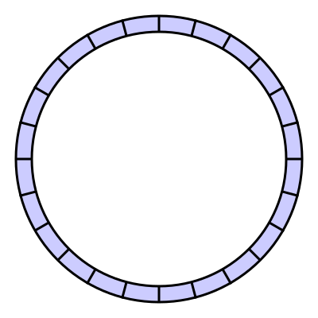

> **자료구조 시리즈**
> 1편: 선형 구조 (현재 글) · [2편: 해시와 트리](/ds-2-hash-tree/) · [3편: 그래프와 특수 구조](/ds-3-graph-special/)

## 0. 전제: 메모리 모델

자료구조를 이해하려면 메모리가 어떻게 생겼는지부터 알아야 한다.

컴퓨터의 주 메모리(RAM)는 **바이트 단위로 주소가 매겨진 1차원 배열**이다. CPU가 주소를 주면 해당 위치의 데이터를 읽거나 쓸 수 있다. 여기서 두 가지 핵심 사실이 나온다.

1. **연속된 공간은 빠르다.** CPU 캐시는 인접한 메모리를 한꺼번에 가져온다(캐시 라인, 보통 64바이트). 데이터가 메모리상 연속이면 캐시 히트율이 높아지고, 흩어져 있으면 캐시 미스가 빈번해진다. 배열이 연결 리스트보다 순회가 빠른 이유다.

2. **임의 접근은 O(1)이다.** 주소만 알면 어디든 한 번에 갈 수 있다. 배열의 인덱스 접근이 O(1)인 이유는 `시작주소 + (인덱스 × 원소크기)`로 주소를 계산해서 바로 접근할 수 있기 때문이다.

모든 자료구조는 결국 이 1차원 메모리 위에 올라간다. "연속 배치 vs 포인터로 연결"이라는 두 가지 전략이 자료구조 설계의 근본적인 갈림길이다.

---

## 1. 배열 (Array)

### 본질

배열은 **연속된 메모리 블록에 같은 크기의 원소를 나열**한 것이다. 자료구조 중 가장 원시적이면서, 가장 많이 쓰인다.

### 왜 빠른가

인덱스 `i`의 원소 주소는 `base + i * sizeof(element)`로 **산술 연산 한 번**에 계산된다. 이것이 O(1) 접근의 정체다. 반복문으로 순회할 때도 메모리를 순서대로 읽으므로 CPU 캐시 라인에 딱 맞아 떨어진다.

### 왜 느린가

배열은 연속이어야 하므로, 중간에 끼워넣거나 빼면 나머지를 전부 이동시켜야 한다.

**중간 삽입: 인덱스 2에 'X'를 넣는 경우**

```
삽입 전:  [A][B][C][D][E]          원소 5개
               ↑ 여기에 X를 넣고 싶다

1단계: E를 한 칸 뒤로  [A][B][C][D][ ][E]     복사 1회
2단계: D를 한 칸 뒤로  [A][B][C][ ][D][E]     복사 2회
3단계: C를 한 칸 뒤로  [A][B][ ][C][D][E]     복사 3회
4단계: 빈자리에 X 삽입 [A][B][X][C][D][E]

→ 원소 3개를 이동. 일반적으로 인덱스 i에 삽입하면 n-i개를 이동해야 한다.
```

**중간 삭제: 인덱스 1의 'B'를 빼는 경우**

```
삭제 전:  [A][B][C][D][E]          원소 5개
              ↑ B를 제거

1단계: C를 한 칸 앞으로  [A][C][ ][D][E]      복사 1회
2단계: D를 한 칸 앞으로  [A][C][D][ ][E]      복사 2회
3단계: E를 한 칸 앞으로  [A][C][D][E][ ]      복사 3회

→ 원소 3개를 이동. 빈 구멍을 메우기 위해 뒤의 원소를 앞으로 당겨야 한다.
```

원소가 10만 개인 배열의 인덱스 0에 삽입하면? **10만 개를 전부 한 칸씩 밀어야 한다.** 이것이 O(n)의 실체다.

### 크기 고정 문제

C/C++의 정적 배열은 선언 시 크기가 고정된다. 얼마나 필요한지 미리 알 수 없는 상황에서는 쓸 수 없다. 이 문제를 해결한 것이 동적 배열이다.

### 동적 배열 (Dynamic Array)

Java의 `ArrayList`, Python의 `list`, C++의 `std::vector`가 대표적이다.

**핵심 아이디어: 여유 공간을 미리 확보한다.**

내부적으로 실제 원소 수(`size`)보다 큰 배열(`capacity`)을 잡아둔다. 원소를 추가할 때 capacity가 남아있으면 그냥 넣고, 가득 차면 **2배 크기의 새 배열을 할당**한 뒤 전체를 복사한다.

```
capacity: 4 → 8 → 16 → 32 → ...
```

2배로 늘리는 이유를 실제 코드 흐름으로 보자. capacity 4인 배열에 원소를 하나씩 넣는다고 하자:

```
append 호출    capacity   size   resize 발생?   이번 호출의 비용(복사 횟수)
─────────────────────────────────────────────────────────
  1번째         4          1      아니오         1 (그냥 넣기)
  2번째         4          2      아니오         1
  3번째         4          3      아니오         1
  4번째         4          4      아니오         1
  5번째         4→8        5      YES            4+1 = 5  (기존 4개 복사 + 1개 삽입)
  6번째         8          6      아니오         1
  7번째         8          7      아니오         1
  8번째         8          8      아니오         1
  9번째         8→16       9      YES            8+1 = 9  (기존 8개 복사 + 1개 삽입)
  10번째        16         10     아니오         1
  ...
  16번째        16         16     아니오         1
  17번째        16→32      17     YES            16+1 = 17
```

resize는 드물게 발생하지만, 발생할 때 비용이 크다. 핵심은 **총합**을 보는 것이다:

```
17번의 append 총 비용
= (resize 아닌 것들: 각 1) + (resize들: 4 + 8 + 16)
= 13 + 28
= 41

연산 한 번당 평균 비용 = 41 / 17 ≈ 2.4
```

일반화하면, n번의 append에서 resize 복사 횟수의 합은 `4 + 8 + 16 + ... + n/2 + n`이다. 이것은 등비급수로 **약 2n**이다. resize가 아닌 호출은 각각 비용 1이므로 총합은 약 `3n`. 연산 한 번당 평균 비용은 상수(약 3)이다. 이것이 **amortized O(1)**의 정체다.

"amortized"란 "비싼 연산의 비용을 싼 연산들에게 분산시켜 계산한다"는 뜻이다. 한 번의 append가 O(n)일 수 있지만, 그런 일은 n번에 한 번만 일어나므로 평균하면 O(1)이다.

**성장 인자(growth factor)의 선택:**

성장 인자란 resize 시 배열을 몇 배로 키울지를 결정하는 값이다.

```
성장 인자 2배:  4 → 8 → 16 → 32 → 64 → ...
성장 인자 1.5배: 4 → 6 → 9 → 13 → 19 → ...
```

성장 인자가 **2배**이면 resize 빈도가 가장 낮고(log₂n번), 대신 메모리 낭비가 최악 50%까지 발생할 수 있다(capacity 8에 원소 5개). Java `ArrayList`가 이 방식을 쓴다. **1.5배**로 줄이면 resize가 약간 더 자주 일어나지만(log₁.₅n번) 최악 메모리 낭비가 33%로 줄어든다. C++ MSVC의 `std::vector`가 이 전략이다. **1.25배**까지 낮추면 resize 빈도는 높아지지만 메모리 낭비가 최악 20%에 그쳐, 메모리 제약이 심한 환경에서 유리하다.

**1보다 큰 어떤 상수배든 amortized O(1)이 성립한다.** 이유: 성장 인자가 r이면 resize 시 복사 총합은 `n + n/r + n/r² + ... = n × r/(r-1)`이다. r이 상수이면 `r/(r-1)`도 상수이므로 총합은 O(n), 연산당 O(1)이다. 다만 r이 1에 가까울수록 `r/(r-1)`이 커져서 상수 계수가 나빠진다.

2배가 가장 많이 쓰이는 이유는 **비트 시프트 한 번**(`capacity <<= 1`)으로 계산할 수 있고 resize 빈도가 낮기 때문이다. 메모리가 넉넉한 환경에서는 2배가 정답에 가깝다.

**끝이 아닌 위치에서의 삽입/삭제는 여전히 O(n)**이다. 동적 배열은 크기 관리만 자동화한 것이지, 연속 배치라는 본질은 변하지 않는다.

### 구현: 동적 배열

```c
#include <stdlib.h>
#include <string.h>

typedef struct {
    int *data;
    int size;
    int capacity;
} DynArray;

DynArray *dynarray_create(void) {
    DynArray *arr = malloc(sizeof(DynArray));
    arr->capacity = 4;
    arr->size = 0;
    arr->data = malloc(sizeof(int) * arr->capacity);
    return arr;
}

static void dynarray_resize(DynArray *arr, int new_cap) {
    int *new_data = malloc(sizeof(int) * new_cap);
    memcpy(new_data, arr->data, sizeof(int) * arr->size);
    free(arr->data);          /* 기존 배열 해제 -- 동적 배열의 핵심 비용 */
    arr->data = new_data;
    arr->capacity = new_cap;
}

void dynarray_append(DynArray *arr, int val) {
    if (arr->size == arr->capacity)
        dynarray_resize(arr, arr->capacity * 2);   /* 2배 확장 */
    arr->data[arr->size++] = val;
}

int dynarray_pop(DynArray *arr) {
    int val = arr->data[--arr->size];
    /* 축소: 1/4 이하면 절반으로. 1/2에서 줄이면 thrashing 발생 */
    if (arr->size > 0 && arr->size <= arr->capacity / 4)
        dynarray_resize(arr, arr->capacity / 2);
    return val;
}

void dynarray_insert(DynArray *arr, int index, int val) {
    if (arr->size == arr->capacity)
        dynarray_resize(arr, arr->capacity * 2);
    /* index 이후 원소를 한 칸씩 뒤로 밀기 -- O(n) */
    memmove(&arr->data[index + 1], &arr->data[index],
            sizeof(int) * (arr->size - index));
    arr->data[index] = val;
    arr->size++;
}

int dynarray_get(DynArray *arr, int index) {   /* O(1) 접근 */
    return arr->data[index];  /* base + index * sizeof(int) */
}

void dynarray_free(DynArray *arr) {
    free(arr->data);
    free(arr);
}
```

C에서는 `malloc`/`free`로 메모리를 직접 관리한다. `dynarray_resize`에서 `free(arr->data)`가 일어나는 것이 동적 배열의 핵심 비용이다. `memmove`는 겹치는 메모리 영역도 안전하게 복사한다(`memcpy`와의 차이).

---

## 2. 연결 리스트 (Linked List)


*단일 연결 리스트. 각 노드가 다음 노드의 주소를 가리킨다. (이미지: Wikimedia Commons, CC BY-SA)*

### 배열의 한계에서 출발

배열의 삽입/삭제가 O(n)인 이유는 연속 배치를 유지하기 위해 원소를 밀어야 하기 때문이다. "연속 배치를 포기하면 어떨까?"라는 질문에서 연결 리스트가 탄생한다.

### 구조

각 노드는 `데이터`와 `다음 노드의 주소(포인터)`를 담는다. 노드들은 메모리 어디에든 흩어져 있어도 되고, 포인터 체인으로만 연결된다.

```
[data|next] → [data|next] → [data|next] → null
```

### 종류별 차이

**단일 연결 리스트(Singly Linked List)**
- 각 노드가 `next`만 가진다
- 역방향 순회 불가. 특정 노드의 이전 노드를 찾으려면 처음부터 다시 탐색해야 한다
- 메모리 오버헤드가 가장 작다 (포인터 1개)

**이중 연결 리스트(Doubly Linked List)**


*이중 연결 리스트. 각 노드가 앞뒤 양쪽을 가리킨다. (이미지: Wikimedia Commons, CC BY-SA)*

- 각 노드가 `prev`와 `next`를 모두 가진다
- 양방향 순회 가능. 임의의 노드가 주어지면 그 앞뒤에서 O(1) 삽입/삭제 가능
- Java `LinkedList`, Linux 커널의 `list_head`가 이중 연결 리스트다
- 포인터 2개분의 메모리 오버헤드

**원형 연결 리스트(Circular Linked List)**
- 마지막 노드의 `next`가 첫 번째 노드를 가리킨다
- 끝과 시작의 구분이 없어 라운드 로빈 스케줄링 등에 사용

### 진짜 trade-off

교과서에서는 "삽입/삭제 O(1)"이라고 쓰지만, 이것은 **삽입/삭제할 위치의 노드를 이미 알고 있을 때**의 이야기다. 위치를 모르면 탐색에 O(n)이 먼저 든다.

실무에서 연결 리스트가 배열보다 느린 경우가 많은 이유는 **캐시 지역성(cache locality)**이다. 노드가 메모리에 흩어져 있으면 순회할 때마다 캐시 미스가 발생한다. 원소 수천 개를 순회하는 작업에서는 배열이 압도적으로 빠르다.

**연결 리스트가 유리한 상황:**
- 삽입/삭제 지점을 이미 참조로 갖고 있고, 그 연산이 매우 빈번할 때
- 원소 크기가 커서 배열의 복사 비용이 클 때
- 다른 자료구조의 내부 부품으로 쓸 때:
  - [해시 테이블 체이닝 심화](/hashtable-chaining-internals/) -- 버킷마다 연결 리스트를 달고, Java HashMap은 길이 8 초과 시 레드-블랙 트리로 전환한다
  - [LRU 캐시](/lru-cache-internals/) -- 해시 테이블 + 이중 연결 리스트를 조합하여 get/put 모두 O(1)을 달성한다

### 구현: 이중 연결 리스트

```c
#include <stdlib.h>

typedef struct DLNode {
    int data;
    struct DLNode *prev;
    struct DLNode *next;
} DLNode;

typedef struct {
    DLNode head;   /* 센티널: 실제 데이터를 담지 않는 더미 노드 */
    DLNode tail;
} DList;

void dlist_init(DList *list) {
    list->head.prev = NULL;
    list->head.next = &list->tail;
    list->tail.prev = &list->head;
    list->tail.next = NULL;
}

/* 노드 포인터를 반환 → 나중에 O(1) 삭제에 활용 */
DLNode *dlist_push_front(DList *list, int val) {
    DLNode *node = malloc(sizeof(DLNode));
    node->data = val;
    node->prev = &list->head;
    node->next = list->head.next;
    list->head.next->prev = node;
    list->head.next = node;
    return node;
}

DLNode *dlist_push_back(DList *list, int val) {
    DLNode *node = malloc(sizeof(DLNode));
    node->data = val;
    node->next = &list->tail;
    node->prev = list->tail.prev;
    list->tail.prev->next = node;
    list->tail.prev = node;
    return node;
}

/* 핵심: 노드 포인터만 있으면 O(1)에 삭제. 리스트 전체를 탐색하지 않는다 */
void dlist_remove(DLNode *node) {
    node->prev->next = node->next;
    node->next->prev = node->prev;
    free(node);
}

int dlist_empty(DList *list) {
    return list->head.next == &list->tail;
}
```

**센티널(sentinel) 노드 패턴이란?**

센티널은 실제 데이터를 담지 않는 **더미 노드**다. 리스트의 양 끝에 항상 존재하여 "리스트가 비어있는 경우"와 "첫 번째/마지막 노드를 조작하는 경우"를 별도로 처리할 필요가 없게 만든다.

센티널이 없으면 삭제 코드가 이렇게 된다:

```c
/* 센티널 없는 버전: 경계 조건 분기가 필수 */
void remove_no_sentinel(DList *list, DLNode *node) {
    if (node->prev == NULL) {
        /* 첫 번째 노드 삭제 → head를 바꿔야 한다 */
        list->head = node->next;
        if (list->head) list->head->prev = NULL;
    } else if (node->next == NULL) {
        /* 마지막 노드 삭제 → tail을 바꿔야 한다 */
        node->prev->next = NULL;
        list->tail = node->prev;
    } else {
        /* 중간 노드 삭제 */
        node->prev->next = node->next;
        node->next->prev = node->prev;
    }
    free(node);
}
```

센티널이 있으면 **모든 노드가 중간 노드**처럼 동작한다. `prev`와 `next`가 항상 존재하므로 NULL 체크가 사라진다:

```c
/* 센티널 있는 버전: 분기 없음. 이 한 가지 코드가 모든 경우를 처리 */
void remove_with_sentinel(DLNode *node) {
    node->prev->next = node->next;
    node->next->prev = node->prev;
    free(node);
}
```

비어있는 리스트도 문제없다. 센티널 head와 tail이 서로를 가리키고 있으므로:

```
비어있을 때:  [head] ↔ [tail]
원소 1개:    [head] ↔ [A] ↔ [tail]
원소 3개:    [head] ↔ [A] ↔ [B] ↔ [C] ↔ [tail]
```

어떤 상태에서든 `dlist_remove`의 포인터 조작 2줄이 정확히 동작한다. Linux 커널의 `list_head`, LRU 캐시, 텍스트 에디터의 줄 관리 등 실전 구현 대부분이 이 패턴을 쓴다.

> 시각화: [VisuAlgo - Linked List](https://visualgo.net/en/list)에서 삽입/삭제 시 포인터가 어떻게 바뀌는지 단계별로 확인할 수 있다.

---

## 3. 스택 (Stack)

### 본질

스택은 자료구조라기보다 **접근 규칙**이다. "가장 최근에 넣은 것만 꺼낼 수 있다"는 LIFO(Last In, First Out) 규칙을 강제한다.

### 연산

모든 연산이 O(1)이다. `push(x)`는 최상단에 x를 추가하고, `pop()`은 최상단 원소를 제거한 뒤 반환한다. `peek()` 또는 `top()`은 최상단 원소를 제거하지 않고 확인만 하며, `isEmpty()`는 비어있는지를 판별한다.

### 구현

배열 기반과 연결 리스트 기반 모두 가능하다. 배열 기반이 캐시 효율이 좋아 실무에서 더 많이 쓰인다. `top` 인덱스만 관리하면 된다.

### 왜 중요한가

스택은 **"되돌아가야 하는 모든 상황"**의 기본 도구다.

- **함수 호출 스택(Call Stack):** 함수 A가 함수 B를 호출하면 A의 상태(지역 변수, 복귀 주소)를 스택에 push한다. B가 반환되면 pop해서 A로 되돌아간다. 재귀 호출이 너무 깊어지면 스택 오버플로우가 발생하는 이유다.
- **실행 취소(Undo):** 각 편집 동작을 push하고, Ctrl+Z를 누르면 pop한다.
- **괄호 매칭:** 여는 괄호를 만나면 push, 닫는 괄호를 만나면 pop해서 짝이 맞는지 확인한다.
- **후위 표기식 계산:** `3 4 + 5 *` 같은 식에서 피연산자를 push하고 연산자를 만나면 두 개를 pop해서 계산한 결과를 다시 push한다.
- **DFS(깊이 우선 탐색):** 재귀 DFS는 사실 콜 스택을 활용하는 것이고, 반복적 DFS는 명시적 스택을 사용한다.

### 단조 스택 (Monotone Stack)

스택 내부의 원소가 항상 **바닥에서 꼭대기까지 단조 감소**(또는 단조 증가)하도록 유지하는 기법이다.

핵심 규칙: 새 원소를 push할 때, 스택 꼭대기(top)에 있는 원소가 새 원소보다 **작으면** pop한다. "이전에는 합법적이었지만 새 원소가 들어오면서 규칙을 깨게 되는 원소"를 제거하는 것이다. 즉, 원소가 들어갈 때는 문제가 없었는데 더 큰 원소가 나중에 등장하면서 밀려나는 구조다.

**대표 문제: Next Greater Element.** 배열의 각 원소에 대해 오른쪽에서 처음 만나는 더 큰 원소를 찾는 문제다. 실제 흐름을 따라가보자:

```
배열: [2, 1, 4, 3]

i=0, 원소=2: 스택 비어있음 → push(0)
             스택: [2]

i=1, 원소=1: top=2, 1 < 2 → 조건 불만족, pop 안 함 → push(1)
             스택: [2, 1]     (바닥→꼭대기: 감소 유지)

i=2, 원소=4: top=1, 4 > 1 → pop(1), result[1] = 4  "1의 NGE는 4"
             top=2, 4 > 2 → pop(2), result[0] = 4  "2의 NGE도 4"
             스택 비어있음 → push(2)
             스택: [4]

i=3, 원소=3: top=4, 3 < 4 → 조건 불만족, pop 안 함 → push(3)
             스택: [4, 3]

순회 끝. 스택에 남은 [4, 3]은 오른쪽에 더 큰 원소가 없음 → result = -1

최종 결과: [4, 4, -1, -1]
```

각 원소는 **최대 한 번 push, 한 번 pop**되므로 전체 O(n)이다. 브루트포스 O(n²)을 O(n)으로 줄이는 강력한 기법이다.

### 구현: 배열 기반 스택 + 단조 스택

```c
#define STACK_CAP 1024

typedef struct {
    int data[STACK_CAP];
    int top;              /* 다음에 넣을 위치. top == 0이면 비어있음 */
} Stack;

void stack_init(Stack *s)    { s->top = 0; }
int  stack_empty(Stack *s)   { return s->top == 0; }
void stack_push(Stack *s, int val) { s->data[s->top++] = val; }
int  stack_pop(Stack *s)     { return s->data[--s->top]; }
int  stack_peek(Stack *s)    { return s->data[s->top - 1]; }

/*
 * 단조 스택: Next Greater Element
 * 배열의 각 원소에 대해 오른쪽에서 처음 만나는 더 큰 원소를 구한다.
 * 각 원소는 최대 1번 push, 1번 pop → 전체 O(n)
 */
void next_greater_element(int *nums, int n, int *result) {
    Stack s;
    stack_init(&s);
    for (int i = 0; i < n; i++)
        result[i] = -1;

    for (int i = 0; i < n; i++) {
        /* 현재 원소가 스택 top보다 크면 → top의 NGE가 현재 원소 */
        while (!stack_empty(&s) && nums[stack_peek(&s)] < nums[i]) {
            int idx = stack_pop(&s);
            result[idx] = nums[i];
        }
        stack_push(&s, i);  /* 인덱스를 저장 */
    }
}
/* 예: {2, 1, 4, 3} → {4, 4, -1, -1} */
```

스택은 `top` 인덱스 하나로 배열을 스택처럼 쓰는 것이 전부다. C에서는 이것이 함수 호출 시 실제 하드웨어 스택(ESP/RSP 레지스터)이 동작하는 방식과 정확히 같다.

---

## 4. 큐 (Queue)

### 본질

스택이 LIFO라면, 큐는 **FIFO**(First In, First Out)다. 먼저 넣은 것이 먼저 나온다. 줄 서기와 같다.

### 연산

모든 연산이 O(1)이다. `enqueue(x)`는 뒤쪽에 x를 추가하고, `dequeue()`는 앞쪽 원소를 제거한 뒤 반환한다. `front()` 또는 `peek()`은 앞쪽 원소를 제거하지 않고 확인만 한다.

### 배열 기반 구현의 함정


*원형 큐(원형 버퍼)의 구조. front와 rear가 원형으로 순환한다. (이미지: Wikimedia Commons, CC BY-SA)*

단순 배열로 큐를 만들면 문제가 생긴다. 실제로 enqueue 3번, dequeue 2번을 해보자:

```
enqueue(A):  [A][ ][ ][ ][ ]    front=0, rear=1
enqueue(B):  [A][B][ ][ ][ ]    front=0, rear=2
enqueue(C):  [A][B][C][ ][ ]    front=0, rear=3

dequeue → A: [ ][B][C][ ][ ]    front=1  ← 앞에 빈칸 발생!
dequeue → B: [ ][ ][C][ ][ ]    front=2  ← 빈칸 2개!

enqueue(D):  [ ][ ][C][D][ ]    rear=4
enqueue(E):  [ ][ ][C][D][E]    rear=5  ← 배열 끝 도달!
```

배열 끝에 도달했는데, 앞쪽에는 빈 공간이 2칸이나 있다. 여기서 선택지가 두 가지다:

**방법 1: 앞으로 당기기** -- dequeue할 때마다 뒤의 원소를 전부 한 칸씩 앞으로 이동

```
dequeue → C 제거 후 당기기:
  [ ][ ][ ][D][E]
  → [ ][ ][D][E][ ]     D 이동 (1회)
  → [ ][D][E][ ][ ]     ... 아니, 이건 더 복잡하다
  → [D][E][ ][ ][ ]     원소 2개 이동 = O(n)
```

원소가 만 개면 dequeue 한 번에 9,999개를 이동해야 한다. 큐의 dequeue가 O(n)이면 큐를 쓰는 의미가 없다.

**방법 2: 안 당기기** -- front 인덱스만 올림

```
계속 enqueue/dequeue를 반복하면:
  [ ][ ][ ][ ][ ][F][G][ ][ ][ ]
  ↑ 이 공간은 영원히 못 씀      ↑ front는 계속 오른쪽으로
```

배열 크기 1만인데 실제 원소는 3개뿐인 상황이 된다. 메모리 낭비.

**해법: 원형 큐(Circular Queue)**

배열의 끝에 도달하면 다시 0번으로 돌아간다. `% capacity`(나머지 연산)가 핵심이다.

```
capacity = 5

enqueue(A):  [A][ ][ ][ ][ ]    front=0, rear=1
enqueue(B):  [A][B][ ][ ][ ]    front=0, rear=2
enqueue(C):  [A][B][C][ ][ ]    front=0, rear=3

dequeue → A: [ ][B][C][ ][ ]    front=1
dequeue → B: [ ][ ][C][ ][ ]    front=2

enqueue(D):  [ ][ ][C][D][ ]    rear=4
enqueue(E):  [ ][ ][C][D][E]    rear=5 → rear = 5 % 5 = 0  ← 앞으로 돌아옴!

enqueue(F):  [F][ ][C][D][E]    rear=1  ← 빈칸 재활용!
             ↑ 앞쪽 빈칸에 저장

논리적 순서: C → D → E → F  (front=2에서 시작, 원형으로 순회)
```

원소를 이동시키지 않으면서도 빈 공간을 재활용한다. enqueue와 dequeue 모두 O(1)이다.

### 변형

**덱(Deque, Double-Ended Queue)**
- 양쪽 끝에서 삽입/삭제 모두 O(1)
- 스택과 큐를 모두 대체할 수 있다
- C++ `std::deque`는 내부적으로 고정 크기 블록의 배열(map of blocks)로 구현되어 양 끝 삽입이 O(1)이면서도 인덱스 접근이 O(1)이다

**우선순위 큐(Priority Queue)**
- FIFO가 아니라 우선순위가 높은 원소가 먼저 나온다
- 힙으로 구현한다 (뒤의 "힙" 섹션에서 상세히 다룬다)

### 사용처

- **BFS(너비 우선 탐색):** 현재 레벨의 노드를 큐에 넣고, 하나씩 꺼내면서 다음 레벨을 큐에 넣는다
- **작업 스케줄링:** OS의 프로세스 스케줄링, 프린터 큐, 웹 서버의 요청 큐
- **메시지 큐:** Kafka, RabbitMQ 등 비동기 시스템의 핵심 추상화. 생산자가 enqueue하고 소비자가 dequeue한다
- **슬라이딩 윈도우:** 덱을 활용하면 슬라이딩 윈도우 내 최솟값/최댓값을 O(1)에 유지할 수 있다

### 구현: 원형 큐

```c
typedef struct {
    int *data;
    int front;
    int size;
    int capacity;
} CircularQueue;

CircularQueue *cq_create(int capacity) {
    CircularQueue *q = malloc(sizeof(CircularQueue));
    q->data = malloc(sizeof(int) * capacity);
    q->front = 0;
    q->size = 0;
    q->capacity = capacity;
    return q;
}

int cq_enqueue(CircularQueue *q, int val) {
    if (q->size == q->capacity) return -1;  /* full */
    int rear = (q->front + q->size) % q->capacity;
    q->data[rear] = val;
    q->size++;
    return 0;
}

int cq_dequeue(CircularQueue *q) {
    int val = q->data[q->front];
    q->front = (q->front + 1) % q->capacity;  /* 모듈러로 순환 */
    q->size--;
    return val;
}

int cq_peek(CircularQueue *q) {
    return q->data[q->front];
}

void cq_free(CircularQueue *q) {
    free(q->data);
    free(q);
}
```

`size` 변수를 별도로 관리하면 빈 상태(`size == 0`)와 가득 찬 상태(`size == capacity`)를 명확히 구분할 수 있다. 한 칸을 비워두는 방식보다 직관적이다. `% capacity`가 원형의 핵심이다.

---

다음 글: [자료구조 2편: 해시와 트리](/ds-2-hash-tree/) — 해시 테이블, 이진 탐색 트리, 균형 트리, B-Tree, 힙
