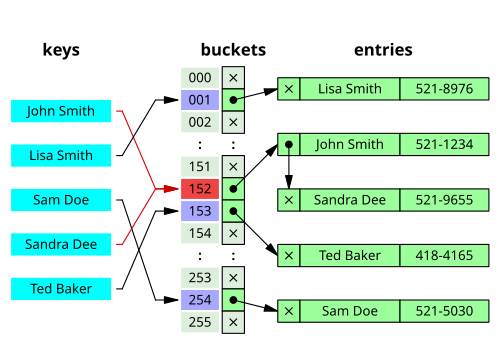
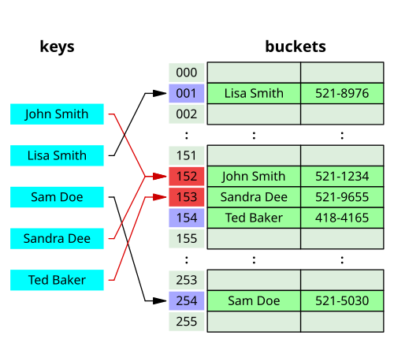
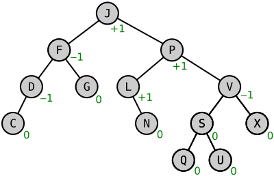
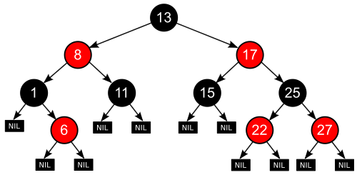
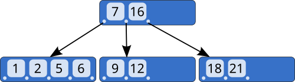
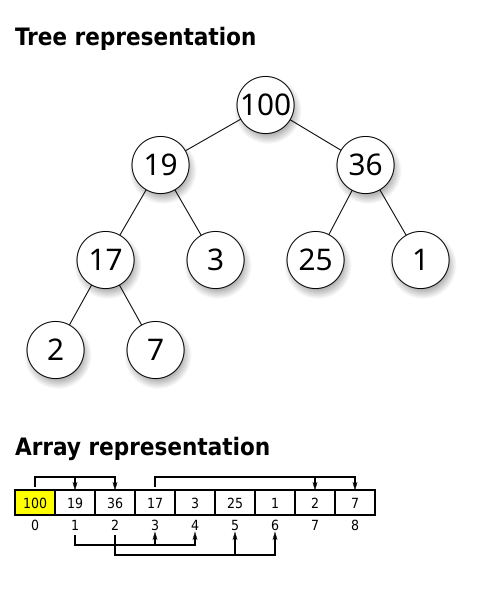

> **자료구조 시리즈**
> [1편: 선형 구조](/ds-1-linear/) · 2편: 해시와 트리 (현재 글) · [3편: 그래프와 특수 구조](/ds-3-graph-special/)

1편에서 다룬 배열과 연결 리스트는 탐색이 O(n)이다. 이 편에서는 탐색을 O(1) 또는 O(log n)으로 만드는 구조를 다룬다.

## 5. 해시 테이블 (Hash Table)


*체이닝 방식의 해시 테이블. 같은 인덱스에 매핑된 원소들이 연결 리스트로 연결된다. (이미지: Wikimedia Commons, CC BY-SA)*

### 해결하려는 문제

배열은 정수 인덱스로 O(1) 접근이 가능하다. 그런데 키가 문자열이나 객체라면? "임의의 키를 정수 인덱스로 변환해서 배열의 O(1) 접근을 활용하자"가 해시 테이블의 아이디어다.

### 해시 함수

키를 배열 인덱스로 변환하는 함수다. 좋은 해시 함수의 조건:

1. **결정적(deterministic):** 같은 입력에 항상 같은 출력
2. **균일 분포(uniform distribution):** 출력이 배열 전체에 고르게 퍼져야 충돌이 줄어든다
3. **빠른 계산:** 해시 자체가 느리면 O(1)의 의미가 없다

실제 구현에서는 해시값을 배열 크기로 나눈 나머지를 인덱스로 쓴다: `index = hash(key) % capacity`

### 충돌 해결

서로 다른 키가 같은 인덱스에 매핑되는 것은 불가피하다(비둘기집 원리: 4개의 슬롯에 5개의 키를 넣으면 최소 1곳은 겹친다). 실제로 일어나는 과정을 보자.

capacity = 5인 해시 테이블에 키 "cat", "dog", "ant", "fox"를 넣는다:

```
hash("cat") % 5 = 2
hash("dog") % 5 = 4
hash("ant") % 5 = 2    ← "cat"과 충돌!
hash("fox") % 5 = 1
```

**방법 1: 체이닝(Separate Chaining)**

같은 인덱스에 연결 리스트를 달아서 여러 원소를 저장한다:

```
[0] → (비어있음)
[1] → [fox:값]
[2] → [cat:값] → [ant:값]    ← 충돌한 둘이 체인으로 연결
[3] → (비어있음)
[4] → [dog:값]
```

get("ant") 호출 시: hash("ant")%5 = 2 → 인덱스 2의 체인 순회 → "cat" 아님 → "ant" 찾음 (비교 2회)

체인이 길어지면? 모든 키가 인덱스 2에 몰리면:
```
[2] → [a] → [b] → [c] → ... → [z]    체인 길이 26
```
get 한 번에 최대 26번 비교 = O(n). [체이닝 심화](/hashtable-chaining-internals/)에서 Java HashMap이 이걸 어떻게 해결하는지 다룬다.

**방법 2: 오픈 어드레싱(Open Addressing) -- 선형 탐사**

충돌 시 연결 리스트를 쓰지 않고 배열 내 **다음 빈 슬롯**을 찾아간다:

```
put("cat"): hash = 2 → 슬롯 2 비어있음 → 저장
  [0:   ] [1:   ] [2:cat] [3:   ] [4:   ]

put("dog"): hash = 4 → 슬롯 4 비어있음 → 저장
  [0:   ] [1:   ] [2:cat] [3:   ] [4:dog]

put("ant"): hash = 2 → 슬롯 2에 cat이 있다! → 3은? 비어있음 → 저장
  [0:   ] [1:   ] [2:cat] [3:ant] [4:dog]
                           ↑ 원래 자리(2)에서 1칸 밀려남

put("bat"): hash = 2 → 2에 cat → 3에 ant → 4에 dog → 0은? 비어있음 → 저장
  [0:bat] [1:   ] [2:cat] [3:ant] [4:dog]
   ↑ 원래 자리(2)에서 3칸이나 밀려남!
```

이것이 **클러스터링(clustering)** 문제다. 충돌이 충돌을 부른다. 인덱스 2 근처에 데이터가 뭉치면, 새로 들어오는 원소는 빈 칸을 찾아 점점 멀리 이동해야 한다.

```
클러스터링 발생 시 탐사 횟수:
  get("cat"): hash=2, 슬롯2 → 1번 만에 찾음
  get("ant"): hash=2, 슬롯2(cat) → 슬롯3 → 2번 만에 찾음
  get("bat"): hash=2, 슬롯2(cat) → 3(ant) → 4(dog) → 0 → 4번 만에 찾음
```

**이차 탐사(Quadratic Probing)**는 1, 4, 9, 16... 칸씩 건너뛰어 클러스터링을 완화한다. **이중 해싱(Double Hashing)**은 두 번째 해시 함수로 탐사 간격 자체를 키마다 다르게 만든다.


*오픈 어드레싱(선형 탐사). 충돌 시 다음 빈 슬롯을 찾아 저장한다. (이미지: Wikimedia Commons, CC BY-SA)*

Python의 `dict`는 오픈 어드레싱(변형된 이차 탐사)을, Java의 `HashMap`은 체이닝을 사용한다.

### 적재율과 리해싱

**적재율(load factor)** = 저장된 원소 수 / 배열 크기.

적재율이 높아지면 충돌이 급격히 늘어난다. capacity = 4인 테이블에 원소 3개를 넣으면 적재율 0.75인데, 이때 새 원소가 빈 슬롯에 들어갈 확률은 겨우 25%다. 나머지 75% 확률로 충돌이 발생한다.

적재율이 임계값(Java `HashMap`은 0.75)을 넘으면 **리해싱(rehashing)**을 한다. 실제 과정:

```
리해싱 전: capacity = 4, 원소 3개 (적재율 0.75)

  [0: "fox"] [1: (빈)] [2: "cat" → "ant"] [3: (빈)]

리해싱: capacity를 4 → 8로 2배 확장

  새 배열 8칸 할당
  모든 원소를 새 배열 크기(8)로 다시 해싱:
    hash("fox") % 8 = 5     (기존: %4=0)
    hash("cat") % 8 = 6     (기존: %4=2)
    hash("ant") % 8 = 2     (기존: %4=2)

리해싱 후: capacity = 8, 원소 3개 (적재율 0.375)

  [0:   ] [1:   ] [2:"ant"] [3:   ] [4:   ] [5:"fox"] [6:"cat"] [7:   ]

  → "cat"과 "ant"의 충돌이 해소되었다!
```

`% 4`에서 같았던 해시값이 `% 8`로 바뀌면서 다른 인덱스에 분산된다. 리해싱 자체는 O(n)이지만, 동적 배열의 resize와 마찬가지로 amortized O(1)이다.

### 시간 복잡도

탐색, 삽입, 삭제 모두 평균 O(1)이다. 다만 최악의 경우(모든 키가 같은 인덱스에 몰리는 병적인 상황)에는 세 연산 모두 O(n)까지 떨어진다.

최악은 모든 키가 같은 인덱스에 몰리는 병적인 경우다. 좋은 해시 함수와 적절한 적재율 관리로 실질적으로 O(1)을 유지한다.

### 순서 보존 해시 테이블

일반 해시 테이블은 삽입 순서를 보장하지 않는다. Python 3.7+의 `dict`와 Java의 `LinkedHashMap`은 삽입 순서를 유지한다. `LinkedHashMap`은 해시 테이블의 각 엔트리를 이중 연결 리스트로도 연결하여 삽입 순서 순회를 지원한다.

### 구현: 체이닝 해시 테이블

```c
#include <stdlib.h>
#include <string.h>

typedef struct HTEntry {
    char *key;
    int value;
    struct HTEntry *next;    /* 같은 버킷의 다음 엔트리 (체이닝) */
} HTEntry;

typedef struct {
    HTEntry **buckets;       /* 버킷 배열 (포인터의 배열) */
    int capacity;
    int size;
} HashTable;

static unsigned int hash_str(const char *s, int cap) {
    unsigned int h = 5381;
    while (*s)
        h = h * 33 + (unsigned char)*s++;  /* djb2 해시 */
    return h % cap;
}

HashTable *ht_create(int capacity) {
    HashTable *ht = malloc(sizeof(HashTable));
    ht->capacity = capacity;
    ht->size = 0;
    ht->buckets = calloc(capacity, sizeof(HTEntry *));  /* NULL 초기화 */
    return ht;
}

static void ht_rehash(HashTable *ht) {
    int old_cap = ht->capacity;
    HTEntry **old = ht->buckets;
    ht->capacity *= 2;
    ht->buckets = calloc(ht->capacity, sizeof(HTEntry *));
    ht->size = 0;

    for (int i = 0; i < old_cap; i++) {
        HTEntry *e = old[i];
        while (e) {
            HTEntry *next = e->next;
            /* 새 버킷에 재삽입 */
            unsigned int idx = hash_str(e->key, ht->capacity);
            e->next = ht->buckets[idx];
            ht->buckets[idx] = e;
            ht->size++;
            e = next;
        }
    }
    free(old);
}

void ht_put(HashTable *ht, const char *key, int val) {
    if ((float)ht->size / ht->capacity >= 0.75f)
        ht_rehash(ht);

    unsigned int idx = hash_str(key, ht->capacity);
    /* 키가 이미 있으면 덮어쓰기 */
    for (HTEntry *e = ht->buckets[idx]; e; e = e->next) {
        if (strcmp(e->key, key) == 0) {
            e->value = val;
            return;
        }
    }
    /* 새 엔트리를 체인 앞에 삽입 */
    HTEntry *entry = malloc(sizeof(HTEntry));
    entry->key = strdup(key);
    entry->value = val;
    entry->next = ht->buckets[idx];
    ht->buckets[idx] = entry;
    ht->size++;
}

int ht_get(HashTable *ht, const char *key) {
    unsigned int idx = hash_str(key, ht->capacity);
    for (HTEntry *e = ht->buckets[idx]; e; e = e->next)
        if (strcmp(e->key, key) == 0)
            return e->value;
    return -1;  /* not found */
}
```

버킷 배열의 각 슬롯이 연결 리스트의 head 포인터다. 충돌하면 체인이 늘어나고, 적재율이 0.75를 넘으면 2배로 확장한 뒤 전체를 재해싱한다. `djb2`는 단순하면서 분포가 좋은 해시 함수로, 실무에서도 널리 쓰인다.

> 시각화: [USFCA - Hash Table (Chaining)](https://www.cs.usfca.edu/~galles/visualization/ClosedHash.html)에서 충돌 시 체인이 어떻게 늘어나는지, [Open Addressing](https://www.cs.usfca.edu/~galles/visualization/ClosedHash.html)에서 선형 탐사의 클러스터링을 직접 확인할 수 있다.

---

## 6. 트리 (Tree) -- 기초


*이진 탐색 트리. 왼쪽 자식 < 부모 < 오른쪽 자식 규칙을 만족한다. (이미지: Wikimedia Commons, CC BY-SA)*

### 왜 트리인가

배열은 접근이 O(1)이지만 탐색이 O(n)이다. 해시 테이블은 탐색이 O(1)이지만 정렬된 순서를 유지하지 못한다. **"정렬을 유지하면서 탐색/삽입/삭제를 O(log n)에 하고 싶다"**는 욕구에서 트리가 나온다.

### 용어 정리

- **루트(root):** 최상위 노드
- **리프(leaf):** 자식이 없는 노드
- **높이(height):** 루트에서 가장 먼 리프까지의 간선 수
- **깊이(depth):** 루트에서 해당 노드까지의 간선 수
- **서브트리(subtree):** 임의의 노드를 루트로 하는 부분 트리
- **차수(degree):** 한 노드가 가질 수 있는 최대 자식 수

### 이진 트리 (Binary Tree)

각 노드가 **최대 2개**의 자식(왼쪽, 오른쪽)을 갖는 트리다.

**특수한 형태:**
- **정 이진 트리(Full):** 모든 노드의 자식이 0개 또는 2개
- **완전 이진 트리(Complete):** 마지막 레벨을 제외하고 모두 채워져 있고, 마지막 레벨은 왼쪽부터 채워짐 (힙의 기반)
- **포화 이진 트리(Perfect):** 모든 리프가 같은 깊이에 있고 모든 내부 노드가 자식 2개를 가짐. 노드 수 = 2^(h+1) - 1

**순회 방법:**


*이진 트리 깊이 우선 순회: 전위(Preorder, 빨강) = 루트→좌→우, 중위(Inorder, 노랑) = 좌→루트→우, 후위(Postorder, 초록) = 좌→우→루트 (출처: [Wikipedia](https://en.wikipedia.org/wiki/Tree_traversal))*


*레벨 순회(Level-order): 레벨별 왼쪽→오른쪽으로 방문, BFS 기반 (출처: [Wikipedia](https://en.wikipedia.org/wiki/Tree_traversal))*

### 이진 탐색 트리 (Binary Search Tree, BST)

이진 트리에 **정렬 불변식(invariant)**을 추가한 것이다:

> 모든 노드 N에 대해, 왼쪽 서브트리의 모든 값 < N의 값 < 오른쪽 서브트리의 모든 값

이 불변식 덕분에 탐색이 이진 탐색과 같은 원리로 작동한다. 루트에서 시작하여 찾는 값이 작으면 왼쪽, 크면 오른쪽으로 내려간다. 한 번 비교할 때마다 탐색 범위가 절반으로 줄어든다.

**삽입:** 탐색과 같은 경로를 따라 내려가다가 빈 자리에 넣는다. O(h).

**삭제:** 세 가지 경우로 나뉜다. 아래 트리에서 각 경우를 보자:

```
        8
       / \
      3   10
     / \    \
    1   6    14
       / \   /
      4   7 13
```

**케이스 1: 리프 노드 삭제 (4를 삭제)**

```
자식이 없으므로 그냥 떼어내면 된다.

        8                    8
       / \                  / \
      3   10      →       3   10
     / \    \            / \    \
    1   6    14         1   6    14
       / \   /             \   /
      4   7 13              7 13
      ↑ 제거
```

**케이스 2: 자식이 1개인 노드 삭제 (10을 삭제)**

```
10의 유일한 자식(14)을 10 자리에 올린다.

        8                    8
       / \                  / \
      3   10      →       3   14
     / \    \            / \   /
    1   6    14         1   6  13
       / \   /             / \
      4   7 13            4   7
          ↑ 14가 올라옴
```

**케이스 3: 자식이 2개인 노드 삭제 (3을 삭제)** -- 가장 복잡

```
3의 오른쪽 서브트리에서 가장 작은 값(중위 후속자)을 찾는다 → 4
3을 4로 대체한 뒤, 원래 4의 위치를 삭제한다 (4는 리프이므로 케이스 1)

        8                    8
       / \                  / \
      3   10      →       4   10
     / \    \            / \    \
    1   6    14         1   6    14
       / \   /             / \   /
      4   7 13            (X)  7 13
      ↑ 이 값을 올림
```

왜 중위 후속자인가? BST 불변식(왼쪽 < 부모 < 오른쪽)을 유지하려면, 삭제된 노드를 대체할 값은 "왼쪽 서브트리의 모든 값보다 크고, 오른쪽 서브트리의 모든 값보다 작은" 값이어야 한다. 오른쪽 서브트리의 최솟값이 정확히 그 조건을 만족한다.

**치명적 약점: 편향 트리**

정렬된 데이터 1, 2, 3, 4, 5를 순서대로 삽입하면:

```
1을 삽입:  1

2를 삽입:  1         3을 삽입:  1         4를 삽입:  1         5를 삽입:  1
            \                    \                    \                    \
             2                    2                    2                    2
                                   \                    \                    \
                                    3                    3                    3
                                                          \                    \
                                                           4                    4
                                                                                 \
                                                                                  5

높이 = 4 (원소 수 - 1)
탐색 5: 1→2→3→4→5  비교 5번 = O(n)
```

같은 5개를 3, 1, 4, 2, 5 순서로 넣으면:

```
        3
       / \
      1   4
       \   \
        2   5

높이 = 2
탐색 5: 3→4→5  비교 3번
탐색 2: 3→1→2  비교 3번
```

같은 데이터인데 삽입 순서에 따라 높이가 4 vs 2로 달라진다. 이 문제를 해결한 것이 균형 트리다.

### 구현: 이진 탐색 트리

```c
typedef struct BSTNode {
    int key;
    struct BSTNode *left;
    struct BSTNode *right;
} BSTNode;

BSTNode *bst_new_node(int key) {
    BSTNode *n = malloc(sizeof(BSTNode));
    n->key = key;
    n->left = n->right = NULL;
    return n;
}

BSTNode *bst_insert(BSTNode *root, int key) {
    if (!root) return bst_new_node(key);
    if (key < root->key)
        root->left = bst_insert(root->left, key);
    else if (key > root->key)
        root->right = bst_insert(root->right, key);
    return root;
}

BSTNode *bst_search(BSTNode *root, int key) {
    if (!root || root->key == key) return root;
    if (key < root->key) return bst_search(root->left, key);
    return bst_search(root->right, key);
}

/* 서브트리에서 최솟값 노드를 찾는다 (가장 왼쪽) */
static BSTNode *bst_min(BSTNode *node) {
    while (node->left) node = node->left;
    return node;
}

BSTNode *bst_delete(BSTNode *root, int key) {
    if (!root) return NULL;
    if (key < root->key)
        root->left = bst_delete(root->left, key);
    else if (key > root->key)
        root->right = bst_delete(root->right, key);
    else {
        /* 삭제 대상 발견 */
        if (!root->left) {                  /* 케이스 1, 2: 자식 0~1개 */
            BSTNode *right = root->right;
            free(root);
            return right;
        }
        if (!root->right) {
            BSTNode *left = root->left;
            free(root);
            return left;
        }
        /* 케이스 3: 자식 2개 → 중위 후속자로 대체 */
        BSTNode *succ = bst_min(root->right);
        root->key = succ->key;
        root->right = bst_delete(root->right, succ->key);
    }
    return root;
}

/* 중위 순회 → 정렬된 순서로 출력 */
void bst_inorder(BSTNode *root) {
    if (!root) return;
    bst_inorder(root->left);
    printf("%d ", root->key);
    bst_inorder(root->right);
}
```

재귀의 반환값으로 서브트리의 새 루트를 받는 패턴(`root->left = bst_insert(root->left, key)`)에 주목하라. 부모 포인터 없이도 트리를 수정할 수 있는 깔끔한 방법이다.

> 시각화: [VisuAlgo - BST](https://visualgo.net/en/bst)에서 삽입/삭제/탐색 과정을 단계별로 볼 수 있다. 특히 정렬된 데이터를 순서대로 삽입하면 편향 트리가 되는 것을 눈으로 확인할 수 있다.

---

## 7. 균형 이진 탐색 트리


*AVL 트리. 각 노드 옆의 숫자가 균형 인수(balance factor)다. 모든 노드에서 -1, 0, 1 중 하나를 유지한다. (이미지: Wikimedia Commons, CC BY-SA)*

편향 트리 문제를 해결하기 위해 트리의 높이를 O(log n)으로 유지하는 전략이다.

### AVL 트리

가장 먼저 등장한 자가 균형 BST(1962년, Adelson-Velsky & Landis).

**불변식:** 모든 노드에서 왼쪽 서브트리 높이와 오른쪽 서브트리 높이의 차이(**균형 인수, balance factor**)가 -1, 0, 1 중 하나여야 한다.

삽입이나 삭제 후 균형이 깨지면 **회전(rotation)**으로 복구한다:

- **단순 회전(Single Rotation):** LL 또는 RR 케이스. 한 번 회전으로 해결
- **이중 회전(Double Rotation):** LR 또는 RL 케이스. 두 번 회전이 필요

AVL 트리는 높이 제한이 엄격하여 **탐색이 빠르다**. 하지만 삽입/삭제 시 회전이 빈번하게 발생할 수 있다. 읽기가 많고 쓰기가 적은 상황에 적합하다.

### 레드-블랙 트리 (Red-Black Tree)


*레드-블랙 트리. 빨강/검정 색상 규칙으로 균형을 유지한다. (이미지: Wikimedia Commons, CC BY-SA)*

AVL보다 약간 느슨한 균형을 유지하되 삽입/삭제 시 회전 횟수를 줄인 구조다.

**규칙:**
1. 모든 노드는 빨강 또는 검정
2. 루트는 검정
3. 모든 리프(NIL 노드)는 검정
4. 빨강 노드의 자식은 반드시 검정 (빨강 연속 불가)
5. 임의의 노드에서 리프까지의 모든 경로에 포함된 검정 노드 수가 동일(**블랙 높이**)

이 규칙들을 조합하면 가장 긴 경로가 가장 짧은 경로의 2배를 넘지 않음이 보장된다. 따라서 높이 ≤ 2 log₂(n+1)이고, 모든 연산이 O(log n)이다.

삽입/삭제 후 규칙 위반이 발생하면 **색상 변경(recoloring)**과 **회전**을 조합하여 복구한다. AVL과 달리 최대 2~3번의 회전으로 해결되므로 **쓰기 성능이 좋다**.

Java의 `TreeMap`, `TreeSet`, `HashMap`(체인 길이 8 초과 시), C++ `std::map`, `std::set`, Linux 커널의 스케줄러(CFS)가 레드-블랙 트리를 사용한다.

> 시각화: AVL과 레드-블랙 트리의 회전을 이해하려면 직접 값을 넣어보는 것이 가장 좋다.
> - [USFCA - AVL Tree](https://www.cs.usfca.edu/~galles/visualization/AVLtree.html) -- 삽입/삭제 후 회전이 어떻게 발생하는지 단계별 확인
> - [USFCA - Red-Black Tree](https://www.cs.usfca.edu/~galles/visualization/RedBlack.html) -- 색상 변경과 회전의 조합 확인
> - [USFCA - B-Tree](https://www.cs.usfca.edu/~galles/visualization/BTree.html) -- 노드 분할(split)과 병합(merge) 시각화

### AVL vs 레드-블랙 비교

| 항목 | AVL 트리 | 레드-블랙 트리 |
|------|---------|--------------|
| **균형 조건** | 높이 차이 ≤ 1 (엄격) | 블랙 높이 동일 (느슨) |
| **최대 높이** | ~1.44 log n | ~2 log n |
| **탐색** | 약간 더 빠름 | 약간 느림 |
| **삽입/삭제** | 회전 많을 수 있음 | 회전 최대 2~3번 |
| **적합** | 읽기 위주 | 읽기/쓰기 혼합 |

{: width="45%" style="display:inline-block" }
{: width="45%" style="display:inline-block" }
*왼쪽: AVL 트리 (엄격한 균형), 오른쪽: 레드-블랙 트리 (느슨한 균형) (출처: [Wikipedia - AVL](https://en.wikipedia.org/wiki/AVL_tree), [Wikipedia - Red-Black](https://en.wikipedia.org/wiki/Red%E2%80%93black_tree))*

---

## 8. B-Tree와 B+Tree


*B-Tree. 한 노드에 여러 개의 키를 저장하여 트리 높이를 낮춘다. (이미지: Wikimedia Commons, CC BY-SA)*

### 왜 이진이 아닌가

이진 트리 계열은 메모리(RAM)에서 잘 동작한다. 하지만 **디스크**에서는 이야기가 다르다. 디스크 I/O는 RAM 접근보다 수만~수십만 배 느리고, 한 번 읽을 때 블록(보통 4KB~16KB) 단위로 읽는다. 이진 트리는 노드당 키 1개이므로 트리 높이가 크고, 그만큼 디스크 접근 횟수가 많아진다.

**핵심 아이디어:** 한 노드에 키를 수백~수천 개 넣어서 트리 높이를 극단적으로 낮추자. 높이가 낮으면 디스크 접근 횟수가 줄어든다.

### B-Tree

차수(order) m인 B-Tree의 규칙:
- 루트를 제외한 모든 노드는 최소 ⌈m/2⌉개의 자식을 가진다
- 모든 노드는 최대 m개의 자식을 가진다
- 모든 리프는 같은 깊이에 있다
- k개의 자식을 가진 노드는 k-1개의 키를 가진다

m = 1000이면 높이 3인 B-Tree가 약 10억 개의 키를 저장할 수 있다. 즉 10억 개의 레코드에서 원하는 값을 찾는 데 **디스크 접근 3번**이면 충분하다.

**삽입:** 리프에 삽입한 뒤 노드가 가득 차면 중간값을 기준으로 분할(split)하고 중간값을 부모로 올린다.

**삭제:** 리프에서 제거 후 최소 키 수를 만족하지 못하면 형제 노드에서 빌려오거나(borrow) 병합(merge)한다.

### B+Tree

B-Tree의 변형으로, **실제 데이터는 리프에만** 저장하고 내부 노드는 탐색 키만 보유한다.

**B-Tree와의 차이:**
- 내부 노드에는 키만 있고 데이터 포인터가 없으므로, 같은 블록에 더 많은 키를 담을 수 있다 → 트리 높이가 더 낮아진다
- 리프 노드끼리 연결 리스트로 연결되어 **범위 검색(range query)**이 매우 효율적이다. 시작 리프를 찾은 뒤 연결 리스트를 따라가면 된다
- 모든 탐색이 리프까지 내려가므로 성능 예측이 일관적이다

거의 모든 RDBMS(MySQL InnoDB, PostgreSQL, Oracle)의 인덱스가 B+Tree다. 파일 시스템(NTFS, ext4)의 메타데이터 관리에도 쓰인다.

---

## 9. 힙 (Heap)


*최대 힙. 부모가 항상 자식보다 크다. 루트가 전체 최댓값이다. (이미지: Wikimedia Commons, CC BY-SA)*

### 해결하려는 문제

"현재 저장된 원소 중 최솟값(또는 최댓값)을 빠르게 꺼내고 싶다." 정렬된 배열이면 최솟값은 O(1)이지만 삽입이 O(n)이다. 힙은 삽입과 최솟값 추출 모두 O(log n)에 해결한다.

### 구조

힙은 **완전 이진 트리**이면서 **힙 속성(heap property)**을 만족하는 구조다.

- **최소 힙(Min Heap):** 부모 ≤ 자식. 루트가 전체 최솟값
- **최대 힙(Max Heap):** 부모 ≥ 자식. 루트가 전체 최댓값

주의: 힙은 BST가 아니다. 형제 노드 간 대소 관계는 보장되지 않는다. "부모 vs 자식"의 관계만 유지한다.

### 배열로 구현하는 이유


*힙을 배열로 매핑하는 방법. 트리의 레벨 순서대로 배열에 저장한다. (이미지: Wikimedia Commons, CC BY-SA)*

완전 이진 트리는 배열에 딱 맞게 매핑된다. 인덱스 `i`의 노드에 대해:
- 부모: `(i - 1) / 2`
- 왼쪽 자식: `2i + 1`
- 오른쪽 자식: `2i + 2`

포인터가 필요 없고 캐시 효율도 좋다.

### 핵심 연산 (최소 힙 기준)

**삽입 (sift up): 2를 삽입하는 과정**

현재 최소 힙: `[3, 5, 7, 8, 9]`

```
트리:        3             배열: [3, 5, 7, 8, 9]
            / \
           5   7
          / \
         8   9

1단계: 배열 끝에 2를 넣는다
             3             배열: [3, 5, 7, 8, 9, 2]
            / \
           5   7
          / \  |
         8  9  2(new)

2단계: 부모(7)와 비교. 2 < 7 → 교환
             3             배열: [3, 5, 2, 8, 9, 7]
            / \
           5   2  ← 올라옴
          / \  |
         8  9  7

3단계: 부모(3)와 비교. 2 < 3 → 교환
             2  ← 루트 도달   배열: [2, 5, 3, 8, 9, 7]
            / \
           5   3
          / \  |
         8  9  7

비교 2회 (트리 높이 = ⌊log₂6⌋ = 2). 원소 100만 개여도 최대 20번 비교.
```

**최솟값 추출 (sift down): 루트(2)를 꺼내는 과정**

```
1단계: 루트(2)를 꺼내고, 마지막 원소(7)를 루트에 놓는다
             7             배열: [7, 5, 3, 8, 9]
            / \
           5   3
          / \
         8   9

2단계: 자식(5, 3) 중 더 작은 3과 비교. 7 > 3 → 교환
             3             배열: [3, 5, 7, 8, 9]
            / \
           5   7  ← 내려옴
          / \
         8   9

3단계: 자식 없음. 끝.

비교 2회. 항상 O(log n).
```

**배열로 힙 만들기 (build heap):**

`[5, 3, 8, 1, 2, 7]`을 힙으로 만드는 두 가지 방법:

방법 1: 하나씩 삽입. 각각 sift up → 비교 횟수: 0+1+1+2+2+2 = 8회. 일반적으로 O(n log n).

방법 2: **Bottom-up heapify.** 마지막 내부 노드(인덱스 n/2-1)부터 역순으로 sift down.

```
초기 (그냥 배열을 트리로 배치):
             5
            / \
           3   8
          / \ /
         1  2 7

sift down(8): 자식(7). 8>7 → 교환.           비교 1회
             5
            / \
           3   7
          / \ /
         1  2 8

sift down(3): 자식(1,2). 3>1 → 교환.          비교 1회
             5
            / \
           1   7
          / \ /
         3  2 8

sift down(5): 자식(1,7). 5>1 → 교환.          비교 1회
             1
            / \           자식(3,2). 5>2 → 교환.  비교 1회
           5   7
          / \ /                    1
         3  2 8                   / \
                                 2   7
                                / \ /
                               3  5 8

총 비교 4회. 하나씩 삽입하면 8회.
```

일반적으로 Bottom-up은 **O(n)**이다. 리프(절반)는 sift down 불필요, 높이 1인 노드(1/4)는 최대 1번, 높이 2인 노드(1/8)는 최대 2번... 총합이 n에 수렴한다.

### 우선순위 큐와의 관계

우선순위 큐는 **추상 자료형(ADT)**이고, 힙은 그것을 구현하는 **자료구조**다. Java의 `PriorityQueue`, Python의 `heapq`, C++의 `priority_queue`가 모두 이진 힙 기반이다.

### 힙 정렬 (Heap Sort)

1. 배열을 최대 힙으로 만든다 (O(n))
2. 루트(최댓값)를 배열 끝으로 보내고 힙 크기를 줄인 뒤 sift down (O(log n))
3. 2를 n-1번 반복

총 O(n log n), 추가 공간 O(1). 최악에도 O(n log n)이 보장된다는 점에서 퀵소트보다 안정적이지만, 캐시 효율이 떨어져 실측에서는 퀵소트가 보통 더 빠르다.

### 구현: 최소 힙

```c
#define HEAP_CAP 1024

typedef struct {
    int data[HEAP_CAP];
    int size;
} MinHeap;

void heap_init(MinHeap *h) { h->size = 0; }

static void swap(int *a, int *b) { int t = *a; *a = *b; *b = t; }

void heap_push(MinHeap *h, int val) {
    int i = h->size++;
    h->data[i] = val;
    /* sift up: 부모보다 작으면 교환 */
    while (i > 0) {
        int parent = (i - 1) / 2;
        if (h->data[i] >= h->data[parent]) break;
        swap(&h->data[i], &h->data[parent]);
        i = parent;
    }
}

int heap_pop(MinHeap *h) {
    int min = h->data[0];
    h->data[0] = h->data[--h->size];
    /* sift down: 자식 중 더 작은 쪽과 교환 */
    int i = 0;
    while (1) {
        int left = 2 * i + 1, right = 2 * i + 2, smallest = i;
        if (left < h->size && h->data[left] < h->data[smallest])
            smallest = left;
        if (right < h->size && h->data[right] < h->data[smallest])
            smallest = right;
        if (smallest == i) break;
        swap(&h->data[i], &h->data[smallest]);
        i = smallest;
    }
    return min;
}

/* Bottom-up heapify: O(n). 마지막 내부 노드부터 sift down */
void heap_build(MinHeap *h, int *arr, int n) {
    h->size = n;
    for (int i = 0; i < n; i++) h->data[i] = arr[i];
    for (int i = n / 2 - 1; i >= 0; i--) {
        int k = i;
        while (1) {
            int left = 2*k+1, right = 2*k+2, smallest = k;
            if (left < n && h->data[left] < h->data[smallest]) smallest = left;
            if (right < n && h->data[right] < h->data[smallest]) smallest = right;
            if (smallest == k) break;
            swap(&h->data[k], &h->data[smallest]);
            k = smallest;
        }
    }
}
```

배열 인덱스 산술(`2*i+1`, `(i-1)/2`)만으로 트리를 탐색한다. 포인터가 없으므로 캐시 효율이 좋다.

> 시각화: [VisuAlgo - Heap](https://visualgo.net/en/heap)에서 삽입 시 sift up, 삭제 시 sift down이 어떻게 동작하는지 확인할 수 있다. [USFCA - Min Heap](https://www.cs.usfca.edu/~galles/visualization/Heap.html)도 좋다.

### 고급 힙 변형

**피보나치 힙(Fibonacci Heap):**
- decrease-key 연산이 amortized O(1). 이진 힙은 O(log n)
- Dijkstra 알고리즘과 조합하면 이론적 시간 복잡도가 O(E + V log V)로 개선된다
- 구현이 매우 복잡하여 실무에서는 거의 쓰이지 않는다

---

이전 글: [자료구조 1편: 선형 구조](/ds-1-linear/) — 배열, 연결 리스트, 스택, 큐
다음 글: [자료구조 3편: 그래프와 특수 구조](/ds-3-graph-special/) — 그래프, Union-Find, 트라이, 세그먼트 트리, 펜윅 트리, 스킵 리스트, 블룸 필터
