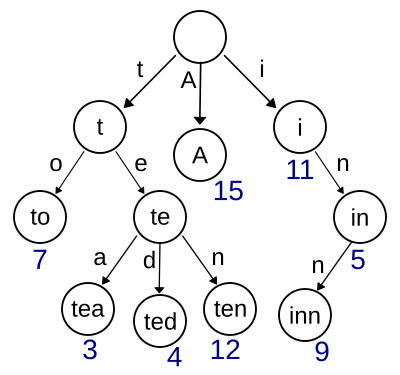
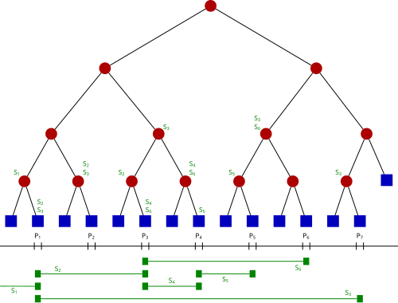
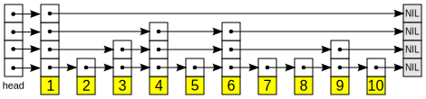
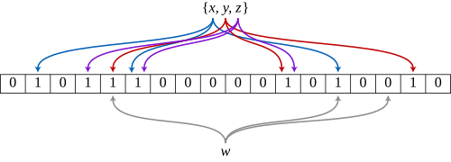

> **자료구조 시리즈**
> [1편: 선형 구조](/ds-1-linear/) · [2편: 해시와 트리](/ds-2-hash-tree/) · 3편: 그래프와 특수 구조 (현재 글)

2편까지 선형·트리 구조를 다뤘다. 이 편에서는 비선형 구조(그래프)와 특수 목적 자료구조를 다룬다.

## 10. 트라이 (Trie, Prefix Tree)


*트라이. 문자 단위로 분기하며, 루트에서 노드까지의 경로가 하나의 문자열을 나타낸다. (이미지: Wikimedia Commons, CC BY-SA)*

### 해결하려는 문제

해시 테이블은 문자열 키의 존재 여부를 O(1)에 확인할 수 있다. 하지만 **"특정 접두사로 시작하는 모든 키"**를 찾으려면 전체를 순회해야 한다. 트라이는 접두사 기반 탐색을 효율적으로 해결한다.

### 구조

트라이는 **문자 단위로 분기**하는 트리다. 루트에서 리프까지의 경로가 하나의 문자열을 나타낸다.

```
예: "cat", "car", "cap", "dog" 저장

        (root)
       /      \
      c        d
      |        |
      a        o
    / | \      |
   t   r  p    g
```

각 노드는 자식 노드를 가리키는 포인터 배열(또는 해시맵)과 "이 노드가 단어의 끝인지" 표시하는 플래그를 가진다.

### 연산과 시간 복잡도

문자열 길이를 L이라 하면:

삽입은 O(L)로, 문자를 하나씩 따라가며 없는 노드를 생성한다. 탐색도 O(L)로, 문자를 하나씩 따라가며 존재 여부를 확인한다. 접두사 검색은 O(L + k)인데, 접두사 위치까지 O(L)로 이동한 뒤 서브트리를 순회하여 결과 k개를 수집한다. 삭제는 O(L)로, 단어 끝 플래그를 해제한 뒤 불필요한 노드를 제거한다.

해시 테이블과 비교: 해시 테이블은 문자열 탐색에 O(L)이 필요하다(해시 계산 자체가 문자열 전체를 읽어야 하므로). 트라이도 O(L)이지만 접두사 검색이 가능하다는 차별점이 있다.

### 공간 문제와 해결

알파벳 26자 기준, 각 노드가 26개의 포인터를 가지면 대부분이 null이라 메모리 낭비가 심하다.

**압축 트라이(Compressed Trie / Radix Tree / Patricia Tree):**
자식이 하나뿐인 노드의 체인을 하나의 노드로 합친다. 예를 들어 `c → a → t`이 유일한 경로면 하나의 노드 `"cat"`으로 압축한다. 노드 수가 크게 줄어들고, 실제 저장된 문자열 수에 비례하는 공간만 사용한다.

### 사용처

- **자동 완성:** 사용자가 "app"을 입력하면 "app" 노드의 서브트리를 순회하여 "apple", "application", "approve" 등을 제안
- **사전(dictionary):** 맞춤법 검사기
- **IP 라우팅:** 라우터의 최장 접두사 매칭(Longest Prefix Match)
- **문자열 알고리즘:** 접미사 트라이(Suffix Trie)를 활용한 부분 문자열 검색

### 구현: 트라이

```c
#define ALPHA_SIZE 26

typedef struct TrieNode {
    struct TrieNode *children[ALPHA_SIZE];
    int is_end;   /* 이 노드가 단어의 끝인가 */
} TrieNode;

TrieNode *trie_new_node(void) {
    TrieNode *n = calloc(1, sizeof(TrieNode));  /* 모두 NULL/0 초기화 */
    return n;
}

void trie_insert(TrieNode *root, const char *word) {
    TrieNode *cur = root;
    for (; *word; word++) {
        int idx = *word - 'a';
        if (!cur->children[idx])
            cur->children[idx] = trie_new_node();
        cur = cur->children[idx];
    }
    cur->is_end = 1;
}

int trie_search(TrieNode *root, const char *word) {
    TrieNode *cur = root;
    for (; *word; word++) {
        int idx = *word - 'a';
        if (!cur->children[idx]) return 0;
        cur = cur->children[idx];
    }
    return cur->is_end;
}

int trie_starts_with(TrieNode *root, const char *prefix) {
    TrieNode *cur = root;
    for (; *prefix; prefix++) {
        int idx = *prefix - 'a';
        if (!cur->children[idx]) return 0;
        cur = cur->children[idx];
    }
    return 1;  /* 접두사까지 도달 → 해당 접두사로 시작하는 단어 존재 */
}
```

각 노드가 26개의 포인터 배열을 가지므로 노드당 `26 * 8 = 208바이트`(64비트 시스템)를 차지한다. 이것이 트라이의 공간 문제다. `children`을 해시맵이나 정렬 배열로 바꾸면 공간을 줄일 수 있다.

---

## 11. 그래프 (Graph)

### 본질

그래프는 **관계**를 표현하는 가장 일반적인 구조다. 정점(vertex) 집합 V와 간선(edge) 집합 E로 이루어진다. 트리는 그래프의 특수한 경우(사이클 없는 연결 그래프)이고, 연결 리스트도 그래프의 특수한 경우(경로 그래프)다.

### 분류

| 분류 기준 | 유형 | 예시 |
|----------|------|------|
| **방향** | 방향 그래프(Directed) | 트위터 팔로우, 웹 링크 |
| | 무방향 그래프(Undirected) | 페이스북 친구, 도로 |
| **가중치** | 가중(Weighted) | 지도(거리), 네트워크(대역폭) |
| | 비가중(Unweighted) | 소셜 연결 유무 |
| **사이클** | 순환(Cyclic) | 순환 의존성 |
| | 비순환(Acyclic) | DAG, 트리 |

{: width="30%" style="display:inline-block" }
{: width="30%" style="display:inline-block" }
{: width="30%" style="display:inline-block" }
*왼쪽부터: 방향 그래프, 무방향 그래프, 가중 그래프 (출처: [Wikipedia](https://en.wikipedia.org/wiki/Graph_(discrete_mathematics)))*

**DAG(Directed Acyclic Graph)**는 방향 그래프이면서 사이클이 없는 구조로, 위상 정렬, 작업 스케줄링, Git 커밋 히스토리 등에 핵심적으로 쓰인다.

### 표현 방식

**인접 행렬(Adjacency Matrix)**
- V×V 크기의 2차원 배열. `matrix[i][j] = 1`이면 간선 존재
- 간선 존재 확인: O(1)
- 공간: O(V²)
- 밀집 그래프(간선이 많은 경우)에 적합
- 간선에 가중치가 있으면 1 대신 가중치를 저장

**인접 리스트(Adjacency List)**
- 각 정점마다 연결된 정점의 리스트를 저장
- 공간: O(V + E)
- 간선 존재 확인: O(degree)
- 희소 그래프(간선이 적은 경우)에 적합
- 실무에서 대부분의 그래프는 희소하므로 인접 리스트가 표준

**인접 행렬 vs 인접 리스트 선택 기준:**
- 간선 수 E가 V²에 가까우면 → 인접 행렬
- 간선 수 E가 V에 가까우면 → 인접 리스트
- 간선 존재 여부를 자주 확인해야 하면 → 인접 행렬 (또는 인접 리스트 + 해시셋)

### 핵심 탐색 알고리즘

**BFS(너비 우선 탐색)**
- 큐를 사용한다. 시작점에서 가까운 정점부터 방문
- 최단 경로(비가중): BFS가 처음 도달한 거리가 곧 최단 거리
- 시간: O(V + E)

**DFS(깊이 우선 탐색)**
- 스택(또는 재귀)을 사용한다. 한 경로를 끝까지 파고 들어간 뒤 되돌아온다
- 사이클 탐지, 위상 정렬, 강연결 요소(SCC) 찾기에 활용
- 시간: O(V + E)

### 주요 그래프 알고리즘

**최단 경로** 문제는 간선 특성에 따라 알고리즘이 달라진다. 비가중 그래프에서는 **BFS**가 O(V + E)로 레벨별 탐색을 통해 최단 거리를 구한다. 양의 가중치만 있으면 **Dijkstra** 알고리즘이 O((V + E) log V)로, 가장 가까운 미방문 정점부터 확정해 나간다. 음의 가중치가 존재하면 **Bellman-Ford**를 써야 하며, 모든 간선을 V-1번 반복 완화하므로 O(VE)가 든다. 모든 쌍 최단 경로가 필요하면 **Floyd-Warshall**이 동적 프로그래밍으로 O(V³)에 해결한다.

**최소 신장 트리**는 **Kruskal** 또는 **Prim** 알고리즘이 O(E log E)로, 가장 저렴한 간선부터 추가하는 방식으로 구한다. **위상 정렬**은 DFS 또는 Kahn(BFS) 알고리즘으로 O(V + E)에 처리하며, 진입 차수 0인 노드부터 순서를 확정한다. **강연결 요소(SCC)** 분해는 Tarjan 또는 Kosaraju 알고리즘이 O(V + E)로 DFS를 기반으로 수행한다.

### 구현: 인접 리스트 + BFS + DFS

```c
#include <stdlib.h>
#include <string.h>

#define MAX_V 1000

/* 인접 리스트: 각 정점마다 연결된 정점을 동적 배열로 관리 */
typedef struct {
    int *adj[MAX_V];    /* adj[v] = v에 연결된 정점 배열 */
    int deg[MAX_V];     /* deg[v] = v의 차수 (연결된 정점 수) */
    int cap[MAX_V];     /* 동적 배열 용량 */
    int V;
} Graph;

void graph_init(Graph *g, int V) {
    g->V = V;
    for (int i = 0; i < V; i++) {
        g->deg[i] = 0;
        g->cap[i] = 4;
        g->adj[i] = malloc(sizeof(int) * 4);
    }
}

void graph_add_edge(Graph *g, int u, int v) {
    if (g->deg[u] == g->cap[u]) {
        g->cap[u] *= 2;
        g->adj[u] = realloc(g->adj[u], sizeof(int) * g->cap[u]);
    }
    g->adj[u][g->deg[u]++] = v;
}

/* BFS: 큐로 구현. 시작점에서의 최단 거리를 dist[]에 기록 */
void bfs(Graph *g, int start, int *dist) {
    int queue[MAX_V], front = 0, rear = 0;
    memset(dist, -1, sizeof(int) * g->V);
    dist[start] = 0;
    queue[rear++] = start;

    while (front < rear) {
        int u = queue[front++];
        for (int i = 0; i < g->deg[u]; i++) {
            int v = g->adj[u][i];
            if (dist[v] == -1) {
                dist[v] = dist[u] + 1;
                queue[rear++] = v;
            }
        }
    }
}

/* DFS: 재귀로 구현 */
int visited[MAX_V];

void dfs(Graph *g, int u) {
    visited[u] = 1;
    /* 여기서 u에 대한 처리 (전위) */
    for (int i = 0; i < g->deg[u]; i++) {
        int v = g->adj[u][i];
        if (!visited[v])
            dfs(g, v);
    }
    /* 여기서 u에 대한 처리 (후위) */
}
```

BFS의 `queue`는 원형 큐 대신 단순 배열을 쓴다. 정점은 최대 한 번만 큐에 들어가므로 `MAX_V` 크기면 충분하다. DFS는 재귀 자체가 콜 스택을 사용하므로 별도 스택이 필요 없다.

> 시각화: [VisuAlgo - Graph Traversal](https://visualgo.net/en/dfsbfs)에서 BFS의 레벨별 탐색과 DFS의 백트래킹을 애니메이션으로 확인할 수 있다.

---

## 12. 서로소 집합 (Disjoint Set / Union-Find)

### 해결하려는 문제

"원소 A와 원소 B가 같은 그룹에 속하는가?" 그리고 "두 그룹을 합쳐라." 이 두 연산을 거의 O(1)에 처리한다.

### 구조

각 원소가 자신의 부모를 가리키는 트리(포레스트)로 표현한다. 같은 트리에 속한 원소는 같은 집합이다. 각 트리의 루트가 집합의 대표(representative)다.

### 핵심 연산

**Find(x):** x의 루트를 찾는다. 부모를 따라 올라간다.
**Union(x, y):** x가 속한 집합과 y가 속한 집합을 합친다. 한쪽의 루트를 다른 쪽의 루트 아래에 붙인다.

### 최적화 두 가지

최적화 없이는 트리가 편향되어 Find가 O(n)까지 퇴화한다.

**1. Union by Rank (또는 Union by Size)**
- 합칠 때 높이(rank)가 낮은 트리를 높은 트리 아래에 붙인다
- 트리 높이가 O(log n)으로 유지된다

**2. 경로 압축(Path Compression)**
- Find 과정에서 방문한 모든 노드를 직접 루트에 연결한다
- 한 번 Find하면 이후 같은 원소의 Find가 O(1)에 가까워진다

두 최적화를 모두 적용하면 m번의 연산이 **O(m α(n))**에 수행된다. α(n)은 아커만 함수의 역함수로, 실질적으로 5를 넘지 않는다. **사실상 상수 시간**이다.

### 사용처

- **Kruskal 알고리즘:** 간선을 가중치 순으로 정렬한 뒤, Union-Find로 사이클 여부를 확인하면서 최소 신장 트리를 만든다
- **연결 요소(Connected Components) 판별:** 동적으로 간선이 추가되는 상황에서 두 정점이 같은 연결 요소에 속하는지 확인
- **이미지 처리:** 인접한 동일 색상 픽셀 그룹 묶기
- **네트워크 연결 확인:** 컴퓨터 A와 B가 같은 네트워크에 있는가?

### 구현: Union-Find

```c
#define UF_MAX 100000

int parent[UF_MAX];
int rank_[UF_MAX];   /* rank: 트리 높이의 상한 */

void uf_init(int n) {
    for (int i = 0; i < n; i++) {
        parent[i] = i;    /* 자기 자신이 루트 */
        rank_[i] = 0;
    }
}

int uf_find(int x) {
    if (parent[x] != x)
        parent[x] = uf_find(parent[x]);   /* 경로 압축: 재귀적으로 루트에 직접 연결 */
    return parent[x];
}

void uf_union(int x, int y) {
    int rx = uf_find(x), ry = uf_find(y);
    if (rx == ry) return;    /* 이미 같은 집합 */
    /* Union by Rank: 높이가 낮은 트리를 높은 트리 아래에 붙인다 */
    if (rank_[rx] < rank_[ry])      parent[rx] = ry;
    else if (rank_[rx] > rank_[ry]) parent[ry] = rx;
    else { parent[ry] = rx; rank_[rx]++; }
}

int uf_connected(int x, int y) {
    return uf_find(x) == uf_find(y);
}
```

전체 코드가 20줄 남짓이다. `uf_find`의 경로 압축 한 줄(`parent[x] = uf_find(parent[x])`)이 amortized 성능을 극적으로 개선한다.

> 시각화: [VisuAlgo - Union-Find](https://visualgo.net/en/ufds)에서 경로 압축과 Union by Rank가 트리 구조를 어떻게 평탄화하는지 확인할 수 있다.

---

## 13. 세그먼트 트리 (Segment Tree)


*세그먼트 트리. 각 노드가 특정 구간의 집계값(합, 최솟값 등)을 저장한다. (이미지: Wikimedia Commons, CC BY-SA)*

### 해결하려는 문제

배열이 주어졌을 때 두 가지 연산을 빠르게 하고 싶다:
1. **구간 질의(Range Query):** 인덱스 l부터 r까지의 합, 최솟값, 최댓값 등을 구하라
2. **점 갱신(Point Update):** 인덱스 i의 값을 변경하라

단순 배열로는 질의 O(n), 갱신 O(1)이다. 누적합(prefix sum)을 쓰면 질의 O(1), 갱신 O(n)이다. 세그먼트 트리는 **둘 다 O(log n)**에 해결한다.

### 구조

배열을 반씩 나누어 이진 트리를 만든다. 각 노드는 자신이 담당하는 구간의 집계값(합, 최솟값 등)을 저장한다.

```
배열: [2, 1, 5, 3, 4, 2]

               [17]           -- 전체 합
            /        \
         [8]          [9]     -- 좌반, 우반
        /    \       /    \
      [3]    [5]   [7]    [2] -- 2칸 구간
     / \     |    / \      |
   [2] [1]  [5] [3] [4]  [2] -- 원소
```

### 연산

**구간 질의:**
루트에서 시작하여 질의 구간과 노드의 담당 구간을 비교한다.
- 완전히 포함되면: 그 노드의 값을 반환
- 전혀 겹치지 않으면: 항등원 반환 (합이면 0, 최솟값이면 ∞)
- 부분 겹침이면: 양쪽 자식에게 재귀

최대 O(4 log n) = O(log n)개의 노드를 방문한다.

**점 갱신:**
해당 원소를 포함하는 모든 조상 노드(루트까지)를 업데이트. O(log n)개의 노드.

### 게으른 전파 (Lazy Propagation)

**구간 갱신(Range Update)**이 필요할 때 쓴다. "인덱스 l부터 r까지 모두 x를 더해라" 같은 연산이다.

핵심 아이디어: 갱신 정보를 즉시 전파하지 않고 노드에 "나중에 전파할 값(lazy tag)"을 기록해둔다. 해당 노드를 실제로 방문할 때 비로소 자식에게 전파한다.

구간 갱신과 구간 질의 모두 O(log n)으로 처리할 수 있다.

### 사용처

- 구간 합, 구간 최솟값/최댓값 질의가 빈번한 알고리즘 문제
- RMQ(Range Minimum Query)
- 좌표 압축 후 구간 연산
- 2D 세그먼트 트리로 확장 가능

### 구현: 세그먼트 트리 (구간 합)

```c
#define SEG_MAX 400004  /* 4 * n */

int tree[SEG_MAX];

void seg_build(int *arr, int node, int start, int end) {
    if (start == end) {
        tree[node] = arr[start];
        return;
    }
    int mid = (start + end) / 2;
    seg_build(arr, 2*node, start, mid);
    seg_build(arr, 2*node+1, mid+1, end);
    tree[node] = tree[2*node] + tree[2*node+1];
}

/* 구간 [l, r]의 합을 구한다 */
int seg_query(int node, int start, int end, int l, int r) {
    if (r < start || end < l) return 0;        /* 겹치지 않음 */
    if (l <= start && end <= r) return tree[node]; /* 완전히 포함 */
    int mid = (start + end) / 2;
    return seg_query(2*node, start, mid, l, r)
         + seg_query(2*node+1, mid+1, end, l, r);
}

/* arr[idx]를 val로 변경 */
void seg_update(int node, int start, int end, int idx, int val) {
    if (start == end) {
        tree[node] = val;
        return;
    }
    int mid = (start + end) / 2;
    if (idx <= mid) seg_update(2*node, start, mid, idx, val);
    else            seg_update(2*node+1, mid+1, end, idx, val);
    tree[node] = tree[2*node] + tree[2*node+1];
}

/* 사용 예:
 * int arr[] = {2, 1, 5, 3, 4, 2};
 * seg_build(arr, 1, 0, 5);           // 트리 구축
 * seg_query(1, 0, 5, 1, 3);          // arr[1..3] 합 = 9
 * seg_update(1, 0, 5, 2, 10);        // arr[2] = 10으로 변경
 */
```

노드 번호 규칙: 루트가 1, 왼쪽 자식 `2*node`, 오른쪽 자식 `2*node+1`. 배열 크기를 `4*n`으로 잡으면 충분하다.

> 시각화: [VisuAlgo - Segment Tree](https://visualgo.net/en/segmenttree)에서 구간 질의와 갱신이 어떤 노드를 방문하는지 단계별로 확인할 수 있다.

---

## 14. 펜윅 트리 (Fenwick Tree / Binary Indexed Tree, BIT)

### 세그먼트 트리와의 관계

세그먼트 트리와 같은 문제(구간 합 질의 + 점 갱신)를 풀지만, 구현이 훨씬 간결하다. 상수 계수도 작아 실측에서 더 빠른 경우가 많다.

다만 세그먼트 트리보다 범용성이 떨어진다. **역연산이 존재하는 연산(합, XOR 등)**에만 사용할 수 있다. 구간 최솟값/최댓값처럼 역연산이 없는 경우에는 세그먼트 트리를 써야 한다.

### 핵심 아이디어

인덱스의 **최하위 비트(lowest set bit)**를 활용하여 각 인덱스가 담당하는 구간을 결정한다.

`lowbit(i) = i & (-i)`

인덱스 `i`의 노드는 `[i - lowbit(i) + 1, i]` 구간의 합을 저장한다.

```
인덱스(2진수):  구간
 1 (0001)     → [1, 1]
 2 (0010)     → [1, 2]
 3 (0011)     → [3, 3]
 4 (0100)     → [1, 4]
 5 (0101)     → [5, 5]
 6 (0110)     → [5, 6]
 7 (0111)     → [7, 7]
 8 (1000)     → [1, 8]
```

### 연산

**prefix sum query (1~i까지의 합):**
```
sum = 0
while i > 0:
    sum += tree[i]
    i -= lowbit(i)   # 최하위 비트를 빼며 올라감
return sum
```

**점 갱신:**
```
while i <= n:
    tree[i] += delta
    i += lowbit(i)   # 최하위 비트를 더하며 올라감
```

구간 합 `[l, r]`은 `prefix(r) - prefix(l-1)`로 구한다.

두 연산 모두 O(log n). 코드가 10줄 내외로 매우 짧다.

### 구현: 펜윅 트리

```c
#define BIT_MAX 100001

int bit[BIT_MAX];
int n;

void bit_update(int i, int delta) {
    for (; i <= n; i += i & (-i))   /* i & (-i) = 최하위 비트 */
        bit[i] += delta;
}

int bit_query(int i) {              /* prefix sum [1..i] */
    int sum = 0;
    for (; i > 0; i -= i & (-i))
        sum += bit[i];
    return sum;
}

int bit_range_query(int l, int r) { /* [l..r] 구간 합 */
    return bit_query(r) - bit_query(l - 1);
}

/* 배열로부터 구축: 각 원소에 대해 update 호출 */
void bit_build(int *arr, int size) {
    n = size;
    for (int i = 0; i <= n; i++) bit[i] = 0;
    for (int i = 1; i <= n; i++)
        bit_update(i, arr[i]);      /* 1-indexed */
}
```

`i & (-i)`가 전체 구조를 결정한다. 2의 보수 표현에서 `-i`는 비트를 뒤집고 1을 더한 것이므로, `i & (-i)`는 최하위 set bit만 남긴다. 이 한 줄의 비트 연산이 세그먼트 트리 수십 줄을 대체한다.

---

## 15. 스킵 리스트 (Skip List)


*스킵 리스트. 다층 연결 리스트로, 상위 층에서 빠르게 건너뛴 뒤 하위 층으로 내려간다. (이미지: Wikimedia Commons, CC BY-SA)*

### 해결하려는 문제

연결 리스트의 탐색은 O(n)이다. "연결 리스트에서 이진 탐색처럼 빠르게 탐색할 수 없을까?" 스킵 리스트는 연결 리스트를 **확률적으로 다층화**하여 O(log n) 탐색을 달성한다.

### 구조

여러 층(level)의 연결 리스트를 쌓는다. 최하층은 모든 원소를 담고, 상위 층으로 갈수록 원소가 확률적으로 줄어든다.

```
Level 3:  1 ────────────────────────── 9
Level 2:  1 ────── 4 ─────────── 7 ── 9
Level 1:  1 ── 3 ─ 4 ── 5 ── 6 ─ 7 ── 9
Level 0:  1  2  3  4  5  6  7  8  9
```

각 원소의 높이는 삽입 시 동전 던지기(확률 1/2)로 결정한다. 평균적으로 절반의 원소가 1층, 1/4이 2층, 1/8이 3층... 이므로 기대 높이는 O(log n)이다.

### 탐색

최상위 층에서 시작하여 오른쪽으로 이동하다가, 찾는 값보다 큰 원소를 만나면 한 층 아래로 내려간다. 이진 탐색과 유사한 패턴이다. 기대 시간 O(log n).

### 왜 균형 트리 대신 쓰는가

AVL이나 레드-블랙 트리와 같은 O(log n) 성능을 제공하면서 **구현이 훨씬 단순**하다. 회전이나 색상 규칙 같은 복잡한 재균형 로직이 없다. 삽입/삭제 시 확률적으로 높이를 결정하면 끝이다.

Redis의 Sorted Set이 스킵 리스트로 구현되어 있다. LevelDB, RocksDB 같은 LSM-Tree 기반 DB의 MemTable에도 쓰인다.

### 시간 복잡도 (기댓값)

탐색, 삽입, 삭제 모두 기댓값 O(log n)이다. 기대 공간은 O(n)이다.

기대 공간은 O(n). 각 원소가 평균 2개의 포인터를 가지므로(1 + 1/2 + 1/4 + ... = 2) 연결 리스트 대비 약 2배.

---

## 16. 블룸 필터 (Bloom Filter)


*블룸 필터. 원소 x, y, z를 삽입한 상태. w를 질의하면 해시 위치 중 하나가 0이므로 "확실히 없다"고 답한다. (이미지: Wikimedia Commons, CC BY-SA)*

### 해결하려는 문제

"이 원소가 집합에 **없는 것은 확실한가**?" 블룸 필터는 이 질문에 극도로 적은 메모리로 답한다.

### 핵심 특성

- **"없다"는 답은 100% 정확하다** (false negative 없음)
- **"있다"는 답은 틀릴 수 있다** (false positive 가능)
- 삭제가 불가능하다
- 실제 원소를 저장하지 않는다

### 구조와 동작

m비트 배열과 k개의 해시 함수를 사용한다.

**삽입:** 원소를 k개의 해시 함수에 통과시켜 k개의 비트 위치를 얻고, 해당 비트를 1로 설정한다.

**질의:** 원소를 k개의 해시 함수에 통과시켜 k개의 비트 위치를 확인한다. 모두 1이면 "아마 있다", 하나라도 0이면 "확실히 없다".

### false positive 확률

n개 원소를 삽입한 후 false positive 확률은 대략:

```
p ≈ (1 - e^(-kn/m))^k
```

m/n(비트 수/원소 수) 비율이 10이고 k = 7이면 false positive 확률이 약 0.8%다. 원소당 10비트(1.25바이트)만으로 99.2% 정확도를 얻는다.

### 사용처

- **웹 크롤러:** 이미 방문한 URL인지 확인. 수십억 개의 URL을 해시 테이블에 저장하면 메모리가 부족하지만, 블룸 필터는 수 GB로 충분하다
- **데이터베이스:** LSM-Tree(LevelDB, RocksDB, Cassandra) 에서 SSTable에 키가 없는 경우를 빠르게 걸러낸다. 불필요한 디스크 읽기를 방지
- **네트워크:** CDN에서 캐시 오염 방지. 한 번만 요청된 컨텐츠는 캐시하지 않고, 두 번 이상 요청된 것만 캐시. 첫 요청을 블룸 필터로 기록
- **스팸 필터, 악성 URL 탐지**

### 변형

- **Counting Bloom Filter:** 비트 대신 카운터를 사용하여 삭제를 지원
- **Cuckoo Filter:** 삭제 가능 + false positive 확률이 낮음 + 공간 효율 비슷

### 구현: 블룸 필터

```c
#include <string.h>

#define BF_SIZE 1024   /* 비트 배열 크기 (비트 단위) */
#define BF_BYTES (BF_SIZE / 8)
#define BF_K 3         /* 해시 함수 개수 */

unsigned char bf_bits[BF_BYTES];

/* 간단한 해시: seed를 바꿔가며 k개의 서로 다른 해시를 생성 */
static unsigned int bf_hash(const char *s, unsigned int seed) {
    unsigned int h = seed;
    while (*s)
        h = h * 31 + (unsigned char)*s++;
    return h % BF_SIZE;
}

void bf_add(const char *key) {
    for (int i = 0; i < BF_K; i++) {
        unsigned int pos = bf_hash(key, i * 0x9e3779b9);
        bf_bits[pos / 8] |= (1 << (pos % 8));   /* 비트 설정 */
    }
}

int bf_might_contain(const char *key) {
    for (int i = 0; i < BF_K; i++) {
        unsigned int pos = bf_hash(key, i * 0x9e3779b9);
        if (!(bf_bits[pos / 8] & (1 << (pos % 8))))
            return 0;   /* 하나라도 0이면 확실히 없다 */
    }
    return 1;   /* 모두 1이면 "아마 있다" (false positive 가능) */
}
```

전체가 비트 연산이다. `bf_bits`는 `unsigned char` 배열이고, 각 비트를 `pos/8`로 바이트, `pos%8`로 비트 위치를 찾아 조작한다. 이 단순한 구조로 수백만 개의 원소를 수 KB에 표현할 수 있다.

---

이전 글: [자료구조 2편: 해시와 트리](/ds-2-hash-tree/) -- 해시 테이블, BST, 균형 트리, B-Tree, 힙
