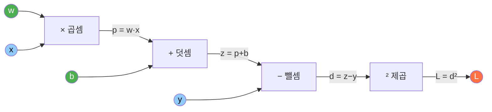
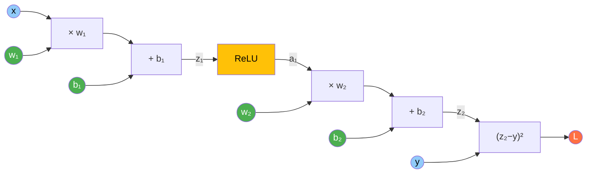
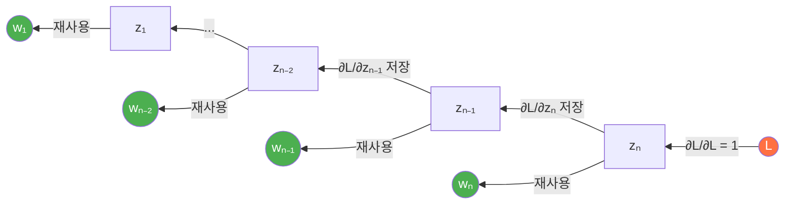
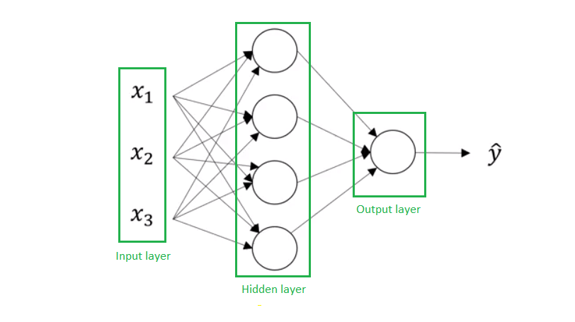
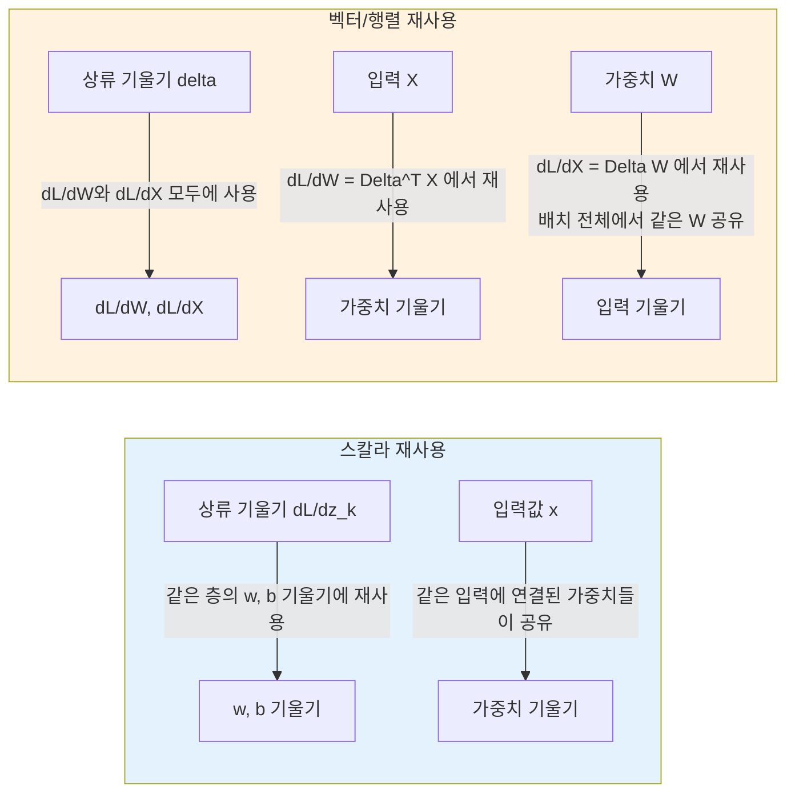
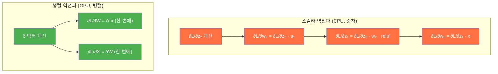
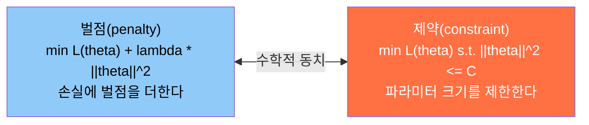
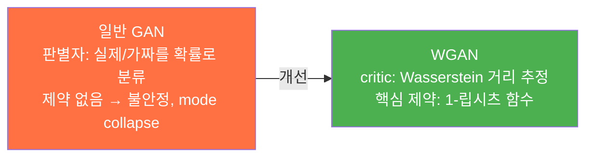
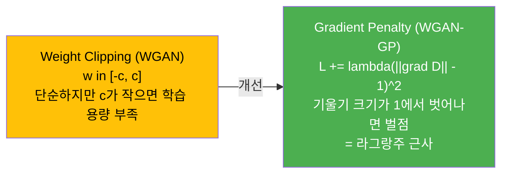

이 글은 역전파(Backpropagation)를 **수학적 기초부터 실전 구현까지** 단계적으로 다룬다. 신경망 학습의 핵심 알고리즘을 숫자 하나하나 따라가며 이해하는 것이 목표다.

- **Level 1** --- 기울기가 왜 필요한가: 경사 하강법의 직관과 역전파의 동기
- **Level 2** --- 연쇄 법칙과 계산 그래프: 수치 예제로 따라가는 역전파
- **Level 3** --- 실전: 기울기 문제, 옵티마이저, 자동 미분

주요 참고 논문:
- Rumelhart, Hinton & Williams, 1986. "Learning representations by back-propagating errors" --- Nature
- 미적분학의 연쇄 법칙(chain rule)이 수학적 기초

---

# Level 1: 기울기가 왜 필요한가

## 신경망 학습 = 손실 함수의 최솟값 찾기

신경망을 학습시킨다는 것은 결국 **손실 함수(Loss Function)의 값을 가능한 한 작게 만드는 파라미터를 찾는 것**이다. 손실 함수는 "모델의 예측이 정답과 얼마나 다른가"를 숫자 하나로 표현한다.

문제는 **어떤 방향으로 파라미터를 바꿔야 손실이 줄어드는가**를 알아야 한다는 것이다. 여기서 미분(기울기)이 등장한다.

## 1변수 예제: y = x^2의 최솟값 찾기

가장 간단한 경우를 생각하자. 함수 $$ y = x^2 $$의 최솟값을 찾고 싶다.

```
y = x²

      y
  9 ─ *                         *
      │
  4 ─ │   *                 *
      │
  1 ─ │       *         *
      │
  0 ─ │           *
      └───┼───┼───┼───┼───┼───→ x
         -3  -2  -1   0   1   2   3

최솟값은 x = 0에서 y = 0이다.
눈으로 보면 바로 알 수 있지만, 컴퓨터는 어떻게 찾는가?
```

**기울기(gradient)**가 답이다. $$ \frac{dy}{dx} = 2x $$이므로:

- $$ x = 3 $$이면 기울기 = 6 (양수) --- 오른쪽으로 올라가는 중 --- **왼쪽으로 이동해야 한다**
- $$ x = -2 $$이면 기울기 = -4 (음수) --- 왼쪽으로 올라가는 중 --- **오른쪽으로 이동해야 한다**
- $$ x = 0 $$이면 기울기 = 0 --- 최솟값에 도달

즉, **기울기의 반대 방향으로 이동하면 항상 아래로 내려간다.** 이것이 경사 하강법(Gradient Descent)의 핵심이다.

## 수치 예제: 경사 하강법 단계별 추적

학습률(learning rate) $$ \eta = 0.1 $$로 설정하고, $$ x = 3 $$에서 시작한다.

업데이트 규칙: $$ x_{\text{new}} = x - \eta \cdot \frac{dy}{dx} $$

```
step 0: x = 3.000   y = 9.000   기울기 = 2 * 3.000 = 6.000
         x_new = 3.000 - 0.1 * 6.000 = 2.400

step 1: x = 2.400   y = 5.760   기울기 = 2 * 2.400 = 4.800
         x_new = 2.400 - 0.1 * 4.800 = 1.920

step 2: x = 1.920   y = 3.686   기울기 = 2 * 1.920 = 3.840
         x_new = 1.920 - 0.1 * 3.840 = 1.536

step 3: x = 1.536   y = 2.359   기울기 = 2 * 1.536 = 3.072
         x_new = 1.536 - 0.1 * 3.072 = 1.229

step 4: x = 1.229   y = 1.510   기울기 = 2 * 1.229 = 2.458
         x_new = 1.229 - 0.1 * 2.458 = 0.983

step 5: x = 0.983   y = 0.966   기울기 = 2 * 0.983 = 1.966
         x_new = 0.983 - 0.1 * 1.966 = 0.786
```

매 단계마다 $$ y $$가 줄어든다: 9.000 -> 5.760 -> 3.686 -> 2.359 -> 1.510 -> 0.966 -> ...

계속 반복하면 $$ x \to 0 $$으로 수렴하고, $$ y \to 0 $$이 된다. **기울기만 알면 최솟값을 찾을 수 있다.**

## 다변수: 신경망은 파라미터가 수백만 개다

실제 신경망의 손실 함수는 $$ L(w_1, w_2, \ldots, w_n) $$ 형태다. 각 파라미터 $$ w_i $$에 대해 **편미분(partial derivative)** $$ \frac{\partial L}{\partial w_i} $$를 구해야 한다.

```
손실 L은 모든 가중치의 함수:

L(w₁, w₂, w₃, ..., wₙ)

각 가중치에 대한 편미분을 구한다:
  ∂L/∂w₁ = ?    (w₁을 살짝 바꾸면 L이 얼마나 변하는가)
  ∂L/∂w₂ = ?    (w₂를 살짝 바꾸면 L이 얼마나 변하는가)
  ...
  ∂L/∂wₙ = ?    (wₙ을 살짝 바꾸면 L이 얼마나 변하는가)

이 편미분들을 모아 놓은 벡터 = 기울기(gradient):
  ∇L = [∂L/∂w₁, ∂L/∂w₂, ..., ∂L/∂wₙ]
```

업데이트 규칙은 동일하다: $$ w_i \leftarrow w_i - \eta \cdot \frac{\partial L}{\partial w_i} $$

## 나이브한 방법: 수치 미분 --- 왜 불가능한가

기울기를 구하는 가장 단순한 방법은 **수치 미분(numerical differentiation)**이다:

$$
\frac{\partial L}{\partial w_i} \approx \frac{L(w_i + \epsilon) - L(w_i)}{\epsilon}
$$

$$ w_i $$를 아주 조금($$ \epsilon $$만큼) 바꿔보고, 손실이 얼마나 변하는지 측정한다.

```
파라미터가 n개일 때:

수치 미분:
  w₁을 살짝 바꿔서 순전파 1회 → ∂L/∂w₁
  w₂를 살짝 바꿔서 순전파 1회 → ∂L/∂w₂
  ...
  wₙ을 살짝 바꿔서 순전파 1회 → ∂L/∂wₙ

  기울기 1번 구하는 데 순전파 n회 필요
  1 에폭에 (데이터 수 × n)회 순전파

  GPT-3: n = 1,750억 → 기울기 1번 = 순전파 1,750억 회
  → 완전히 불가능
```

수치 미분은 파라미터당 순전파 1회가 필요하므로, 전체 기울기를 구하는 데 $$ O(n) $$회의 순전파가 필요하다. 파라미터가 수백만~수십억 개인 신경망에서는 쓸 수 없다.

## 역전파의 핵심 아이디어: 한 번의 역방향 통과로 모든 기울기를 구한다

**역전파(Backpropagation)**는 연쇄 법칙을 활용하여 **순전파 1회 + 역전파 1회**만으로 모든 파라미터의 기울기를 한꺼번에 구한다.

수치 미분은 기울기 1세트를 구하려면 순전파를 파라미터 수(n)만큼 반복해야 하므로, n이 1억이면 1억 회 순전파가 필요하다. 반면 역전파는 순전파 1회와 역전파 1회만으로 모든 기울기를 구하며, 총 비용은 약 2~3배 수준이다.

역전파는 수치 미분보다 **파라미터 수(n)배** 빠르다.

이것이 역전파가 존재하는 이유다. Rumelhart, Hinton, Williams (1986)의 논문이 이 알고리즘을 신경망 학습에 적용하면서, 다층 신경망의 학습이 비로소 실용적이 되었다.

---

# Level 2: 연쇄 법칙과 계산 그래프

## 연쇄 법칙 복습

연쇄 법칙(chain rule)은 합성 함수의 미분법이다.

$$ y = f(g(x)) $$일 때:

$$
\frac{dy}{dx} = \frac{dy}{dg} \cdot \frac{dg}{dx}
$$

예: $$ y = (3x + 1)^2 $$

- $$ g(x) = 3x + 1 $$, $$ y = g^2 $$
- $$ \frac{dy}{dg} = 2g $$, $$ \frac{dg}{dx} = 3 $$
- $$ \frac{dy}{dx} = 2g \cdot 3 = 2(3x+1) \cdot 3 = 6(3x+1) $$

핵심: **각 단계의 "로컬 미분"을 곱하면 전체 미분을 구할 수 있다.** 역전파는 이 원리를 계산 그래프 위에서 체계적으로 적용하는 것이다.

## 단순 예제: z = wx + b, L = (z - y)^2

가장 간단한 1-뉴런, 1-데이터 모델로 시작한다.



- **초록**: 학습 가능한 파라미터 ($$ w, b $$)
- **파랑**: 입력 데이터 ($$ x, y $$)
- **주황**: 최종 손실 ($$ L $$)

### 순전파: 숫자 넣기

초기값: $$ w = 2, \; x = 3, \; b = 1, \; y = 10 $$

```
p = w * x     = 2 * 3     = 6
z = p + b     = 6 + 1     = 7
d = z - y     = 7 - 10    = -3
L = d²        = (-3)²     = 9
```

손실 $$ L = 9 $$다. 이제 이 손실을 줄이려면 $$ w $$와 $$ b $$를 어느 방향으로 바꿔야 하는지 알아야 한다.

### 역전파: 출력에서 입력 방향으로 기울기 전파

역전파는 **출력(L)에서 시작하여 입력 방향으로** 기울기를 전파한다. 각 노드에서는 **로컬 기울기 x 상류 기울기(upstream gradient)**만 계산하면 된다.

**단계 1: dL/dL**

자기 자신에 대한 미분은 항상 1이다.

$$
\frac{\partial L}{\partial L} = 1
$$

**단계 2: dL/dd**

$$ L = d^2 $$이므로 $$ \frac{\partial L}{\partial d} = 2d = 2 \times (-3) = -6 $$

```
로컬 기울기: ∂L/∂d = 2d = 2 × (-3) = -6
상류 기울기: ∂L/∂L = 1
결합:        ∂L/∂d = -6 × 1 = -6
```

**단계 3: dL/dz**

$$ d = z - y $$이므로 $$ \frac{\partial d}{\partial z} = 1 $$

```
로컬 기울기: ∂d/∂z = 1
상류 기울기: ∂L/∂d = -6
결합:        ∂L/∂z = 1 × (-6) = -6
```

**단계 4: dL/dp와 dL/db**

$$ z = p + b $$이므로 $$ \frac{\partial z}{\partial p} = 1 $$, $$ \frac{\partial z}{\partial b} = 1 $$

```
∂L/∂p = ∂z/∂p × ∂L/∂z = 1 × (-6) = -6
∂L/∂b = ∂z/∂b × ∂L/∂z = 1 × (-6) = -6
```

**단계 5: dL/dw**

$$ p = w \cdot x $$이므로 $$ \frac{\partial p}{\partial w} = x = 3 $$

```
∂L/∂w = ∂p/∂w × ∂L/∂p = 3 × (-6) = -18
```

### 정리

```
순전파 결과:
  p = 6,  z = 7,  d = -3,  L = 9

역전파 결과:
  ∂L/∂L = 1
  ∂L/∂d = -6
  ∂L/∂z = -6
  ∂L/∂b = -6     ← b의 기울기
  ∂L/∂p = -6
  ∂L/∂w = -18    ← w의 기울기
```

### 파라미터 업데이트

학습률 $$ \eta = 0.01 $$로 업데이트한다:

```
w_new = w - η × ∂L/∂w = 2 - 0.01 × (-18) = 2 + 0.18 = 2.18
b_new = b - η × ∂L/∂b = 1 - 0.01 × (-6)  = 1 + 0.06 = 1.06
```

검증 --- 새로운 파라미터로 다시 순전파:

```
p = 2.18 * 3 = 6.54
z = 6.54 + 1.06 = 7.60
d = 7.60 - 10 = -2.40
L = (-2.40)² = 5.76
```

손실이 9에서 5.76으로 줄었다. 기울기가 올바른 방향을 가리킨 것이다.

## 2-레이어 네트워크 예제

이제 층이 2개인 네트워크로 확장한다. 활성화 함수로 ReLU를 사용한다.



- $$ z_1 = w_1 x + b_1 $$ → ReLU → $$ a_1 $$ → $$ z_2 = w_2 a_1 + b_2 $$ → $$ L = (z_2 - y)^2 $$

### 순전파: 숫자 넣기

초기값: $$ w_1 = 0.5, \; b_1 = -1, \; w_2 = 2, \; b_2 = 0.5, \; x = 4, \; y = 5 $$

```
z₁ = w₁ * x + b₁   = 0.5 * 4 + (-1)   = 2.0 - 1.0  = 1.0
a₁ = relu(z₁)       = relu(1.0)         = 1.0         (1.0 > 0이므로 그대로 통과)
z₂ = w₂ * a₁ + b₂   = 2.0 * 1.0 + 0.5  = 2.5
d  = z₂ - y         = 2.5 - 5.0         = -2.5
L  = d²             = (-2.5)²           = 6.25
```

### 역전파: 출력에서 입력 방향으로

**dL/dd:**

$$
\frac{\partial L}{\partial d} = 2d = 2 \times (-2.5) = -5.0
$$

**dL/dz2:**

$$ d = z_2 - y $$이므로 $$ \frac{\partial d}{\partial z_2} = 1 $$

$$
\frac{\partial L}{\partial z_2} = 1 \times (-5.0) = -5.0
$$

**dL/dw2와 dL/db2:**

$$ z_2 = w_2 \cdot a_1 + b_2 $$이므로:

```
∂z₂/∂w₂ = a₁ = 1.0     →  ∂L/∂w₂ = 1.0 × (-5.0) = -5.0
∂z₂/∂b₂ = 1             →  ∂L/∂b₂ = 1 × (-5.0)   = -5.0
∂z₂/∂a₁ = w₂ = 2.0      →  ∂L/∂a₁ = 2.0 × (-5.0) = -10.0
```

**dL/dz1 (ReLU 통과):**

ReLU의 미분: $$ z_1 > 0 $$이면 1, $$ z_1 \le 0 $$이면 0.

$$ z_1 = 1.0 > 0 $$이므로 $$ \frac{\partial a_1}{\partial z_1} = 1 $$

$$
\frac{\partial L}{\partial z_1} = 1 \times (-10.0) = -10.0
$$

**dL/dw1과 dL/db1:**

$$ z_1 = w_1 \cdot x + b_1 $$이므로:

```
∂z₁/∂w₁ = x = 4.0      →  ∂L/∂w₁ = 4.0 × (-10.0)  = -40.0
∂z₁/∂b₁ = 1             →  ∂L/∂b₁ = 1 × (-10.0)    = -10.0
```

### 전체 기울기 요약

```
파라미터      값       기울기(∂L/∂·)
─────────────────────────────────────
w₁          0.5       -40.0
b₁         -1.0       -10.0
w₂          2.0        -5.0
b₂          0.5        -5.0
```

### 업데이트 및 검증

$$ \eta = 0.01 $$:

```
w₁_new = 0.5  - 0.01 × (-40.0) = 0.5  + 0.40 = 0.90
b₁_new = -1.0 - 0.01 × (-10.0) = -1.0 + 0.10 = -0.90
w₂_new = 2.0  - 0.01 × (-5.0)  = 2.0  + 0.05 = 2.05
b₂_new = 0.5  - 0.01 × (-5.0)  = 0.5  + 0.05 = 0.55
```

새 파라미터로 순전파:

```
z₁ = 0.90 * 4 + (-0.90)   = 3.60 - 0.90  = 2.70
a₁ = relu(2.70)           = 2.70
z₂ = 2.05 * 2.70 + 0.55   = 5.535 + 0.55 = 6.085
d  = 6.085 - 5.0          = 1.085
L  = 1.085²               = 1.177
```

손실: 6.25 -> 1.177. 한 번의 업데이트로 크게 줄었다. (오버슈팅이 발생하여 d의 부호가 바뀌었지만, 손실 자체는 확실히 감소했다.)

### 핵심 패턴: 로컬 기울기 x 상류 기울기

모든 노드에서 동일한 패턴이 반복된다:


*역전파의 기울기 흐름: 출력에서 입력으로 연쇄 법칙을 적용하며 기울기를 전파한다. (출처: [colah's blog](https://colah.github.io/posts/2015-08-Backprop/))*

$$
\frac{\partial L}{\partial \text{입력}} = \underbrace{\frac{\partial \text{출력}}{\partial \text{입력}}}_{\text{로컬 기울기}} \times \underbrace{\frac{\partial L}{\partial \text{출력}}}_{\text{상류 기울기}}
$$

이 단순한 규칙을 계산 그래프의 모든 노드에 순서대로 적용하면, 모든 파라미터의 기울기를 한 번에 구할 수 있다. 이것이 역전파 알고리즘의 전부다.

## 역전파의 진짜 핵심: 중간 결과의 재사용

위에서 "로컬 기울기 × 상류 기울기"라는 규칙을 배웠다. 하지만 역전파가 **왜** 효율적인지를 진정으로 이해하려면, 이 규칙 없이 연쇄 법칙을 직접 펼쳐보는 것이 필요하다.

### 식을 완전히 펼쳐보자

2-레이어 네트워크의 각 파라미터 기울기를 연쇄 법칙으로 **끝까지 전개**한다.

$$
L = (z_2 - y)^2, \quad z_2 = w_2 a_1 + b_2, \quad a_1 = \text{relu}(z_1), \quad z_1 = w_1 x + b_1
$$

**$$ \frac{\partial L}{\partial w_2} $$를 구해보자:**

$$
\frac{\partial L}{\partial w_2}
= \frac{\partial L}{\partial d} \cdot \frac{\partial d}{\partial z_2} \cdot \frac{\partial z_2}{\partial w_2}
= 2d \cdot 1 \cdot a_1
$$

체인이 3단계다. 비교적 짧다.

**$$ \frac{\partial L}{\partial w_1} $$을 구해보자:**

$$
\frac{\partial L}{\partial w_1}
= \frac{\partial L}{\partial d} \cdot \frac{\partial d}{\partial z_2} \cdot \frac{\partial z_2}{\partial a_1} \cdot \frac{\partial a_1}{\partial z_1} \cdot \frac{\partial z_1}{\partial w_1}
= 2d \cdot 1 \cdot w_2 \cdot \text{relu}'(z_1) \cdot x
$$

체인이 5단계다. **$$ w_1 $$이 $$ L $$에서 더 멀기 때문에** 거쳐야 하는 노드가 더 많다.

**$$ \frac{\partial L}{\partial b_1} $$도 구해보자:**

$$
\frac{\partial L}{\partial b_1}
= \frac{\partial L}{\partial d} \cdot \frac{\partial d}{\partial z_2} \cdot \frac{\partial z_2}{\partial a_1} \cdot \frac{\partial a_1}{\partial z_1} \cdot \frac{\partial z_1}{\partial b_1}
= 2d \cdot 1 \cdot w_2 \cdot \text{relu}'(z_1) \cdot 1
$$

이제 세 식을 나란히 놓고 보자:

$$
\frac{\partial L}{\partial w_2} = \underbrace{2d \cdot 1}_{①} \cdot a_1
$$

$$
\frac{\partial L}{\partial w_1} = \underbrace{2d \cdot 1}_{①} \cdot \underbrace{w_2 \cdot \text{relu}'(z_1)}_{②} \cdot x
$$

$$
\frac{\partial L}{\partial b_1} = \underbrace{2d \cdot 1}_{①} \cdot \underbrace{w_2 \cdot \text{relu}'(z_1)}_{②} \cdot 1
$$

### 겹치는 부분이 보이는가?

**①** $$ 2d \cdot 1 $$은 세 식 모두에서 등장한다. 이것은 $$ \frac{\partial L}{\partial z_2} $$다.

**②** $$ w_2 \cdot \text{relu}'(z_1) $$은 $$ w_1 $$과 $$ b_1 $$의 기울기에서 공통이다. ①과 합치면 $$ \frac{\partial L}{\partial z_1} $$이다.

정리하면:

중간 결과 $$ \frac{\partial L}{\partial z_2} = 2d $$ (수식 ①)는 $$ w_2, b_2, w_1, b_1 $$ 전부의 기울기 계산에서 재사용된다. 또한 $$ \frac{\partial L}{\partial z_1} = 2d \cdot w_2 \cdot \text{relu}'(z_1) $$ (수식 ① x ②)는 $$ w_1, b_1 $$의 기울기 계산에서 재사용된다.

역전파는 **$$ L $$에서 가까운 쪽부터 기울기를 계산하고 저장**해두면, 먼 쪽 파라미터를 계산할 때 **이미 구한 값을 그대로 꺼내 쓸 수 있다**는 원리다.

### 역전파 없이 직접 계산하면?

만약 각 파라미터의 기울기를 **독립적으로** 연쇄 법칙을 전개한다면:

```
∂L/∂w₂ = 2d · 1 · a₁                               곱셈 3회
∂L/∂b₂ = 2d · 1 · 1                                 곱셈 3회
∂L/∂w₁ = 2d · 1 · w₂ · relu'(z₁) · x               곱셈 5회
∂L/∂b₁ = 2d · 1 · w₂ · relu'(z₁) · 1               곱셈 5회
                                                 합계: 16회
```

**역전파로 재사용하면:**

```
∂L/∂z₂ = 2d                             저장 (곱셈 1회)
  ├── ∂L/∂w₂ = ∂L/∂z₂ · a₁             곱셈 1회 (재사용!)
  ├── ∂L/∂b₂ = ∂L/∂z₂ · 1              곱셈 0회 (재사용!)
  └── ∂L/∂a₁ = ∂L/∂z₂ · w₂             곱셈 1회 (재사용!)

∂L/∂z₁ = ∂L/∂a₁ · relu'(z₁)            저장 (곱셈 1회, ∂L/∂a₁ 재사용!)
  ├── ∂L/∂w₁ = ∂L/∂z₁ · x              곱셈 1회 (재사용!)
  └── ∂L/∂b₁ = ∂L/∂z₁ · 1              곱셈 0회 (재사용!)
                                     합계: 5회
```

2-레이어에서 16회 → 5회. **약 3배** 차이다. 이게 겨우 2층인데, 100층이면?

### 깊이가 깊어질수록 재사용 효과가 폭발한다

$$ n $$층 네트워크에서 각 층의 파라미터를 $$ w_1, w_2, \ldots, w_n $$이라 하자.

**독립 계산 (재사용 없이):**

$$
\frac{\partial L}{\partial w_k} = \frac{\partial L}{\partial z_n} \cdot \frac{\partial z_n}{\partial z_{n-1}} \cdot \ldots \cdot \frac{\partial z_{k+1}}{\partial z_k} \cdot \frac{\partial z_k}{\partial w_k}
$$

$$ w_k $$의 기울기를 구하려면 $$ (n - k + 1) $$번의 곱셈이 필요하다. 모든 파라미터의 기울기를 구하면:

$$
\sum_{k=1}^{n} (n - k + 1) = \frac{n(n+1)}{2} = O(n^2)
$$

**역전파 (재사용):**

$$ \frac{\partial L}{\partial z_n} $$을 먼저 구하고, $$ \frac{\partial L}{\partial z_{n-1}} $$, $$ \frac{\partial L}{\partial z_{n-2}} $$, ... 순서로 계산하면 각 단계에서 곱셈이 **상수 회**만 필요하다:

$$
\frac{\partial L}{\partial z_k} = \frac{\partial L}{\partial z_{k+1}} \cdot \frac{\partial z_{k+1}}{\partial z_k}
$$

이미 계산된 $$ \frac{\partial L}{\partial z_{k+1}} $$을 꺼내 쓰고, 로컬 기울기 하나만 곱하면 된다. 전체 비용:

$$
O(n)
$$

독립적으로 계산하면 곱셈 횟수가 $$ O(n^2) $$이며 n=100일 때 약 5,050회가 필요하다. 반면 역전파는 $$ O(n) $$으로, n=100일 때 약 100회만으로 충분하다.

**100층 네트워크에서 약 50배 차이.** 1000층이면 500배다. 이것이 역전파가 단순히 "연쇄 법칙을 적용하는 것"이 아니라, **중간 결과를 저장·재사용하는 동적 프로그래밍(Dynamic Programming) 알고리즘**인 이유다.

### 역전파 = 동적 프로그래밍



**역방향 통과의 각 단계에서:**

1. 이전 단계에서 **저장해둔** $$ \frac{\partial L}{\partial z_{k+1}} $$을 꺼낸다
2. 로컬 기울기 $$ \frac{\partial z_{k+1}}{\partial z_k} $$를 곱하여 $$ \frac{\partial L}{\partial z_k} $$를 구한다
3. $$ \frac{\partial L}{\partial z_k} $$를 **저장**한다 (다음 단계에서 재사용)
4. $$ \frac{\partial L}{\partial z_k} \cdot \frac{\partial z_k}{\partial w_k} $$로 파라미터 기울기도 구한다

피보나치 수열을 재귀로 계산하면 $$ O(2^n) $$이지만, 메모이제이션(DP)을 쓰면 $$ O(n) $$이 되는 것과 **정확히 같은 원리**다.

### 숫자로 다시 확인: 2-레이어 예제

아까의 2-레이어 예제 ($$ w_1=0.5, b_1=-1, w_2=2, b_2=0.5, x=4, y=5 $$)를 역전파의 재사용 관점에서 다시 추적한다.

**순전파 (값을 저장):**

- **단계 1**: $$ z_1 = w_1 x + b_1 = 0.5 \times 4 + (-1) $$ → 결과 1.0, 저장: $$ z_1 = 1.0 $$
- **단계 2**: $$ a_1 = \text{relu}(z_1) = \text{relu}(1.0) $$ → 결과 1.0, 저장: $$ a_1 = 1.0 $$
- **단계 3**: $$ z_2 = w_2 a_1 + b_2 = 2 \times 1 + 0.5 $$ → 결과 2.5, 저장: $$ z_2 = 2.5 $$
- **단계 4**: $$ d = z_2 - y = 2.5 - 5 $$ → 결과 -2.5, 저장: $$ d = -2.5 $$
- **단계 5**: $$ L = d^2 = (-2.5)^2 $$ → 결과 6.25, 저장: $$ L = 6.25 $$

**역전파 (뒤에서 앞으로, 재사용 표시):**

- **❶** $$ \frac{\partial L}{\partial d} = 2d = 2 \times (-2.5) $$ → **-5.0** (저장)
- **❷** $$ \frac{\partial L}{\partial z_2} = \frac{\partial L}{\partial d} \times 1 $$ → **-5.0** (❶ 재사용, 저장)
- **❸** $$ \frac{\partial L}{\partial w_2} = \frac{\partial L}{\partial z_2} \times a_1 = -5.0 \times 1.0 $$ → **-5.0** (❷ 재사용)
- **❹** $$ \frac{\partial L}{\partial b_2} = \frac{\partial L}{\partial z_2} \times 1 $$ → **-5.0** (❷ 재사용)
- **❺** $$ \frac{\partial L}{\partial a_1} = \frac{\partial L}{\partial z_2} \times w_2 = -5.0 \times 2 $$ → **-10.0** (❷ 재사용, 저장)
- **❻** $$ \frac{\partial L}{\partial z_1} = \frac{\partial L}{\partial a_1} \times \text{relu}'(z_1) = -10.0 \times 1 $$ → **-10.0** (❺ 재사용, 저장)
- **❼** $$ \frac{\partial L}{\partial w_1} = \frac{\partial L}{\partial z_1} \times x = -10.0 \times 4 $$ → **-40.0** (❻ 재사용)
- **❽** $$ \frac{\partial L}{\partial b_1} = \frac{\partial L}{\partial z_1} \times 1 $$ → **-10.0** (❻ 재사용)

단계 ❸❹에서 ❷를 재사용하고, ❼❽에서 ❻을 재사용한다. **각 단계에서 곱셈은 최대 1회**다. 이전 단계의 결과가 이미 계산되어 있기 때문이다.

만약 재사용 없이 ❼을 독립적으로 구하면:

$$
\frac{\partial L}{\partial w_1} = \underbrace{2d}_{\text{다시 계산}} \cdot \underbrace{1}_{\text{다시 계산}} \cdot \underbrace{w_2}_{\text{다시 계산}} \cdot \underbrace{\text{relu}'(z_1)}_{\text{다시 계산}} \cdot x
$$

곱셈 4회. 역전파에서는 $$ \frac{\partial L}{\partial z_1} \times x $$로 **곱셈 1회**. 앞의 4개 곱셈은 이미 ❶→❷→❺→❻에서 끝나 있다.

### 순전파도 저장이 필요하다

재사용이 되려면, 역전파 시점에 **순전파에서 계산한 값들이 메모리에 남아있어야** 한다.

- $$ \frac{\partial L}{\partial d} = 2d $$를 계산하려면 순전파 값 $$ d = -2.5 $$가 필요하다 (로컬 기울기 계산).
- $$ \frac{\partial L}{\partial w_2} = \frac{\partial L}{\partial z_2} \cdot a_1 $$를 계산하려면 $$ a_1 = 1.0 $$이 필요하다 (로컬 기울기 계산).
- $$ \frac{\partial L}{\partial a_1} = \frac{\partial L}{\partial z_2} \cdot w_2 $$를 계산하려면 $$ w_2 = 2.0 $$이 필요하다 (로컬 기울기 계산).
- $$ \frac{\partial L}{\partial z_1} = \frac{\partial L}{\partial a_1} \cdot \text{relu}'(z_1) $$를 계산하려면 $$ z_1 = 1.0 $$이 필요하다 (relu'의 입력).
- $$ \frac{\partial L}{\partial w_1} = \frac{\partial L}{\partial z_1} \cdot x $$를 계산하려면 $$ x = 4.0 $$이 필요하다 (로컬 기울기 계산).

이것이 **딥러닝의 메모리 사용량이 큰 이유**다. 역전파를 위해 순전파의 모든 중간 활성화 값(activation)을 메모리에 보관해야 한다. 네트워크가 깊을수록, 배치가 클수록 메모리 소모가 커진다.

> **Gradient Checkpointing**: 메모리가 부족할 때, 중간 활성화 값을 일부만 저장하고 나머지는 역전파 시 다시 순전파해서 복원하는 기법. 메모리를 $$ O(\sqrt{n}) $$으로 줄이는 대신 계산량이 약 1.3배 증가한다. 이것은 시간-공간 트레이드오프(time-space tradeoff)의 전형적인 예시다.

### 요약: 역전파의 3가지 본질

역전파의 본질은 세 가지다. 첫째, **연쇄 법칙의 적용**으로 합성 함수의 미분을 로컬 기울기의 곱으로 분해한다. 둘째, **중간 결과의 재사용**이 핵심인데, $$ \frac{\partial L}{\partial z_k} $$를 한 번 계산하면 그 층의 모든 파라미터 기울기에 재사용하여 $$ O(n^2) \to O(n) $$으로 복잡도를 줄인다. 셋째, **순전파 값의 저장**이 필요한데, 역전파 시 로컬 기울기를 구하려면 순전파의 중간값이 메모리에 남아있어야 하므로 메모리 트레이드오프가 발생한다.

역전파는 **"뒤에서 앞으로 한 번만 훑으면서, 이미 구한 기울기를 다음 노드에 넘겨주는"** 동적 프로그래밍 알고리즘이다. 연쇄 법칙은 수학적 근거이고, 재사용이 효율의 근거다.

## 스칼라에서 벡터로: 재사용이 행렬 곱이 되는 과정

지금까지 뉴런이 1개인 스칼라 예제에서 "겹치는 부분을 재사용한다"는 것을 보았다. 실제 신경망은 각 층에 뉴런이 수백~수천 개다. 뉴런이 여러 개가 되면 재사용 패턴이 어떻게 변하는지 단계적으로 확장해보자.

### 뉴런 1개 → 3개로 확장

스칼라에서는 하나의 가중치 $$ w $$와 하나의 입력 $$ x $$가 있었다. 이제 **입력 3개, 출력 2개**인 층을 생각한다.


*완전 연결(fully connected) 층의 구조: 각 입력 노드가 모든 출력 뉴런에 가중치를 통해 연결된다. (출처: [The Mathematical Engineering of Deep Learning](https://deeplearningmath.org/general-fully-connected-neural-networks))*

$$
z_1 = w_{11} x_1 + w_{12} x_2 + w_{13} x_3 + b_1
$$

$$
z_2 = w_{21} x_1 + w_{22} x_2 + w_{23} x_3 + b_2
$$

가중치가 6개($$ w_{11}, w_{12}, w_{13}, w_{21}, w_{22}, w_{23} $$)로 늘어났다. 각각의 기울기를 연쇄 법칙으로 구해보자.

### 6개의 기울기를 하나씩 펼치면

뒤쪽에서 이미 $$ \frac{\partial L}{\partial z_1} $$과 $$ \frac{\partial L}{\partial z_2} $$가 전파되어 왔다고 하자 (이전 섹션에서 배운 재사용 원리).

$$
\frac{\partial L}{\partial w_{11}} = \frac{\partial L}{\partial z_1} \cdot \frac{\partial z_1}{\partial w_{11}} = \frac{\partial L}{\partial z_1} \cdot x_1
$$

$$
\frac{\partial L}{\partial w_{12}} = \frac{\partial L}{\partial z_1} \cdot \frac{\partial z_1}{\partial w_{12}} = \frac{\partial L}{\partial z_1} \cdot x_2
$$

$$
\frac{\partial L}{\partial w_{13}} = \frac{\partial L}{\partial z_1} \cdot \frac{\partial z_1}{\partial w_{13}} = \frac{\partial L}{\partial z_1} \cdot x_3
$$

$$
\frac{\partial L}{\partial w_{21}} = \frac{\partial L}{\partial z_2} \cdot x_1, \quad
\frac{\partial L}{\partial w_{22}} = \frac{\partial L}{\partial z_2} \cdot x_2, \quad
\frac{\partial L}{\partial w_{23}} = \frac{\partial L}{\partial z_2} \cdot x_3
$$

6개의 식을 나란히 보면, **같은 구조가 반복**된다: **"상류 기울기 × 입력값"**.

### 겹치는 부분을 모으면 행렬 곱이 된다

6개를 격자로 배치하면:

$$
\begin{pmatrix}
\frac{\partial L}{\partial z_1} \cdot x_1 & \frac{\partial L}{\partial z_1} \cdot x_2 & \frac{\partial L}{\partial z_1} \cdot x_3 \\
\frac{\partial L}{\partial z_2} \cdot x_1 & \frac{\partial L}{\partial z_2} \cdot x_2 & \frac{\partial L}{\partial z_2} \cdot x_3
\end{pmatrix}
$$

이것은 **외적(outer product)**이다:

$$
\frac{\partial L}{\partial W} =
\begin{bmatrix} \frac{\partial L}{\partial z_1} \\ \frac{\partial L}{\partial z_2} \end{bmatrix}
\begin{bmatrix} x_1 & x_2 & x_3 \end{bmatrix}
= \boldsymbol{\delta}^T \boldsymbol{x}^T
$$

여기서 $$ \boldsymbol{\delta} = \begin{bmatrix} \frac{\partial L}{\partial z_1}, \frac{\partial L}{\partial z_2} \end{bmatrix} $$는 **상류 기울기 벡터**, $$ \boldsymbol{x} = \begin{bmatrix} x_1, x_2, x_3 \end{bmatrix} $$는 **입력 벡터**다.

**6개의 스칼라 곱셈을 하나의 행렬 곱으로 묶은 것이다.** 재사용이 자연스럽게 행렬 연산에 녹아든다 — $$ \frac{\partial L}{\partial z_1} $$은 $$ w_{11}, w_{12}, w_{13} $$ 세 개의 기울기에서 공유되고, $$ x_1 $$은 $$ w_{11}, w_{21} $$ 두 개의 기울기에서 공유된다.

### 이전 층으로의 전파도 마찬가지

이전 층으로 기울기를 보내려면 $$ \frac{\partial L}{\partial x_1}, \frac{\partial L}{\partial x_2}, \frac{\partial L}{\partial x_3} $$이 필요하다. $$ x_1 $$은 $$ z_1 $$과 $$ z_2 $$ **두 곳**에 영향을 주므로 기울기가 합산된다:

$$
\frac{\partial L}{\partial x_1}
= \frac{\partial L}{\partial z_1} \cdot w_{11} + \frac{\partial L}{\partial z_2} \cdot w_{21}
$$

$$
\frac{\partial L}{\partial x_2}
= \frac{\partial L}{\partial z_1} \cdot w_{12} + \frac{\partial L}{\partial z_2} \cdot w_{22}
$$

$$
\frac{\partial L}{\partial x_3}
= \frac{\partial L}{\partial z_1} \cdot w_{13} + \frac{\partial L}{\partial z_2} \cdot w_{23}
$$

이것도 행렬 곱이다:

$$
\frac{\partial L}{\partial \boldsymbol{x}} =
\begin{bmatrix} \frac{\partial L}{\partial z_1} & \frac{\partial L}{\partial z_2} \end{bmatrix}
\begin{bmatrix} w_{11} & w_{12} & w_{13} \\ w_{21} & w_{22} & w_{23} \end{bmatrix}
= \boldsymbol{\delta} \cdot W
$$

**"상류 기울기 벡터 × 가중치 행렬"**. 여기서도 재사용이 핵심이다 — $$ \frac{\partial L}{\partial z_1} $$이 $$ x_1, x_2, x_3 $$ 세 기울기 모두에 공통으로 곱해진다.

### 배치까지 확장

데이터가 1개가 아니라 $$ m $$개(미니배치)이면, 입력이 벡터에서 행렬이 된다. 재사용 범위가 **데이터 간**으로도 확장된다.

$$
X = \begin{bmatrix} x_1^{(1)} & x_2^{(1)} & x_3^{(1)} \\ x_1^{(2)} & x_2^{(2)} & x_3^{(2)} \\ \vdots & \vdots & \vdots \end{bmatrix}
\quad (m \times d)
$$

순전파: $$ Z = XW^T + \boldsymbol{b} $$ 에서 $$ W $$는 모든 데이터에 **공유**된다.

역전파:

$$
\frac{\partial L}{\partial W} = \boldsymbol{\Delta}^T X
\quad \text{(} k \times m \text{)(} m \times d \text{) = (} k \times d \text{)}
$$

$$
\frac{\partial L}{\partial X} = \boldsymbol{\Delta} W
\quad \text{(} m \times k \text{)(} k \times d \text{) = (} m \times d \text{)}
$$

여기서 $$ \boldsymbol{\Delta} $$는 상류 기울기 행렬 $$ (m \times k) $$이다.



### 왜 GPU가 빠른가: 재사용 = 병렬화

스칼라 재사용은 "한 번 계산해두고 다음에 꺼내 쓴다"는 **순차적** 절약이었다. 행렬 곱이 되면 이것이 **병렬 절약**으로 바뀐다.

$$ \boldsymbol{\delta}^T \boldsymbol{x}^T $$에서 결과 행렬의 각 원소 $$ \delta_i \cdot x_j $$는 **서로 독립**이다. 즉, GPU의 수천 개 코어가 동시에 계산할 수 있다.



정리하면:

- **1단계 (연쇄 법칙)**: 긴 미분을 로컬 조각으로 분해하여 복잡한 미분을 단순하게 만든다.
- **2단계 (재사용, DP)**: 중간 기울기를 저장하고 꺼내 써서 $$ O(n^2) \to O(n) $$으로 줄인다.
- **3단계 (벡터화)**: 재사용 패턴을 행렬 곱으로 묶어 **GPU 병렬 처리**를 가능하게 한다.

**스칼라에서의 "겹치는 부분"은 벡터에서 "행렬 곱의 공유 차원"이 된다.** 재사용이 먼저이고, 행렬 형태는 그 재사용을 효율적으로 표현하는 도구다.

### 행렬 역전파 공식 요약

위에서 유도한 결과를 일반화하면, 하나의 선형 레이어 $$ Z = XW^T + b $$에 대한 역전파 공식은:

- $$ \frac{\partial L}{\partial W} = \boldsymbol{\Delta}^T X $$, 크기 $$ (k \times d) $$ = $$ W $$와 동일 (가중치 업데이트용)
- $$ \frac{\partial L}{\partial \boldsymbol{b}} = \sum_i \boldsymbol{\delta}^{(i)} $$, 크기 $$ (k,) $$ = $$ b $$와 동일 (바이어스 업데이트용)
- $$ \frac{\partial L}{\partial X} = \boldsymbol{\Delta} W $$, 크기 $$ (m \times d) $$ = $$ X $$와 동일 (이전 층으로 전파)

핵심 규칙: **기울기의 모양은 항상 해당 파라미터의 모양과 같다.** 이것은 스칼라에서도, 벡터에서도, 행렬에서도 동일하다.

---

# Level 3: 실전

## 기울기 소실과 기울기 폭발

깊은 네트워크에서 역전파를 하면, 기울기가 연쇄 법칙에 의해 **곱해지면서** 전파된다. 층이 깊어질수록 이 곱이 누적되어 문제가 생긴다.

### Sigmoid의 기울기 소실

Sigmoid 함수: $$ \sigma(x) = \frac{1}{1 + e^{-x}} $$

미분: $$ \sigma'(x) = \sigma(x)(1 - \sigma(x)) $$

```
σ'(x)의 최댓값은 x = 0일 때 0.25이다.

x = 0:   σ(0) = 0.5,   σ'(0) = 0.5 × 0.5 = 0.25
x = 3:   σ(3) = 0.953, σ'(3) = 0.953 × 0.047 = 0.045
x = 5:   σ(5) = 0.993, σ'(5) = 0.993 × 0.007 = 0.007
x = -5:  σ(-5) = 0.007, σ'(-5) = 0.007 × 0.993 = 0.007

|x|가 크면 기울기가 거의 0에 가깝다. (포화 영역)
```

10층 네트워크에서 모든 활성화 함수가 sigmoid이고, 각 층에서 기울기가 0.25라면:

$$
0.25^{10} = 0.00000095 \approx 10^{-6}
$$

기울기가 **백만 분의 1**로 줄어든다. 앞쪽 층의 파라미터는 사실상 학습되지 않는다. 이것이 **기울기 소실(vanishing gradient)** 문제다.

반대로 각 층에서 기울기가 1보다 크면 기울기가 기하급수적으로 커져서 **기울기 폭발(exploding gradient)**이 발생한다.

### ReLU: 기울기 소실의 해결

$$
\text{ReLU}(x) = \max(0, x)
$$

```
미분:
  x > 0: 기울기 = 1   (소실 없음)
  x ≤ 0: 기울기 = 0   (완전히 죽음)

장점: x > 0인 경로에서는 기울기가 정확히 1이므로, 아무리 깊어도 소실되지 않는다.
단점: x ≤ 0이면 기울기가 0이므로, 해당 뉴런은 영원히 업데이트되지 않는다. (dead neuron)
```

Leaky ReLU($$ \max(0.01x, x) $$)는 $$ x \le 0 $$에서도 작은 기울기(0.01)를 부여하여 dead neuron 문제를 완화한다.

### 가중치 초기화: He, Xavier

가중치의 초기값도 기울기 흐름에 영향을 준다. 너무 크면 폭발, 너무 작으면 소실.

```
Xavier 초기화 (Glorot, 2010):
  - sigmoid, tanh 등에 적합
  - 분산 = 2 / (fan_in + fan_out)
  - fan_in: 입력 뉴런 수, fan_out: 출력 뉴런 수
  - 예: 입력 256, 출력 128 → 분산 = 2/384 ≈ 0.0052

He 초기화 (He et al., 2015):
  - ReLU에 적합
  - 분산 = 2 / fan_in
  - ReLU가 절반의 값을 0으로 만들므로, Xavier보다 분산을 2배로 키운다
  - 예: 입력 256 → 분산 = 2/256 ≈ 0.0078
```

적절한 초기화를 사용하면, 순전파와 역전파에서 각 층의 활성화 값과 기울기의 분산이 일정하게 유지되어 안정적으로 학습할 수 있다.

## 경사 하강법 변형

### SGD (Stochastic Gradient Descent)

데이터 하나(또는 랜덤 샘플)로 기울기를 구해서 업데이트한다.

```
for each sample (x_i, y_i):
    g = ∂L(x_i, y_i) / ∂w
    w = w - η * g
```

장점: 빠르다, 메모리 적게 든다. 단점: 기울기가 매우 불안정(노이즈가 크다).

### Mini-batch SGD

데이터를 작은 묶음(batch)으로 나누어 기울기의 평균을 구한다. 가장 보편적인 방식.

```
for each mini-batch B = {(x_1,y_1), ..., (x_m,y_m)}:
    g = (1/m) Σ ∂L(x_i, y_i) / ∂w
    w = w - η * g

일반적인 배치 크기: 32, 64, 128, 256
```

### Momentum

기울기의 **지수 이동 평균**을 사용한다. 언덕을 굴러 내려가는 공처럼, 이전의 속도를 유지하면서 이동한다.

```
v = β * v + (1-β) * g       (속도 업데이트, β = 0.9가 일반적)
w = w - η * v               (파라미터 업데이트)

효과:
  - 같은 방향의 기울기가 반복되면 속도가 빨라진다 (가속)
  - 방향이 바뀌면 이전 속도가 상쇄하여 진동이 줄어든다 (안정)
```

> 참고: 여기서 사용한 `v = βv + (1-β)g` 형태는 지수이동평균(EMA) 스타일의 momentum이다. 고전적 momentum(Polyak, 1964)은 `v = βv + g`이며, `(1-β)` 팩터가 없다. 두 형태 모두 실무에서 사용되지만, Adam 옵티마이저의 1차 모멘트 추정과 혼동하지 않도록 주의해야 한다.

### Adam (Adaptive Moment Estimation)

파라미터마다 학습률을 다르게 조정한다. 1차 모멘트(평균)와 2차 모멘트(분산)를 모두 추적한다.

```
m = β₁ * m + (1-β₁) * g           (1차 모멘트: 기울기의 평균)
v = β₂ * v + (1-β₂) * g²          (2차 모멘트: 기울기의 분산)
m_hat = m / (1 - β₁ᵗ)             (편향 보정)
v_hat = v / (1 - β₂ᵗ)             (편향 보정)
w = w - η * m_hat / (√v_hat + ε)  (업데이트)

기본값: β₁ = 0.9, β₂ = 0.999, ε = 1e-8, η = 0.001
```

기울기가 큰 파라미터는 학습률을 줄이고, 기울기가 작은 파라미터는 학습률을 키운다. 대부분의 실험에서 기본 옵티마이저로 Adam을 사용한다.

### 수렴 비교

같은 2차원 최적화 문제에서 각 옵티마이저의 수렴 특성 비교:


*옵티마이저 수렴 특성 비교: SGD는 안장점에서 오래 머무르는 반면, Momentum과 적응형 옵티마이저는 빠르게 탈출한다. (출처: [An overview of gradient descent optimization algorithms](https://www.ruder.io/optimizing-gradient-descent/) - Alec Radford)*

*(2차원 Rosenbrock 함수 기준, 동일 학습률)*


*옵티마이저 수렴 경로 시각화: 손실 함수의 등고선 위에서 각 옵티마이저가 최솟값을 향해 이동하는 경로. SGD는 지그재그로 진동하고, Momentum은 부드러운 곡선을, 적응형 방법들은 더 직선에 가까운 경로를 보인다. (출처: [An overview of gradient descent optimization algorithms](https://www.ruder.io/optimizing-gradient-descent/) - Alec Radford)*

## 자동 미분 (Autograd)

현대의 딥러닝 프레임워크에서는 역전파를 직접 구현하지 않는다. **자동 미분(automatic differentiation)** 엔진이 순전파를 기록하고, 역전파를 자동으로 수행한다.

### 원리

```
1. 순전파 중에 모든 연산을 기록한다 (computation graph 구축)
2. loss.backward()를 호출하면, 기록된 그래프를 역순으로 순회한다
3. 각 노드에서 로컬 기울기 × 상류 기울기를 계산한다
4. 결과를 각 파라미터의 .grad 속성에 저장한다
```

### 수동 계산 vs PyTorch 자동 미분

Level 2의 단순 예제($$ w = 2, x = 3, b = 1, y = 10 $$)를 PyTorch로 검증한다:

```python
import torch

# 파라미터 (requires_grad=True로 기울기 추적 활성화)
w = torch.tensor(2.0, requires_grad=True)
b = torch.tensor(1.0, requires_grad=True)

# 데이터
x = torch.tensor(3.0)
y = torch.tensor(10.0)

# 순전파
z = w * x + b
L = (z - y) ** 2

print(f"z = {z.item()}")     # 7.0
print(f"L = {L.item()}")     # 9.0

# 역전파 (한 줄로 모든 기울기 계산)
L.backward()

print(f"dL/dw = {w.grad.item()}")   # -18.0
print(f"dL/db = {b.grad.item()}")   # -6.0
```

```
출력:
z = 7.0
L = 9.0
dL/dw = -18.0
dL/db = -6.0
```

Level 2에서 손으로 계산한 결과와 정확히 일치한다: $$ \frac{\partial L}{\partial w} = -18 $$, $$ \frac{\partial L}{\partial b} = -6 $$.

### 2-레이어 네트워크도 동일하게 검증

```python
import torch

w1 = torch.tensor(0.5, requires_grad=True)
b1 = torch.tensor(-1.0, requires_grad=True)
w2 = torch.tensor(2.0, requires_grad=True)
b2 = torch.tensor(0.5, requires_grad=True)

x = torch.tensor(4.0)
y = torch.tensor(5.0)

# 순전파
z1 = w1 * x + b1
a1 = torch.relu(z1)
z2 = w2 * a1 + b2
L = (z2 - y) ** 2

print(f"z1={z1.item()}, a1={a1.item()}, z2={z2.item()}, L={L.item()}")

# 역전파
L.backward()

print(f"dL/dw1 = {w1.grad.item()}")   # -40.0
print(f"dL/db1 = {b1.grad.item()}")   # -10.0
print(f"dL/dw2 = {w2.grad.item()}")   # -5.0
print(f"dL/db2 = {b2.grad.item()}")   # -5.0
```

```
출력:
z1=1.0, a1=1.0, z2=2.5, L=6.25
dL/dw1 = -40.0
dL/db1 = -10.0
dL/dw2 = -5.0
dL/db2 = -5.0
```

Level 2에서 손으로 계산한 기울기와 완전히 동일하다. `L.backward()` 한 줄이 우리가 여러 단계에 걸쳐 수동으로 한 모든 연쇄 법칙 계산을 자동으로 수행한다.

## CNN과 RNN으로의 확장

역전파의 원리는 어떤 구조의 네트워크에도 동일하게 적용된다. 차이는 **계산 그래프의 모양**뿐이다.

**CNN의 경우:** 합성곱 연산도 결국 곱하기와 더하기의 조합이므로, 계산 그래프 위에서 동일한 로컬 기울기 x 상류 기울기 규칙으로 역전파된다. 필터(커널)의 기울기를 구해서 필터 값을 업데이트한다.

**RNN의 경우:** 같은 가중치가 여러 타임스텝에서 반복 사용되므로, 계산 그래프를 시간축으로 펼치면(unfolding) 매우 깊은 네트워크가 된다. 이 펼쳐진 그래프 위에서 역전파하는 것을 **BPTT(Backpropagation Through Time)**라 부른다. 타임스텝이 길어질수록 기울기 소실/폭발이 심해지며, 이것이 LSTM과 GRU가 등장한 직접적인 이유다.

---

## 라그랑주 승수 — 제약 조건이 있는 최적화

지금까지의 경사 하강법은 **제약 없는(unconstrained) 최적화**다. "손실을 줄여라"만 있다. 하지만 현실에서는 **조건이 붙는** 경우가 많다.

$$
\text{제약 없는 최적화: } \min_\theta L(\theta)
$$

$$
\text{제약 있는 최적화: } \min_\theta L(\theta) \quad \text{subject to } g(\theta) \leq 0
$$

### 왜 딥러닝에서 중요한가

**정규화를 제약 조건으로 보는 관점:**

L2 정규화는 두 가지로 표현할 수 있으며, 이 둘은 **수학적으로 동치**다:



$$ \lambda $$가 크면 $$ C $$가 작고, $$ \lambda $$가 작으면 $$ C $$가 크다.

라그랑주 승수법은 표현 2를 표현 1로 변환하는 도구다.

### 라그랑주 승수법

제약 $$g(\theta) \leq 0$$ 아래에서 $$L(\theta)$$를 최소화하려면, **라그랑주 함수**를 만든다:

$$\mathcal{L}(\theta, \lambda) = L(\theta) + \lambda \cdot g(\theta)$$

$$\lambda$$가 **라그랑주 승수**다. 이 함수의 안장점(saddle point)이 원래 문제의 해가 된다.

$$ \lambda $$는 **"제약 조건의 가격"**이다:

제약을 위반하여 $$ g > 0 $$이면 $$ \lambda \cdot g(\theta) $$가 양수가 되어 벌점이 증가하고 해를 밀어낸다. 반대로 제약을 만족하여 $$ g \leq 0 $$이면 벌점이 없어 영향이 없다. $$ \lambda $$가 크면 강한 벌점으로 파라미터 크기를 엄격히 제한하고, $$ \lambda $$가 작으면 약한 벌점으로 파라미터 크기에 관대하다.

### KKT 조건 (Karush-Kuhn-Tucker)

부등식 제약이 있을 때 최적해가 만족해야 하는 조건:

KKT 조건은 네 가지로 구성된다. **정상성(Stationarity)** 조건은 $$ \nabla L + \lambda \nabla g = 0 $$으로, 라그랑주 함수의 기울기가 0이어야 한다. **원시 가능성(Primal feasibility)** 조건은 $$ g(\theta) \leq 0 $$으로, 제약 조건을 만족해야 한다. **이중 가능성(Dual feasibility)** 조건은 $$ \lambda \geq 0 $$으로, 승수가 음이 아니어야 한다. 마지막으로 **상보 이완(Complementary slackness)** 조건은 $$ \lambda \cdot g(\theta) = 0 $$으로, $$ g < 0 $$이면 $$ \lambda = 0 $$이고 $$ \lambda > 0 $$이면 $$ g = 0 $$이다.

**상보 이완이 핵심이다.** 파라미터가 제약 경계 안에 있으면($$\|\theta\|^2 < C$$) 정규화가 아무 영향을 주지 않고($$\lambda = 0$$), 경계에 닿으면($$\|\theta\|^2 = C$$) 정규화가 작동한다($$\lambda > 0$$).

### SVM에서의 라그랑주 승수

라그랑주 승수가 가장 직접적으로 쓰이는 곳이 SVM(Support Vector Machine)이다.

SVM 원시 문제:

$$
\min_{w,b} \frac{1}{2}\|w\|^2 \quad \text{subject to} \quad y_i(w \cdot x_i + b) \geq 1 \;\; \forall i
$$

라그랑주 함수:

$$
\mathcal{L}(w, b, \alpha) = \frac{1}{2}\|w\|^2 - \sum_i \alpha_i \left[ y_i(w \cdot x_i + b) - 1 \right]
$$

KKT의 상보 이완: $$ \alpha_i \left[ y_i(w \cdot x_i + b) - 1 \right] = 0 $$

데이터 포인트가 마진 경계 위에 있으면($$ y_i(w \cdot x_i + b) = 1 $$) 해당 $$ \alpha_i > 0 $$이며, 이것이 **서포트 벡터**다. 반면 경계에서 멀리 있는 데이터($$ y_i(w \cdot x_i + b) > 1 $$)는 $$ \alpha_i = 0 $$이므로 무시해도 된다.

### 딥러닝의 제약 최적화 사례

- **Weight Constraint (max-norm)**: 제약 $$ \|w\| \leq c $$를 Dropout과 함께 적용하여 가중치 크기를 제한한다 (Hinton et al., 2012).
- **Wasserstein GAN**: 제약 $$ \|\nabla D\| \leq 1 $$ (1-립시츠)을 gradient penalty로 라그랑주 근사하여 해결한다.
- **Constrained RL**: 보상 최대화와 안전 제약을 동시에 만족시키기 위해 라그랑주 승수로 보상과 안전의 균형을 잡는다.

---

## 립시츠 연속성 — 기울기의 변화 속도에 상한을 건다

### 정의

함수 $$f$$가 **L-립시츠 연속(L-Lipschitz continuous)**이라 함은:

$$|f(x) - f(y)| \leq L \cdot |x - y| \quad \text{for all } x, y$$

$$|f(x) - f(y)| \leq L \cdot |x - y|$$는 직관적으로 **"함수값의 변화량 $$ \leq $$ L $$ \times $$ 입력의 변화량"**이다. 미분 가능한 경우 $$ L = \sup|f'(x)| $$와 같다.

$$ L $$ 값이 작으면 함수가 천천히 변하는 완만한 형태다 (예: $$ f(x) = \sin(x) $$는 $$ L = 1 $$). $$ L $$ 값이 크면 함수가 급격히 변하는 가파른 형태다 (예: $$ f(x) = 2x $$는 $$ L = 2 $$).

### 왜 딥러닝에서 중요한가

**1. 학습률 선택의 이론적 근거**

손실 함수 $$L(\theta)$$의 기울기가 $$\beta$$-립시츠 연속이면 (즉, 기울기 자체가 $$\beta$$보다 빠르게 변하지 않으면):

$$\eta < \frac{1}{\beta} \quad \text{이면 경사 하강법이 수렴한다}$$

$$ \beta $$가 크면 (예: 100) 손실 곡면이 울퉁불퉁하므로 $$ \eta < 0.01 $$처럼 작은 학습률이 필요하다. $$ \beta $$가 작으면 (예: 10) 손실 곡면이 완만하므로 $$ \eta < 0.1 $$까지도 가능하다.

학습률이 $$ 1/\beta $$보다 크면 한 스텝이 최솟값을 넘어서 발산한다. 이것이 **"학습률을 너무 크게 하면 학습이 안 된다"**의 수학적 이유다.

**2. 기울기 클리핑의 근거**

RNN에서 $$ \|\nabla L\| $$이 매우 커질 수 있다 → 학습이 발산. 기울기 클리핑으로 해결:

$$
\nabla L \leftarrow
\begin{cases}
\nabla L & \text{if } \|\nabla L\| \leq \text{threshold} \\
\text{threshold} \times \frac{\nabla L}{\|\nabla L\|} & \text{if } \|\nabla L\| > \text{threshold}
\end{cases}
$$

기울기의 **방향은 유지**하되 크기를 threshold 이하로 제한한다. 사실상 "업데이트 함수를 립시츠 연속으로 만드는 것"이다.

**3. GAN에서의 립시츠 제약**

> Arjovsky et al., "Wasserstein GAN", ICML, 2017



1-립시츠: $$ |D(x) - D(y)| \leq \|x - y\| $$ — critic이 너무 급격하게 변하면 거리 추정이 부정확하므로 변화율에 상한을 건다.

**립시츠 제약을 강제하는 방법:**



**4. Spectral Normalization**

> Miyato et al., "Spectral Normalization for Generative Adversarial Networks", ICLR, 2018

각 레이어의 가중치 행렬 $$ W $$를 최대 특이값(spectral norm)으로 나눈다:

$$
W_{\text{normalized}} = \frac{W}{\sigma(W)}, \quad \sigma(W) = \max_x \frac{\|Wx\|}{\|x\|}
$$

이렇게 하면 각 레이어가 1-립시츠가 되고, 전체 네트워크도 1-립시츠가 된다(립시츠 상수의 곱).

Spectral Normalization은 Weight Clipping에 비해 더 세련되고 표현력을 유지하며, Gradient Penalty에 비해 계산이 더 효율적이라는 장점이 있다.

### 립시츠 상수와 네트워크 깊이

각 레이어의 립시츠 상수가 $$ L_i $$이면, 전체 네트워크의 립시츠 상수는 $$ L_1 \times L_2 \times \cdots \times L_n $$이다.

레이어별 $$ L_i $$가 **1.1** (약간 > 1)이면, 10층에서 $$ 1.1^{10} \approx 2.6 $$이지만 100층에서 $$ 1.1^{100} \approx 13{,}781 $$로 **기울기가 폭발**한다. $$ L_i $$가 **1.0** (이상적)이면 10층이든 100층이든 항상 1로 **안정**적이다. $$ L_i $$가 **0.9** (약간 < 1)이면, 10층에서 $$ 0.9^{10} \approx 0.35 $$이고 100층에서 $$ 0.9^{100} \approx 0.00003 $$으로 **기울기가 소실**된다.

이것이 기울기 소실/폭발의 또 다른 관점이다. **각 레이어의 립시츠 상수를 1에 가깝게 유지하는 것**이 깊은 네트워크를 안정적으로 학습하는 핵심이며, BatchNorm/LayerNorm이 하는 일의 본질은 바로 **각 레이어의 출력 분포를 정규화하여 립시츠 상수를 안정화**하는 것이다.

---

## 정리

- **역전파**: 순전파로 값을 구하고, 역전파로 기울기를 구하고, 기울기 방향으로 파라미터를 업데이트한다. 연쇄 법칙 + 계산 그래프 = 역전파다.
- **라그랑주 승수**: 제약 최적화를 벌점 형태로 변환하는 도구다. L2 정규화, SVM 서포트 벡터, WGAN-GP 모두 이 프레임워크에 속한다.
- **립시츠 연속성**: $$ \eta < 1/\beta $$이면 수렴이 보장된다. 기울기 클리핑, Spectral Norm, BatchNorm 모두 립시츠 상수를 안정화하는 기법이다.

다음 글: [RNN](/rnn/) · [CNN](/cnn/)
