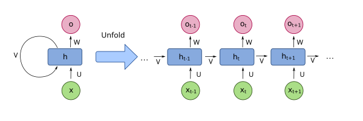
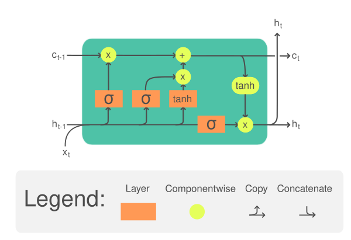

이 글은 순차 데이터를 다루는 신경망의 **역사적 흐름**을 따라간다. 각 모델이 이전 모델의 어떤 문제를 해결하기 위해 등장했는지가 핵심이다.

- **Level 1** — Vanilla RNN: 구조, 동작, 수치 예제
- **Level 2** — 기울기 소실 문제와 LSTM/GRU: 왜 게이트가 필요한가
- **Level 3** — Seq2Seq, Attention, 그리고 Transformer로의 전환

주요 참고 논문:
- Elman, 1990. "Finding structure in time" — RNN의 초기 형태
- Hochreiter & Schmidhuber, 1997. "Long Short-Term Memory" — LSTM
- Cho et al., 2014. "Learning Phrase Representations using RNN Encoder-Decoder" — GRU
- Bahdanau et al., 2014. "Neural Machine Translation by Jointly Learning to Align and Translate" — Attention
- Vaswani et al., 2017. "Attention Is All You Need" — Transformer

---

# Level 1: Vanilla RNN

## 왜 RNN인가

일반적인 Feed-Forward 신경망은 입력과 출력이 고정된 크기다. 이미지 분류에서는 "224×224 픽셀 → 1000개 클래스"처럼 크기가 정해져 있다.

하지만 현실의 많은 데이터는 **길이가 다르고 순서가 중요**하다:

```
텍스트:    "나는 밥을 먹었다" (4단어)  vs  "어제 친구와 함께 점심을 먹었다" (6단어)
음성:      0.5초짜리 발화  vs  3초짜리 발화
주가:      최근 30일치  vs  최근 365일치

입력 길이가 다르다. Feed-Forward는 이를 다룰 수 없다.
```

핵심 아이디어: **이전 단계의 정보를 다음 단계로 넘기면서**, 한 번에 하나씩 처리하자.

## 구조: hidden state가 기억을 전달한다


*RNN을 시간축으로 펼친 모습. 같은 가중치(W)가 모든 타임스텝에서 공유된다. (이미지: Wikimedia Commons, CC BY-SA)*

```
                      ┌──────────────────────────────────────────┐
                      │                                          │
                      ▼                                          │
  x₁ ──→ [RNN Cell] ──→ h₁ ──→ [RNN Cell] ──→ h₂ ──→ [RNN Cell] ──→ h₃
              │                     │                     │
              ▼                     ▼                     ▼
             y₁                    y₂                    y₃

x_t: 타임스텝 t의 입력 (예: 단어 하나의 임베딩 벡터)
h_t: 타임스텝 t의 hidden state (이전 정보의 요약)
y_t: 타임스텝 t의 출력 (예: 다음 단어의 확률 분포)

핵심: h_t는 x₁, x₂, ..., x_t까지의 정보를 압축한 것이다.
     마치 사람이 문장을 읽으면서 "지금까지의 맥락"을 머릿속에 유지하는 것과 같다.
```

**같은 가중치(W)를 모든 타임스텝에서 공유한다.** 이것이 "Recurrent"의 의미다. 시퀀스가 아무리 길어도 파라미터 수는 동일하다.

## 수식

$$h_t = \tanh(W_h \cdot h_{t-1} + W_x \cdot x_t + b)$$

$$y_t = \text{softmax}(W_y \cdot h_t)$$

각 부분의 역할:

```
W_x · x_t      : 현재 입력의 기여 ("지금 뭐가 들어왔는가")
W_h · h_{t-1}  : 이전 기억의 기여 ("지금까지 뭘 봤는가")
둘을 더함      : 현재 입력 + 과거 기억을 결합
tanh           : -1~1로 범위 제한 (폭발 방지)
```

## 수치 예제: "안녕 세상" 처리

극단적으로 단순화하여 hidden state 크기 2, 단어 임베딩 크기 2인 경우를 보자.

```
단어 임베딩:
  "안녕" → x₁ = [1.0, 0.5]
  "세상" → x₂ = [0.3, 0.8]

가중치 (학습된 값이라 가정):
  W_x = [[0.5, 0.3],    W_h = [[0.2, 0.1],    b = [0, 0]
         [0.1, 0.4]]           [0.3, 0.2]]

초기 hidden state:
  h₀ = [0, 0]

═══ 타임스텝 1: "안녕" 입력 ═══

  W_x · x₁ = [0.5×1.0 + 0.3×0.5, 0.1×1.0 + 0.4×0.5] = [0.65, 0.30]
  W_h · h₀ = [0, 0]  (초기값이 0이므로)

  h₁ = tanh([0.65, 0.30] + [0, 0]) = tanh([0.65, 0.30])
     = [0.572, 0.291]

→ "안녕"을 보고 hidden state가 [0.572, 0.291]이 되었다.

═══ 타임스텝 2: "세상" 입력 ═══

  W_x · x₂ = [0.5×0.3 + 0.3×0.8, 0.1×0.3 + 0.4×0.8] = [0.39, 0.35]
  W_h · h₁ = [0.2×0.572 + 0.1×0.291, 0.3×0.572 + 0.2×0.291]
           = [0.144, 0.230]

  h₂ = tanh([0.39, 0.35] + [0.144, 0.230]) = tanh([0.534, 0.580])
     = [0.489, 0.523]

→ "안녕 세상"까지 본 후 hidden state가 [0.489, 0.523]이 되었다.
  이 벡터 안에 "안녕"과 "세상" 모두의 정보가 압축되어 있다.
```

## 왜 tanh인가

Elman(1990)의 원래 RNN은 sigmoid를 썼다. 현대 RNN이 tanh를 쓰는 이유:

```
sigmoid: 출력 범위 0~1, 중심값 0.5
  → 출력이 항상 양수 → 다음 레이어 입력이 항상 양수
  → 가중치 업데이트가 한쪽으로 편향 (zig-zag 문제)
  → 기울기 최대값 0.25 → 기울기 소실이 빠르게 발생

tanh: 출력 범위 -1~1, 중심값 0
  → 출력이 0을 중심으로 분포 → 학습 안정적
  → 기울기 최대값 1.0 → sigmoid보다 기울기 소실에 강함

  tanh'(x)의 실제 값:
    x=0일 때:   tanh'(0) = 1.0    ← 최대
    x=±1일 때:  tanh'(±1) ≈ 0.42
    x=±2일 때:  tanh'(±2) ≈ 0.07  ← 이미 매우 작음
    x=±3일 때:  tanh'(±3) ≈ 0.01  ← 거의 0

→ 입력이 크면 기울기가 급격히 줄어든다. 이것이 소실 문제의 원인.
```

## RNN의 학습: BPTT (Backpropagation Through Time)

RNN을 시간축으로 펼치면(unfold) 일반 신경망처럼 역전파를 할 수 있다.

```
펼친 RNN:

  x₁ → [Cell] → h₁ → [Cell] → h₂ → ... → [Cell] → h_T
          |              |                     |
         y₁             y₂                   y_T
          |              |                     |
         L₁             L₂                   L_T

전체 손실: L = L₁ + L₂ + ... + L_T

역전파: L_T에서 시작하여 h_T → h_{T-1} → ... → h₁으로 기울기를 전파
```

문제는 이 역전파 과정에서 기울기가 연쇄적으로 곱해진다는 것이다.

---

# Level 2: 기울기 소실과 LSTM/GRU

## 기울기 소실 — RNN의 치명적 약점

> "The problem of vanishing gradients is perhaps the most well-known challenge in training RNNs."
> — Hochreiter & Schmidhuber, 1997

역전파 시 hidden state를 거슬러 올라가면서 기울기를 **연쇄적으로 곱한다**:

$$\frac{\partial L}{\partial h_0} = \frac{\partial L}{\partial h_T} \cdot \prod_{t=1}^{T} \frac{\partial h_t}{\partial h_{t-1}}$$

각 $$\frac{\partial h_t}{\partial h_{t-1}}$$은 W_h × tanh'(·)를 포함한다. tanh'의 최대값이 1이고 보통 1 미만이므로, 이 곱은 T가 커질수록 **기하급수적으로 0에 수렴**한다.

```
구체적으로:
  tanh'의 평균값이 약 0.5라고 하면

  T=5:   0.5⁵ = 0.031   → 기울기가 3%로 줄어듦
  T=10:  0.5¹⁰ = 0.001  → 0.1%
  T=20:  0.5²⁰ ≈ 0.000001 → 0.0001%
  T=50:  사실상 0

  50 타임스텝 전의 입력이 현재 출력에 미치는 영향이
  역전파로는 전달되지 않는다!
```

**실제 문제:**

```
문장: "나는 프랑스에서 태어났고, 어린 시절을 파리에서 보냈으며,
       ... (50단어) ...
       그래서 나는 [???]를 유창하게 말한다."

정답: "프랑스어"
필요한 정보: "프랑스" (50단어 전)

RNN은 "프랑스"의 기울기가 소실되어 이 연결을 학습하지 못한다.
→ "영어", "중국어" 등을 답할 수도 있다.
```

반대로 W_h의 고유값이 1보다 크면 기울기가 **폭발(exploding)**한다. 이는 gradient clipping(기울기를 일정 범위로 잘라냄)으로 비교적 쉽게 해결되지만, 소실 문제는 구조적 해결이 필요하다.

## LSTM — 게이트로 기억을 제어한다

> Hochreiter & Schmidhuber, "Long Short-Term Memory", Neural Computation, 1997

LSTM의 핵심 통찰: **기울기가 소실되는 이유는 매 타임스텝마다 tanh를 통과하기 때문이다. 정보가 변형 없이 흐를 수 있는 "고속도로"를 만들자.**


*LSTM 셀 구조. forget/input/output 게이트가 cell state(위쪽 수평선)의 정보 흐름을 제어한다. (이미지: Wikimedia Commons, CC BY-SA)*

### Cell State: 정보의 고속도로

```
Vanilla RNN:
  h₀ → [tanh] → h₁ → [tanh] → h₂ → [tanh] → h₃
         ↑ 매번 tanh를 통과 → 기울기가 매번 줄어듦

LSTM:
  C₀ ──────── × + ──────── × + ──────── × + ──── C₃
               ↑ ↑            ↑ ↑            ↑ ↑
              f₁ i₁          f₂ i₂          f₃ i₃

  C_t (cell state)는 덧셈 기반으로 업데이트된다.
  기울기가 곱셈이 아니라 덧셈으로 전파 → 소실 없이 먼 거리까지 도달!
```

이것은 [ResNet의 skip connection](/skip-connection/)과 같은 원리다. 정보가 변형 없이 통과할 수 있는 경로를 만들면 기울기가 보존된다.

### 세 가지 게이트

LSTM은 세 개의 게이트로 cell state에 무엇을 **버리고**, **저장하고**, **출력할지** 결정한다. 각 게이트는 sigmoid(0~1)로 "얼마나 열 것인가"를 결정한다.

```
게이트 값 = 0: 완전히 닫힘 (정보 차단)
게이트 값 = 1: 완전히 열림 (정보 통과)
게이트 값 = 0.7: 70%만 통과
```

**1. Forget Gate (잊기 게이트): "이전 기억에서 뭘 버릴까?"**

$$f_t = \sigma(W_f \cdot [h_{t-1}, x_t] + b_f)$$

```
예: 문장에서 주어가 바뀌는 경우
  "고양이가 앉아있다. 개가 달린다."
  "개가"를 만나면 → forget gate가 "고양이" 관련 기억을 지움
  f_t ≈ 0 (이전 주어 정보를 잊어라)
```

**2. Input Gate (입력 게이트): "새 정보에서 뭘 저장할까?"**

$$i_t = \sigma(W_i \cdot [h_{t-1}, x_t] + b_i)$$

$$\tilde{C}_t = \tanh(W_C \cdot [h_{t-1}, x_t] + b_C)$$

```
i_t: 얼마나 저장할지 (0~1)
C̃_t: 저장할 후보 정보 (-1~1)
둘을 곱하면: 실제로 저장될 정보

예: "개가 달린다"에서 "개"를 만나면
  i_t ≈ 1 (새 주어를 저장하라)
  C̃_t ≈ "개"의 의미를 담은 벡터
```

**3. Cell State 업데이트:**

$$C_t = f_t \odot C_{t-1} + i_t \odot \tilde{C}_t$$

```
= (잊을 것은 잊고) + (새로 저장할 것을 저장)

C_t = 0.1 × C_{t-1} + 0.9 × C̃_t
      ↑ 이전 기억의 10%만 유지    ↑ 새 정보의 90%를 저장
```

**4. Output Gate (출력 게이트): "cell state에서 뭘 내보낼까?"**

$$o_t = \sigma(W_o \cdot [h_{t-1}, x_t] + b_o)$$

$$h_t = o_t \odot \tanh(C_t)$$

```
cell state의 모든 정보를 출력하지 않는다.
현재 필요한 부분만 선택적으로 출력한다.

예: 주어가 "고양이"인데 다음 단어가 동사일 경우
  → 주어의 "단수/복수" 정보는 출력 (동사 활용에 필요)
  → 주어의 "종류(동물)" 정보는 출력하지 않음 (지금은 불필요)
```

### 왜 기울기 소실이 해결되는가

```
Cell state 업데이트: C_t = f_t × C_{t-1} + i_t × C̃_t

C_t의 C_{t-1}에 대한 편미분:
  ∂C_t/∂C_{t-1} = f_t

f_t는 sigmoid 출력이므로 0~1.
forget gate가 1에 가까우면 기울기가 거의 그대로 전달된다!

Vanilla RNN: ∂h_t/∂h_{t-1} = W_h × tanh'(·)  → 항상 < 1로 축소
LSTM:        ∂C_t/∂C_{t-1} = f_t              → 1에 가까울 수 있음!

f_t = 1이면 기울기가 100% 전달.
네트워크가 "이 정보는 잊지 마라"고 학습하면
→ forget gate가 1에 가까워짐
→ 기울기가 소실 없이 먼 거리까지 전파
```

### LSTM 파라미터 수

```
Vanilla RNN:
  파라미터 = W_h(h×h) + W_x(h×x) + b(h) = h² + hx + h

LSTM:
  게이트 4개(forget, input, candidate, output) × 같은 구조
  파라미터 = 4 × (h² + hx + h) = 4h² + 4hx + 4h

  → RNN 대비 약 4배의 파라미터
  → 그만큼 학습할 것이 많지만, 장거리 의존성을 학습할 수 있다

예: hidden size = 256, input size = 100
  RNN:  256² + 256×100 + 256 = 91,392
  LSTM: 4 × 91,392 = 365,568
```

## GRU — LSTM의 간소화

> Cho et al., "Learning Phrase Representations using RNN Encoder-Decoder", EMNLP, 2014


*GRU 셀 구조. reset gate(r)와 update gate(z) 두 개만으로 LSTM과 비슷한 성능을 낸다. (이미지: Wikimedia Commons, CC BY-SA)*

GRU는 LSTM의 게이트를 3개에서 **2개로** 줄이고, cell state를 hidden state에 통합했다.

```
LSTM: 3개 게이트 + cell state + hidden state → 복잡
GRU:  2개 게이트 + hidden state만            → 간결

LSTM                           GRU
─────                          ────
forget gate + input gate  →   update gate (z_t) 하나로 통합
output gate               →   reset gate (r_t)
cell state C_t             →   없음. hidden state h_t만 사용
```

> 주의: 이 매핑은 직관적 대응을 보여주기 위한 것으로, 정확한 1:1 대응은 아니다. GRU의 reset gate(r_t)는 후보 은닉 상태 계산에서 이전 은닉 상태의 영향을 조절하는 역할로, LSTM의 forget gate 기능에 더 가깝다. LSTM의 output gate에 대응하는 GRU 구성요소는 존재하지 않는다.

**GRU 수식:**

$$z_t = \sigma(W_z \cdot [h_{t-1}, x_t])$$

$$r_t = \sigma(W_r \cdot [h_{t-1}, x_t])$$

$$\tilde{h}_t = \tanh(W \cdot [r_t \odot h_{t-1}, x_t])$$

$$h_t = (1 - z_t) \odot h_{t-1} + z_t \odot \tilde{h}_t$$

```
update gate z_t의 역할:
  z_t = 1: 새 정보로 완전히 교체 (LSTM의 input gate 역할)
  z_t = 0: 이전 hidden state를 그대로 유지 (LSTM의 forget gate 역할)

  LSTM은 "잊기"와 "저장"을 독립적으로 제어하지만
  GRU는 하나의 게이트로 "교체 비율"을 결정한다.
  → 잊는 만큼 새로 저장. 더 간결하지만 유연성은 약간 떨어짐.

reset gate r_t의 역할:
  r_t = 0: 이전 hidden state를 완전히 무시하고 새 후보 계산
  r_t = 1: 이전 hidden state를 전부 반영하여 새 후보 계산
```

**LSTM vs GRU:**

```
                  LSTM              GRU
──────────────────────────────────────────
게이트 수         3개               2개
파라미터          4(h² + hx + h)   3(h² + hx + h)
메모리 상태      cell + hidden      hidden만
학습 속도         느림              빠름 (파라미터 25% 적음)
성능             약간 더 좋음       거의 비슷
적합한 상황      긴 시퀀스, 큰 모델  빠른 실험, 작은 모델

Chung et al.(2014)의 실험:
  "어떤 것이 더 낫다고 단정할 수 없다. 과제에 따라 다르다."
  → 실전에서는 LSTM을 기본으로 쓰고, 속도가 중요하면 GRU를 시도
```

---

# Level 3: Seq2Seq, Attention, Transformer로의 전환

## Seq2Seq — 인코더-디코더 구조

> Sutskever et al., "Sequence to Sequence Learning with Neural Networks", NeurIPS, 2014

입력 시퀀스와 출력 시퀀스의 길이가 다른 문제를 해결한다. 기계 번역이 대표적이다.

```
입력: "나는 학생이다" (3단어)
출력: "I am a student" (4단어)

인코더(LSTM): "나는 학생이다" → 고정 크기 벡터 c (context vector)
디코더(LSTM): c → "I am a student"

  나는 → [Encoder] → h₁
  학생이다 → [Encoder] → h₂
                          ↓
                     c = h₂ (마지막 hidden state)
                          ↓
                     [Decoder] → I
                     [Decoder] → am
                     [Decoder] → a
                     [Decoder] → student
```

**문제: 병목(bottleneck)**

```
입력이 100단어인 문장을 고정 크기 벡터 c 하나에 압축해야 한다.
c의 크기가 256이라면, 100단어의 모든 정보를 256차원에 우겨넣어야 한다.

짧은 문장: 문제없음
긴 문장: 정보 손실 불가피
  → 특히 문장 앞부분의 정보가 손실됨 (기울기 소실과 비슷한 문제)
```

## Attention — 매번 입력 전체를 다시 본다

> Bahdanau et al., "Neural Machine Translation by Jointly Learning to Align and Translate", ICLR, 2015

Attention의 핵심 아이디어: 디코더가 출력을 생성할 때마다 **인코더의 모든 hidden state를 참조**한다. 고정 벡터 c 하나에 의존하지 않는다.

```
인코더: "나는 학생이다"
  → h₁("나는"), h₂("학생이다")

디코더가 "student"를 생성할 때:
  "student"와 가장 관련 있는 인코더 hidden state는?
  → h₂("학생이다")에 높은 가중치!
  → h₁("나는")에 낮은 가중치

  context = 0.2 × h₁ + 0.8 × h₂   ← 가중 합

디코더가 "I"를 생성할 때:
  → h₁("나는")에 높은 가중치!
  → h₂("학생이다")에 낮은 가중치

  context = 0.9 × h₁ + 0.1 × h₂
```

**Attention 가중치 계산:**

```
1. 디코더의 현재 hidden state s_t와 인코더의 각 h_i 사이의
   "관련도(alignment score)"를 계산:
   e_{t,i} = score(s_t, h_i)    ← 여러 방법 존재

2. softmax로 정규화하여 가중치 α를 만든다:
   α_{t,i} = softmax(e_{t,i})   ← 합이 1이 되는 확률 분포

3. 인코더 hidden states의 가중 합 = context vector:
   c_t = Σ α_{t,i} × h_i

4. c_t와 s_t를 결합하여 출력 생성
```

**Attention이 해결한 것:**

```
Seq2Seq 없이:     100단어 → 256차원 벡터 1개 → 출력 (병목!)
Attention 있음:   100단어 → 100개의 hidden state 모두 참조 (병목 없음!)

추가 이점:
  - 장거리 의존성: 몇 단어 전이든 직접 참조 가능 (RNN의 기울기 소실 우회)
  - 해석 가능성: attention 가중치를 시각화하면 "무엇을 보고 판단했는지" 알 수 있음
```

## Transformer — "Attention만으로 충분하다"

> Vaswani et al., "Attention Is All You Need", NeurIPS, 2017


*Transformer 모델 구조 (Vaswani et al., 2017). 왼쪽이 인코더, 오른쪽이 디코더. RNN 없이 Multi-Head Attention만으로 구성된다. (이미지: Wikimedia Commons, CC BY-SA)*

Transformer의 핵심 질문: **RNN이 꼭 필요한가?** Attention이 장거리 의존성을 해결하는데, 왜 순차적으로 처리하는 RNN을 유지해야 하나?

```
RNN + Attention의 한계:
  1. 순차 처리: h₁ → h₂ → h₃ → ... 순서대로 계산해야 한다
     → GPU 병렬화가 불가능 → 학습이 느리다

  2. 여전히 RNN을 통과: Attention이 장거리를 해결해도
     인코더/디코더 자체는 여전히 RNN → 기울기 소실 잔존

Transformer의 해법:
  RNN을 완전히 제거하고 Attention만으로 구성
  → Self-Attention: 시퀀스 내에서 모든 위치가 모든 위치를 참조
  → 순서 정보는 Positional Encoding으로 대체
  → 완전 병렬화 가능!
```

```
RNN: 시퀀스 길이 T → T번 순차 계산 (병렬화 불가)
     "나는" 처리 → "학생" 처리 → "이다" 처리 → ...

Transformer: 시퀀스 길이 T → 1번 병렬 계산
     "나는", "학생", "이다"를 동시에 처리!

학습 속도:
  RNN (T=100): 100 sequential steps
  Transformer (T=100): 1 parallel step (+ O(T²) attention 계산)

  GPU가 있으면 Transformer가 압도적으로 빠르다.
```

**RNN → Transformer 전환의 결과:**

```
연도   모델              구조            영향
───────────────────────────────────────────────────
1997   LSTM              RNN + Gate      장거리 의존성 해결
2014   GRU               간소화 LSTM     빠른 학습
2014   Seq2Seq           Encoder-Decoder 가변 길이 입출력
2015   Attention         RNN + Attention 병목 해결
2017   Transformer       Attention Only  RNN 제거, 병렬화
2018   BERT              Transformer     양방향 이해
2018   GPT               Transformer     텍스트 생성
2020   GPT-3             거대 Transformer  Few-shot 학습
2022   ChatGPT           GPT + RLHF      대화형 AI

Transformer 이후 거의 모든 NLP가 Transformer 기반으로 전환되었다.
```

## 그래도 RNN이 쓰이는 곳

```
1. 실시간 스트리밍 데이터
   → Transformer는 전체 시퀀스가 필요. RNN은 하나씩 처리 가능.
   → 음성 인식의 실시간 전사, IoT 센서 스트림

2. 매우 긴 시퀀스
   → Transformer의 Self-Attention은 O(T²) 메모리
   → T=10000이면 메모리 부족
   → RNN은 O(1) 메모리 (hidden state만 유지)

3. 자원 제약 환경
   → 모바일, 임베디드에서 Transformer는 무거움
   → 작은 LSTM/GRU가 더 적합할 수 있음

4. 시계열 예측
   → 일부 시계열에서 LSTM이 Transformer보다 나은 경우가 보고됨
   → 데이터가 적을 때 특히
```

---

## 이 글에서 가져가야 할 것

```
Level 1:
  RNN = hidden state로 이전 정보를 전달하는 신경망
  같은 가중치를 모든 타임스텝에서 공유
  tanh가 sigmoid보다 기울기 보존에 유리

Level 2:
  기울기 소실 = tanh를 반복 통과하면 기울기가 기하급수적으로 줄어듦
  LSTM = cell state (덧셈 기반 고속도로) + 3개 게이트로 해결
  GRU = LSTM 간소화, 2개 게이트, 성능은 비슷

Level 3:
  Seq2Seq = 가변 길이 입출력. 병목 문제 있음
  Attention = 매번 인코더 전체를 참조하여 병목 해결
  Transformer = RNN 제거, Attention만으로 구성, 완전 병렬화
  현재 NLP의 거의 모든 것이 Transformer 기반
```

이전 글: [CNN](/cnn/)
다음 글: [Skip Connection](/skip-connection/) · Transformer(별도 포스트 예정)
