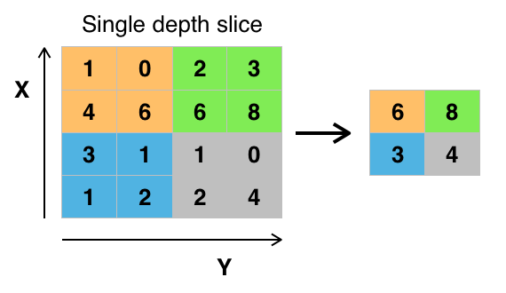
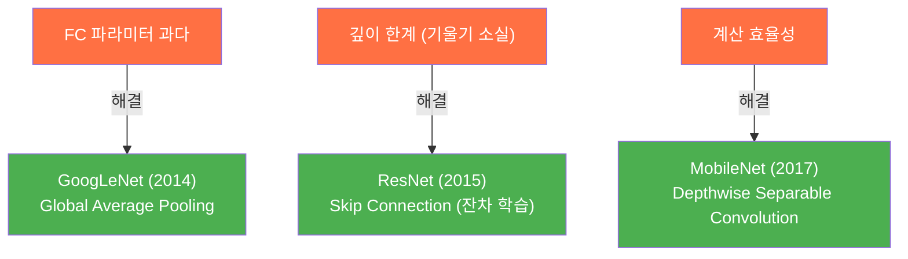
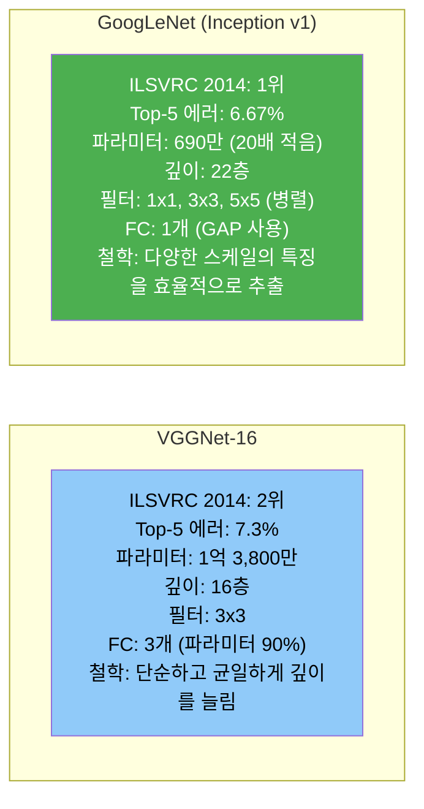
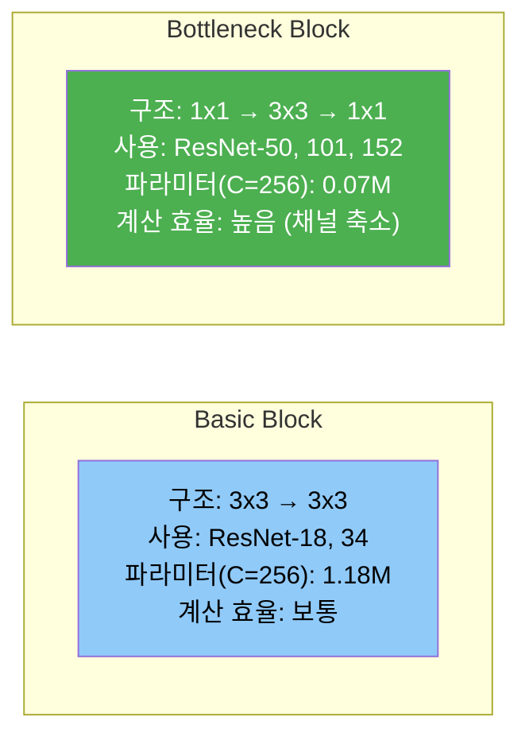
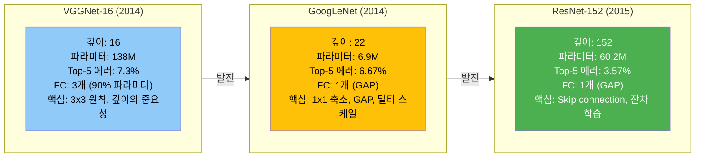

## 합성곱(Convolution)이란


*2D 합성곱 연산. 필터(커널)가 입력 위를 슬라이딩하면서 원소별 곱의 합을 구한다. (이미지: Wikimedia Commons, CC BY-SA)*

합성곱은 입력 데이터 위에 작은 **필터(커널)**를 슬라이딩하면서 원소별 곱의 합을 구하는 연산이다. 이 과정에서 **특정 특징(패턴)**이 입력의 어디에 있는지를 찾아낸다.

예를 들어 3x3 필터가 세로선을 감지하도록 학습되었다면, 입력 이미지를 훑으면서 세로선이 있는 위치에서 높은 값을 출력한다. 이 결과를 **특징 맵(feature map)**이라 부른다.

핵심은 **커널 속의 값이 학습되는 파라미터**라는 점이다. 어떤 특징을 추출할지를 사람이 정하지 않고, 손실을 줄이는 방향으로 네트워크가 스스로 학습한다.

---

## FC(Fully Connected)와의 차이

FC 레이어는 입력의 모든 픽셀을 1차원으로 펼친 뒤 가중치를 곱한다. 이 과정에서 **위치 정보가 사라진다**. 또한 어떤 특징을 뽑을지를 구조적으로 강제하지 않으므로, 이미지의 공간적 패턴을 학습하기 어렵다.

반면 CNN은:

- **위치 정보를 유지**한 채로 특징을 추출한다.
- **어떤 특징을 뽑아야 손실을 줄일 수 있는지**를 AI가 알아낸다.
- 같은 필터를 이미지 전체에 공유하므로 **파라미터 수가 적다**(parameter sharing).

OpenCV에서 블러 처리를 할 때 고정된 커널(예: 평균 필터)을 사용하지만, CNN은 커널 값 자체를 학습하여 목적에 맞는 특징을 추출한다.

---

## 합성곱 연산의 구성 요소

### Stride

필터가 한 번에 몇 칸씩 이동하는지를 결정한다.

- stride = 1: 한 칸씩 이동 (출력 크기가 크다)
- stride = 2: 두 칸씩 이동 (출력 크기가 절반으로 줄어든다)

### Padding

입력의 가장자리에 값(보통 0)을 채워 넣는다. padding이 없으면 합성곱을 거칠수록 출력 크기가 줄어드는데, padding을 추가하면 입력과 출력의 크기를 동일하게 유지할 수 있다.

### 출력 크기 공식

입력 크기 $$ W $$, 필터 크기 $$ F $$, 패딩 $$ P $$, 스트라이드 $$ S $$일 때:

$$
\text{출력 크기} = \frac{W - F + 2P}{S} + 1
$$

---

## 컬러 이미지와 채널

흑백 이미지는 채널이 1개이지만, 컬러 이미지는 **RGB 3개 채널**로 구성된다. 따라서 필터도 3차원이 된다.

- 입력: $$ H \times W \times C_{in} $$ (예: 32 x 32 x 3)
- 필터 하나: $$ F \times F \times C_{in} $$ (예: 3 x 3 x 3)
- 필터의 채널 수(depth)는 **입력 채널 수와 동일**해야 한다.

하나의 필터를 적용하면 하나의 2D 특징 맵이 나온다. **여러 개의 필터**를 사용하면 여러 개의 특징 맵이 생성되고, 이것이 곧 **출력 채널 수**가 된다.

$$
\text{출력}: H' \times W' \times N_{\text{filters}}
$$

예를 들어 32개의 필터를 사용하면 출력은 32개 채널의 특징 맵이다.

---

## 풀링(Pooling)

풀링은 특징 맵의 **공간적 크기를 줄이는** 연산이다. 파라미터 수와 계산량을 줄이고, 작은 위치 변화에 대한 **불변성(invariance)**을 부여한다.


*Max Pooling. 2×2 영역에서 최대값만 취하여 크기를 절반으로 줄인다. (이미지: Wikimedia Commons, CC BY-SA)*

### Max Pooling

영역 내 최대값만 취한다. 가장 강한 특징 신호를 보존한다.

```
입력 (4x4)        Max Pool (2x2, stride 2)
1 3 2 1
5 6 8 2    -->    6  8
4 2 1 0           4  3
3 4 1 3
```

### Average Pooling

영역 내 평균값을 취한다. 전체적인 특징 분포를 요약한다.

실무에서는 Max Pooling이 더 자주 사용된다. 특징의 존재 여부를 판단하는 데 최대값이 더 유용하기 때문이다.

---

## CNN 전체 구조

일반적인 CNN은 다음 블록을 반복한 뒤, 마지막에 FC 레이어로 분류한다.

```
입력 이미지
  --> [Conv --> ReLU --> Pool] x N
  --> Flatten
  --> [FC --> ReLU] x M
  --> Softmax
  --> 클래스 예측
```

- **Conv**: 특징 추출
- **ReLU**: 비선형성 부여 (음수를 0으로)
- **Pool**: 차원 축소, 불변성 확보
- **FC**: 추출된 특징을 기반으로 최종 분류

앞쪽 Conv 레이어는 **저수준 특징**(엣지, 코너)을, 뒤쪽 Conv 레이어는 **고수준 특징**(눈, 바퀴 등 의미 있는 패턴)을 학습하는 경향이 있다.

---

## VGGNet — 깊이의 힘을 증명한 네트워크

> 참고 논문: Simonyan & Zisserman, 2014. "Very Deep Convolutional Networks for Large-Scale Image Recognition"

VGGNet은 하나의 질문에서 출발한다: **네트워크를 더 깊게 쌓으면 성능이 좋아지는가?** 결론은 "그렇다"였고, 이를 증명하기 위해 **오직 3×3 필터만 사용하면서 깊이를 11층에서 19층까지** 늘려 나갔다.

2014년 ILSVRC(ImageNet 대회)에서 준우승을 차지했고, 이후 전이 학습(transfer learning)의 백본 네트워크로 가장 널리 사용되었다.

---

### 핵심 아이디어: 3×3 필터만 쓰는 이유

VGGNet 이전의 AlexNet(2012)은 11×11, 5×5 같은 큰 필터를 사용했다. VGGNet은 이를 **모두 3×3 필터로 대체**했다. 3×3은 상하좌우와 중심을 포함하는 가장 작은 크기의 필터다.

큰 필터 하나 대신 작은 필터를 여러 번 쌓으면 **같은 수용 영역(receptive field)**을 확보하면서도 파라미터가 줄어든다.

```
[5×5 필터 1개]                 [3×3 필터 2개]
수용 영역: 5×5                 수용 영역: 5×5 (3×3 → 3×3)
파라미터: 25C²                 파라미터: 2 × 9C² = 18C²

[7×7 필터 1개]                 [3×3 필터 3개]
수용 영역: 7×7                 수용 영역: 7×7 (3×3 → 3×3 → 3×3)
파라미터: 49C²                 파라미터: 3 × 9C² = 27C²
```

3×3 두 번이 5×5 한 번보다 파라미터가 28% 적고, 3×3 세 번이 7×7 한 번보다 45% 적다. 여기서 $$ C $$는 채널 수다.

파라미터가 줄어드는 것뿐 아니라, **레이어 사이마다 ReLU가 들어가므로 비선형성이 증가**한다. 5×5 하나는 비선형 변환이 1번이지만, 3×3 두 개는 2번이다. 같은 수용 영역이라도 더 복잡한 특징을 표현할 수 있다.

#### 수용 영역이란

수용 영역은 **출력의 한 픽셀이 입력에서 참조하는 영역의 크기**다. Conv 레이어를 거칠수록 수용 영역은 커진다.

```
3×3 Conv 1회 → 수용 영역 3×3

  □ □ □
  □ ■ □   →  ■
  □ □ □

3×3 Conv 2회 → 수용 영역 5×5

  □ □ □ □ □
  □ □ □ □ □
  □ □ ■ □ □  →  3×3  →  ■
  □ □ □ □ □
  □ □ □ □ □
```

첫 번째 Conv가 3×3 영역을 요약하고, 두 번째 Conv가 그 요약들의 3×3을 다시 요약하므로 원본 기준으로는 5×5를 본 셈이 된다.

---

### VGGNet 구조

논문에서는 A(11층)부터 E(19층)까지 6개 변형을 제시했다. 가장 많이 사용되는 것은 **VGG-16(D)**과 **VGG-19(E)**다.

```
VGG-16 (Configuration D)

입력: 224 × 224 × 3 (RGB 이미지)

Block 1:  Conv3-64  → Conv3-64  → MaxPool    출력: 112×112×64
Block 2:  Conv3-128 → Conv3-128 → MaxPool    출력:  56× 56×128
Block 3:  Conv3-256 → Conv3-256 → Conv3-256 → MaxPool    출력: 28×28×256
Block 4:  Conv3-512 → Conv3-512 → Conv3-512 → MaxPool    출력: 14×14×512
Block 5:  Conv3-512 → Conv3-512 → Conv3-512 → MaxPool    출력:  7× 7×512

FC-4096 → ReLU → Dropout
FC-4096 → ReLU → Dropout
FC-1000 → Softmax
```

- **Conv3-64**: 3×3 필터 64개, stride 1, padding 1 (크기 유지)
- **MaxPool**: 2×2, stride 2 (크기 절반)
- 모든 Conv 뒤에 ReLU 적용
- 블록이 진행될수록 **공간은 절반으로 줄고, 채널은 두 배로 증가**한다

이 패턴 — 공간 축소 + 채널 증가 — 은 이후 ResNet, DenseNet 등 거의 모든 CNN 아키텍처가 따르는 표준이 되었다.

#### 논문의 전체 변형 비교

VGG-11(A)은 Conv 8개, FC 3개, 총 133M 파라미터의 기본 모델이다. VGG-13(B)은 Block 1~2에 Conv를 추가하여 Conv 10개, 134M 파라미터다. VGG-16(D)은 Conv 13개, 138M 파라미터로 가장 널리 사용되는 변형이다. VGG-19(E)는 Conv 16개, 144M 파라미터로 가장 깊은 모델이다. 모든 변형에서 FC 레이어는 3개로 동일하다.

11층에서 19층으로 깊어질수록 ImageNet top-5 에러율이 꾸준히 감소했다. 이것이 "깊이가 성능에 중요하다"는 논문의 핵심 결론이다.

---

### 파라미터 분포: FC 레이어의 비중

VGG-16의 총 파라미터는 약 1억 3,800만 개인데, 이 중 대부분이 FC 레이어에 집중되어 있다.

```
Conv 레이어 전체:  약 14.7M  (10.6%)
FC-4096 (첫 번째): 7×7×512 × 4096 = 102.8M  (74.5%)
FC-4096 (두 번째): 4096 × 4096   =  16.8M  (12.2%)
FC-1000 (출력):    4096 × 1000   =   4.1M  ( 2.9%)
```

**파라미터의 약 90%가 FC 레이어**에 있다. Conv 레이어는 파라미터 공유 덕분에 효율적이지만, FC 레이어는 모든 입력과 모든 출력을 연결하므로 파라미터가 폭발적으로 증가한다. 이후 GoogLeNet(Inception)은 FC 대신 Global Average Pooling을 사용하여 이 문제를 해결했다.

---

### 학습 방법

논문에서 제시한 학습 전략은 이후 CNN 학습의 표준이 되었다.

#### 가중치 초기화

깊은 네트워크는 초기화가 잘못되면 기울기가 소실되거나 폭발하여 학습이 안 된다. 논문의 접근:

1. 먼저 **얕은 모델(VGG-11)**을 랜덤 초기화로 학습
2. 더 깊은 모델을 만들 때, 처음 4개 Conv 블록과 FC 레이어는 학습된 VGG-11의 가중치로 초기화
3. 새로 추가된 레이어만 랜덤 초기화

이 전략을 **pre-training** 또는 **단계적 학습**이라 한다. 현대에는 He 초기화, Batch Normalization 등이 등장하여 이런 우회가 필요 없지만, 당시에는 깊은 네트워크를 학습시키기 위한 핵심 테크닉이었다.

#### Multi-Scale 학습

입력 이미지를 고정 크기(224×224)로 자르기 전에, **짧은 변의 길이(S)를 여러 스케일로 조절**하여 학습했다.

- **Single-scale**: S = 256 또는 S = 384로 고정
- **Multi-scale**: S를 [256, 512] 범위에서 랜덤으로 샘플링

Multi-scale 학습은 하나의 모델이 **다양한 크기의 객체를 인식**할 수 있게 만든다. 작은 S에서는 객체가 크게 보이고, 큰 S에서는 작게 보이므로 스케일 불변성이 향상된다.

#### 테스트 시 Dense Evaluation

학습 시에는 224×224 crop을 사용하지만, 테스트 시에는 **전체 이미지를 FC 레이어 없이 Conv로 처리**한다. FC-4096을 7×7 Conv로, FC-1000을 1×1 Conv로 변환하면 입력 크기에 제약이 없어진다. 출력으로 나오는 클래스별 점수 맵을 평균하여 최종 예측을 구한다.

이 방식을 **Fully Convolutional** 적용이라 하며, 여러 crop을 개별 추론하는 것보다 효율적이다.

---

### 실험 결과

ImageNet ILSVRC-2012 (1,000개 클래스, 130만 학습 이미지):

VGG-11(single scale)은 Top-1 에러 29.6%, Top-5 에러 10.4%를 기록했다. VGG-16(single scale)은 Top-1 28.5%, Top-5 9.9%로 개선되었고, multi-scale 학습을 적용하면 Top-1 27.0%, Top-5 8.8%까지 낮아졌다. VGG-19(multi-scale)는 Top-1 27.3%, Top-5 9.0%로 VGG-16 대비 개선이 미미했다. 2개 모델 앙상블(VGG ensemble)은 Top-5 에러 7.3%를 달성했다.

주요 관찰:

- **깊이가 깊을수록** 에러율이 감소 (A → D까지 일관적)
- **Multi-scale 학습**이 single-scale보다 확실히 우수
- VGG-19는 VGG-16 대비 개선이 미미 → **19층 이상은 효과가 포화**
- 2개 모델 앙상블로 top-5 에러 7.3% 달성 (2014년 대회 2위)

VGG-16에서 VGG-19로의 개선이 작다는 것은, 단순히 깊이만 늘리는 것에는 한계가 있음을 시사한다. 이 한계를 돌파한 것이 ResNet(2015)의 **skip connection**이다.

---

### VGGNet의 의의와 한계

#### 의의

- **"깊이가 중요하다"**는 것을 체계적 실험으로 증명
- **3×3 필터만으로 충분**하다는 설계 원칙 확립 → 이후 거의 모든 CNN이 3×3 사용
- **공간 축소 + 채널 증가** 패턴의 표준화
- 구조가 단순하고 규칙적이어서 **전이 학습의 대표 백본**으로 오래 사용됨

#### 한계

- **파라미터 1.38억 개**는 당시 기준으로도 매우 큼 (AlexNet의 2배 이상)
- FC 레이어에 파라미터가 집중 → 메모리와 계산 비효율
- 단순히 깊이를 늘리는 것은 **20층 이상에서 학습이 어려워짐** (기울기 소실)
- 같은 해 GoogLeNet(Inception)은 파라미터가 VGG의 1/20 수준이면서도 더 높은 정확도를 달성

이후의 발전 방향:



---

## GoogLeNet(Inception) — 넓이와 효율의 네트워크

> 참고 논문: Szegedy et al., 2015. "Going Deeper with Convolutions" (CVPR 2015)

VGGNet이 "깊이"에 집중했다면, GoogLeNet은 **"같은 레이어 안에서 여러 크기의 필터를 동시에 적용하면 어떨까?"**라는 질문에서 출발했다. 이 아이디어를 구현한 것이 **Inception 모듈**이다.

2014년 ILSVRC에서 top-5 에러율 6.67%로 **1위**를 차지했다. VGG(7.3%)보다 정확하면서 파라미터는 VGG의 **1/20 수준**(약 690만 개)에 불과했다.

---

### VGGNet의 문제: 필터 크기를 어떻게 정할 것인가

VGGNet은 3×3 필터만 사용했다. 하지만 이미지에는 다양한 크기의 특징이 공존한다:

- 눈동자의 질감 → **작은 수용 영역**(1×1, 3×3)으로 포착
- 얼굴 윤곽 → **중간 수용 영역**(5×5)으로 포착
- 사람 전체 실루엣 → **넓은 수용 영역**(풀링)으로 포착

하나의 레이어에서 하나의 필터 크기만 사용하면, 그 크기에 맞는 특징만 잘 추출하고 나머지는 놓칠 수 있다. Inception 모듈은 **여러 크기의 필터를 병렬로 적용하고 결과를 합치는** 방식으로 이 문제를 해결한다.

---

### Inception 모듈: Naive 버전

가장 단순한 형태의 Inception 모듈은 4가지 연산을 병렬로 수행한 뒤 결과를 채널 축으로 합친다(concatenation).

```
              입력 (28×28×256)
         ┌──────┬──────┬──────┬──────┐
         │      │      │      │      │
      1×1 Conv 3×3 Conv 5×5 Conv 3×3 MaxPool
         │      │      │      │      │
         └──────┴──────┴──────┴──────┘
              Concatenate (채널 축)
              출력 (28×28×?)
```

- **1×1 Conv**: 픽셀 단위 특징 조합 (채널 간 상호작용)
- **3×3 Conv**: 작은 공간 패턴
- **5×5 Conv**: 넓은 공간 패턴
- **3×3 MaxPool**: 가장 강한 특징 신호 보존

네 갈래의 출력을 채널 방향으로 이어붙이면, 하나의 레이어가 **여러 스케일의 특징을 동시에 표현**할 수 있다.

그런데 문제가 있다. 5×5 Conv는 **계산량이 매우 크다**. 입력이 256채널이고 5×5 필터를 128개 사용하면 파라미터만 $$ 5 \times 5 \times 256 \times 128 = 819,200 $$개다. 이 문제를 해결하는 것이 **1×1 컨볼루션을 이용한 차원 축소**다.

---

### 1×1 컨볼루션: 차원 축소의 핵심

1×1 컨볼루션은 공간(H, W)은 건드리지 않고 **채널 수만 변경**하는 연산이다. Network-in-Network(NIN) 논문에서 처음 제안되었고, Inception에서 핵심 부품으로 자리잡았다.

```
입력: 28×28×256
  ↓ 1×1 Conv (필터 64개)
출력: 28×28×64
```

256채널을 64채널로 줄이면, 이후 3×3이나 5×5 Conv의 입력 채널이 64가 되어 계산량이 **4배** 줄어든다.

#### 계산량 비교

256채널 입력에 5×5 Conv 128개를 적용하는 경우:

```
[Naive]
5×5 Conv: 256 → 128
연산량: 28 × 28 × 5 × 5 × 256 × 128 = 6.4억

[1×1 축소 후]
1×1 Conv: 256 → 32    →  28 × 28 × 1 × 1 × 256 × 32 = 0.06억
5×5 Conv:  32 → 128   →  28 × 28 × 5 × 5 × 32 × 128 = 0.8억
합계: 약 0.86억
```

**1×1 Conv를 앞에 두는 것만으로 계산량이 약 7.4배 감소**한다. 이것이 Inception 모듈이 깊으면서도 가벼운 비결이다.

1×1 Conv는 단순한 차원 축소가 아니다. 뒤에 ReLU가 붙으므로 **비선형 변환이 추가**되어 표현력도 함께 증가한다.

---

### Inception 모듈: 실제 버전 (with dimension reduction)

실제 GoogLeNet에서 사용하는 Inception 모듈은 3×3과 5×5 앞에 1×1 Conv를 추가하고, MaxPool 뒤에도 1×1 Conv를 배치한다.

```
                      입력 (28×28×256)
         ┌──────────┬──────────┬──────────┬──────────┐
         │          │          │          │          │
      1×1 Conv   1×1 Conv   1×1 Conv   3×3 MaxPool
      (64개)     (96개)     (16개)        │
         │          │          │       1×1 Conv
         │       3×3 Conv   5×5 Conv   (32개)
         │       (128개)    (32개)       │
         │          │          │          │
         └──────────┴──────────┴──────────┘
                  Concatenate (채널 축)
                출력: 28×28×(64+128+32+32) = 28×28×256
```

각 갈래의 역할:

- **갈래 1** (1x1, 출력 64채널): 채널 간 특징을 조합한다.
- **갈래 2** (1x1 → 3x3, 출력 128채널): 차원 축소 후 작은 공간 패턴을 추출한다.
- **갈래 3** (1x1 → 5x5, 출력 32채널): 차원 축소 후 넓은 공간 패턴을 추출한다.
- **갈래 4** (3x3 Pool → 1x1, 출력 32채널): 풀링으로 강한 신호를 추출한 뒤 채널을 축소한다.

각 갈래의 필터 수(64, 96, 16, 32 등)는 레이어마다 다르게 설정되어 있다. 이 값들은 논문에서 **경험적으로 결정**한 하이퍼파라미터다.

---

### GoogLeNet 전체 구조

GoogLeNet은 22개 레이어 깊이(파라미터가 있는 레이어 기준)로 구성된다. Inception 모듈 9개를 쌓은 구조다.

```
GoogLeNet (Inception v1)

입력: 224 × 224 × 3

── 초기 Conv ──────────────────────────────────────
Conv 7×7/2  → MaxPool 3×3/2  → Conv 1×1  → Conv 3×3  → MaxPool 3×3/2

── Inception 모듈 ×9 ──────────────────────────────
Inception(3a) → Inception(3b) → MaxPool
Inception(4a) → Inception(4b) → Inception(4c) → Inception(4d) → Inception(4e) → MaxPool
Inception(5a) → Inception(5b)

── 분류 헤드 ──────────────────────────────────────
Global Average Pooling (7×7 → 1×1)
Dropout (40%)
FC-1000 → Softmax
```

주목할 점:

- **Global Average Pooling**: VGGNet의 FC-4096 대신 사용. 7×7×1024 특징 맵의 각 채널을 평균하여 1×1×1024 벡터로 만든다. FC 레이어의 대규모 파라미터가 사라진다.
- **Dropout 40%**: FC 레이어가 하나뿐이므로 과적합 방지에 40%면 충분
- 초기 레이어(Conv 7×7)는 아직 VGGNet 이전 스타일. 이후 Inception v2부터 이것도 3×3으로 분해한다.

---

### Global Average Pooling: FC를 대체하는 방법

VGGNet의 가장 큰 문제는 FC 레이어의 파라미터(전체의 90%)였다. Global Average Pooling(GAP)은 이 문제를 근본적으로 해결한다.

```
[VGGNet 방식]
7×7×512 → Flatten → 25,088차원 → FC → 4,096차원
파라미터: 25,088 × 4,096 = 102,760,448개

[GoogLeNet 방식]
7×7×1024 → GAP → 1,024차원 → FC → 1,000차원
파라미터: 1,024 × 1,000 = 1,024,000개
```

GAP은 각 채널의 7×7 특징 맵을 **하나의 숫자(평균)**로 요약한다. 공간 정보를 완전히 압축하되, 채널별 특징 강도는 보존한다.

$$
\text{GAP}(k) = \frac{1}{H \times W} \sum_{i=1}^{H} \sum_{j=1}^{W} x_{i,j,k}
$$

파라미터가 100배 이상 줄어들면서도 성능은 오히려 향상되었다. GAP은 **구조적으로 과적합을 억제**하는 효과도 있다. 이후 ResNet, DenseNet 등 거의 모든 현대 CNN이 GAP을 사용한다.

---

### 보조 분류기 (Auxiliary Classifier)

GoogLeNet은 22층이나 되는 깊은 네트워크이므로, 학습 초기에 **기울기 소실** 문제가 발생할 수 있다. 이를 완화하기 위해 네트워크 중간에 **보조 분류기 2개**를 달았다.

```
입력 → ... → Inception(4a) → [보조 분류기 1] → Inception(4d) → [보조 분류기 2] → ... → 최종 분류
```

보조 분류기의 구조:

```
Inception 중간 출력
  → Average Pooling 5×5/3
  → 1×1 Conv (128개)
  → FC-1024 → ReLU → Dropout(70%)
  → FC-1000 → Softmax
```

학습 시 총 손실:

$$
\mathcal{L}_{\text{total}} = \mathcal{L}_{\text{final}} + 0.3 \times \mathcal{L}_{\text{aux1}} + 0.3 \times \mathcal{L}_{\text{aux2}}
$$

- 보조 손실의 가중치는 0.3 (주 손실보다 작게)
- 중간 레이어에도 직접 기울기가 주입되어 **기울기 소실을 방지**
- **테스트(추론) 시에는 보조 분류기를 제거**하고 최종 출력만 사용

이후 Inception v2/v3 논문에서 보조 분류기의 효과를 재분석한 결과, 기울기 소실 방지보다는 **정규화(regularization) 효과**가 더 크다는 것을 밝혔다. 보조 분류기에 Batch Normalization이나 Dropout이 있을 때만 성능 향상이 관찰되었다.

---

### VGGNet vs GoogLeNet 비교



GoogLeNet이 정확도, 효율성 모두에서 VGGNet을 이겼지만, 실제로 더 많이 사용된 것은 **VGGNet**이었다. 이유는 VGGNet의 구조가 단순하고 직관적이어서 **수정과 전이 학습이 쉬웠기 때문**이다. Inception 모듈은 구현이 복잡하고 하이퍼파라미터(각 갈래의 필터 수)를 결정하기 어렵다는 단점이 있었다.

---

### Inception의 진화

GoogLeNet(Inception v1) 이후, 같은 팀이 Inception 구조를 지속적으로 개선했다.

- **v1** (Going Deeper with Convolutions, 2015): Inception 모듈, 1x1 차원 축소, 보조 분류기를 도입했다.
- **v2** (Batch Normalization, 2015): BN을 도입하여 학습을 안정화하고 높은 학습률 사용이 가능해졌다.
- **v3** (Rethinking the Inception Architecture, 2016): 5x5를 3x3 두 번으로 분해하고, 비대칭 Conv(nx1 + 1xn)를 적용했다.
- **v4** (Inception-ResNet, 2017): Inception과 ResNet의 skip connection을 결합했다.

#### Inception v3의 필터 분해

Inception v3는 VGGNet의 아이디어를 Inception 안으로 가져왔다. 5×5 필터를 3×3 두 번으로 분해하고, 더 나아가 n×n 필터를 **n×1과 1×n의 비대칭 Conv**로 분해했다.

```
[5×5 분해]
5×5 Conv  →  3×3 Conv → 3×3 Conv
파라미터: 25  →  9 + 9 = 18  (28% 감소)

[비대칭 분해]
3×3 Conv  →  1×3 Conv → 3×1 Conv
파라미터: 9   →  3 + 3 = 6   (33% 감소)
```

비대칭 분해는 특히 **큰 특징 맵(12×12 이상)**에서 효과적이라고 논문에서 밝히고 있다. 작은 특징 맵에서는 오히려 성능이 떨어질 수 있어, GoogLeNet의 뒤쪽 Inception 모듈에서만 적용한다.

---

### GoogLeNet의 의의와 한계

#### 의의

- **효율성 혁명**: VGG의 1/20 파라미터로 더 높은 정확도
- **1×1 Conv의 대중화**: 차원 축소 기법이 이후 모든 CNN 아키텍처에 표준으로 채택
- **Global Average Pooling**: FC 레이어를 대체하는 방법을 제시, 이후 표준이 됨
- **멀티 스케일 특징 추출**: 하나의 레이어에서 다양한 수용 영역을 동시에 처리하는 설계 패러다임

#### 한계

- Inception 모듈의 **하이퍼파라미터가 많다** (각 갈래의 필터 수를 레이어마다 수동 설정)
- 구조가 **복잡하여 수정이 어렵다** (VGGNet처럼 레이어를 추가/제거하기 쉽지 않음)
- 보조 분류기는 구현 복잡성 대비 효과가 제한적
- 22층에서도 학습이 어려웠으며, 이 문제는 ResNet의 skip connection으로 본질적으로 해결됨

---

## ResNet — 깊이의 한계를 돌파한 잔차 학습

> 참고 논문: He et al., 2016. "Deep Residual Learning for Image Recognition" (CVPR 2016, Best Paper)

VGGNet은 19층, GoogLeNet은 22층이었다. 더 깊게 쌓으면 더 좋아질까? 실험 결과는 의외였다. **56층 네트워크가 20층보다 학습/테스트 에러 모두 높았다.** 과적합이 아니라 학습 자체가 안 되는 것이었다.

ResNet은 이 문제를 **skip connection(잔차 연결)**이라는 단순한 아이디어로 해결하여, **152층** 네트워크의 학습을 가능하게 했다. 2015년 ILSVRC에서 top-5 에러율 3.57%로 1위를 차지했고, 인간의 분류 에러율(약 5%)을 처음으로 넘어섰다.

---

### 깊이의 역설: Degradation Problem

VGGNet의 결론은 "깊을수록 좋다"였다. 그렇다면 56층은 20층보다 당연히 좋아야 한다. 최소한 20층의 성능은 나와야 한다 — 나머지 36층이 항등 함수(identity)만 학습하면 20층과 동일한 성능이 보장되니까.

하지만 실제로는 **56층이 20층보다 나빴다.** 이것은 과적합(overfitting)과 다르다. 과적합이면 학습 에러는 낮고 테스트 에러가 높아야 하는데, **학습 에러 자체가 높았다.**

```
CIFAR-10 에러율 (논문 Figure 1)

                학습 에러    테스트 에러
20층 plain     ~4.5%       ~8.0%
56층 plain     ~7.5%       ~10.5%    ← 깊은데 더 나쁨!
```

이 현상을 논문에서는 **degradation problem**이라 부른다. 원인은 기울기 소실/폭발뿐만 아니라, 깊은 네트워크에서 **항등 매핑(identity mapping)을 학습하는 것 자체가 어렵다**는 구조적 문제다.

---

### 핵심 아이디어: 잔차 학습 (Residual Learning)

네트워크가 원하는 출력을 $$ H(x) $$라 하자. 기존 네트워크는 레이어들이 $$ H(x) $$를 직접 학습한다.

ResNet의 발상 전환: **레이어들이 $$ H(x) $$를 직접 학습하지 말고, 입력과의 차이(잔차) $$ F(x) = H(x) - x $$만 학습하게 하자.**

$$
H(x) = F(x) + x
$$

$$ F(x) $$가 잔차(residual), $$ x $$가 skip connection(shortcut)으로 더해지는 입력이다.

```
[기존 네트워크]
x → [Conv → ReLU → Conv] → H(x)
     레이어가 H(x) 전체를 학습

[ResNet]
x ─────────────────────── (+) → H(x) = F(x) + x
  └→ [Conv → ReLU → Conv] ─┘
     레이어가 F(x) = H(x) - x 만 학습
```

#### 왜 잔차가 학습하기 쉬운가

만약 최적의 출력이 입력 그대로($$ H(x) = x $$)인 레이어가 있다면:

- **기존 방식**: 레이어가 $$ H(x) = x $$를 학습해야 함 → Conv 레이어로 항등 함수를 만드는 것은 어려움
- **잔차 방식**: $$ F(x) = 0 $$만 학습하면 됨 → 가중치를 0에 가깝게 만들면 되므로 훨씬 쉬움

즉, skip connection은 **"아무것도 안 하는 것"이 쉬운 기본값이 되도록** 네트워크를 재구성한 것이다. 레이어가 유용한 변환을 학습하면 $$ F(x) \neq 0 $$이 되고, 유용하지 않으면 $$ F(x) \approx 0 $$이 되어 입력이 그대로 통과한다.

---

### Residual Block: 두 가지 형태

#### 1) Basic Block (ResNet-18, ResNet-34)

얕은 모델에서 사용하는 기본 블록. 3×3 Conv 두 개로 구성된다.

```
x ───────────────────────── (+) → ReLU → 출력
  └→ 3×3 Conv → BN → ReLU ─┘
  └→ 3×3 Conv → BN ────────┘
```

- **Batch Normalization(BN)**: 각 Conv 뒤에 배치하여 학습을 안정화
- **ReLU**: 덧셈(+) 이후에 적용 (잔차와 shortcut을 합친 후 비선형 변환)
- 파라미터: $$ 2 \times (3 \times 3 \times C \times C) = 18C^2 $$

#### 2) Bottleneck Block (ResNet-50, ResNet-101, ResNet-152)

깊은 모델에서 사용하는 병목 블록. **1×1 → 3×3 → 1×1** 구조로 계산 효율을 높인다.

```
x ──────────────────────────────────── (+) → ReLU → 출력
  └→ 1×1 Conv → BN → ReLU ────────────┘
  └→ 3×3 Conv → BN → ReLU ────────────┘
  └→ 1×1 Conv → BN ───────────────────┘
     (축소)     (처리)     (확장)
```

예를 들어 입력이 256채널이면:

```
256 → 1×1 Conv → 64   (채널 축소: 1/4)
 64 → 3×3 Conv → 64   (공간 특징 추출)
 64 → 1×1 Conv → 256  (채널 복원)
```

- 1×1 Conv로 채널을 1/4로 줄인 뒤 3×3을 적용하므로 계산량이 크게 감소
- GoogLeNet의 1×1 차원 축소 아이디어와 동일한 원리
- 파라미터: $$ 1 \times 1 \times C \times \frac{C}{4} + 3 \times 3 \times \frac{C}{4} \times \frac{C}{4} + 1 \times 1 \times \frac{C}{4} \times C $$

#### Basic vs Bottleneck 비교



---

### 차원이 다를 때: Projection Shortcut

Skip connection은 $$ F(x) + x $$인데, $$ F(x) $$와 $$ x $$의 차원이 다르면 덧셈이 불가능하다. 특징 맵의 공간 크기가 절반으로 줄거나 채널 수가 바뀌는 경계에서 이 문제가 발생한다.

논문에서 제시한 해결 방법:

```
[Option A — Zero Padding]
x의 부족한 채널을 0으로 채움 (파라미터 추가 없음)

[Option B — Projection Shortcut] ← 주로 사용
x ──→ 1×1 Conv (stride 2) ──→ (+)
  └→ [Bottleneck Block, stride 2] ──┘

1×1 Conv로 공간 크기를 절반으로 줄이고 채널 수를 맞춤
```

실험 결과 Option B가 약간 더 좋았고, 차원이 변하는 곳에서만 projection을 사용하는 것이 가장 효율적이었다.

---

### ResNet 전체 구조

ResNet은 VGGNet처럼 **규칙적이고 단순한** 구조다. 4개의 스테이지로 구성되며, 각 스테이지에서 공간 크기가 절반으로 줄고 채널이 두 배로 증가한다.

```
ResNet-50

입력: 224 × 224 × 3

── 초기 Conv ──────────────────────────
Conv 7×7/2 → BN → ReLU → MaxPool 3×3/2        출력: 56×56×64

── Stage 1: ×3 Bottleneck ────────────
[1×1,64 → 3×3,64 → 1×1,256] × 3               출력: 56×56×256

── Stage 2: ×4 Bottleneck ────────────
[1×1,128 → 3×3,128 → 1×1,512] × 4             출력: 28×28×512

── Stage 3: ×6 Bottleneck ────────────
[1×1,256 → 3×3,256 → 1×1,1024] × 6            출력: 14×14×1024

── Stage 4: ×3 Bottleneck ────────────
[1×1,512 → 3×3,512 → 1×1,2048] × 3            출력: 7×7×2048

── 분류 헤드 ──────────────────────────
Global Average Pooling → FC-1000 → Softmax
```

#### 모델 변형

- **ResNet-18**: 각 Stage 블록 수 [2, 2, 2, 2], Basic 블록, 11.7M 파라미터, 1.8G FLOPs
- **ResNet-34**: 각 Stage 블록 수 [3, 4, 6, 3], Basic 블록, 21.8M 파라미터, 3.6G FLOPs
- **ResNet-50**: 각 Stage 블록 수 [3, 4, 6, 3], Bottleneck 블록, 25.6M 파라미터, 3.8G FLOPs
- **ResNet-101**: 각 Stage 블록 수 [3, 4, 23, 3], Bottleneck 블록, 44.5M 파라미터, 7.6G FLOPs
- **ResNet-152**: 각 Stage 블록 수 [3, 8, 36, 3], Bottleneck 블록, 60.2M 파라미터, 11.3G FLOPs

주목할 점:

- ResNet-50과 ResNet-34는 블록 수가 같지만(3,4,6,3) 블록 타입이 다름
- Bottleneck 덕분에 ResNet-50은 ResNet-34보다 깊으면서 파라미터는 비슷
- **ResNet-152의 파라미터(60.2M)도 VGG-16(138M)의 절반 이하**

---

### 기울기 흐름: Skip Connection이 학습을 살리는 원리

역전파 시 기울기가 어떻게 흐르는지를 보면 skip connection의 효과가 명확해진다.

$$ H(x) = F(x) + x $$에 대해 역전파를 적용하면:

$$
\frac{\partial \mathcal{L}}{\partial x} = \frac{\partial \mathcal{L}}{\partial H} \cdot \frac{\partial H}{\partial x} = \frac{\partial \mathcal{L}}{\partial H} \cdot \left( \frac{\partial F}{\partial x} + 1 \right)
$$

핵심은 **$$ +1 $$** 항이다. 이 항 덕분에:

- $$ \frac{\partial F}{\partial x} $$가 아무리 작아져도 기울기가 최소 $$ \frac{\partial \mathcal{L}}{\partial H} \times 1 $$은 전달된다
- 기울기가 레이어를 건너뛰어 **직통 고속도로(gradient highway)**처럼 흐른다
- 152층을 거쳐도 기울기가 소실되지 않는다

```
[기존 네트워크 — 기울기가 레이어마다 곱해져 소실]
∂L/∂x = ∂L/∂H · ∂f₅₆/∂f₅₅ · ∂f₅₅/∂f₅₄ · ... · ∂f₂/∂f₁
         └──────── 56번 곱셈 → 0에 수렴 ────────┘

[ResNet — skip connection으로 직통 경로 확보]
∂L/∂x = ∂L/∂H · (∂F/∂x + 1)
                        ↑
                  이 1이 기울기를 보존
```

논문 이후의 연구(He et al., 2016, "Identity Mappings in Deep Residual Networks")에서 이 해석을 더 발전시켰다. ResNet을 **앙상블 관점**으로 보면, skip connection이 만드는 다양한 길이의 경로들이 서로 다른 "서브 네트워크"처럼 동작한다는 해석도 있다(Veit et al., 2016).

---

### Batch Normalization과 ResNet

ResNet의 모든 Conv 뒤에는 **Batch Normalization(BN)**이 적용된다. BN은 Inception v2 논문(Ioffe & Szegedy, 2015)에서 제안된 기법으로, 각 미니배치의 활성화 값을 정규화한다.

$$
\hat{x}_i = \frac{x_i - \mu_B}{\sqrt{\sigma_B^2 + \epsilon}}
$$

$$
y_i = \gamma \hat{x}_i + \beta
$$

- $$ \mu_B, \sigma_B^2 $$: 미니배치의 평균과 분산
- $$ \gamma, \beta $$: 학습 가능한 스케일/시프트 파라미터
- $$ \epsilon $$: 0으로 나누기 방지 (보통 $$ 10^{-5} $$)

BN의 효과:

- **내부 공변량 변화(Internal Covariate Shift)** 감소 → 학습 안정화
- **높은 학습률** 사용 가능 → 학습 속도 향상
- **정규화 효과** → Dropout을 줄이거나 제거 가능
- 기울기 흐름 개선 → 깊은 네트워크 학습 가능

ResNet에서 BN의 위치는 중요한 연구 주제였다:

```
[Original — Conv → BN → ReLU]  (ResNet 원논문)
[Pre-activation — BN → ReLU → Conv]  (He et al., 2016 후속 논문, 더 좋은 성능)
```

Pre-activation 순서가 더 나은 이유는, skip connection이 **순수한 항등 매핑**이 되어 기울기가 변형 없이 직통으로 흐르기 때문이다.

---

### 실험 결과

ImageNet ILSVRC-2012:

VGG-16은 Top-1 에러 28.1%, Top-5 에러 9.3%로 2014년 2위였고, GoogLeNet은 Top-1 27.0%, Top-5 9.2%로 2014년 1위였다. ResNet 계열은 이를 크게 뛰어넘어, ResNet-34가 Top-1 24.2%/Top-5 7.4%, ResNet-50이 22.9%/6.7%, ResNet-101이 21.8%/6.0%, ResNet-152가 단일 모델로 21.4%/5.7%를 달성했다. ResNet 앙상블은 Top-5 에러 **3.57%**로 2015년 1위를 차지했으며, 이는 인간 수준(약 5%)을 초월한 결과다.

CIFAR-10에서의 plain vs residual 비교:

CIFAR-10에서 20층 plain 네트워크는 학습 에러 4.5%, 테스트 에러 8.0%인 반면, 56층 plain은 학습 에러 7.5%, 테스트 에러 10.5%로 오히려 성능이 하락했다 (degradation). 반면 20층 ResNet은 학습 에러 3.8%, 테스트 에러 7.9%이고, 110층 ResNet은 학습 에러 **1.5%**, 테스트 에러 **6.4%**로 깊이가 증가할수록 성능이 향상되었다. 다만 1202층 ResNet은 학습 에러 1.0%이지만 테스트 에러 7.9%로 과적합이 발생했다.

주요 관찰:

- **Plain 네트워크는 56층에서 degradation** 발생, ResNet은 110층까지 지속적으로 개선
- ResNet-152가 VGG-16보다 파라미터가 적으면서 에러율은 절반 이하
- **1202층 ResNet**도 학습은 되지만 과적합 발생 → 깊이의 실질적 한계는 과적합
- 앙상블 3.57%는 인간 에러율(약 5%)을 처음으로 넘어선 결과

---

### ResNet의 의의와 한계

#### 의의

- **Degradation problem 해결**: skip connection으로 깊이에 대한 근본적 제약을 제거
- **"더 깊게 = 더 좋게"**를 100층 이상에서 실현 — CNN 설계의 패러다임 전환
- **구조가 단순**: VGGNet처럼 규칙적이고, 블록 수만 바꾸면 깊이 조절 가능
- **효율적**: Bottleneck 구조로 VGG 대비 파라미터와 계산량 모두 적음
- **범용성**: 분류뿐 아니라 검출(Faster R-CNN), 분할(FCN), 생성(StyleGAN) 등 모든 비전 태스크의 백본으로 사용
- 이후 거의 모든 딥러닝 아키텍처(Transformer 포함)가 **residual connection을 표준으로 채택**

#### 한계

- 파라미터 효율은 좋지만, **순차적 계산** 구조라 추론 속도에서 병목
- Skip connection의 이론적 근거는 경험적이며, **왜 잔차 학습이 효과적인지** 완전히 설명되지 않음
- 1000층 이상에서는 여전히 과적합 문제
- 블록 내부 구조(3×3×2 또는 1×1→3×3→1×1)는 수동 설계

---

### VGGNet → GoogLeNet → ResNet 흐름 정리

```
AlexNet (2012)  →  깊은 CNN이 이미지 인식에 효과적임을 증명
    ↓
VGGNet (2014)   →  "3×3만 쓰고 깊이를 늘리면 더 좋다" (16~19층)
    ↓                한계: 파라미터 과다(FC), 20층 이상 학습 어려움
GoogLeNet (2014) →  "여러 크기 필터를 병렬로, 1×1로 차원 축소" (22층)
    ↓                한계: 구조 복잡, 하이퍼파라미터 과다
ResNet (2015)   →  "skip connection으로 잔차만 학습" (152층)
    ↓                깊이의 한계를 근본적으로 해결
DenseNet, SENet, EfficientNet, Vision Transformer ...
```



---

## 정리

- **합성곱**: 필터를 슬라이딩하며 특징을 추출하는 연산이다.
- **커널(필터)**: 학습되는 파라미터로, 어떤 특징을 감지할지 결정한다.
- **특징 맵**: 합성곱의 결과로, 특징의 위치 정보를 포함한다.
- **Stride**: 필터 이동 간격이다.
- **Padding**: 가장자리를 채워 크기를 유지한다.
- **Pooling**: 공간을 축소하고 불변성을 부여한다.
- **채널**: 입력 채널은 필터의 depth이고, 필터 개수가 출력 채널이 된다.
- **VGGNet**: 3x3 필터만 깊게 쌓아 "깊이가 곧 성능"임을 증명했다.
- **수용 영역**: 출력 한 픽셀이 입력에서 참조하는 영역의 크기다.
- **Inception 모듈**: 1x1, 3x3, 5x5, Pool을 병렬 실행 후 합치는 멀티 스케일 블록이다.
- **1x1 Conv**: 공간은 유지하면서 채널 수만 변경하는 차원 축소 연산이다.
- **Global Average Pooling**: 채널별 공간 평균으로 FC를 대체하여 파라미터를 대폭 감소시킨다.
- **보조 분류기**: 네트워크 중간에 분류 헤드를 달아 기울기 소실을 완화하고 정규화 효과를 준다.
- **Skip Connection**: 입력을 출력에 더하여 잔차만 학습하게 하는 연결이다.
- **Residual Block**: Conv 레이어와 skip connection으로 구성된 ResNet의 기본 단위다.
- **Bottleneck**: 1x1 → 3x3 → 1x1 구조로 채널을 축소 후 복원하여 계산 효율을 향상시킨다.
- **Batch Normalization**: 미니배치 단위로 활성화 값을 정규화하여 학습을 안정화한다.
- **Degradation Problem**: 깊은 plain 네트워크에서 깊이가 증가할수록 성능이 떨어지는 현상이다.
