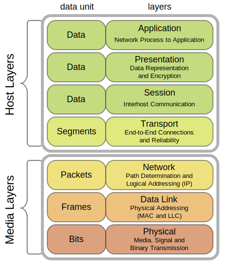
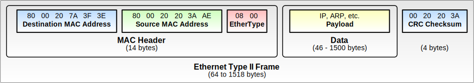
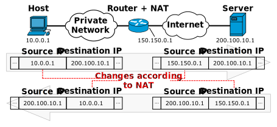

*OSI 7계층 모델. 각 계층이 상위 계층에 서비스를 제공하고, 하위 계층의 서비스를 이용한다. (이미지: Wikimedia Commons, CC BY-SA)*

각 계층이 **무엇을 해결하는지**, 왜 **그 위 계층이 필요한지**. 이 두 질문을 중심으로.

---

# 1계층: 물리 계층 (Physical) — 신호 문제

0과 1을 전기/빛/전파 등의 물리적 신호로 변환하여 전송하는 계층이다. NIC의 PHY 칩, 케이블, 허브가 담당한다. 백엔드 개발에서 직접 다룰 일은 거의 없으므로 **"비트를 신호로 바꿔서 보내는 하드웨어 계층"**이라는 것만 알면 된다.

---

# 2계층: 데이터 링크 계층 (Data Link) — LAN 내부 전달 문제

여러 장치가 동일한 물리 매체를 공유하면, 전송된 데이터는 모든 장치에 도달한다. 두 가지 문제를 해결해야 한다.

## 문제 1: 누구에게 보내는 것인가? → MAC 주소

```
같은 스위치에 연결된 PC 3대:

PC A (MAC: AA:AA:AA:AA:AA:AA)
PC B (MAC: BB:BB:BB:BB:BB:BB)
PC C (MAC: CC:CC:CC:CC:CC:CC)

A가 B에게 데이터를 보내려면:
  프레임 헤더에 목적지 MAC = BB:BB:BB:BB:BB:BB 를 적는다

스위치의 동작:
  1. A에서 프레임 수신
  2. 출발지 MAC(AA)이 포트 1에 있다고 MAC 테이블에 학습
  3. 목적지 MAC(BB)을 MAC 테이블에서 검색
  4. BB가 포트 2에 있으면 → 포트 2로만 전송 (다른 포트에는 안 보냄)
  5. 테이블에 없으면 → 모든 포트로 전송(flooding), 응답이 오면 학습
```

```
스위치의 MAC 주소 테이블:

포트 | MAC 주소
─────|──────────────────
  1  | AA:AA:AA:AA:AA:AA
  2  | BB:BB:BB:BB:BB:BB
  3  | CC:CC:CC:CC:CC:CC

이 테이블은 수동 설정이 아니라 트래픽을 보면서 자동으로 학습된다.
```

데이터는 **프레임(Frame)** 단위로 포장되어 전송된다. 프레임에는 출발지/목적지 MAC 주소와 에러 검출용 체크섬(FCS)이 포함된다.


*이더넷 Type II 프레임 구조. (이미지: Wikimedia Commons, CC BY-SA)*


> **2계층의 본질: LAN 내부 전달 문제**
> 구현 위치: NIC(MAC 로직) + OS 드라이버 + 스위치

---

# 3계층: 네트워크 계층 (Network) — 네트워크 간 경로 문제

2계층은 같은 LAN 안에서만 작동한다. 다른 네트워크로 가려면 **전역 주소 체계**와 **경로 선택**이 필요하다.

## IP 주소와 서브넷

```
MAC 주소: 48비트, 하드웨어에 고정. 물리적 식별자.
  → 같은 LAN 안에서만 유효. 네트워크를 넘으면 의미 없음.

IP 주소: 32비트(IPv4), 논리적 할당. 네트워크 + 호스트 부분.
  → 전 세계에서 유일하게 경로를 찾을 수 있는 주소.

192.168.1.100 / 24 (서브넷 마스크 255.255.255.0)
  네트워크 부분: 192.168.1    (앞 24비트)
  호스트 부분:   .100         (뒤 8비트)

같은 네트워크 (192.168.1.x) → 2계층으로 직접 전달 (ARP로 MAC 주소 획득)
다른 네트워크 (10.0.0.x)    → 라우터(게이트웨이)로 넘긴다
```

## 라우팅과 포워딩

```
라우팅(Routing): 어디로 가야 하는지 경로를 계산하여 테이블을 만드는 과정
  → 라우팅 프로토콜(OSPF, BGP 등)이 수행
  → 네트워크 구조가 바뀌면 동적으로 갱신

포워딩(Forwarding): 라우팅 테이블을 보고 패킷을 실제로 넘기는 동작
  → 패킷이 도착할 때마다 수행
  → 하드웨어(ASIC)로 고속 처리

라우팅 테이블 예시:
  목적지 네트워크    | 다음 홉         | 인터페이스
  ──────────────────|────────────────|──────────
  192.168.1.0/24   | directly connected | eth0
  10.0.0.0/8       | 192.168.1.1    | eth0
  0.0.0.0/0        | 192.168.1.1    | eth0  ← 기본 게이트웨이
```

## 패킷이 라우터를 통과하는 과정

```
PC A (192.168.1.100) → 웹서버 (203.0.113.50) 로 패킷 전송

1. A의 커널: 목적지 203.0.113.50은 같은 서브넷(192.168.1.x)이 아님
   → 기본 게이트웨이 192.168.1.1(라우터)로 보낸다
   → ARP로 192.168.1.1의 MAC 주소 획득
   → 이더넷 프레임: dst MAC = 라우터 MAC, src MAC = A의 MAC
   → IP 패킷: dst IP = 203.0.113.50, src IP = 192.168.1.100

2. 라우터 수신:
   → 이더넷 헤더를 벗김 (2계층 처리 완료)
   → IP 헤더의 dst IP = 203.0.113.50 확인
   → 라우팅 테이블 조회: 203.0.113.0/24 → 다음 홉 = ISP 라우터
   → TTL을 1 감소 (0이면 패킷 폐기 + ICMP 에러)
   → 새 이더넷 프레임으로 재포장: dst MAC = ISP 라우터 MAC
   → 전송

핵심: IP 주소(3계층)는 출발지→목적지 끝까지 변하지 않지만
     MAC 주소(2계층)는 매 홉(hop)마다 바뀐다!
```

```
패킷의 여정:

A → [스위치] → 라우터 1 → [ISP 네트워크] → 라우터 2 → [스위치] → 웹서버

이더넷 헤더 (2계층):  A→R1  |  R1→ISP  |  ISP→R2  |  R2→서버
                      ↑ 매 홉마다 새로운 MAC
IP 헤더 (3계층):      A→서버 | A→서버   | A→서버   | A→서버
                      ↑ 출발지~목적지 끝까지 동일
```

## IP의 특성: 비연결, 비신뢰

```
비연결(Connectionless):
  각 패킷이 독립적. 이전 패킷과의 상태를 기억하지 않음.
  같은 목적지로 가는 두 패킷이 다른 경로를 탈 수 있음.

비신뢰(Best Effort):
  IP가 보장하지 않는 것:
  - 도착 보장 (패킷이 사라질 수 있음)
  - 순서 보장 (뒤에 보낸 패킷이 먼저 도착할 수 있음)
  - 중복 방지 (같은 패킷이 두 번 도착할 수 있음)
  - 재전송 (잃어버려도 다시 보내지 않음)

  → 이 모든 것은 TCP(4계층)가 처리한다!
```

## NAT (Network Address Translation)


*NAT의 동작. 내부 사설 IP를 외부 공인 IP로 변환하여 하나의 공인 IP로 여러 내부 장치가 인터넷을 사용한다. (이미지: Wikimedia Commons, CC BY-SA)*

```
NAT 변환 테이블 (공유기 내부):

내부 IP:포트           외부 IP:포트           목적지
──────────────────────────────────────────────────
192.168.0.10:52341    203.0.113.1:40001    93.184.216.34:443
192.168.0.11:49872    203.0.113.1:40002    93.184.216.34:443
192.168.0.10:52342    203.0.113.1:40003    142.250.196.4:80

내부에서 나갈 때: src IP를 공인 IP로 교체, 포트도 변환
외부에서 응답 올 때: dst IP/포트를 보고 내부 장치로 역변환

→ 공인 IP 1개로 내부 수백 대가 인터넷 사용 가능
→ 외부에서 내부로 먼저 연결하는 것은 불가 (포트 포워딩 설정 필요)
```

## TTL (Time to Live)

```
TTL은 패킷의 "수명"이다. 라우터를 하나 통과할 때마다 1씩 감소.
0이 되면 패킷을 폐기하고 출발지에 ICMP "Time Exceeded" 메시지를 보냄.

왜 필요한가?
  라우팅 테이블에 순환(loop)이 생기면 패킷이 영원히 네트워크를 돈다.
  TTL이 없으면 좀비 패킷이 네트워크를 가득 채울 수 있다.

  초기 TTL = 64 (Linux 기본)
  → 최대 64개의 라우터를 통과할 수 있음
  → traceroute 명령이 TTL을 1, 2, 3, ... 으로 증가시키며
    각 라우터의 IP를 알아내는 원리
```

> **3계층의 본질: 네트워크 간 경로 문제**
> 구현 위치: 커널(IP 스택) + 라우터

---

# 4계층: 전송 계층 (Transport) — 프로세스 식별과 신뢰성 문제

## 문제: 같은 컴퓨터에 프로그램이 여러 개면?

3계층까지 성공하면 "목적지 컴퓨터"까지는 도착한다. 하지만 그 컴퓨터 안에는 크롬, 카카오톡, 서버 등이 동시에 돌고 있다.

```
203.0.113.50 서버에서 동시에 실행 중:
  - 웹서버 (포트 443)
  - SSH 서버 (포트 22)
  - DB 서버 (포트 3306)

패킷이 도착했는데 IP만 있으면:
  "203.0.113.50으로 왔다"  → 어느 프로그램에 줄 것인가?
```

## 해결: 포트 번호

```
IP 주소 → 컴퓨터(호스트) 식별
포트 번호 → 그 컴퓨터 안의 프로세스 식별

203.0.113.50:443  → 웹서버
203.0.113.50:22   → SSH
203.0.113.50:3306 → MySQL
```

## TCP vs UDP

```
TCP (Transmission Control Protocol):
  연결 지향, 신뢰성 보장

  IP가 안 해주는 것을 전부 해준다:
  - 순서 보장: 시퀀스 번호로 패킷 순서 복원
  - 재전송: ACK가 안 오면 다시 보냄
  - 흐름 제어: 수신자가 감당할 수 있는 속도로 조절
  - 혼잡 제어: 네트워크가 막히면 전송 속도를 줄임
  - 중복 제거: 시퀀스 번호로 중복 패킷 감지

  대가: 오버헤드가 크다 (연결 설정, ACK, 재전송 등)


UDP (User Datagram Protocol):
  비연결, 비신뢰

  IP에 포트 번호만 추가한 것. 그 외 아무것도 안 함.
  - 순서 보장 안 함
  - 재전송 안 함
  - 흐름/혼잡 제어 안 함

  장점: 빠르고 가볍다
  용도: 실시간 스트리밍, 게임, DNS, VoIP
    → 늦게 도착하느니 아예 안 오는 게 낫는 경우
```


*TCP 3-Way Handshake. SYN → SYN-ACK → ACK로 양방향 통신을 수립한다. (이미지: Wikimedia Commons, CC BY-SA)*

## TCP 3-Way Handshake

```
클라이언트                              서버
    |                                     |
    |──── SYN (seq=100) ──────────────→   |  "연결하자"
    |                                     |
    |←── SYN-ACK (seq=300, ack=101) ────  |  "좋아, 나도 연결하자"
    |                                     |
    |──── ACK (seq=101, ack=301) ─────→   |  "확인했어"
    |                                     |
    |          연결 수립 (ESTABLISHED)      |

왜 3번인가?
  1번 (SYN): 클라이언트 → 서버 방향 통신 가능 확인
  2번 (SYN-ACK): 서버 → 클라이언트 방향 통신 가능 확인
  3번 (ACK): 클라이언트가 서버의 시퀀스 번호를 확인

  2번만으로는 클라이언트가 SYN-ACK를 받았는지 서버가 모른다.
  → 오래된 SYN이 지연 도착하면 서버가 유령 연결을 만들 수 있음
  → 3번째 ACK가 이를 방지
```

## 소켓 — 4계층의 실체

포트 매핑이 실제로 어떻게 동작하는지, 커널 내부를 따라가보자.

```
서버가 준비되는 과정:

socket()  → 커널에 소켓 구조체(struct sock) 생성
bind()    → 로컬 IP + 포트(443)에 바인딩
listen()  → LISTEN 상태로 전환, SYN 대기

커널 상태:
  (local_ip=*, local_port=443)  상태: LISTEN
```

```
클라이언트가 연결:

connect() → 임시 포트(52341) 자동 할당 + SYN 전송

SYN 패킷 도착 시 서버 커널:
  1. TCP 헤더에서 dst port = 443 확인
  2. LISTEN 소켓 검색 → 매칭!
  3. 새 소켓 생성: (192.168.0.10, 52341, 203.0.113.5, 443)
  4. SYN-ACK 전송

ACK 도착 → ESTABLISHED
accept() → 커널의 완료 큐에서 소켓을 꺼내 fd(파일 디스크립터) 부여
```

```
이후 데이터 패킷 도착 시:

패킷: src=192.168.0.10:52341, dst=203.0.113.5:443

TCP 스택이 4-tuple로 소켓을 검색:
  (src IP, src port, dst IP, dst port)
  → 정확히 매칭되는 struct sock 발견
  → 해당 소켓의 receive buffer에 저장

recv() 호출 시:
  fd → struct sock → receive buffer → 사용자 공간으로 복사
```

```
핵심: 포트 매핑은 단순한 "포트 번호 비교"가 아니다.
     4-tuple (src IP, src port, dst IP, dst port)이 키이고,
     커널의 해시 테이블에서 소켓을 조회하는 과정이다.

     같은 서버 포트(443)에 1만 개의 동시 연결이 가능한 이유:
     각 연결의 4-tuple이 다르므로 (클라이언트 IP/포트가 다름)
     각각 별도의 소켓으로 구분된다.
```

> **4계층의 본질: 프로세스 식별 + 신뢰성**
> 구현 위치: 운영체제 커널(네트워크 스택)

---

# 5~7계층: 세션 / 프레젠테이션 / 응용

현대 인터넷은 실무적으로 **TCP/IP 스택**이 표준이다. OSI의 5~7계층 기능들은 사라진 게 아니라 **애플리케이션/라이브러리 안으로 흡수**됐다.

```
OSI 계층            TCP/IP에서의 위치              예시
──────────────────────────────────────────────────────
5 세션 계층         애플리케이션 내부              로그인 상태, 토큰, Keep-alive
6 프레젠테이션 계층  라이브러리                    JSON/Protobuf 직렬화, gzip 압축, TLS 암호화
7 응용 계층         애플리케이션                  HTTP, DNS, SMTP, FTP, SSH
```

## TLS (Transport Layer Security)

```
OSI 모델에서는 6계층(프레젠테이션)에 해당하지만,
실제로는 4계층(TCP)과 7계층(HTTP) 사이에 위치한다.

TLS 없이:
  [HTTP 요청] → [TCP] → [IP] → ...
  → 내용이 평문으로 전송. 중간에서 읽을 수 있음.

TLS 있음:
  [HTTP 요청] → [TLS 암호화] → [TCP] → [IP] → ...
  → 내용이 암호화됨. 중간에서 읽을 수 없음.

HTTPS = HTTP + TLS
```

## HTTP

```
HTTP 요청:
  GET /index.html HTTP/1.1
  Host: www.example.com
  User-Agent: Mozilla/5.0
  Accept: text/html

HTTP 응답:
  HTTP/1.1 200 OK
  Content-Type: text/html
  Content-Length: 1234

  <html>...</html>

HTTP는 텍스트 기반 프로토콜이다. 사람이 읽을 수 있다.
모든 요청은 독립적 (stateless). 상태 유지는 쿠키/세션으로.
```

> **5~7계층의 본질: 애플리케이션 문제**
> 구현 위치: 사용자 공간 — 애플리케이션/라이브러리

---


*TCP/IP 캡슐화. 각 계층이 상위 데이터를 페이로드로 감싸고 자기 헤더를 붙인다. (이미지: Wikimedia Commons, CC BY-SA)*

# 캡슐화: 계층이 쌓이는 방식

각 계층은 상위 계층의 데이터를 페이로드로 보고 **자기 헤더를 붙인다**.

```
보내는 쪽 (캡슐화):

  7계층: [HTTP 데이터]
  4계층: [TCP 헤더][HTTP 데이터]                      ← 세그먼트
  3계층: [IP 헤더][TCP 헤더][HTTP 데이터]               ← 패킷
  2계층: [이더넷 헤더][IP 헤더][TCP 헤더][HTTP 데이터][FCS] ← 프레임
  1계층: 01101001011010...                             ← 비트/신호


받는 쪽 (역캡슐화):

  1계층: 비트 수신 → 프레임 복원
  2계층: 이더넷 헤더 제거, MAC 확인 → IP 패킷 추출
  3계층: IP 헤더 제거, IP 확인 → TCP 세그먼트 추출
  4계층: TCP 헤더 제거, 포트 확인 → HTTP 데이터 추출
  7계층: HTTP 데이터를 애플리케이션에 전달
```


---

# 계층은 "물리적 위치"가 아니라 "해결하는 문제"다

```
계층 | 해결하는 문제              | 주요 단위   | 주요 장비/구현
─────|──────────────────────────|──────────|──────────────
  1  | 비트를 신호로 변환         | 비트       | PHY 칩, 케이블
  2  | LAN 내부 전달 + 프레이밍   | 프레임     | NIC, 스위치
  3  | 네트워크 간 경로 선택      | 패킷       | 라우터, 커널
  4  | 프로세스 식별 + 신뢰성     | 세그먼트   | 커널
 5-7 | 애플리케이션 기능          | 메시지     | 애플리케이션
```

**핵심:** 각 계층은 "이전 계층만으로 해결 못 하는 문제"를 해결하기 위해 추가된 규칙이다.

```
1계층만 있으면: 비트는 보내지만 누구에게 보내는지 모른다    → 2계층 필요
2계층까지 있으면: 같은 LAN은 되지만 다른 네트워크로 못 간다  → 3계층 필요
3계층까지 있으면: 컴퓨터는 찾지만 어느 프로그램인지 모른다   → 4계층 필요
4계층까지 있으면: 데이터는 오지만 의미를 해석 못 한다        → 7계층 필요
```

> 시각화: [VisuAlgo](https://visualgo.net)에는 네트워크 시각화가 없지만, Wireshark로 실제 패킷을 캡처하면 각 계층의 헤더가 중첩되는 구조를 직접 확인할 수 있다.
