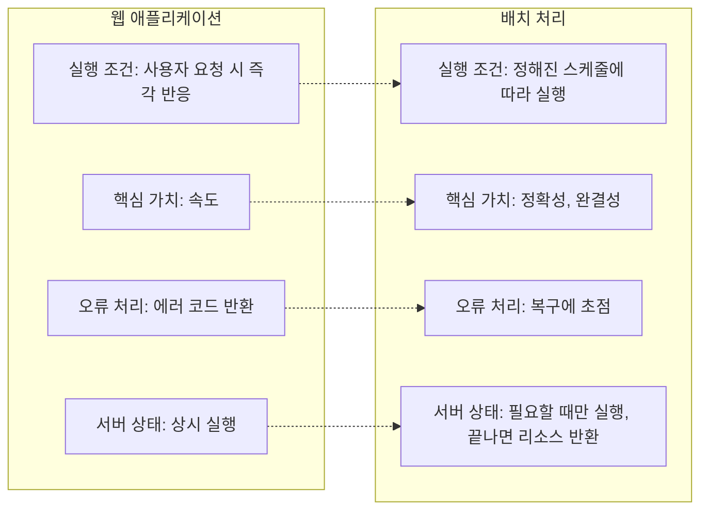

Spring Batch는 대량의 데이터를 정해진 시간에 자동으로 일괄처리하고 결과를 출력하는 작업 프레임워크입니다.

## 배치(Batch)란?

배치 처리는 대량의 데이터를 **자동으로, 정기적으로, 효율적으로** 처리하는 방식입니다.

웹 애플리케이션과 비교하면 차이가 뚜렷합니다.

## Spring Batch의 구조

스프링 배치는 일반적인 배치 처리 패턴을 추상화한 컴포넌트들을 제공합니다.

- **Job**: 하나의 완전한 배치 처리 작업
- **Step**: Job의 세부 실행 단계 (하나의 Job은 여러 Step으로 구성)
- **ItemReader**: 데이터를 읽어오는 컴포넌트
- **ItemProcessor**: 데이터를 가공하는 컴포넌트
- **ItemWriter**: 데이터를 저장하는 컴포넌트

## 핵심 기능

### Chunk 지향 처리

대량의 데이터를 지정된 크기(chunk)로 나누어 순차적으로 처리합니다. 한 번에 처리하는 데이터양을 제한하여 메모리 사용을 최적화합니다.

### 재시작 및 실행 제어

대용량 데이터 처리 중 실패해도 처음부터 다시 시작할 필요가 없습니다.

- 오류 발생 시 마지막으로 성공한 Step부터 재시작 가능
- Step 내에서도 마지막 처리 항목 이후부터 작업 재개
- 특정 Step만 선택적으로 실행

### 확장성 (Scalability)

- **멀티스레드 Step**: 하나의 Step을 여러 스레드로 처리
- **병렬 Step**: 여러 Step을 동시에 실행
- **분산 처리**: 여러 서버에서 배치 처리 분산 실행

## 인프라 컴포넌트

Spring Batch가 제공하는 인프라 컴포넌트는 배치 실행의 생명주기를 관리합니다.

### JobLauncher

Job을 실행하는 진입점입니다. 외부에서 Job 이름과 **JobParameters**(실행 시 전달할 파라미터)를 받아 Job 실행을 시작합니다. 스케줄러나 REST API에서 호출하는 대상이 바로 JobLauncher입니다.

### JobRepository

배치 실행의 **메타데이터를 저장**하는 저장소입니다. Job과 Step의 실행 이력, 상태(성공/실패), 시작 시간, 종료 시간 등을 데이터베이스에 기록합니다. 재시작 시 JobRepository의 메타데이터를 참조하여 마지막 성공 지점부터 이어서 실행할 수 있습니다.

### ExecutionContext

Job 또는 Step 실행 중 데이터를 공유하기 위한 **key-value 저장소**입니다. JobExecutionContext는 Job 전체에서, StepExecutionContext는 해당 Step 내에서 데이터를 주고받을 수 있습니다. 재시작 시에도 ExecutionContext가 복원되어 이전 상태를 이어받습니다.

## 개발자가 구현하는 영역

Spring Batch가 실행 흐름과 인프라를 제공하고, 개발자는 **실제 비즈니스 로직**을 구현합니다.

**ItemReader**는 데이터 소스에서 데이터를 읽어오는 역할을 합니다. DB 쿼리, CSV 파일 읽기, API 호출 등이 대표적인 예시입니다.

**ItemProcessor**는 읽어온 데이터를 가공, 변환, 필터링합니다. 유효성 검증, 포맷 변환, 비즈니스 규칙 적용 등의 작업을 수행합니다.

**ItemWriter**는 가공된 데이터를 최종 저장합니다. DB 저장, 파일 출력, 외부 시스템 전송 등이 이에 해당합니다.

Spring Batch는 `JdbcCursorItemReader`, `FlatFileItemWriter` 등 자주 쓰이는 Reader/Writer 구현체를 기본 제공하지만, 비즈니스 요구사항에 맞는 커스텀 구현이 필요한 경우가 대부분입니다. 특히 ItemProcessor는 거의 항상 직접 작성합니다.

## 정리

Spring Batch는 배치 처리에 필요한 실행 제어, 상태 관리, 재시작, 확장성을 프레임워크 차원에서 제공합니다. 개발자는 인프라를 직접 구현할 필요 없이, Reader-Processor-Writer라는 명확한 구조 안에서 비즈니스 로직에만 집중하면 됩니다.
