## 개요

채팅 코드를 점검하면서 상관 서브쿼리에 의한 슬로우 쿼리와 N+1 쿼리를 발견했다. k6 부하 테스트로 확인한 결과, 채팅방 목록 조회에서 상관 서브쿼리가 병목이었고, 메시지 조회에서 N+1이 DB 커넥션 풀을 소진시키고 있었다.

---

## 시스템 구조

### 채팅 메시지 흐름

```
클라이언트 (REST / WebSocket STOMP)
    ↓
ChatWebSocketController (@MessageMapping)
    ↓
MessageCommandService.publishImmediately() → Redis Pub/Sub 발행
    ↓
AsyncMessageService.saveMessageAsync() (@Async) → DB INSERT
    ↓
ChatSubscriber.onMessage() → SimpMessagingTemplate.convertAndSend()
    ↓
WebSocket 구독자 브로드캐스트
```

REST 조회는 `MessageQueryService`가 `MessageRepository.findLatest()` / `findOlderThan()`으로 커서 기반 페이징을 처리한다.

---

## 문제 상세

---

### 채팅방 목록 조회 슬로우 쿼리 — 상관 서브쿼리

채팅방 목록 API(GET /clubs/{clubId}/chat)에서 마지막 메시지를 가져오는 쿼리가 병목이었다.

```java
// MessageRepository.java (수정 전)
@Query("""
SELECT m FROM Message m
WHERE m.chatRoom.chatRoomId IN :chatRoomIds
  AND m.deleted = false
  AND m.sentAt = (
    SELECT MAX(m2.sentAt) FROM Message m2
    WHERE m2.chatRoom.chatRoomId = m.chatRoom.chatRoomId
      AND m2.deleted = false
  )
""")
List<Message> findLastMessagesByChatRoomIds(@Param("chatRoomIds") List<Long> chatRoomIds);
```

`EXPLAIN` 결과는 다음과 같다.

```
기존: DEPENDENT SUBQUERY → 매 row마다 438건씩 스캔 (20,236 × 438 = 약 887만 건)
최적화: Using index for group-by → 인덱스만으로 GROUP BY 처리, derived 21건
```

채팅방이 많아질수록 채팅방 수와 메시지 수의 곱에 비례하여 느려지는 구조였다. (상관 서브쿼리는 외부 행 수 N × 내부 스캔 M = O(N·M)으로, 지수적이 아니라 다항식적 증가다.)

**수정 후:**

```java
@Query(value = """
    SELECT m.* FROM message m
    INNER JOIN (
        SELECT chat_room_id, MAX(sent_at) AS max_sent_at
        FROM message
        WHERE chat_room_id IN :chatRoomIds AND deleted = 0
        GROUP BY chat_room_id
    ) latest ON m.chat_room_id = latest.chat_room_id AND m.sent_at = latest.max_sent_at
    WHERE m.deleted = 0
""", nativeQuery = true)
List<Message> findLastMessagesByChatRoomIds(@Param("chatRoomIds") List<Long> chatRoomIds);
```

> 이 시점에서는 `MAX(sent_at)`을 사용했다. 같은 밀리초에 메시지가 2개 들어오면 중복 반환되는 문제가 남아 있으며, 이후 [채팅 도메인 리팩토링](/chat-domain-deep-refactoring/)에서 `MAX(messageId)`로 재수정했다.

---

---

### `findLatest` N+1 쿼리

메시지 50건을 조회하면 각 메시지마다 `chatRoom`과 `user` 연관이 LAZY 로딩됐다.

```
findLatest() → 1 쿼리
→ m.chatRoom 접근 × 50 → 50 쿼리
→ m.user 접근 × 50 → 50 쿼리
합계: 101 쿼리
```

**수정 후:**

```java
@Query("""
   select m from Message m
   join fetch m.chatRoom
   join fetch m.user
   where m.chatRoom.chatRoomId = :roomId
     and m.deleted = false
   order by m.sentAt desc, m.messageId desc
""")
List<Message> findLatest(@Param("roomId") Long roomId, Pageable pageable);
```

`findOlderThan`도 동일하게 수정했다.

---

### AbortPolicy — 비동기 큐 포화 시 태스크 유실 위험

```java
// AsyncConfig.java (수정 전)
executor.setRejectedExecutionHandler(new ThreadPoolExecutor.AbortPolicy());
```

`AbortPolicy`는 큐가 가득 차면 `RejectedExecutionException`을 던진다. 태스크(DB 저장)가 버려지고 호출자에게 에러가 전파된다. 문제는 `@Async` 메서드에서 이 예외가 발생하면 호출자(WebSocket 스레드)에게 전파되지 않아 **메시지가 Redis에는 발행됐지만 DB에는 저장되지 않는 상태**가 조용히 발생할 수 있다는 것이다.

`@Retryable`이 걸려 있지만, 큐 자체가 가득 찬 상태에서는 재시도해도 같은 이유로 실패한다. 실패 시 폴백 처리(`@Recover`)도 없어 메시지가 유실된다.

**수정 후:**

```java
executor.setRejectedExecutionHandler((r, exec) -> {
    log.warn("[AsyncExecutor] task rejected, queue full. poolSize={}, queueSize={}",
            exec.getPoolSize(), exec.getQueue().size());
    throw new RejectedExecutionException("Async queue full");
});
```

```
로그를 남기는 커스텀 거부 정책 + @Recover 폴백 추가.
→ 거부된 태스크는 @Recover가 Redis 폴백으로 처리
→ 나중에 배치가 Redis에서 꺼내 DB에 저장
→ 메시지 유실 방지
```

> 커스텀 거부 정책의 역할은 로그를 남기는 것이고, 실제 메시지 유실 방지는 호출 측의 `@Recover` 메서드가 담당한다. `@Retryable` + `@Recover` 조합으로 비동기 저장이 실패하면 Redis list에 백업하는 폴백 경로를 추가했다.

비동기 executor 설정 문제는 [SSE 알림 편](/sse-notification-chained-bugs/)의 `@Async` executor 미지정 문제와 같은 맥락이다.

---

### 로그 I/O 병목

매 메시지마다 `INFO` 레벨 로그가 4~5줄씩 찍혔다.

```java
log.info("[WebSocket.Receive] chatRoomId={}, userId={}", ...);
log.info("[WebSocket.Publish] chatRoomId={}, userId={}", ...);
log.info("[Async.SaveMessage] completed: chatRoomId={}, userId={}", ...);
log.info("[Chat.Subscriber] message broadcast: roomId={}, text={}", ...);
```

200VU 기준 초당 수백 건의 메시지가 처리될 때 로그 I/O가 병목이 됐다.

**수정:** 4개 모두 `log.debug`로 변경.

---

## 부하 테스트 결과 (3차 최종)

### 3M+ 메시지, VU를 800 → 400으로 조정한 후 최종 수치

```mermaid
xychart-beta
    title "p95 응답 시간 비교 (ms)"
    x-axis ["P1 메시지조회", "P1 채팅방목록", "P2 메시지전송", "P3 메시지조회", "P4 메시지왕복"]
    y-axis "ms" 0 --> 350
    bar [319, 48, 44, 50, 0]
    bar [108, 33, 35, 91, 26]
```



**P1 Read (400VU)**: 메시지 조회 p95 319ms → 108ms (-66%), 채팅방 목록 p95 48ms → 33ms (-31%), 성공률 84.2% → 100%.

**P2 Write (150VU)**: 메시지 전송 p95 44ms → 35ms (-20%), 성공률 100% → 100%.

**P3 Mixed (200VU)**: 메시지 조회 p95 50ms → 91ms (VU 2배로 증가), 성공률 85.1% → 100%.

**P4 WebSocket (150VU)**: 메시지 왕복 p95 측정불가 → 26ms (해결), 연결 성공률 99.6% → 99.3%.

**전체**: 5xx 에러 9,668건 → 0건, 슬로우 쿼리 827건 → 46건 (-83%).

### Phase별 결과 요약

**P1 (조회 단독 400VU)**: 메시지 조회 p95 108ms, 채팅방 목록 p95 33ms. 모두 임계값(300ms) 이내.

**P2 (전송 단독 150VU)**: 메시지 전송 p95 35ms. 성공률 100%.

**P3 (혼합 200VU)**: 조회/전송/삭제 모두 50~91ms. 성공률 100%. 조회 p95가 1차 대비 91ms로 올라간 건 VU가 두 배(100 → 200)로 늘었기 때문이며, 임계값(300ms) 대비로는 충분히 여유 있는 수치다.

**P4 (WebSocket 150VU)**: 연결 p95 15ms, **메시지 왕복 p95 26ms**.

**P5 (스파이크 500VU)**: p95 929ms. DB 커넥션 풀(HikariCP 400) 포화 구간으로, 이 수준의 스파이크는 인프라 확장이 필요한 로컬 환경 한계.

---

## 남은 병목점

### P5 스파이크 (800VU) — DB 커넥션 풀 포화

단일 쿼리 실행 시간은 1.2ms지만 400VU가 동시에 접근하면 1,411ms로 늘어난다. HikariCP 400 커넥션이 전부 사용 중일 때 나머지 요청이 큐에 대기하는 시간이 쿼리 시간에 더해지는 것이다.

실서버 환경에서는 DB 복제(Read Replica)와 커넥션 풀 수직 확장으로 대응 가능하다.

### WebSocket 메시지 왕복 1.5% 실패

STOMP SUBSCRIBE 후 MESSAGE 프레임이 3초 타임아웃 내에 도달하지 못하는 케이스가 1.5% 수준으로 남아 있다. Redis Pub/Sub → STOMP 브로드캐스트 사이의 지연으로, 300VU 이상의 고부하 구간에서 발생한다.

---

## 수정 내역 요약

- **`MessageRepository.java`**: `findLastMessagesByChatRoomIds` 상관 서브쿼리 → GROUP BY + JOIN
- **`MessageRepository.java`**: `findLatest`, `findOlderThan`에 `JOIN FETCH m.chatRoom, m.user` 추가
- **`ChatSubscriber.java`**: `log.info` → `log.debug`
- **`AsyncMessageService.java`**: 지수 백오프로 변경 (100ms / 300ms / 900ms)
- **`WebSocketConfig.java`**: STOMP 아웃바운드 큐 10,000 → 2,000
- **`AsyncConfig.java`**: `AbortPolicy` → 로깅 + `@Recover` Redis 폴백 추가
- **`ChatWebSocketController.java`**: `log.info` → `log.debug`
- **커서 페이징 인덱스**: `idx_message_room_deleted_sent`, `idx_message_room_sent_id` 추가

---

## 정리하며

상관 서브쿼리가 가장 큰 병목이었다. 채팅방이 늘어날수록 지수적으로 느려지는 구조라, 부하 테스트에서 성공률이 떨어지는 직접적인 원인이 됐다. (정확히는 O(N·M) 다항식 증가이며, 데이터가 늘수록 급격히 느려지는 구조다.) GROUP BY + JOIN으로 교체한 뒤 EXPLAIN에서 DEPENDENT SUBQUERY가 사라지고, 채팅방 목록 조회 응답 시간이 안정됐다.

N+1도 메시지 50건 조회에 101쿼리가 나가는 구조라 VU가 늘어나면 DB 커넥션 풀을 빠르게 소진시켰다. `join fetch` 추가로 1쿼리로 줄인 것이 성능 안정화에 기여했다.

> **상관 서브쿼리는 데이터가 적을 때는 드러나지 않는다.**
> 채팅방이 수십 개인 로컬 환경에서는 문제없이 동작하다가, 부하 테스트로 데이터가 늘어나면서 급격히 느려졌다. EXPLAIN을 먼저 확인했으면 부하 테스트 전에 잡을 수 있었던 문제다.

---

## 시리즈 탐색

**◀ 이전 글**
[유저 도메인 — 인증 이후, 사용자 생명주기에서 무너진 것들](/user-lifecycle-bugs/)

**▶ 다음 글**
[알림 API 성능 — 13% 성공률에서 100%로, 9번의 시도 기록](/notification-api-performance-improvement/)
