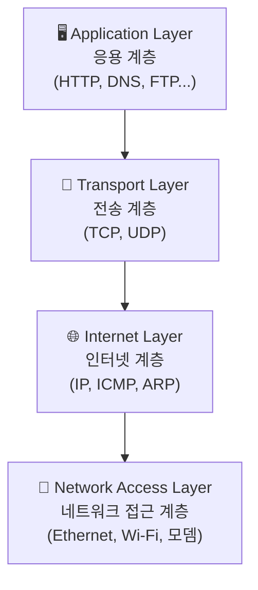

> 기반: 네트워크.md 내용 + TCP/IP Updated (4계층) 모델 기준

---

## TCP/IP 모델 전체 구조



> OSI 7계층에서 세션/프레젠테이션을 Application으로 통합한 것이 TCP/IP Updated 모델

---

## 1계층 — Network Access Layer (네트워크 접근 계층)

> OSI의 **물리 계층 + 데이터 링크 계층**을 합친 것

### 물리 계층 부분

모든 건 **0과 1**이다. 두 컴퓨터가 전선으로 연결되어 0과 1 신호를 주고받는다.
문제는 전선은 아날로그 신호만 전송 가능하다는 것.
→ **디지털 → 아날로그 → 디지털** 변환이 필요하다. 이 역할을 하는 장치가 **모뎀(Modem)**이다.

하나의 전선에 여러 컴퓨터가 연결되면, 신호를 보냈을 때 **모든 컴퓨터**에게 전송되어 버린다.
→ 이를 해결하는 것이 **스위치(Switch)**: 메시지의 목적지(MAC 주소)를 확인해서 특정 컴퓨터에만 전달한다.

스위치(네트워크)끼리를 연결해주는 것이 **라우터(Router)**. **인터넷 = 거대한 라우터들의 집합**으로 볼 수 있다.

### 데이터 링크 계층 부분

전선에 흐르는 데이터는 `010101...` 연속된 비트열이다. 송신자가 데이터 **앞뒤에 특정 비트열을 붙인다** = **프레이밍(Framing)**

```
[ 시작 비트열 | 실제 데이터 | 끝 비트열 | 오류 검사 ]
     Header      Payload       Footer       FCS
```

- 구현 장치: **랜카드(NIC, Network Interface Card)**
- 주소 체계: **MAC 주소** (하드웨어에 고정된 48비트 주소)
- 대표 프로토콜: **Ethernet**, Wi-Fi(802.11)
- → **하드웨어**로 구현됨

---

## 2계층 — Internet Layer (인터넷 계층)

> OSI 3계층(네트워크 계층)에 해당

라우터 내부에서 "다음 라우터를 어디로 보낼까?"를 결정한다 → **라우팅(Routing)**

데이터를 **패킷(Packet)** 단위로 포장해서 목적지까지 넘겨준다.

```
[ IP Header | Data ]
  - 출발지 IP
  - 목적지 IP
  - TTL (Time To Live)
  - 프로토콜 정보
```

- 대표 프로토콜: **IP (IPv4, IPv6)**, ICMP, ARP
- → **OS 커널 소프트웨어**로 구현됨

---

## 3계층 — Transport Layer (전송 계층)

> OSI 4계층에 해당

컴퓨터에는 여러 프로그램이 동시에 실행 중이다. IP 주소만으로는 어떤 **프로세스**에 데이터를 줄지 모른다.
→ **포트 번호(Port Number)** 로 프로세스를 식별한다.

### TCP vs UDP

| | TCP | UDP |
|---|---|---|
| 연결 방식 | 연결 지향 (3-way handshake) | 비연결 |
| 신뢰성 | 높음 (재전송 보장) | 낮음 (손실 허용) |
| 속도 | 상대적으로 느림 | 빠름 |
| 사용 예 | HTTP, 파일 전송 | 스트리밍, 게임, DNS |

---

## 4계층 — Application Layer (응용 계층)

> OSI 5(세션) + 6(프레젠테이션) + 7(응용) 통합

OS의 Transport Layer가 제공하는 **소켓(Socket) API**를 활용해서 통신 가능한 프로그램을 만드는 것 = **TCP/IP 소켓 프로그래밍**

---

## 전체 계층 한눈에 보기

| 계층 | 키워드 | 단위 | 구현 |
|---|---|---|---|
| Application | HTTP, DNS, 소켓 API | 메시지 | 앱 |
| Transport | TCP/UDP, 포트번호 | 세그먼트 | OS 커널 |
| Internet | IP, 라우팅 | 패킷 | OS 커널 |
| Network Access | MAC, 프레이밍, 모뎀, 스위치 | 프레임 / 비트 | 하드웨어 |
