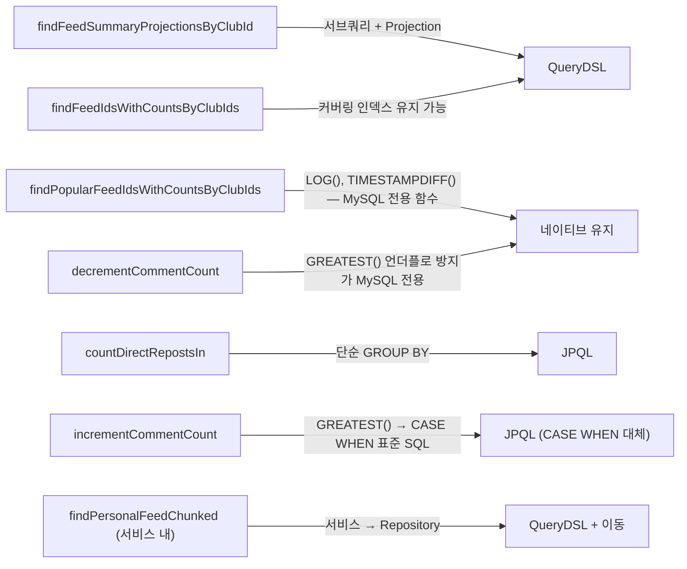
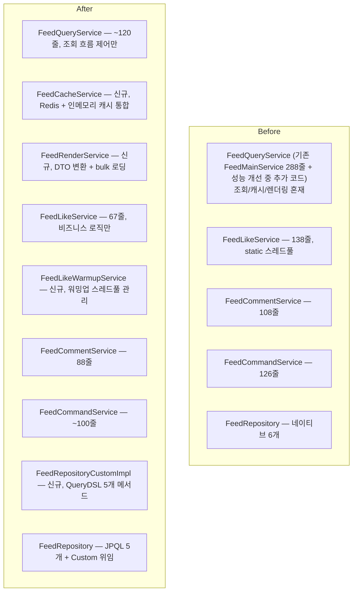

## 개요

피드 도메인은 다른 팀원이 설계한 코드다. [부하 테스트를 통한 성능 개선](/feed-performance-load-test/)을 마친 뒤 코드 구조를 점검하면서 진행한 리팩토링이다.

원본 코드에서 확인된 주요 구조 문제:

```
1. FeedMainService(288줄)에 조회/렌더링/bulk 로딩이 혼재
2. FeedRepository에 네이티브 쿼리(findPopularByClubIds 등) — 컴파일 타임 검증 없음
3. getCurrentUser().getUserId()가 8곳 — 매번 DB 조회
4. getFeedLikes().size()로 카운트 — 컬렉션 전체 로딩
5. likedFeedIds가 항상 빈 Set — 좋아요 여부 표시 안 됨
```

네이티브 쿼리를 QueryDSL/JPQL로 전환하고, 서비스의 책임을 분리하는 것이 목표였다.

---

## 구조 분석 — 원본 코드의 구조

```
FeedMainService (288줄) — 전체 피드 조회 + 렌더링
├── getPersonalFeed / getPopularFeed
├── getFeedsCommon → FeedRepository 호출
├── bulkLoadParents / bulkLoadRoots → 동일 로직이 2개
├── toOverviewDto → 렌더링 (DTO 변환 + 이미지 처리)
├── resolveAccessibleClubIds → "친구의 친구" 범위 계산
└── countDirectReposts

FeedService (별도) — 모임 피드 CRUD + 좋아요 + 댓글
├── getCurrentUser().getUserId() 7곳
└── getFeedLikes().size() → 컬렉션 전체 로딩

FeedRepository — 네이티브 쿼리
├── findPopularByClubIds → LOG(), TIMESTAMPDIFF() MySQL 전용 함수
├── countDirectRepostsIn → 네이티브
└── findByClubIds → JPQL
```

네이티브 쿼리가 Repository에 있는 것 자체는 레이어상 맞지만, MySQL 전용 함수를 쓰고 있어 DB 독립성이 없고 컴파일 타임 검증도 되지 않는다는 점이 문제였다.

---

## Repository 레이어 정리 — 네이티브 → QueryDSL/JPQL

### 전환 판단 기준



`LOG()`를 `QueryDSL MathExpressions`로, `GREATEST(x, 0)`을 `CASE WHEN x > 0 THEN x ELSE 0 END`로, `DATE_SUB(NOW(), INTERVAL 7 DAY)`를 Java에서 `LocalDateTime.now().minusDays(7)` 파라미터로 전달하는 방식으로 MySQL 전용 함수를 제거했다.

```java
// 수정 후 — QueryDSL로 인기피드 스코어 계산 (LN, TIMESTAMPDIFF 잔류는 numberTemplate)
NumberExpression<Double> score = feed.likeCount
        .add(feed.commentCount.multiply(2))
        .castToNum(Double.class)
        .add(numberTemplate(Double.class, "1.0"))
        .as("score");
```

`decrementCommentCount`의 `GREATEST`만 네이티브로 남겼다. MySQL에서 음수 언더플로를 방지하는 가장 안전한 방법이고, 다른 표준 방법이 없다.

### FeedRepositoryCustomImpl 신규 생성

```java
// FeedRepositoryCustomImpl.java (신규)
@Repository
public class FeedRepositoryCustomImpl implements FeedRepositoryCustom {
    private final JPAQueryFactory queryFactory;

    @Override
    public List<FeedIdWithCounts> findPersonalFeedChunked(
            List<Long> clubIds, int limit) {
        // CLUB_CHUNK_SIZE=5개씩 청크 → 각 청크를 별도 QueryDSL 쿼리
        // Java에서 merge sort로 정렬 후 limit 적용
        return partitionList(clubIds, CLUB_CHUNK_SIZE).stream()
                .flatMap(chunk -> queryChunk(chunk, limit))
                .sorted(Comparator.comparing(FeedIdWithCounts::createdAt).reversed())
                .limit(limit)
                .toList();
    }
}
```

`EntityManager` 직접 사용이 서비스에서 사라졌다. `FeedRepository`가 `FeedRepositoryCustom`을 extends하고, Spring Data JPA가 `FeedRepositoryCustomImpl`을 자동으로 찾아 주입한다.

---

## getCurrentUser() → getCurrentUserId() — 불필요한 SELECT 제거

`AuthService.getCurrentUser()`는 SecurityContext에서 principal을 꺼낸 뒤 `userRepository.findById()`를 호출한다. `getCurrentUserId()`는 DB 조회 없이 principal에서 ID만 추출한다.

피드 서비스 전반에 `getCurrentUser().getUserId()`가 8곳 있었다.

원본 코드의 `getCurrentUser().getUserId()` 사용 현황:

`FeedMainService`에서는 3회 호출 중 1회만 User 엔티티가 실제로 필요했고(createRefeed에서 User 전달), 나머지 2회는 userId만으로 충분했다. `FeedService`에서는 7회 호출 중 3회가 User 엔티티 필요(create/update/refeed), 4회는 userId만으로 충분했다.

User 엔티티가 필요한 곳은 유지, userId만 쓰는 곳은 `getCurrentUserId()`로 교체. [유저 도메인 편](/user-lifecycle-bugs/)에서 `UserPrincipal` 방식으로 바꾼 뒤에는 DB 조회 자체가 사라진다.

---

## FeedCacheService 분리 — 캐시 로직을 서비스에서 제거

[부하 테스트 성능 개선](/feed-performance-load-test/) 과정에서 Redis 캐시와 인메모리 캐시를 도입했는데, 그때 캐시 로직을 `FeedQueryService` 안에 인라인으로 작성했다. 리팩토링에서 이를 별도 서비스로 분리한다.

캐시 로직이 서비스에 섞여 있으면 테스트 격리가 어렵고, Spring 컨텍스트 외부에서 캐시 생명주기를 제어할 수 없다. `FeedCacheService`를 별도 Bean으로 분리:

```java
// FeedCacheService.java (신규)
@Component
public class FeedCacheService {
    // Redis pass1 캐시
    public Optional<List<FeedIdWithCounts>> getPass1(String key) { ... }
    public void putPass1(String key, List<FeedIdWithCounts> data) { ... }

    // 인메모리 result 캐시 (10초 TTL)
    public Optional<List<FeedOverviewDto>> getResult(String key) { ... }
    public void putResult(String key, List<FeedOverviewDto> data) { ... }

    // 인메모리 detail 캐시 (5초 TTL)
    public Optional<DetailCacheEntry> getDetail(Long feedId) { ... }
    public void putDetail(Long feedId, DetailCacheEntry entry) { ... }

    // eviction 통합
    @Scheduled(fixedDelay = 30_000)
    public void evictExpired() { ... }
}
```

`FeedQueryService`의 `StringRedisTemplate` 직접 의존이 제거됐다. 캐시 관련 record, 직렬화/역직렬화, eviction 로직이 모두 `FeedCacheService` 안으로 응집됐다.

---

## FeedRenderService 분리 — 렌더링 로직 추출

`FeedQueryService`의 절반은 DTO 변환과 bulk 로딩이었다.

```java
// 수정 전 — 서비스에 렌더링 로직 인라인
private List<FeedOverviewDto> buildOverviewList(
        List<FeedIdWithCounts> feedIds, Long userId) {
    List<Feed> feeds = feedRepository.findByIdsWithRelations(feedIds);
    Map<Long, Long> likedFeedIds = feedLikeRepository.findLikedFeedIdsByUser(userId, ...);
    Map<Long, Feed> parents = bulkLoadParents(feeds);
    Map<Long, Feed> roots = bulkLoadRoots(feeds);
    Map<Long, Long> repostCounts = countDirectReposts(feedIds);
    // ...
}

private Map<Long, Feed> bulkLoadParents(List<Feed> feeds) { ... }
private Map<Long, Feed> bulkLoadRoots(List<Feed> feeds) { ... }
```

`FeedRenderService`로 추출했다. `bulkLoadParents`와 `bulkLoadRoots`는 `bulkLoadByIds(Set<Long>)` 하나로 통합했다. 두 메서드가 동일한 로직이었다.

```java
// FeedRenderService.java (신규)
@Service
public class FeedRenderService {
    public List<FeedOverviewDto> buildOverviewList(
            List<FeedIdWithCounts> feedIds, Long userId) { ... }

    public FeedOverviewDto toOverviewDto(
            Feed feed, FeedRenderContext ctx) { ... }

    private Map<Long, Feed> bulkLoadByIds(Set<Long> ids) { ... }  // 2개 → 1개 통합
}
```

`getPersonalFeed`와 `getPopularFeed`가 거의 동일한 구조였는데, `loadFeed(pageable, cachePrefix, chronological)` 메서드 하나로 통합했다.

```java
// 수정 후 — 공통 로직 1개 메서드로
public List<FeedOverviewDto> getPersonalFeed(Pageable pageable) {
    return loadFeed(pageable, "pf", true);
}

public List<FeedOverviewDto> getPopularFeed(Pageable pageable) {
    return loadFeed(pageable, "ppf", false);
}

private List<FeedOverviewDto> loadFeed(
        Pageable pageable, String cachePrefix, boolean chronological) {
    Long userId = userService.getCurrentUserId();
    String resultKey = buildCacheKey(cachePrefix, userId, pageable);

    return feedCacheService.getResult(resultKey)
            .orElseGet(() -> {
                List<FeedIdWithCounts> ids = chronological
                        ? feedRepository.findPersonalFeedChunked(...)
                        : feedRepository.findPopularFeedIdsWithCountsByClubIds(...);
                List<FeedOverviewDto> result = feedRenderService.buildOverviewList(ids, userId);
                feedCacheService.putResult(resultKey, result);
                return result;
            });
}
```

---

## FeedLikeWarmupService 분리 — 서비스에서 스레드풀 제거

[피드 좋아요 개선](/feed-redis-like-n-plus-1/) 과정에서 Redis 워밍업 로직을 `FeedLikeService`에 추가했는데, 스레드풀과 워밍업 중복 방지용 Set도 함께 서비스에 넣었다. 비즈니스 로직과 인프라 생명주기가 한 클래스에 섞인 상태였다.

```java
// 수정 전 — 서비스에 스레드풀 하드코딩
@Service
public class FeedLikeService {
    private static final ExecutorService warmupExecutor =
            Executors.newFixedThreadPool(2);
    private static final Set<Long> warmingUp = ConcurrentHashMap.newKeySet();

    @PreDestroy
    public void shutdown() { warmupExecutor.shutdown(); }

    private void triggerAsyncWarmup(long feedId) {
        if (!warmingUp.add(feedId)) return;
        warmupExecutor.submit(() -> {
            try {
                List<Long> userIds = feedLikeRepository.findUserIdsByFeedId(feedId);
                // Redis 워밍업
            } finally { warmingUp.remove(feedId); }
        });
    }
}
```

`FeedLikeWarmupService`를 분리했다. `FeedLikeService`는 비즈니스 로직(toggleLike, isLiked)만 담당하고, 스레드풀·워밍업 로직·DB 조회는 `FeedLikeWarmupService`가 관리한다.

```java
// FeedLikeWarmupService.java (신규)
@Component
public class FeedLikeWarmupService implements DisposableBean {
    private final ExecutorService warmupExecutor = Executors.newFixedThreadPool(2);
    private final Set<Long> warmingUp = ConcurrentHashMap.newKeySet();
    private final FeedLikeRepository feedLikeRepository;
    private final StringRedisTemplate redis;

    public void triggerAsync(long feedId) { ... }

    @Override
    public void destroy() { warmupExecutor.shutdown(); }
}
```

`FeedLikeService`가 138줄 → 67줄로 줄었고, 의존성도 1개 감소했다.

---

## FeedCommentService — 반복 패턴 헬퍼 추출

`createComment`와 `deleteComment`에서 같은 패턴이 4번 반복됐다.

```java
// 반복 패턴 1: 트랜잭션 안에서 실행
transactionTemplate.executeWithoutResult(status -> {
    feedCommentRepository.save(feedComment);
});

// 반복 패턴 2: count 업데이트 실패 허용
try {
    transactionTemplate.executeWithoutResult(status -> {
        feedRepository.incrementCommentCount(feedId);
    });
} catch (Exception e) {
    log.warn("카운트 증가 실패 (댓글은 정상 저장): feedId={}", feedId);
}
```

`runInTx(Runnable)`과 `updateCountSafely(Runnable, String, Long)` 헬퍼를 추출했다.

```java
private void runInTx(Runnable action) {
    transactionTemplate.executeWithoutResult(status -> action.run());
}

private void updateCountSafely(Runnable action, String msg, Long feedId) {
    try { runInTx(action); }
    catch (Exception e) { log.warn("{}: feedId={}", msg, feedId); }
}
```

`findFeedInClub()`, `validateMembership()` 헬퍼도 추출해 feed 조회 + 필터, 멤버십 확인 패턴을 하나로 묶었다. 108줄 → 88줄.

---

## Feed.createRefeed() — 엔티티 팩토리 메서드

`FeedCommandService.createRefeed()`에서 `rootId` 계산과 `Feed.builder()` 조립이 서비스에 인라인이었다.

```java
// 수정 전 — 도메인 규칙이 서비스에
Long rootId = (parent.getRootFeedId() != null)
        ? parent.getRootFeedId()
        : parent.getFeedId();

Feed reFeed = Feed.builder()
        .content(requestDto.content())
        .feedType(FeedType.REFEED)
        .parentFeedId(parentFeedId)
        .rootFeedId(rootId)
        .club(club)
        .user(user)
        .build();
```

`Feed.createRefeed()`를 엔티티 팩토리 메서드로 추출했다. "리피드의 rootId는 원본 피드의 rootId를 따라가고, rootId가 없으면 원본 feedId가 root다"는 규칙은 `Feed` 엔티티가 알고 있어야 한다.

```java
// Feed.java (팩토리 메서드 추가)
public Feed createRefeed(String content, Club targetClub, User user) {
    Long rootId = (this.rootFeedId != null) ? this.rootFeedId : this.feedId;
    return Feed.builder()
            .content(content)
            .feedType(FeedType.REFEED)
            .parentFeedId(this.feedId)
            .rootFeedId(rootId)
            .club(targetClub)
            .user(user)
            .build();
}
```

서비스에서 `FeedType` import가 사라졌다. `createRefeed` 호출부가 32줄 → 16줄.

---

## 최종 구조 변화



---

## 정리하며

```
이번 리팩토링의 핵심:

1. 네이티브 쿼리 → QueryDSL/JPQL
   MySQL 전용 함수(LOG, TIMESTAMPDIFF)를 쓰는 쿼리를 표준으로 전환
   → 컴파일 타임 검증 + JOIN FETCH 사용 가능

2. 서비스 책임 분리
   FeedMainService의 조회/렌더링/bulk 로딩을
   FeedRenderService, FeedCacheService로 분리
   → 각 클래스가 하나의 역할만 담당

3. 성능 개선 과정에서 추가한 인프라 코드를 서비스에서 분리
   캐시 로직 → FeedCacheService
   워밍업 스레드풀 → FeedLikeWarmupService
   → 비즈니스 로직과 인프라 생명주기가 섞이지 않음
```

> **도메인 규칙은 엔티티 안에 있어야 한다.**
> `rootId = parent.getRootFeedId() != null ? parent.getRootFeedId() : parent.getFeedId()`는 리피드 체인의 루트를 결정하는 도메인 규칙이다. 서비스가 이 계산을 직접 하면 같은 규칙이 여러 곳에 복붙될 수 있다.

---

## 시리즈 탐색

**◀ 이전 글**
[채팅 도메인 리팩토링 — WebSocket 핸들러부터 커서 페이징 DTO까지](/chat-domain-deep-refactoring/)

**▶ 다음 글**
[Finance 도메인 부하 테스트 — Mock 도입 후 발견된 버그](/finance-domain-load-test-mock-exposed-hidden-bug/)
