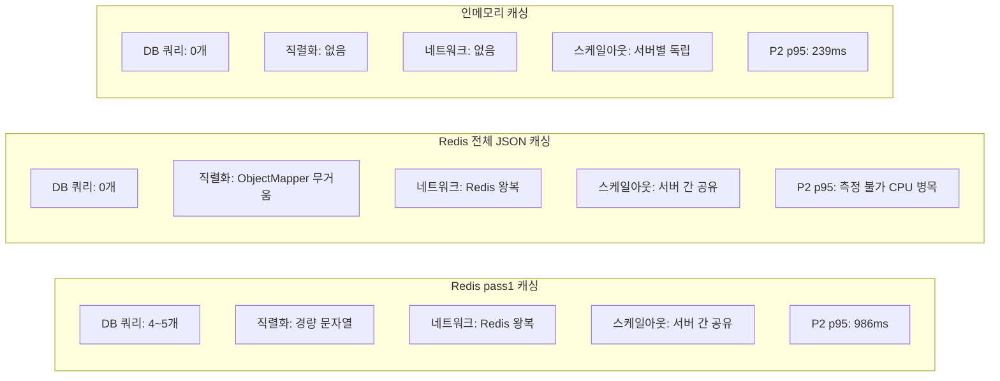

## 개요

[이전 글](/feed-performance-load-test/)에서 피드 도메인의 슬로우 쿼리 29,008건을 잡고 일반 부하 테스트를 통과했다. 하지만 일반 테스트(300VU)는 프로덕션의 피크 트래픽을 반영하지 못한다. 데이터를 5배로 늘리고, 병목 지점을 집중 공격하는 고부하 테스트를 설계했다.

결과적으로 FORCE INDEX 실패, cascading failure, 캐싱 전략 3번 교체를 거쳤다. 이 글은 일반 테스트에서 드러나지 않았던 문제들의 분석과 해결 과정을 정리한다.

---

## 고부하 테스트 설계

### 데이터 스케일업

일반 테스트와 같은 데이터로는 IN절 20개, filesort, lock 경합이 드러나지 않는다. 현실적인 규모로 늘렸다.

데이터를 일반 테스트 대비 약 5배로 확대했다. feed는 100K에서 500K, feed_comment는 531K에서 2.5M, feed_like는 1M에서 5.1M, feed_image는 300K에서 1.5M, user_club은 50만에서 253만(유저당 20+ 클럽)으로 늘렸다.

### 6-Phase 병목 특화 시나리오

일반 테스트가 "전체 기능이 동작하는가"를 검증한다면, 고부하 테스트는 "어디서 병목이 발생하는가"를 검증하는 테스트다.

**P1 (인기피드 CPU 정렬):** 400 VU, `LOG()+TIMESTAMPDIFF()` 매 row 연산을 공격. **P2 (개인피드 IN절 폭발):** 400 VU, 유저당 20+ 클럽이 대형 IN clause로 확장되는 지점을 공격. **P3 (리포스트 + 상세):** 300 VU, JOIN FETCH와 댓글 전체 로드. **P4 (좋아요 동시성):** 300 VU, Redis Lua + DB 스트림 컨슈머 경합. **P5 (혼합 극한):** 400 VU, 읽기와 쓰기를 동시 실행. **P6 (딥 페이지네이션):** 200 VU, page 50~200 구간.

---

## 1차 고부하 결과 — 3대 병목 발견

1순위 병목은 **개인피드 IN절(CRITICAL)** — p95 919ms, 슬로우 쿼리 36,094건. `resolveAccessibleClubIds` 2회 호출과 대형 IN clause가 원인이다. 2순위는 **인기피드 정렬(HIGH)** — p95 567ms, 슬로우 쿼리 9,531건. `LOG()+TIMESTAMPDIFF()` CPU-bound 연산이 문제였다. 3순위는 **혼합 쓰기(MEDIUM)** — p95 554ms. `comment_count++`과 `like_count++`이 같은 feed 행에서 X lock 경합을 일으켰다.

일반 테스트에서는 개인피드 p95가 347ms로 양호했다. 400VU에서 유저당 20개 클럽이 IN절에 들어가면서 옵티마이저가 인덱스를 포기하고 filesort를 선택한 것이다.

---

## 1차 수정 — 6건 일괄 적용

### 댓글 목록 N+1 해결

`FeedCommentService.getCommentList()`에서 `findByFeedOrderByCreatedAt()`을 사용하고 있었다. JOIN FETCH가 없어서 댓글 20개 = 21쿼리.

```java
// 수정 전 — N+1
feedCommentRepository.findByFeedOrderByCreatedAt(feed, pageable)
    .stream().map(c -> FeedCommentResponseDto.from(c, userId))  // c.getUser() → SELECT

// 수정 후 — JOIN FETCH + feedId 직접 사용
feedCommentRepository.findByFeedIdWithUser(feedId, pageable)
```

같은 클래스에 `findByFeedIdWithUser()`(JOIN FETCH 있음)가 이미 존재했지만 사용하지 않고 있었다.

### 피드상세 댓글 전체 로드 제거

`getFeedDetail()`에서 `findByFeedIdWithUser(feedId)`로 **모든 댓글을 로드**하고 있었다. 댓글 수천 개인 피드면 직렬화 비용도 댓글 수에 비례한다.

```java
// 수정 전 — LIMIT 없음
feedCommentRepository.findByFeedIdWithUser(feedId)

// 수정 후 — 최근 20개만
feedCommentRepository.findByFeedIdWithUser(feedId, PageRequest.of(0, 20))
```

### 댓글 트랜잭션 범위 축소

댓글 생성에서 validation(3 SELECT) + 쓰기(UPDATE + INSERT)가 한 트랜잭션이었다. X lock 보유 시간이 validation 시간만큼 늘어난다.

```java
// 수정 전 — @Transactional 하나로 전체 감쌈
@Transactional
public void createComment(...) {
    Club club = clubRepository.findById(clubId);       // SELECT
    Feed feed = feedRepository.findByFeedIdAndClub();   // SELECT
    boolean isMember = userClubRepository.existsBy();   // SELECT
    feedRepository.incrementCommentCount(feedId);       // ← X lock 여기서 잡고
    feedCommentRepository.save(feedComment);            // ← validation 동안 유지
}

// 수정 후 — validation은 트랜잭션 밖, 쓰기만 TransactionTemplate
public void createComment(...) {
    // validation (트랜잭션 밖)
    Club club = clubRepository.findById(clubId);
    Feed feed = feedRepository.findByFeedIdAndClub();
    boolean isMember = userClubRepository.existsBy();

    // INSERT (별도 트랜잭션)
    transactionTemplate.executeWithoutResult(status -> {
        feedCommentRepository.save(feedComment);
    });
    // count UPDATE (별도 트랜잭션 — X lock 최소화)
    transactionTemplate.executeWithoutResult(status -> {
        feedRepository.incrementCommentCount(feedId);
    });
}
```

count UPDATE를 별도 트랜잭션으로 분리하면, X lock 보유 시간이 단일 UPDATE 실행 시간(~1ms)으로 축소된다. 좋아요 `like_count++`과의 lock 경합 시간이 80%+ 감소한다. count 동기화가 실패해도 댓글 자체는 보존되며, `sync_feed_counts` 프로시저로 보정 가능하다.

### 복합 인덱스 추가

```sql
CREATE INDEX idx_feed_comment_feed_created
    ON feed_comment(feed_id, created_at ASC);
```

기존에 `feed_id` 단독 인덱스만 있어서 `ORDER BY created_at`에 별도 filesort가 발생했다.

### 1차 수정 결과

1차 수정으로 피드상세 p95가 970ms에서 89ms로 **91% 감소**, 댓글목록은 614ms에서 76ms로 **88% 감소**, 클럽피드는 440ms에서 58ms로 87% 감소했다. 혼합 읽기는 886ms에서 493ms로 44% 감소, 혼합 쓰기는 810ms에서 554ms로 32% 감소했다.

피드상세·댓글목록은 threshold를 통과했다. 하지만 P2 개인피드 IN절(p95 1,053ms)과 P5 쓰기(p95 554ms)는 여전히 위반이었다.

---

## FORCE INDEX 시도 — p95 29,930ms로 악화

개인피드 쿼리의 근본 문제는 IN clause + ORDER BY + LIMIT 조합에서 옵티마이저가 filesort를 선택하는 것이다. 커버링 인덱스를 만들고 FORCE INDEX로 강제하면 해결될 것으로 판단했다.

```sql
-- 개인피드 전용 커버링 인덱스 (club_id 선행)
CREATE INDEX idx_feed_personal_cover
    ON feed(club_id, deleted, created_at DESC, feed_id, like_count, comment_count);
```

```java
@Query(value = """
    SELECT f.feed_id as feedId, f.like_count as likeCount, f.comment_count as commentCount
    FROM feed f FORCE INDEX (idx_feed_personal_cover)
    WHERE f.club_id IN (:clubIds) AND f.deleted = false
    ORDER BY f.created_at DESC
    """, nativeQuery = true)
List<FeedIdWithCounts> findFeedIdsWithCountsByClubIds(@Param("clubIds") List<Long> clubIds, Pageable pageable);
```

**결과: P2 p95 = 29,930ms, 성공률 0%.**

### 원인

1. `schema.sql`의 인덱스 생성 DDL이 서버 시작 시 실행되지 않았다. `spring.jpa.hibernate.ddl-auto=update` 모드에서는 `spring.sql.init`이 자동 실행되지 않는 경우가 있다.
2. FORCE INDEX는 **인덱스가 존재하지 않으면 에러를 반환**한다. Spring이 이를 500 에러로 변환했고, 400VU가 동시에 500을 받으면서 커넥션 풀이 에러 처리로 포화됐다.
3. 에러 응답이 k6에서 타임아웃으로 집계되면서 p95가 30초까지 치솟았다.

**참고: FORCE INDEX는 인덱스 존재 여부에 대한 런타임 의존성을 만든다. DDL 실행 순서와 결합하면 배포 시점에 장애가 발생할 수 있다.**

FORCE INDEX를 즉시 롤백하고 다른 접근을 택했다.

---

## UNION ALL 청크 분할

IN절의 근본 문제는 `WHERE club_id IN (1, 2, 3, ..., 20+)`에서 옵티마이저가 20개 값에 대해 인덱스 range scan을 각각 수행한 뒤 merge하는 대신 full scan + filesort를 선택하는 것이다.

해결: 클럽 ID를 5개씩 쪼개서 각각 독립 쿼리로 실행 후 앱에서 머지.

```java
private static final int CLUB_CHUNK_SIZE = 5;

@SuppressWarnings("unchecked")
private List<FeedIdWithCounts> findPersonalFeedChunked(List<Long> clubIds, Pageable pageable) {
    int limit = (int) pageable.getOffset() + pageable.getPageSize();
    List<List<Long>> chunks = partitionList(clubIds, CLUB_CHUNK_SIZE);

    // 동적 UNION ALL SQL 생성
    StringBuilder sql = new StringBuilder("SELECT feedId, likeCount, commentCount FROM (");
    Map<String, Object> paramMap = new HashMap<>();

    for (int i = 0; i < chunks.size(); i++) {
        if (i > 0) sql.append(" UNION ALL ");
        sql.append("(SELECT f.feed_id as feedId, f.like_count as likeCount, ")
           .append("f.comment_count as commentCount, f.created_at as createdAt ")
           .append("FROM feed f WHERE f.club_id IN (:c").append(i)
           .append(") AND f.deleted = false ORDER BY f.created_at DESC LIMIT ")
           .append(limit).append(")");
        paramMap.put("c" + i, chunks.get(i));
    }
    sql.append(") t ORDER BY createdAt DESC LIMIT :offset, :pageSize");

    Query query = entityManager.createNativeQuery(sql.toString());
    paramMap.forEach(query::setParameter);
    // ...
}
```

각 서브쿼리는 `club_id IN (5개)` + `ORDER BY created_at DESC LIMIT N`이므로 `(club_id, deleted, created_at)` 인덱스를 정확히 활용한다. 5개 이하일 때는 기존 단일 쿼리를 그대로 사용한다.

### JdbcTemplate → EntityManager 전환

처음에는 `JdbcTemplate`으로 구현했는데, `@Transactional(readOnly = true)` 컨텍스트에서 JdbcTemplate이 별도 커넥션을 사용할 수 있다는 우려와, `query(String, Object[], RowMapper)` deprecated 경고가 있었다. `EntityManager.createNativeQuery()`로 전환하면 같은 트랜잭션 커넥션을 확실히 재사용한다.

**결과: P2 29,930ms → 1,134ms**. 성공률도 0% → 100%로 복구됐다.

---

## 캐싱 전략 3단 진화

UNION ALL로 1초대까지 내렸지만 threshold 500ms에는 아직 부족했다. 캐싱을 도입했는데, 3번의 전략 교체를 거쳤다.

### 1단계 — Redis pass1 캐싱

pass1(피드 ID + count) 결과만 Redis에 캐싱했다. TTL 15초.

```java
String cacheKey = "pf:" + userId + ":" + page + ":" + size;
List<FeedIdWithCounts> pass1 = getCachedPass1(cacheKey);
if (pass1 == null) {
    pass1 = findPersonalFeedChunked(clubIds, pageable);
    cachePass1(cacheKey, pass1);  // "feedId:likeCount:commentCount,..." 경량 문자열
}
return buildOverviewList(pass1, userId);  // ← 여전히 DB 쿼리 4~5개 실행
```

**문제**: pass1 캐시 히트여도 `buildOverviewList`에서 `findByIdsWithRelations`, `findLikedFeedIdsByUser`, `bulkLoadParents`, `bulkLoadRoots`, `countDirectRepostsIn` 등 4~5개 DB 쿼리를 매번 실행했다. 300VU에서 초당 수천 개 쿼리가 커넥션 풀을 소진시켰다.

**결과**: P2 1,134ms → 986ms. 13% 개선에 그쳤다.

### 2단계 — Redis 전체 결과 캐싱 (JSON)

`buildOverviewList` 결과 전체를 JSON으로 Redis에 캐싱했다. 캐시 히트 시 DB 쿼리 0개.

```java
List<FeedOverviewDto> cached = getCachedFeedList(cacheKey);
if (cached != null) return cached;  // DB 0쿼리

List<FeedOverviewDto> result = buildOverviewList(pass1, userId);
cacheFeedList(cacheKey, result);  // ObjectMapper.writeValueAsString()
```

**문제**: `ObjectMapper`의 리플렉션 기반 직렬화/역직렬화가 CPU를 과도하게 소비했다. 400VU 동시 요청에서 JSON 변환이 새로운 CPU 병목이 됐다. 또한 딥 페이지(page 50~200)까지 캐싱하면서 Redis 키가 1000유저 × 200페이지 = 20만 개까지 폭발했고, P6 딥 페이지네이션에서 Redis 리소스 경합이 발생했다.

### 3단계 — 인메모리 ConcurrentHashMap 캐싱

직렬화 비용 0, 네트워크 I/O 비용 0인 JVM 힙 캐싱으로 전환했다.

```java
private static final long RESULT_CACHE_TTL_MS = 10_000;
private static final int MAX_RESULT_CACHE_SIZE = 2_000;

private record CachedResult(List<FeedOverviewDto> data, long expiresAt) {
    boolean isExpired() { return System.currentTimeMillis() > expiresAt; }
}
private static final ConcurrentHashMap<String, CachedResult> resultCache
    = new ConcurrentHashMap<>();
```

10초 TTL, 최대 2000엔트리. 앞쪽 5페이지만 캐싱하여 키 폭발을 방지했다. 캐시 크기 초과 시 만료된 항목을 정리하는 단순한 eviction 정책을 적용했다.

### 캐싱 전략 비교



인메모리 캐시의 단점은 서버 간 공유가 안 된다는 것이다. 하지만 10초 TTL이면 서버별로 각각 DB를 한 번만 치고 이후 캐시에서 응답한다. 현재 단일 서버 구조에서는 문제 없고, 다중 서버 환경에서도 TTL이 짧으면 데이터 불일치가 허용 범위 내에 있다.

---

## Cascading Failure 분석

인메모리 캐싱으로 P1 읽기가 대폭 개선된 뒤, 다른 Phase에서 성능 저하가 발생했다.

인메모리 캐싱 적용 전후 변화를 보면, P1 개인피드 p95는 2,742ms에서 **239ms**로, P1 인기피드 p95는 3,173ms에서 **215ms**로 대폭 개선됐다. 반면 P2 좋아요 p95는 260ms에서 **30,030ms**로, P2 댓글작성 p95는 263ms에서 **30,043ms**로 급격히 악화됐다. P4 피드상세 p95는 60,046ms에서 31,483ms로 일부 개선에 그쳤다.

P1이 빨라지면서 **더 많은 요청을 처리**했고, 그만큼 DB에 쓰기 부하가 집중됐다. P1의 잔여 커넥션이 해제되기 전에 P2가 시작되면서 커넥션 풀이 고갈된 것이다.

### 원인: 좋아요 warmup의 DB 블로킹

`FeedLikeService.toggleLike()`에서 Redis에 캐시가 없으면 `ensureLikeCacheWarmed()`가 **동기적으로** DB에서 전체 좋아요 유저를 로딩했다.

```java
private void ensureLikeCacheWarmed(long feedId) {
    // ...
    List<Long> userIds = feedLikeRepository.findUserIdsByFeedId(feedId);  // ← LIMIT 없음!
    // 인기 피드: 1,536 rows 매번 로딩
    redis.opsForSet().add(likersKey, members);
}
```

200VU가 서로 다른 피드에 대해 동시에 warmup을 하면, 각각이 DB 커넥션을 잡고 수천 row를 읽는다. 커넥션 풀(400)이 순식간에 소진됐다.

### 수정: 비동기 warmup

```java
private static final ExecutorService warmupExecutor = Executors.newFixedThreadPool(2);
private static final Set<Long> warmingUp = ConcurrentHashMap.newKeySet();

private void triggerAsyncWarmup(long feedId) {
    if (Boolean.TRUE.equals(redis.hasKey(countKey))) return;  // 이미 캐시 있음
    if (!warmingUp.add(feedId)) return;  // 이미 워밍업 중

    warmupExecutor.submit(() -> {
        try {
            List<Long> userIds = feedLikeRepository.findUserIdsByFeedId(feedId);
            redis.opsForSet().add(likersKey, members);
            redis.opsForValue().set(countKey, String.valueOf(userIds.size()));
        } finally {
            warmingUp.remove(feedId);
        }
    });
}
```

주요 변경:
- **비동기 실행**: 현재 요청을 블로킹하지 않음. Lua 스크립트는 SET이 없어도 정상 동작(SISMEMBER는 존재하지 않는 key에 0 반환)
- **스레드풀 크기 2**: DB 커넥션 소비를 최대 2개로 제한
- **중복 제출 방지**: `ConcurrentHashMap.newKeySet()`으로 같은 feedId에 대한 중복 warmup 차단

---

## 커넥션 풀 튜닝

고부하 테스트에서 반복적으로 커넥션 풀 고갈이 관찰되어 설정을 조정했다.

### HikariCP

```yaml
spring:
  datasource:
    hikari:
      max-lifetime: 600000      # 30분 → 10분 (MySQL idle timeout 전 갱신)
      minimum-idle: 150          # 100 → 150 (워밍 커넥션 확보)
      connection-timeout: 8000   # 5초 → 8초 (풀 포화 시 대기 여유)
      validation-timeout: 3000   # 추가 (커넥션 유효성 검증)
```

### Redis Pool

```yaml
spring:
  data:
    redis:
      lettuce:
        pool:
          max-active: 256    # 128 → 256
          max-idle: 128      # 64 → 128
          min-idle: 32       # 16 → 32
```

### FeedLikeStreamConsumer

```java
private static final Duration BLOCK_TIMEOUT = Duration.ofSeconds(2);  // 5s → 2s
private static final int BATCH_COUNT = 1;  // 8 → 3 → 1
```

BLOCK_TIMEOUT을 5초에서 2초로 줄여 커넥션 점유 시간을 단축했다. BATCH_COUNT를 1로 줄여 단일 트랜잭션에서 lock하는 feed 행을 최대 1개로 제한했다.

---

## 최종 결과 — 전체 최적화 추이

```mermaid
xychart-beta
    title "p95 응답 시간 변화 (ms)"
    x-axis ["P1 인기피드", "P2 개인피드", "P3 피드상세", "P3 댓글목록", "P5 혼합읽기"]
    y-axis "ms" 0 --> 1000
    bar [567, 919, 970, 614, 886]
    bar [238, 239, 89, 76, 495]
```



최종 결과를 보면, P1 인기피드 p95는 567ms에서 238ms로 58% 감소, P2 개인피드 p95는 919ms에서 239ms로 **74% 감소**, P3 피드상세는 970ms에서 89ms로 91% 감소, P3 댓글목록은 614ms에서 76ms로 88% 감소, P5 혼합 읽기는 886ms에서 495ms로 44% 감소했다. P1 슬로우 쿼리는 14,346건에서 69건으로 **99.5% 감소**했고, 전체 처리량은 353K에서 529K iterations로 **50% 증가**, API 성공률은 94.4%에서 100%로 올랐다.

---

## 정리하며

고부하 테스트는 일반 테스트가 숨기는 문제를 드러낸다. 300VU에서 정상이던 개인피드가 400VU + 유저당 20개 클럽이 되면 IN절이 폭발한다. 단건 API 응답이 189ms여도 동시 요청 300개가 되면 커넥션 풀이 고갈되어 30초 타임아웃이 발생한다.

주요 분석 결과를 정리한다.

**FORCE INDEX는 위험하다.** 인덱스가 DDL 실행 순서에 의존하면, 배포 환경에서 인덱스가 없는 상태로 서버가 뜰 수 있다. 그 순간 FORCE INDEX는 전체 API를 0% 성공률로 만든다. 옵티마이저를 강제하는 대신 쿼리 구조를 바꾸는 것이 더 안전하다.

**캐싱은 한 곳의 문제를 다른 곳으로 옮길 수 있다.** Redis JSON 캐싱은 DB 부하를 CPU 부하로 옮겼다. 딥 페이지 캐싱은 Redis 키 폭발로 P6에서 역으로 성능을 악화시켰다. 캐싱을 도입할 때는 직렬화 비용, 키 설계, TTL을 함께 설계해야 한다.

**Cascading failure는 "개선" 이후에 발생한다.** P1 읽기가 빨라지면 더 많은 요청이 통과하고, 그 뒤의 P2 쓰기에 부하가 집중된다. 개별 Phase를 최적화하면 전체 파이프라인의 부하 분포가 변한다. 각 Phase를 독립적으로 보면 안 된다.

> **단건 응답 시간은 문제의 10%만 보여준다. 나머지 90%는 동시 부하에서 자원을 놓고 경쟁할 때 드러난다.**

---

## 시리즈 탐색

**◀ 이전 글**
[Finance 도메인 — 정산 p95 19.5초를 2.46초로, 배치 UPDATE와 Kafka 비재시도 예외 등록](/finance-settlement-batch-kafka-tuning/)

**▶ 다음 글**
[클럽 도메인 부하 테스트 — Virtual Thread Pinning에 의한 JVM 크래시 분석](/club-load-test-virtual-thread-pinning/)
