## 개요

검색 도메인은 Elasticsearch와 MySQL을 함께 쓰는 구조다.

키워드 검색은 Elasticsearch(nori 한국어 형태소 분석기 + 동의어 + 불용어)를 사용하고, 필터 검색은 MySQL/QueryDSL(관심사, 지역 조건)을 사용한다. 검색 대상은 Club의 name, description 필드다.

엔드포인트는 6개다. 키워드 검색, 관심사/지역 필터, 추천, 내 모임(`my_clubs`), 팀원 클럽(`teammates_clubs`). ES 쪽은 응답 시간이 양호했다. 문제는 MySQL 쪽, 특히 `teammates_clubs`의 다단계 JOIN 쿼리에서 발생했다.

---

## 1차 테스트 — 300VU, 성능 PASS / 정확도 FAIL

Club 20만 건을 ES에 인덱싱한 뒤 첫 부하를 걸었다.

### 성능 지표

키워드 검색(ES)은 p50 27.7ms, p95 187ms로 500ms 임계값 이내(PASS). 필터 검색(MySQL)은 p50 13.98ms, p95 41ms(PASS). 복합 검색은 p50 12.39ms, p95 38ms로 800ms 이내(PASS). 관심사 검색은 p50 22.84ms, p95 227ms(PASS). 지역 검색은 p50 17.14ms, p95 180ms(PASS). 추천은 p50 41.05ms, p95 251ms로 800ms 이내(PASS).

성능은 전 항목 PASS. 다만 두 가지 문제가 있었다.

**병목: 내 모임 조회 (p95 760ms)**

my_clubs는 p50 315ms, p95 760ms였고, teammates_clubs는 p50 42ms, p95 331ms였다.

**정확도: keyword_accuracy FAIL (79.13%)**

synonym_accuracy는 83.47%로 80% 임계값 초과(PASS). keyword_accuracy는 79.13%로 90% 임계값 미달(FAIL). filter_accuracy는 100%로 PASS.

`'축구'` 검색 결과에 `'풋볼'`만 포함된 케이스가 21%였다. ES는 동의어 확장으로 정상 검색했지만, k6의 `containsAny` 매칭 로직이 원본 키워드만 검사해서 발생한 오탐이었다. 검색 자체는 정상 동작하지만 **테스트 검증 로직이 동의어를 고려하지 않는 문제**였다.

---

## 내 모임 병목 분석

```
GET /api/v1/search/user
  └─ SearchService.getMyClubs()
       ├─ ① userService.getCurrentUser()              → SELECT user
       ├─ ② findMyClubsWithMemberCount(userId)        → SELECT uc JOIN club JOIN interest
       ├─ ③ stream.map → ClubResponseDto.from()       → club.getInterest().getCategory()
       └─ ④ existsByUserAndSettlementStatusNot()       → SELECT 1 FROM user_settlement
```

가장 영향이 큰 원인은 `user_settlement` 테이블에 인덱스가 전혀 없어 UserSettlement 엔티티 조회 시 풀스캔이 발생한 것이다. 중간 수준으로는 `user_club` 인덱스 방향 불일치가 있었는데, `(club_id, user_id)` 순서라 user_id 선행 조회가 불가능했다. 마지막으로 `getMyClubs()`에만 캐싱이 미적용된 것도 중간 영향도였다.

`user_settlement` 테이블에 인덱스가 전혀 없었다. `existsByUserAndSettlementStatusNot`이 `(user_id, status)` 조합으로 검색하는데 풀스캔이 발생했다.

Interest N+1은 아니었다. `findMyClubsWithInterest`에서 `join fetch c.interest`로 이미 EAGER 로딩하고 있어서 `club.getInterest().getCategory()` 호출 시 추가 쿼리는 없었다.

---

## 1차 수정 — 3건 일괄 적용

### my_clubs N+1 해결

`findMyClubsWithMemberCount`가 `select c, (select count(uc2) ...)` 형태로 `Object[]`를 반환하고 있었다. Interest를 JOIN하지 않아서, 이후 `club.getInterest().getCategory()` 호출 시 Interest LAZY 로딩이 발생했다. 또한 `memberCount` 비정규화 컬럼이 있는데 매번 상관 서브쿼리로 COUNT를 계산하고 있었다.

```java
// 수정 전 — Object[] 반환, Interest N+1, 상관 서브쿼리 COUNT
@Query("select c, (select count(uc2) from UserClub uc2 where uc2.club = c) from UserClub uc join uc.club c where uc.user.userId = :userId")
List<Object[]> findMyClubsWithMemberCount(Long userId);

// 수정 후 — entity 반환 + join fetch, memberCount 컬럼 활용
@Query("SELECT uc FROM UserClub uc JOIN FETCH uc.club c JOIN FETCH c.interest WHERE uc.user.userId = :userId")
List<UserClub> findMyClubsWithInterest(Long userId);
```

### teammates_clubs 쿼리 최적화 — 5쿼리 → 3쿼리

`findClubsByTeammates`에서 Step 3의 2개 쿼리(내 클럽 ID + 팀원 클럽 ID)와 in-memory 필터링을 NOT IN 서브쿼리 1개로 통합했다. 최종 클럽 조회에서 `join(club.interest).fetchJoin()`을 추가해 Interest N+1도 제거했다. `executeClubQuery()`에도 동일하게 적용해 추천/관심사/지역 검색도 개선했다.

### k6 정확도 로직 수정

동의어 맵을 구성해 원본 키워드의 동의어가 결과에 포함돼도 정확도 체크를 통과하도록 수정했다.

```js
const synonymMap = { '축구': ['풋볼', 'soccer', '축구'], ... };

function keywordOrSynonymFound(results, keyword) {
  const targets = synonymMap[keyword] ?? [keyword];
  return results.some(r => targets.some(t => r.name.includes(t)));
}
```

### 인덱스 추가

```java
// UserSettlement.java — settlement 존재 확인 풀스캔 제거
@Table(indexes = @Index(name = "idx_user_settlement_user_status", columnList = "user_id, status"))

// UserClub.java — user_id 단독 조회 커버링 인덱스
@Index(name = "idx_user_club_user", columnList = "user_id")
```

> `uk_user_club (user_id, club_id)` Unique Constraint가 이미 있어서 user_id 기반 조회 자체는 가능했다. 주요 병목은 `user_settlement` 인덱스 부재였다.

### 1차 수정 결과

1차 수정 결과, ES 키워드 p95는 187ms에서 115ms로 38% 감소, 추천 p95는 251ms에서 150ms로 40% 감소, 내 모임 p95는 760ms에서 494ms로 35% 감소, Teammates p95는 331ms에서 195ms로 41% 감소했다. keyword_accuracy는 79.13%(FAIL)에서 94.8%(PASS)로 해결됐고, 전체 Threshold **11/11 PASS**를 달성했다.

---

## 스트레스 테스트 — 500VU에서 threshold 초과

데이터 규모를 키웠다. user_club을 유저당 20~50개로 확대해 전체 280만 건, user_settlement 5만 건+. 7-Phase, 500VU, 21분 스트레스 테스트를 설계했다.

### 결과 — 대량 FAIL

teammates_clubs가 p95 **11.08초**로 1,200ms 임계값을 크게 초과(FAIL). recommend는 p95 4.06초(FAIL), my_clubs는 p95 2.08초(FAIL), keyword_search는 p95 1.05초(FAIL), interest_search는 p95 1.48초(FAIL), location_search는 p95 1.21초(FAIL), spike는 p95 3.49초(FAIL), peak는 p95 1.95초(FAIL). 에러율만 0.28%로 5% 이내(PASS).

`teammates_clubs`가 p95 11초로 가장 높은 지연을 보였다. 성공률 80%, 5xx 에러 664건이 전부 이 API에 집중됐다.

---

## teammates_clubs 병목 분석

`ClubRepositoryImpl.findClubsByTeammates`의 쿼리 흐름을 분석했다.

```
Step 1: 내 최근 10개 모임               → 440건 중 10건 (OK)
Step 2: 10개 모임의 팀원 ID 조회         → 1,205명 중 LIMIT 100
Step 3: 100명의 모든 모임에서 내 모임 제외  → 13,333개 club_id (LIMIT 없음!)
Step 4: IN(13,333개) club JOIN interest  → 대량 IN절
```

**원인: Step 3에 LIMIT이 없었다.** 100명 × 유저당 280개 모임 = ~28,000건을 스캔해서 DISTINCT 후 13,333개 club_id를 메모리에 올린 뒤, Step 4에서 `IN(13,333)` 대량 IN절을 날리고 있었다.

### 1차 시도 — Step 3+4 통합, fetchJoin+groupBy

Step 3과 Step 4를 단일 QueryDSL 쿼리로 합쳤다. `user_club JOIN club JOIN interest + NOT IN 서브쿼리 + GROUP BY + ORDER BY + LIMIT`을 한 번에 실행하는 구조.

```java
return queryFactory
    .select(club)
    .from(theirClubs)
    .join(club).on(club.clubId.eq(theirClubs.club.clubId))
    .join(club.interest).fetchJoin()
    .where(
        theirClubs.user.userId.in(teammateIds)
            .and(theirClubs.club.clubId.notIn(
                JPAExpressions.select(excl.club.clubId)
                    .from(excl).where(excl.user.userId.eq(userId))
            ))
    )
    .groupBy(club.clubId)
    .orderBy(club.memberCount.desc(), club.createdAt.desc())
    .offset(pageable.getOffset())
    .limit(pageable.getPageSize())
    .fetch();
```

**결과: p95 11.08s → 16.37s. 오히려 악화.**

`fetchJoin`과 `groupBy`를 함께 쓰면 Hibernate가 카르테시안 곱을 생성할 수 있다. `from(theirClubs).join(club)` 구조에서 `fetchJoin`이 중복 결과를 만들고, `groupBy`가 이를 다시 정리하느라 비효율적이었다.

### 2차 시도 — 2-step 유지, Step 3에 LIMIT + 정렬

fetchJoin+groupBy 통합을 포기하고, 기존 2-step 구조를 유지하되 Step 3에 `ORDER BY member_count DESC LIMIT 200`을 추가했다.

```java
// DISTINCT + ORDER BY member_count 조합에서 에러 발생
// MySQL: "ORDER BY not in SELECT list"
```

`DISTINCT`와 `ORDER BY member_count`를 함께 쓰면 MySQL에서 SELECT list에 없는 컬럼으로 정렬할 수 없다. `DISTINCT → groupBy`로 전환해 해결했다.

```java
.select(theirClubs.club.clubId)
// .distinct() 제거
.groupBy(theirClubs.club.clubId)
.orderBy(club.memberCount.desc())
.limit(200)
```

**결과: 16/18 PASS. teammates_clubs p95 = 2,650ms (FAIL), my_clubs p95 = 1,050ms (FAIL).**

개선은 됐지만 여전히 threshold를 넘었다. 팀원 수 제한도 100 → 30으로 축소했지만 부족했다.

---

## 최종 수정 — Step 3 근본 재설계

EXPLAIN ANALYZE로 Step 3의 실행계획을 확인했다.

```sql
SELECT uc1_0.club_id FROM user_club uc1_0
JOIN club c1_0 ON c1_0.club_id = uc1_0.club_id
WHERE uc1_0.user_id IN (30명)
  AND uc1_0.club_id NOT IN (
    SELECT uc2_0.club_id FROM user_club uc2_0 WHERE uc2_0.user_id = ?
  )
GROUP BY uc1_0.club_id
ORDER BY c1_0.member_count DESC
LIMIT 200;
```

```
Using where; Using index; Using temporary; Using filesort
단일 실행: 37ms / 500 VU 동시: 타임아웃
```

세 가지 문제가 있었다.

1. **club 테이블 JOIN이 불필요했다.** `member_count` 정렬만을 위해 14,445번 nested loop를 돌았다. Step 4에서 이미 동일한 정렬을 수행하므로 Step 3의 정렬은 중복이었다.
2. **NOT IN 서브쿼리가 비효율적이었다.** 매 행마다 서브쿼리를 평가했다.
3. **GROUP BY + ORDER BY 조합이 filesort를 유발했다.** 단독 실행은 37ms지만 500 VU 동시에 temporary table과 filesort가 메모리/CPU 자원을 경합했다.

### 수정 내용

```java
// 수정 전 — club JOIN + NOT IN + GROUP BY + ORDER BY
List<Long> filteredClubIds = queryFactory
    .select(theirClubs.club.clubId)
    .from(theirClubs)
    .join(club).on(club.clubId.eq(theirClubs.club.clubId))  // ← 불필요
    .where(
        theirClubs.user.userId.in(teammateIds)
            .and(theirClubs.club.clubId.notIn(              // ← NOT IN
                JPAExpressions.select(excl.club.clubId)
                    .from(excl).where(excl.user.userId.eq(userId))
            ))
    )
    .groupBy(theirClubs.club.clubId)                         // ← filesort
    .orderBy(club.memberCount.desc())
    .limit(200)
    .fetch();

// 수정 후 — club JOIN 제거 + NOT EXISTS + DISTINCT
List<Long> filteredClubIds = queryFactory
    .select(theirClubs.club.clubId).distinct()
    .from(theirClubs)
    // club JOIN 제거 — 정렬은 Step 4에서 수행
    .where(
        theirClubs.user.userId.in(teammateIds)
            .and(JPAExpressions
                .selectOne().from(excl)
                .where(excl.user.userId.eq(userId)
                    .and(excl.club.clubId.eq(theirClubs.club.clubId)))
                .notExists())                                // ← NOT EXISTS
    )
    .limit(200)
    .fetch();
```

### 실행계획 비교

실행 시간은 37ms에서 0.6ms로 **62배** 개선됐다. 스캔 행은 14,445에서 737로 95% 감소하고, filesort는 제거됐으며, club 테이블 접근도 14,445 loops에서 0으로 완전히 제거됐다.

**DISTINCT vs GROUP BY**: MySQL에서 DISTINCT는 covering index만으로 중복 제거가 가능해 temporary table을 피한다. GROUP BY는 항상 temporary table을 생성한다. 정렬이 필요 없는 중복 제거라면 DISTINCT가 효율적이다.

**NOT EXISTS vs NOT IN**: NOT IN은 서브쿼리를 매 행마다 평가한다. NOT EXISTS는 MySQL이 materialized subquery로 최적화해 antijoin 처리한다.

---

## 최종 결과

```mermaid
xychart-beta
    title "teammates_clubs 최적화 전후 p95 (ms)"
    x-axis ["teammates_clubs", "my_clubs", "recommend", "keyword"]
    y-axis "ms" 0 --> 2700
    bar [2650, 1050, 744, 352]
    bar [255, 820, 222, 291]
```



teammates_clubs p95는 2,650ms(FAIL)에서 255ms로 **90.4% 감소**, p50은 71ms에서 20ms로 72% 감소, avg는 415ms에서 57ms로 86% 감소했다. my_clubs p95는 1,050ms(FAIL)에서 820ms(PASS)로 22% 감소, recommend p95는 744ms에서 222ms로 70% 감소, keyword p95는 352ms에서 291ms로 17% 감소했다.

전체적으로 Threshold는 16/18 PASS에서 **18/18 PASS**로 완전 통과, 총 요청은 733,772건에서 940,356건으로 28% 증가, 처리량은 555 req/s에서 707 req/s로 27% 증가, 5xx 에러는 129건에서 **0건**으로 완전 해소, http_req p95는 615ms에서 387ms로 37% 감소했다.

---

## 정리하며

**단독 실행이 빠르다고 부하 테스트를 건너뛰면 안 된다.** Step 3은 단독으로 37ms였다. 500 VU 동시 접근에서 타임아웃이 난다. `Using temporary; Using filesort`는 단독에서는 괜찮지만, 동시 접근이 늘면 메모리와 CPU 자원 경합이 발생한다. 고부하 환경에서만 드러나는 경합이 있다.

**불필요한 정렬을 하고 있었다.** Step 3의 `ORDER BY member_count DESC`는 Step 4에서 이미 수행하는 정렬을 중복으로 하고 있었다. 그 정렬을 위해 club 테이블을 14,445번 JOIN하고 있었다. 정렬 결과가 Step 4에서 덮어씌워지니 처음부터 의미 없는 JOIN이었다.

**중간 결과셋 크기가 근본 원인이다.** 13,333개 club_id를 메모리에 올린 뒤 `IN(13,333)`을 날리는 구조였다. NOT EXISTS로 DB 레벨에서 antijoin 처리하고 DISTINCT + LIMIT으로 early termination을 걸자 0.6ms로 떨어졌다.

> **중간 결과셋이 크다는 건 DB가 할 일을 애플리케이션이 떠맡고 있다는 신호다.**

---

## 수정 내역 요약

수정 1: `findMyClubsWithMemberCount`를 `findMyClubsWithInterest`(JOIN FETCH)로 변경하여 Interest N+1 제거. 수정 2: `user_settlement` 인덱스 `(user_id, status)` 추가로 풀스캔 제거. 수정 3: `user_club` 인덱스 `(user_id)` 추가로 단독 조회 커버링. 수정 4: teammates_clubs Step 3+4 통합으로 5쿼리에서 3쿼리로 감소. 수정 5: k6 동의어 맵 구축으로 keyword_accuracy 79%에서 95%로 개선. 수정 6: 팀원 수 제한을 100에서 30으로 축소하여 스캔 범위 70% 감소. 수정 7: Step 3에서 club JOIN 제거 + NOT IN을 NOT EXISTS로 + GROUP BY를 DISTINCT로 전환하여 **p95 2,650ms에서 255ms로 개선**.

---

## 시리즈 탐색

**◀ 이전 글**
[클럽 도메인 부하 테스트 — Virtual Thread Pinning에 의한 JVM 크래시 분석](/club-load-test-virtual-thread-pinning/)

**▶ 다음 글**
[채팅 도메인 — Storage 추상화, WHERE IN 풀스캔, WebSocket 1,000VU 극한 테스트](/chat-storage-websocket-extreme-test/)
