## 개요

검색 쿼리 최적화로 18/18 전 구간 PASS를 달성한 뒤, 다음 과제가 남아 있었다. 검색 엔진이 Elasticsearch에 직접 결합돼 있어서, ES 장애 시 검색 기능 전체가 죽는 구조였다. 두 가지를 해결해야 했다.

1. **검색 엔진을 교체 가능하게 추상화한다.** ES가 내려가도 MySQL FULLTEXT로 fallback할 수 있는 구조.
2. **ES와 MySQL FULLTEXT의 실제 성능 차이를 정량 비교한다.** 정량적 데이터로 판단한다.

---

## Search Port/Adapter Architecture

검색 엔진을 추상화하기 위해 Port/Adapter 패턴을 적용했다.

### SearchPort 인터페이스

```java
public interface SearchPort {
    List<ClubSearchResult> searchByKeyword(String keyword, Pageable pageable);
    List<ClubSearchResult> searchByKeywordAndLocation(String keyword, String location, Pageable pageable);
    List<ClubSearchResult> searchByKeywordAndInterest(String keyword, Long interestId, Pageable pageable);
    List<ClubSearchResult> searchByKeywordWithFilters(String keyword, String location, Long interestId, Pageable pageable);
}
```

`ClubSearchResult`는 검색 엔진에 무관한 공통 결과 record다. ES의 `SearchHit`이든 MySQL의 `ResultSet`이든 이 record로 변환해서 반환한다.

```java
public record ClubSearchResult(
    Long clubId,
    String name,
    String description,
    double score
) {}
```

### Adapter 구현

두 개의 Adapter를 만들었다.

`ElasticsearchSearchAdapter`는 ES nori 기반 키워드 검색을 담당하며 기본값(default)이다. `MysqlFulltextSearchAdapter`는 MySQL FULLTEXT + MATCH AGAINST를 담당하며 fallback용이다.

### 런타임 엔진 전환

`application.yml`의 `app.search.engine` property로 전환한다.

```yaml
app:
  search:
    engine: elasticsearch  # 또는 mysql
```

```java
@Configuration
public class SearchConfig {

    @Bean
    @ConditionalOnProperty(name = "app.search.engine", havingValue = "elasticsearch", matchIfMissing = true)
    public SearchPort elasticsearchSearchAdapter(ElasticsearchClient client) {
        return new ElasticsearchSearchAdapter(client);
    }

    @Bean
    @ConditionalOnProperty(name = "app.search.engine", havingValue = "mysql")
    public SearchPort mysqlFulltextSearchAdapter(ClubRepository clubRepository) {
        return new MysqlFulltextSearchAdapter(clubRepository);
    }
}
```

`SearchService`는 `SearchPort`만 의존한다. ES client를 직접 주입받던 코드가 사라졌다.

```java
@Service
@RequiredArgsConstructor
public class SearchService {

    private final SearchPort searchPort;  // ES든 MySQL이든 동일한 인터페이스

    public List<ClubResponseDto> searchByKeyword(String keyword, Pageable pageable) {
        List<ClubSearchResult> results = searchPort.searchByKeyword(keyword, pageable);
        // 공통 후처리 로직
        return toResponseDtos(results);
    }
}
```

---

## Data Quality Issue

Port/Adapter 구조를 완성하고 MySQL FULLTEXT 테스트를 시작하자마자 문제가 터졌다. 한글 검색이 전혀 작동하지 않았다.

### 원인: Double-encoded UTF-8

Club 20만 건의 `name`, `description` 데이터가 이중 인코딩돼 있었다. UTF-8 바이트 시퀀스가 Latin-1로 해석된 뒤 다시 UTF-8로 저장된 상태였다.

```
정상:   "축구 동호회"  → E1 84 8E E1 85 AE ...  (UTF-8)
실제 DB: "축구 ë™í˜¸íšŒ" → C3 AC C2 B6 95 ...  (Latin-1 해석된 UTF-8)
```

`character_set_client=latin1`이 근본 원인이었다. 클라이언트가 UTF-8로 보낸 바이트를 MySQL이 Latin-1으로 해석하면서 바이트 단위로 깨진 채 저장됐다.

ES는 인덱싱 시 자체 UTF-8 처리를 하므로 문제가 드러나지 않았다. MySQL FULLTEXT의 `MATCH AGAINST`는 실제 저장된 바이트를 그대로 비교하므로 한글 매칭이 불가능했다.

### 해결

20만 건의 깨진 데이터를 정상 UTF-8 seed 데이터로 전량 교체했다. `character_set_client`를 `utf8mb4`로 고정한 뒤 재삽입했다.

---

## ES Performance Tuning

MySQL FULLTEXT와 비교하기 전에, ES 자체의 성능부터 최적화해야 했다. 초기 ES 부하 테스트에서 spike 구간 p95가 14.56초까지 치솟았다. 4가지를 수정했다.

### 1. ES Docker 리소스 확대

```yaml
# docker-compose.yml
elasticsearch:
  environment:
    - "ES_JAVA_OPTS=-Xms1g -Xmx1g"
  deploy:
    resources:
      limits:
        cpus: "3"
        memory: 3G
```

기본 설정(heap 256m, CPU/memory 제한 없음)에서 heap 1g, CPU 3코어, memory 3G로 명시적으로 할당했다. ES는 Lucene segment merge와 GC에 자원을 많이 쓰므로 heap과 시스템 메모리를 1:1 이상으로 유지해야 한다.

### 2. ES RestClient Connection Pool 확대

```java
@Bean
public RestClient restClient() {
    return RestClient.builder(HttpHost.create(esHost))
        .setHttpClientConfigCallback(httpClientBuilder ->
            httpClientBuilder
                .setMaxConnTotal(200)
                .setMaxConnPerRoute(200)
                .setKeepAliveStrategy((response, context) -> 30_000)
        )
        .setRequestConfigCallback(requestConfigBuilder ->
            requestConfigBuilder
                .setConnectTimeout(5_000)
                .setSocketTimeout(30_000)
        )
        .build();
}
```

기본 connection pool이 25개여서 고부하 시 connection 대기가 발생했다. 200개로 확대하고 timeout을 명시적으로 설정했다.

### 3. CompletableFuture executor 전환

```java
// 수정 전 — ForkJoinPool.commonPool()
CompletableFuture.supplyAsync(() -> searchPort.searchByKeyword(keyword, pageable));

// 수정 후 — 전용 executor
CompletableFuture.supplyAsync(
    () -> searchPort.searchByKeyword(keyword, pageable),
    customAsyncExecutor
);
```

`CompletableFuture`의 기본 executor인 `ForkJoinPool.commonPool()`은 CPU 코어 수 - 1개의 thread만 갖는다. ES I/O 대기가 길어지면 thread가 고갈되면서 다른 비동기 작업까지 블로킹된다. 전용 `customAsyncExecutor`로 분리했다.

### 4. Class-level @Transactional 제거

```java
// 수정 전
@Service
@Transactional(readOnly = true)  // 클래스 레벨
public class SearchService { ... }

// 수정 후
@Service
public class SearchService {

    @Transactional(readOnly = true)  // 메서드 레벨, 필요한 곳만
    public List<ClubResponseDto> getMyClubs(Long userId) { ... }

    // ES 검색 메서드에는 @Transactional 없음
    public List<ClubResponseDto> searchByKeyword(String keyword, Pageable pageable) { ... }
}
```

클래스 레벨 `@Transactional(readOnly = true)`이 ES 검색 메서드에도 적용되면서, ES 호출 동안 DB connection을 불필요하게 점유하고 있었다. ES 검색은 DB를 사용하지 않으므로 transaction이 필요 없다. 메서드 레벨로 전환해 DB connection 점유 시간을 줄였다.

### 튜닝 결과

Spike p95가 14.56초에서 **261ms**로 개선됐다.

4가지 변경으로 spike p95가 14.56초에서 261ms로 개선됐다.

---

## ES Final Results (29/29 PASS)

ES 튜닝 완료 후 전체 부하 테스트를 수행했다. 7-Phase, 600VU spike 포함, 29개 threshold 기준.

단일 키워드 검색 p95 29ms(PASS), 복합 키워드 검색 p95 52ms(PASS), 키워드+지역 검색 p95 32ms(PASS), 키워드+관심사 검색 p95 28ms(PASS), 키워드+전체 필터 p95 22ms(PASS), 필터 전용(MySQL) p95 25ms(PASS), Spike(600VU) p95 261ms(PASS).

Threshold **29/29 PASS**, 총 요청 1,029,459건, 5xx 에러 **0건**.

---

## ES vs MySQL FULLTEXT Comparison

동일한 k6 시나리오, 동일한 데이터(20만 건 Club, 정상 UTF-8), 동일한 인프라에서 `app.search.engine`만 바꿔서 테스트했다.

### 성능 비교

```mermaid
xychart-beta
    title "ES vs MySQL FULLTEXT p95 (ms)"
    x-axis ["단일 키워드", "복합 키워드", "키워드+전체필터", "Spike 600VU"]
    y-axis "ms" 0 --> 10000
    bar [29, 52, 22, 261]
    bar [164, 4780, 5190, 9220]
```



단일 키워드에서 ES p95 29ms, MySQL FULLTEXT p95 164ms로 ES가 5.7배 빠르다. 복합 키워드에서는 ES 52ms, MySQL 4.78초로 92배 차이. 키워드+전체 필터에서는 ES 22ms, MySQL 5.19초로 236배 차이. Spike(600VU)에서는 ES 261ms, MySQL 9.22초로 35배 차이다.

### 안정성 비교

Elasticsearch는 Threshold 29/29 PASS, 5xx 에러 0건, 총 요청 1,029,459건이다. MySQL FULLTEXT는 Threshold 23/29(6 FAIL), 5xx 에러 73건, 총 요청 441,234건이다.

ES는 전 구간 PASS에 에러 0건. MySQL FULLTEXT는 6개 구간 FAIL에 73건의 5xx 에러가 발생했다.

### MySQL FULLTEXT 병목 분석

MySQL FULLTEXT가 느린 이유는 구조적이다.

**MATCH AGAINST + ORDER BY relevance = full table scan**

```sql
SELECT c.club_id, c.name, c.description,
       MATCH(c.name, c.description) AGAINST('축구 동호회' IN BOOLEAN MODE) AS relevance
FROM club c
WHERE MATCH(c.name, c.description) AGAINST('축구 동호회' IN BOOLEAN MODE)
ORDER BY relevance DESC
LIMIT 20;
```

`MATCH AGAINST`는 FULLTEXT 인덱스를 활용해 대상 행을 필터링한다. 여기까지는 빠르다. 문제는 `ORDER BY relevance`다. `relevance`는 계산 컬럼이므로 인덱스 정렬이 불가능하다. MySQL은 FULLTEXT 인덱스로 필터링한 결과 전체를 temporary table에 올린 뒤 filesort를 수행한다.

단일 키워드에서는 매칭 행이 적어 164ms로 기능적으로 문제없다. 복합 키워드(`'축구 동호회 서울 주말'`)에서는 OR 확장으로 매칭 행이 급증하면서 4-5초까지 치솟는다. 필터 조건(지역, 관심사)이 추가되면 JOIN까지 겹쳐 5초를 넘긴다.

**HikariCP Connection 경합**

MySQL FULLTEXT 검색이 4-5초씩 connection을 점유하면서 HikariCP pool이 고갈됐다. 필터 전용 검색(ES와 무관한 순수 MySQL 쿼리)까지 connection 대기에 밀려 연쇄적으로 느려졌다. 5xx 에러 73건은 전부 connection timeout이었다.

**ES와의 구조적 차이**

구조적 차이를 보면, Elasticsearch는 inverted index(term에서 doc으로)를 사용하고 BM25 score로 인덱스 내 정렬이 가능하며, 형태소 분석 후 term 조합으로 복합 키워드를 처리하고, 별도 프로세스로 리소스가 격리된다. MySQL FULLTEXT는 B-tree 기반 FULLTEXT index를 사용하며, 계산 컬럼에 대한 filesort로 정렬하고, BOOLEAN MODE OR 확장으로 복합 키워드를 처리하며, DB connection을 공유한다.

ES는 inverted index에서 BM25 score 계산과 정렬을 인덱스 레벨에서 처리한다. MySQL은 FULLTEXT 인덱스로 필터링만 하고 정렬은 별도 filesort로 처리한다. 이 차이가 복합 키워드에서 92배, 필터 조합에서 236배 격차로 나타난다.

---

## 결론

### 단일 키워드: MySQL FULLTEXT도 쓸 만하다

164ms면 사용자 체감상 문제없는 수준이다. ES 인프라를 운영할 여력이 없는 소규모 서비스라면 MySQL FULLTEXT로 충분히 시작할 수 있다.

### 복합 키워드 + 필터: ES 도입이 필요하다

92배, 236배 차이는 튜닝으로 메울 수 있는 수준이 아니다. MySQL FULLTEXT의 `MATCH AGAINST + ORDER BY relevance` 구조가 갖는 근본적 한계다. 복합 검색이 주요 유스케이스라면 ES를 도입해야 한다.

### Port/Adapter가 fallback을 자연스럽게 만든다

`app.search.engine=mysql`로 전환하면 ES 없이 MySQL FULLTEXT로 검색이 작동한다. 검색 품질은 떨어지지만 서비스는 유지된다. ES 장애 시 자동 전환을 구현하려면 Circuit Breaker를 `SearchPort` 앞에 두면 된다. 추상화가 없었다면 ES 장애 = 검색 장애였다.

정상 운영 시에는 Elasticsearch를 사용한다(29/29 PASS, p95 22-52ms). ES 장애 시에는 MySQL FULLTEXT로 fallback하여 서비스를 유지한다(단일 키워드 164ms). ES 인프라가 없는 환경에서도 MySQL FULLTEXT가 단순 키워드 검색에 한해 실용적이다.

---

## 시리즈 탐색

**◀ 이전 글**
[피드 도메인 — Storage 추상화, Lua Script 분석, 3-Backend 비교 테스트](/feed-storage-abstraction-lua-script-backend-comparison/)

**▶ 다음 글**
[React 프론트엔드 최적화 — memo, 코드 스플리팅, ErrorBoundary](/react-frontend-optimization-memo-splitting/)

