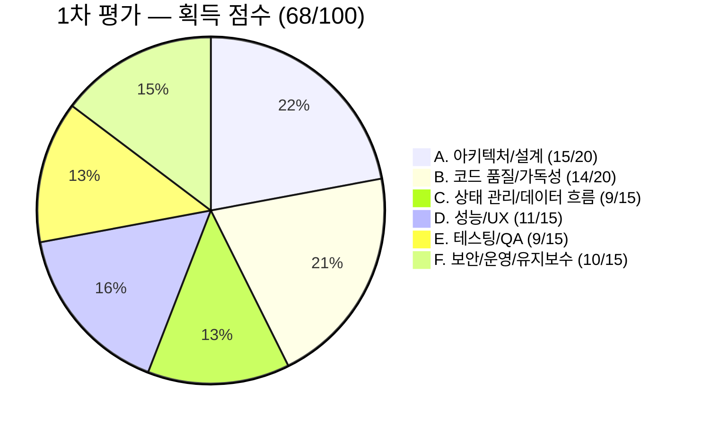

## 개요

[이전 글](/react-deep-review-token-race-sse-leak/)에서 Critical 버그 4건을 수정하고 테스트를 149건으로 확대했다. 이번에는 LLM에 코드 품질을 6개 영역 100점 만점으로 정량 평가를 요청했다.

결과는 **C등급 68점**. 서버 상태 관리(2/5), 코드 중복(3/5), 미사용 코드(3/5)가 주요 감점이었다. ESLint 에러 정리, React Query 도입, 대형 컴포넌트 분리를 거쳐 **B등급 82점**으로 개선했다.

---

## 1차 평가 — C등급 (68/100)



### 주요 감점

**서버 상태 관리 (2/5)**: React Query/SWR 미사용. 모든 서버 데이터가 `useState` + `useEffect`로 수동 관리. 캐싱 없음, stale-while-revalidate 없음, 중복 요청 방지 없음. 매 페이지 진입마다 무조건 새 요청이 발생했다.

**코드 중복 (3/5)**: 날짜 포맷 함수가 CommentSection, FeedList, MeetingFeedDetail 3곳에서 거의 동일하게 반복. 이미지 캐러셀 로직도 FeedList와 MeetingFeedDetail에서 중복. 모든 페이지에서 `useEffect` + `fetch` + `loading`/`error` 상태 패턴이 반복됐다.

**미사용 코드 (3/5)**: ESLint no-unused-vars 에러 27건. `navigate`, `activeTab`, `chatRoomName`, `showModal` 등 선언만 하고 사용하지 않는 변수/import가 상당수 잔존.

**프로덕션 준비도 (3/5)**: console.error 61건이 프로덕션 빌드에 그대로 포함. 환경변수 validation 없음.

---

## 즉시 수정 — Low-hanging Fruit

### ESLint 111 errors → 0

- `any` 57건 → `unknown`, 구체적 타입, `Record<string, unknown>` 등으로 전환
- 미사용 변수/import 27건 제거
- `require()` → `eslint-disable` 처리 (Jest mock 패턴)
- react-refresh 경고 → `eslint-disable` (표준 패턴)

### npm audit fix

vite 관련 취약점 11건 → 0건.

### console.* 프로덕션 제거

`vite.config.ts`에 `esbuild.drop: ['console', 'debugger']`를 설정해 프로덕션 빌드에서 console 호출을 자동으로 제거했다.

---

## React Query 도입

`useState` + `useEffect` 수동 패턴을 `@tanstack/react-query`로 전환했다.

### 커스텀 훅 6개

- **`useFeeds`** (FeedList) — feeds + like 낙관적 업데이트 + delete + refeed
- **`useSchedules`** (ScheduleList) — schedules + join/leave/delete/settlement
- **`useChatRoom`** (ChatRoom) — messages + cursor pagination + delete 낙관적
- **`useNotifications`** (Notice) — notifications + delete 낙관적
- **`useSearch`** (Search) — useInfiniteQuery with filters
- **`useParticipation`** (ParticipationStatus) — participants/settlements

### QueryClient 설정

```typescript
const queryClient = new QueryClient({
  defaultOptions: {
    queries: {
      staleTime: 5 * 60 * 1000,   // 5분
      gcTime: 10 * 60 * 1000,     // 10분
      retry: 1,
    },
  },
});
```

### 낙관적 업데이트

좋아요와 삭제에 낙관적 업데이트 + 롤백 패턴을 적용했다. UI가 즉시 반영되고, API 실패 시 이전 상태로 롤백된다.

WebSocket 메시지는 `queryClient.setQueryData`로 캐시에 직접 주입한다. REST로 초기 데이터를 로드하고, WebSocket으로 실시간 메시지를 캐시에 추가하는 구조다.

---

## 대형 컴포넌트 분리

- **FeedList.tsx**: 620줄 → 350줄. 비즈니스 로직을 `useFeeds.ts`로 추출
- **ScheduleList.tsx**: 540줄 → 400줄. 비즈니스 로직을 `useSchedules.ts`로 추출
- **ChatRoom.tsx**: 418줄 → 300줄. 비즈니스 로직을 `useChatRoom.ts`로 추출

비즈니스 로직(데이터 fetch, mutation, 상태 관리)을 커스텀 훅으로 추출하고, 페이지 컴포넌트는 UI 렌더링에 집중하도록 분리했다.

---

## 재평가 — B등급 (82/100)

```mermaid
xychart-beta
    title "영역별 점수 변화 (이전 → 현재)"
    x-axis ["A.아키텍처(20)", "B.코드품질(20)", "C.상태관리(15)", "D.성능/UX(15)", "E.테스트(15)", "F.보안/운영(15)"]
    y-axis "점수" 0 --> 20
    bar [15, 14, 9, 11, 9, 10]
    bar [18, 17.5, 13, 12, 10, 11.5]
```



영역별 변화: A. 아키텍처/설계 15→18(+3), B. 코드 품질/가독성 14→17.5(+3.5), C. 상태/데이터 흐름 9→13(**+4**), D. 성능/UX 11→12(+1), E. 테스트/품질보증 9→10(+1), F. 보안/운영/유지보수 10→11.5(+1.5). 합계 **68→82(+14)**.

가장 높은 향상 폭을 보인 영역은 **상태 관리 / 데이터 흐름**(+4)이었다. React Query 도입으로 서버 상태 관리가 2/5 → 4.5/5로 올랐다. 캐싱, 중복 요청 방지, 낙관적 업데이트가 한 번에 해결됐다.

게이트 검증 결과:

- **tsc --noEmit**: 0 errors → 0 errors (유지)
- **ESLint**: 122 problems (111 errors) → 0 errors, 8 warnings
- **Jest**: 146/149 pass (3 failed) → 149/149 pass (0 failed)
- **npm audit**: 11 vulnerabilities → 0 vulnerabilities

---

## 최종 push — B→A 로드맵 실행

### Playwright E2E 테스트

5개 spec 파일을 작성했다: auth, navigation, a11y, feed, search. 핵심 유저 플로우(로그인 → 모임 목록 → 피드)를 커버한다.

### 나머지 React Query 전환

8개 페이지를 추가 전환했다: Category, MeetingHome, MeetingDetail, MeetingFeedDetail, Profile, MySettlement, WalletHistory, Mypage.

### Sentry 에러 모니터링

`main.tsx`, `ErrorBoundary.tsx`, `api/client.ts` 3곳에 Sentry를 연동했다. 프로덕션 빌드에서 console이 제거되므로, Sentry가 에러 추적의 유일한 채널이 된다.

### 접근성 (a11y)

16개 컴포넌트를 개선했다. Skip link, semantic HTML, ARIA 속성, 키보드 네비게이션을 추가했다.

### Skeleton UI

8개 스켈레톤 컴포넌트를 생성했다: `SkeletonBox`, `SkeletonText`, `SkeletonAvatar`, `SkeletonCard`, `FeedSkeleton`, `ScheduleSkeleton`, `ListItemSkeleton`, `ChatMessageSkeleton`. React Query의 `staleTime`과 조합하면 재방문 시 캐시 데이터를 즉시 표시하고 백그라운드에서 리프레시한다.

### React Query 훅 테스트

5개 테스트 파일, 28개 테스트를 추가했다: `useFeeds`, `useSchedules`, `useNotifications`, `useSearch`, `useParticipation`.

---

## 최종 검증

- **TypeScript (tsc --noEmit)**: 0 errors
- **ESLint**: 0 errors, 4 warnings
- **Jest**: **177/177 pass** (25 suites)
- **npm audit**: 0 vulnerabilities
- **Vite build**: 성공 (4.54s)
- **E2E spec**: 5개 파일 준비

수치 변화:

- **테스트**: 80 pass → **177 pass** (+97)
- **React Query 훅**: 0 → 9개
- **Skeleton UI**: 0 → 8개 컴포넌트
- **A11y 개선**: 0 → 16개 컴포넌트
- **Sentry**: 미적용 → 3곳 적용
- **E2E**: 0 → 5개 spec 파일

---

## 수정 내역 요약

1. **ESLint any 57건 → 구체 타입, 미사용 변수 27건 제거** — 111 errors → 0
2. **npm audit fix** — 취약점 11 → 0
3. **esbuild.drop console/debugger** — 프로덕션 console 제거
4. **React Query 도입 + 커스텀 훅 9개** — 서버 상태 캐싱, 낙관적 업데이트
5. **FeedList/ScheduleList/ChatRoom 비즈니스 로직 분리** — 620→350, 540→400, 418→300줄
6. **Playwright E2E 5개 spec** — 핵심 플로우 커버
7. **Sentry 연동** — 프로덕션 에러 모니터링
8. **a11y 개선 16개 컴포넌트** — 접근성 향상
9. **Skeleton UI 8개 컴포넌트** — 로딩 UX 개선
10. **React Query 훅 테스트 28개** — 훅 동작 검증

---

## 정리하며

**정량 평가는 개선 방향을 명확하게 만든다.** 6개 영역을 점수로 매기면 "서버 상태 관리 2/5"가 가장 큰 감점 요인임을 즉시 식별할 수 있다. React Query 하나로 캐싱, 중복 요청 방지, 자동 리프레시, 낙관적 업데이트가 한 번에 해결됐고, 상태 관리 점수가 9점 → 13점(+4)으로 가장 크게 올랐다.

`useState` + `useEffect` 수동 패턴이 모든 페이지에 반복되던 것이 React Query의 `useQuery`/`useMutation`으로 통일되면서, 페이지 컴포넌트의 코드량이 평균 30% 줄었다. WebSocket 실시간 메시지도 `queryClient.setQueryData`로 캐시에 직접 주입하니, REST 초기 로드와 WebSocket 실시간 업데이트가 자연스럽게 합쳐진다.

> **C(68점) → B(82점).** ROI가 가장 높은 항목은 React Query(+4점)와 ESLint 정리(+3.5점)였다. 남은 포인트(E2E 확대, 나머지 React Query 전환)를 마치면 90점+ A등급 도달이 가능하다.

---

## 시리즈 탐색

**◀ 이전 글**
[React 심화 리뷰 — 토큰 레이스 컨디션, SSE 메모리 누수, isProtectedRoute 보안 버그](/react-deep-review-token-race-sse-leak/)

**▶ 다음 글**
[알림 EC2 — MySQL write 붕괴와 MongoDB 비교](/notification-aws-ec2-load-test/)
