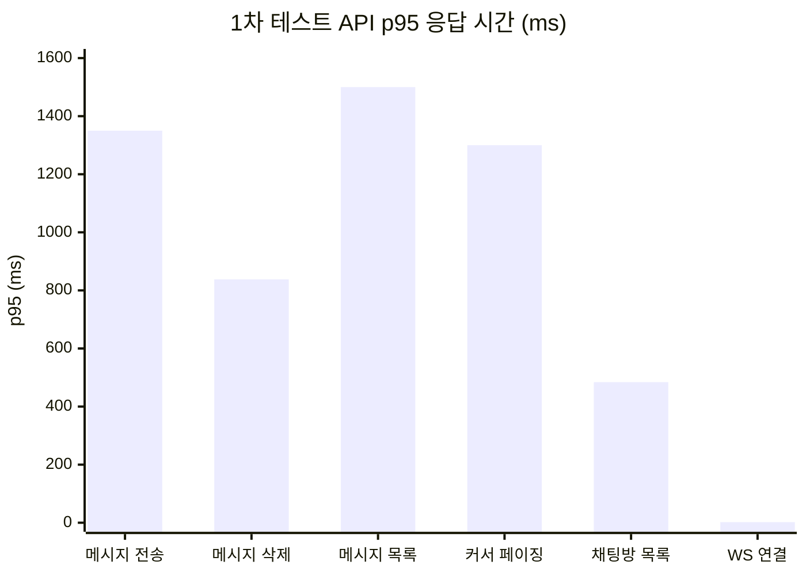
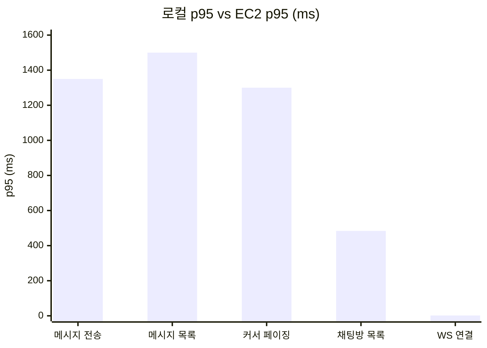
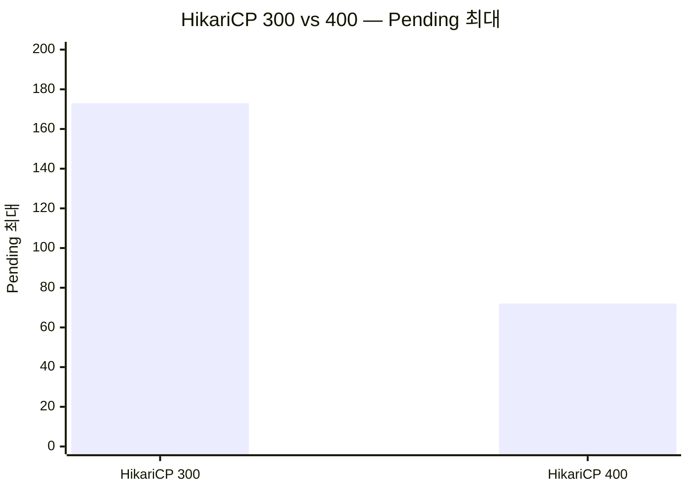
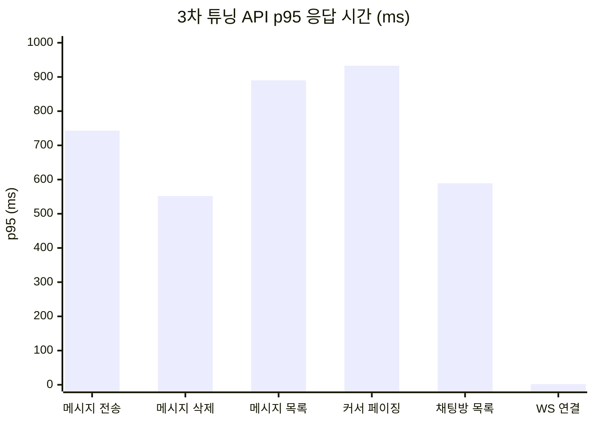
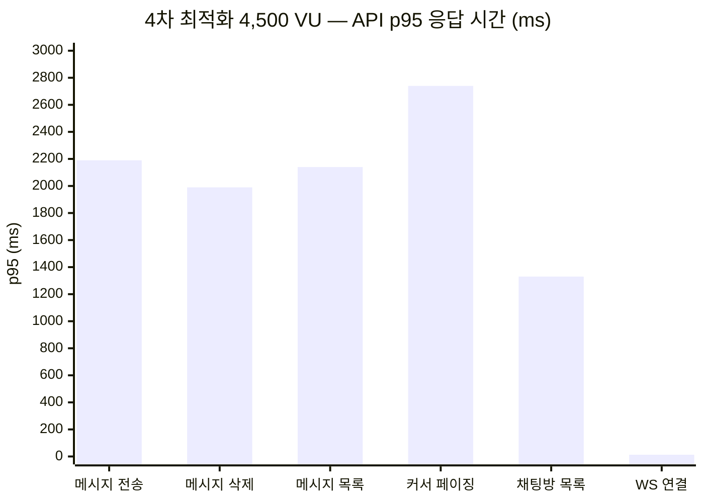
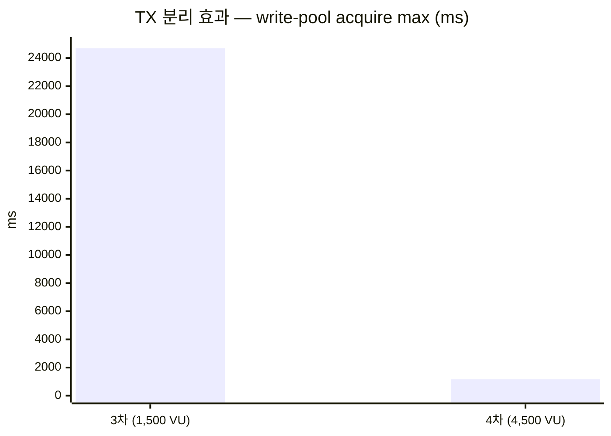
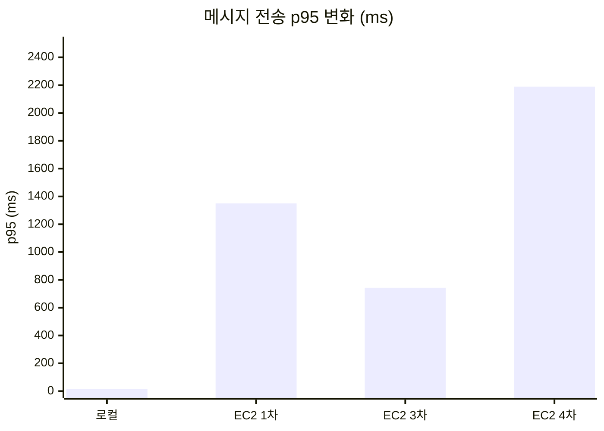

## 개요

[로컬 채팅 부하 테스트](/chat-storage-websocket-extreme-test/)에서 WHERE IN 풀스캔을 derived JOIN으로 30.9배 개선하고, Redis Pub/Sub 풀 튜닝으로 1,000 VU 스파이크까지 안정화했다. 이번에는 AWS EC2에 배포한 환경에서 동일 시나리오를 실행했다.

### EC2 인프라 구성

Load Generator(k6)는 c5.xlarge(4 vCPU, 8GB), App Server는 c5.xlarge(4 vCPU, 8GB), Infra(MySQL, Redis)는 c5.2xlarge(8 vCPU, 16GB)로 구성했다.

앱 서버와 인프라(MySQL, Redis)는 별도 인스턴스로 분리되어 있다. 로컬 테스트에서는 전부 동일 머신이었으므로 네트워크 지연이 0이었다.

---

## 1차 테스트 — HikariCP 300

### API 응답 시간



메시지 전송 p95 1.35s(max 7.26s, avg 334ms), 메시지 삭제 p95 838ms(max 5.18s, avg 205ms), 메시지 목록 p95 1.50s(max 7.32s, avg 355ms), 커서 페이징 p95 1.30s(max 8.41s, avg 300ms), 채팅방 목록 p95 484ms(max 6.91s, avg 119ms), WS 연결 p95 2ms(max 230ms, avg 2ms).

HTTP 500: 0건. HTTP 404: 59,452건 (채팅방이 없는 클럽에 대한 요청, 정상 동작).

### 로컬 테스트와의 비교



메시지 전송은 로컬 p95 15.80ms에서 EC2 p95 1,350ms로 상승했다(VU 5~10배, 네트워크 지연 추가). 메시지 목록은 23.93ms → 1,500ms, 커서 페이징은 16.16ms → 1,300ms로 동일한 패턴이다. 채팅방 목록은 로컬 1,000ms(수정 후)에서 EC2 484ms로 오히려 낮아졌다. WS 연결은 13ms → 2ms로 WebSocket은 DB와 무관하다.

채팅방 목록은 로컬에서 derived JOIN으로 수정한 결과가 EC2에 반영되어 484ms로 정상 범위다. 나머지 API의 p95 상승은 VU 규모 차이(150 → 750~1,500)와 네트워크 RTT가 복합적으로 작용한 결과다.

### HikariCP 병목 타임라인

09:08~09:11 Warmup/Baseline 구간에서 Active 1~58, Pending 0이었다. 09:11~09:13 Send Storm(750VU)에서 Active 300(풀 전부 소진), Pending 70~100이 발생했다. 09:13~09:15 WebSocket(500VU) 구간은 Active 0, Pending 0으로 DB 커넥션을 사용하지 않았다. 09:15~09:17 Contention 구간에서 Active 24~62, Pending 0이었다. 09:18~09:21 Spike(1,500VU)에서 Active 300, Pending 65~173으로 최대치를 기록했다. 09:21~09:22 Cooldown에서 Active 0, Pending 0으로 복귀했다.

```
- Send Storm(750 VU): 300 풀 전부 소진, Pending 70~100 발생
- Spike(1,500 VU): Pending 최대 173까지 상승
- WebSocket Phase(500 VU): Active 0, Pending 0 → WebSocket 자체는 DB 커넥션 미점유
```

### MySQL 상태

InnoDB Buffer Pool 3GB, Buffer Pool Hit Rate 99.976%, Row Lock Waits 190건, Slow Queries 0건이었다.

```
- Buffer Pool Hit 99.976%, Slow Query 0건, Row Lock Waits 190건
- MySQL은 병목 요인이 아님
- 쿼리 실행은 정상이지만 HikariCP 풀 부족으로 커넥션 대기 발생
```

### Redis 상태

Redis Memory 17.86MB, Clients 33, Peak OPS 623/s로 여유가 있었다.

Redis는 병목 요인이 아니다. Pub/Sub 메시지 전달은 정상적으로 동작했다.

---

## 1차 튜닝 — HikariCP 300 → 400

### 변경

```
- 기존 MySQL max_connections 400은 HikariCP 300에 맞춘 설정
- 풀 400으로 확대하면서 MySQL max_connections도 500으로 조정
- HikariCP maximum-pool-size: 300 → 400
```

### 결과

09:56:22 시점에 HK Total 255, Pending 0(Warmup, 풀 확장 중)이었다. 09:56:54 Send Storm 시작 시 Total 298, Active 293, Pending 72로 풀이 미확장 상태에서 부하가 몰렸다. 09:57:27에 Total 400, Active 397, Pending 0으로 풀 확장이 완료되면서 Pending이 해소됐다.

풀이 400까지 확장 완료된 이후에는 Pending 0을 유지했다. 09:56:54의 Pending 72는 HikariCP의 lazy 커넥션 생성 때문이다.

### HikariCP lazy 생성과 warm-up

```
- HikariCP 시작 시 min-idle(50개)만 생성, 부하 증가 시 요청마다 하나씩 max(400)까지 확장
- 09:56:22 total=255 → 30초 뒤 Send Storm(750 VU) 시작 → 300+ 커넥션 필요
- 풀 298개까지만 생성된 상태 → 일시적 Pending 72 발생
- 09:57:27 total=400 확장 완료 → Pending 해소
- 운영 환경에서는 트래픽이 점진적 증가하므로 미발생
- cold start 대응 필요 시 min-idle을 200으로 설정
```

### 300 vs 400 비교



HikariCP 300에서는 Pending이 최대 173까지 지속적으로 발생했다. HikariCP 400에서는 warm-up 시점에만 72가 발생했고, 풀 확장 완료 후에는 Pending 0을 유지했다. 두 경우 모두 HTTP 500은 0건이었다.

300 풀에서는 Spike 구간 내내 Pending이 65~173으로 지속됐다. 400 풀에서는 확장 완료 후 Pending이 0으로 유지됐다.

---

## 2차 튜닝 — message 테이블 복합 인덱스 추가

HikariCP 병목을 풀 확대로 해소한 뒤, 쿼리 실행 시간 자체를 줄여 커넥션 점유 시간을 단축하는 방향으로 전환했다.

### 문제

```
- 3M+ message 테이블에 chat_room_id FK 인덱스만 존재
- 조회 순서: chat_room_id 필터 → deleted 필터 → sent_at 정렬
- deleted 필터와 sent_at 정렬은 인덱스 미사용, filesort로 처리
```

### 복합 인덱스

```
(chat_room_id, deleted, sent_at DESC, message_id DESC)
```

복합 인덱스를 추가했다. 아래는 인덱스 적용 후 예상되는 개선 효과다.

`findLatest`(초기 메시지 목록)는 p95 1.50s에서 100~300ms로, `findOlderThan`(커서 페이징)은 p95 1.30s에서 50~200ms로 개선이 예상된다. `findLastMessagesByChatRoomIdsNative`(채팅방 마지막 메시지)는 이미 derived JOIN이 적용되어 있어 추가 개선이 기대된다.

```
- 기존: chat_room_id FK 인덱스로 필터 → deleted 조건은 테이블 확인 → sent_at 정렬은 filesort
- 복합 인덱스 적용 시: 인덱스 스캔만으로 필터링과 정렬 완료 예상
```

---

## 병목 분석 — 로컬과 EC2의 차이

로컬에서는 MySQL 병목이 WHERE IN 풀스캔(3.1M rows)이었고 주요 병목이 쿼리 실행 시간이었으며, HikariCP Pending은 관측되지 않았고, Redis Pub/Sub 풀 포화가 문제였다. EC2에서는 쿼리 자체는 정상(Slow Query 0)이었지만 HikariCP 커넥션 소진이 주요 병목이었고, Pending이 최대 173(300 풀) / 72(400 풀)까지 발생했으며, Redis는 병목이 아니었다(Peak 623 OPS).

```
- 로컬: 쿼리 실행 시간이 병목 → WHERE IN 풀스캔, Redis Pub/Sub 풀 포화 등 코드 레벨 문제
- EC2: 쿼리 자체는 정상, 커넥션 풀 크기가 동시 요청 미감당 → 인프라 레벨 문제
- 알림 EC2 테스트와 동일한 패턴
- 로컬: 네트워크 지연 0 → 커넥션 점유 시간 짧음 → 풀 빠르게 회전
- EC2: DB 요청마다 네트워크 RTT 추가 → 커넥션 점유 시간 증가 → 동일 풀 크기에서 Pending 발생
```

---

## 3차 튜닝 — 커널 + JVM 최적화 후 재테스트

HikariCP 풀 확대와 복합 인덱스 추가 이후, OS 커널과 JVM 설정을 튜닝하고 재테스트를 실행했다.

### 적용 내용

JVM은 ZGC Generational, 3GB heap, VT parallelism=8로 설정했다. 커널 TCP는 rmem/wmem 16MB, keepalive 60s, fin_timeout 15s를 적용했다. Tomcat은 max-threads 400, max-connections 10,000, accept-count 500으로 구성했다. STOMP inbound는 64~128 threads에 queue 5,000, STOMP outbound는 64~128 threads에 queue 2,000을 설정했다. Redis Pub/Sub listener는 128~400 threads에 queue 10,000으로 구성했다.

### 결과 — 19분, 185만 iterations, 에러 0건



메시지 전송 p95 743ms(max 4.23s, avg 212ms), 메시지 삭제 p95 552ms(max 2.87s, avg 160ms), 메시지 목록 p95 890ms(max 11.26s, avg 178ms), 커서 페이징 p95 933ms(max 10.83s, avg 171ms), 채팅방 목록 p95 589ms(max 2.91s, avg 96ms), WS 연결 p95 2ms(max 226ms, avg 2ms).

```
- 전 Phase 성공률 100%, 총 에러 0건
- WebSocket STOMP 62K 전송, 158K 수신 (브로드캐스트 배수 정상)
- 1,500 VU Spike에서도 안정적
```

### 1차 테스트와의 비교

```mermaid
xychart-beta
  title "1차 vs 3차 p95 비교 (ms)"
  x-axis ["메시지 전송", "메시지 삭제", "메시지 목록", "커서 페이징", "채팅방 목록"]
  y-axis "p95 (ms)" 0 --> 1600
  bar [1350, 838, 1500, 1300, 484]
  bar [743, 552, 890, 933, 589]
```



메시지 전송 1,350ms → 743ms(-45%), 메시지 삭제 838ms → 552ms(-34%), 메시지 목록 1,500ms → 890ms(-41%), 커서 페이징 1,300ms → 933ms(-28%)로 개선됐다. 채팅방 목록만 484ms → 589ms(+22%)로 소폭 상승했다.

메시지 전송, 삭제, 목록 p95가 28~45% 개선됐다. 복합 인덱스, ZGC, 커널 TCP 버퍼 확대의 복합 효과다.

---

## 고부하 병목 예측 — 3,000+ VU

현재 1,500 VU에서 안정적이지만, VU를 더 올릴 경우의 병목을 분석했다.

3,000+ VU에서는 STOMP outbound queue 포화가 예상된다(queue 2,000에 브로드캐스트가 몰려 메시지 지연/드롭). 4,000+ VU에서는 HikariCP 풀 고갈이 예상된다(write 200 + read 200 = 400 pool에 동시 쓰기 집중으로 커넥션 타임아웃). 5,000+ VU에서는 Tomcat max-connections 한계가 예상된다(HTTP + WS가 10,000을 공유하여 연결 거부).

커널과 JVM은 이미 충분하다. 추가 고부하 대비는 앱 설정 튜닝이 필요하다.

3,000+ VU 대비 권장 설정: STOMP outbound queue 2,000 → 8,000, STOMP outbound max threads 128 → 256, STOMP inbound queue 5,000 → 10,000, Tomcat max-connections 10,000 → 20,000, HikariCP pool(write+read) 400 → 500~600.

```
- STOMP outbound queue가 가장 먼저 포화
- Redis Pub/Sub listener → SimpMessagingTemplate.convertAndSend() → outbound queue 진입
- outbound가 최종 병목
```

---

## Virtual Thread Pinning 분석

1,500 VU 테스트에서 안정적이었지만, Virtual Thread 사용 시 carrier thread pinning 여부를 확인했다.

### 확인된 pinning

SseEmitter.send()는 Virtual Thread에서 Spring 내부 sendMutex synchronized 안에서 OutputStream.write를 수행하여 Pinning이 발생한다. Mongo nextSequence()는 Tomcat VT에서 명시적 synchronized 블록 안에서 mongoTemplate으로 네트워크 I/O를 수행하여 Pinning이 발생한다. STOMP outbound는 Platform Thread에서 WebSocket 내부 socket.write를 수행하지만 Pinning은 없다. Redis Pub/Sub와 STOMP inbound도 Platform Thread이므로 Pinning이 발생하지 않는다.

```
- SseEmitter.send(): ResponseBodyEmitter가 synchronized(this.sendMutex) 안에서 OutputStream.write() 수행
  → Virtual Thread executor에서 호출 → carrier thread에 pinned
  → SSE 동시 전송 수가 carrier thread 수(parallelism=8)로 제한
- Mongo nextSequence(): synchronized(this) 블록 안에서 mongoTemplate.findAndModify()로 네트워크 I/O
  → 1,000건당 1회지만 발생 시 수십 ms 동안 carrier thread 점유
  → 채팅의 MongoChatMessageStorageAdapter에도 동일 패턴 존재
```

### 수정 방안

1. **SSE**: `sseEventExecutor`를 Virtual Thread → Platform Thread Pool(core 64, max 256)로 변경. SseEmitter.send() 자체가 짧은 I/O라 Virtual Thread 이점이 없고 pinning만 발생한다.
2. **MongoDB synchronized**: `synchronized` → `ReentrantLock`으로 교체. JDK 21+에서 ReentrantLock은 Virtual Thread pinning을 발생시키지 않는다.

```
- JFR 10초 녹화(17,769 events)에서 VirtualThreadPinned = 0 기록
- 원인: pinning이 수 ms로 매우 짧아 JFR 샘플링에 미포착
- 코드상 pinning 경로 존재 → 고부하 시 carrier thread 고갈 가능
```

---

## 4차 최적화 — TX 분리 + 4,500 VU 스케일 테스트

### 발견된 문제: write-pool 24.7초 점유

```
- 3차 테스트에서 write-pool max usage 24.7초 관측
- 원인: sendAndPublish()가 @Transactional 안에서 Redis publish() 호출
- Redis 통신 중에도 DB 커넥션 점유
```

### 적용 내용

1. **sendAndPublish() TX 분리**: `@Transactional`을 제거하고 `saveMessage()`만 독립 TX로 실행. Redis publish는 TX 커밋 후 커넥션 반환된 상태에서 실행된다.
2. **EC2 show_sql/generate_statistics 비활성화**: 전 쿼리 로깅과 통계 수집 오버헤드를 제거했다.
3. **JVM heap 3GB → 4GB**: Allocation Stall 감소를 위해 확대했다.

```
- sendAndPublish()의 @Transactional 제거 시 클래스 레벨 @Transactional(readOnly=true) 적용 → write 실패
- saveMessage()의 @Transactional이 REQUIRED 전파로 read-only TX에 참여했기 때문
- 클래스 레벨 readOnly=true 제거로 해결
```

### 결과 — 4,500 VU, 전 Phase 100%, 에러 1건



메시지 전송 p95 2.19s(max 38.5s, avg 916ms), 메시지 삭제 p95 1.99s(max 10.3s, avg 796ms), 메시지 목록 p95 2.14s(max 38.9s, avg 805ms), 커서 페이징 p95 2.74s(max 39.0s, avg 954ms), 채팅방 목록 p95 1.33s(max 30.9s, avg 325ms), WS 연결 p95 13ms(max 582ms, avg 5ms).

### HikariCP — TX 분리 효과



write-pool acquire max가 24.7s에서 1.16s로 95% 개선됐다. write-pool avg acquire는 1.1ms에서 0.53ms로 52% 개선됐다. Pending과 Timeout은 3차, 4차 모두 0건이었다.

write-pool acquire max 24.7s → 1.16s가 TX 분리의 핵심 효과다. Redis publish가 DB 커넥션을 물고 있던 병목이 제거됐다.

### 처리량 비교

3차(1,500 VU)에서 4차(4,500 VU, 3배)로 VU를 올렸다. 총 iterations는 1,854,368에서 1,741,030으로 소폭 감소했지만, 전 Phase 성공률은 둘 다 100%를 유지했다. HTTP 에러는 0에서 1건으로, WS 에러는 0으로 동일했다. WS 연결 수는 24,925에서 37,378(+50%), WS 메시지 수신은 124,625에서 186,890(+50%)으로 증가했다.

VU를 3배로 올렸음에도 전 Phase 100%를 유지했다. 총 iterations가 소폭 감소한 것은 4,500 VU에서 응답 시간이 늘어난 영향이다.

### JVM / MySQL

GC pause total은 3차 12ms에서 4차 5ms로 감소했다. Allocation Stall은 63회에서 54회로 소폭 감소했다. Heap 피크는 ~2.3GB/3GB에서 ~2.5GB/4GB로 변화했다. Slow queries는 95에서 909건으로 증가했고, Row lock waits는 둘 다 1건이었다.

```
- Allocation Stall이 4GB에서도 54회 발생
- Spike Phase에서 메모리 할당이 ZGC 회수 속도 초과하는 구간 존재
- Slow query 909건은 3배 부하에서 증가 → 인덱스 최적화 여지
```

---

## 개선 방안

### 적용 완료

1. HikariCP 300 → 400: Pending 173 → 0(확장 완료 후)
2. message 복합 인덱스 `(chat_room_id, deleted, sent_at DESC, message_id DESC)`: filesort 제거 예상
3. 커널 TCP 버퍼 16MB + keepalive 60s + fin_timeout 15s: 네트워크 레벨 지연 감소
4. ZGC Generational + 4GB heap: GC pause 5ms, Allocation Stall 감소
5. sendAndPublish() TX 분리: write-pool acquire 24.7s → 1.16s
6. show_sql/generate_statistics 비활성화: 로깅 오버헤드 제거

### 추가 개선 후보

1. Virtual Thread pinning → SSE executor를 Platform Thread Pool로 변경하여 carrier thread 고갈 방지
2. MongoDB synchronized → ReentrantLock 교체로 VT pinning 제거
3. Allocation Stall → heap 5GB 또는 ZAllocationSpikeTolerance=5로 Spike 시 stall 감소
4. Slow query 909건 → 쿼리 최적화 또는 인덱스 추가로 Spike Phase 응답 시간 개선
5. STOMP outbound → queue 2,000 → 8,000, threads 128 → 256으로 3,000+ VU 대비

---

## 정리



로컬(150~1,000VU)에서는 HTTP 에러 0건, 메시지 전송 p95 15.80ms, 메시지 목록 p95 23.93ms, 채팅방 목록 p95 1,000ms, HikariCP Pending 없음, WS 연결 p95 13ms였다. EC2 1차(1,500VU)에서는 HTTP 에러 0건, 메시지 전송 p95 1,350ms, 메시지 목록 p95 1,500ms, 채팅방 목록 p95 484ms, HikariCP Pending 최대 173, WS 연결 p95 2ms였다. EC2 3차(1,500VU)에서는 HTTP 에러 0건, 총 iterations 1,854,368, 메시지 전송 p95 743ms, 메시지 목록 p95 890ms, 채팅방 목록 p95 589ms, HikariCP Pending 0, write-pool acquire max 24.7s, WS 연결 p95 2ms, WS 메시지 수신 124,625건이었다. EC2 4차(4,500VU)에서는 HTTP 에러 1건, 총 iterations 1,741,030, 메시지 전송 p95 2,190ms, 메시지 목록 p95 2,140ms, 채팅방 목록 p95 1,330ms, HikariCP Pending 0, write-pool acquire max 1.16s, WS 연결 p95 13ms, WS 메시지 수신 186,890건이었다.

1차에서 4차까지의 흐름: HikariCP 풀 확대(300→400)로 Pending 해소 → 복합 인덱스와 커널/JVM 튜닝으로 p95 45% 개선 → TX 분리로 write-pool 점유 95% 개선 → 4,500 VU까지 확장하여 전 Phase 100% 달성.

> **채팅 도메인의 병목은 단계적으로 변화한다.** HikariCP 풀 크기 → 커널/JVM 설정 → TX 범위 내 Redis 호출 → STOMP queue 순서로 병목이 이동한다. 각 단계를 해소하면 다음 병목이 드러나며, c5.xlarge 단일 인스턴스에서 4,500 VU Spike까지 에러 없이 처리할 수 있다.

---

## 시리즈 탐색

**◀ 이전 글**
[알림 부하 테스트 — AWS EC2에서 MySQL write 붕괴와 MongoDB 비교](/notification-aws-ec2-load-test/)

**▶ 다음 글**
[피드 부하 테스트 — AWS EC2에서 IN절 병목, covering index, 전 페이지 캐싱](/feed-aws-ec2-load-test/)
