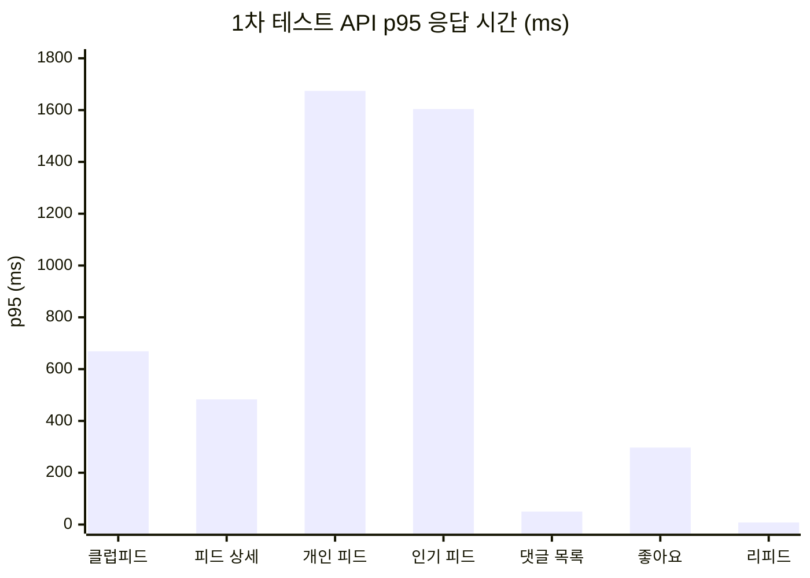
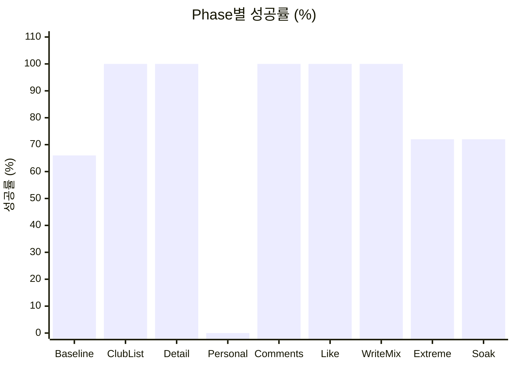
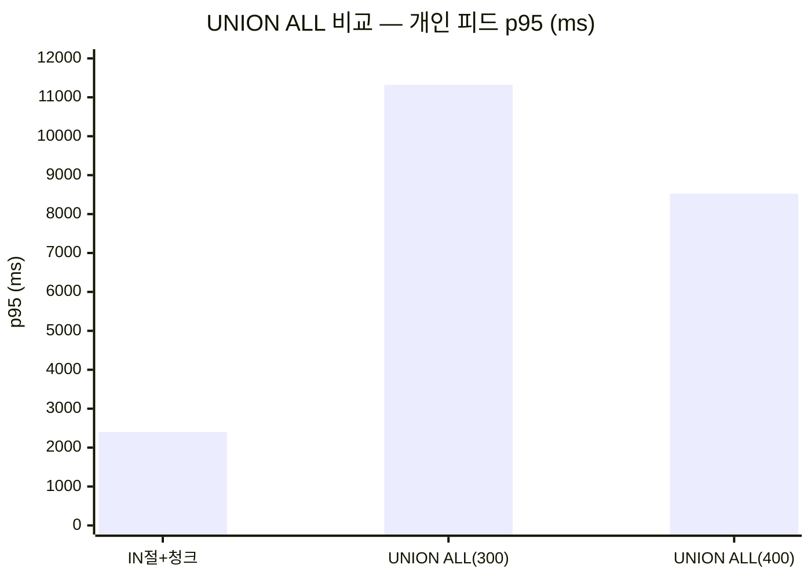
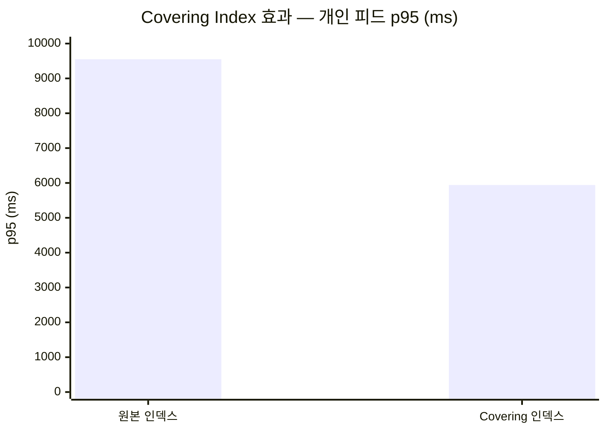
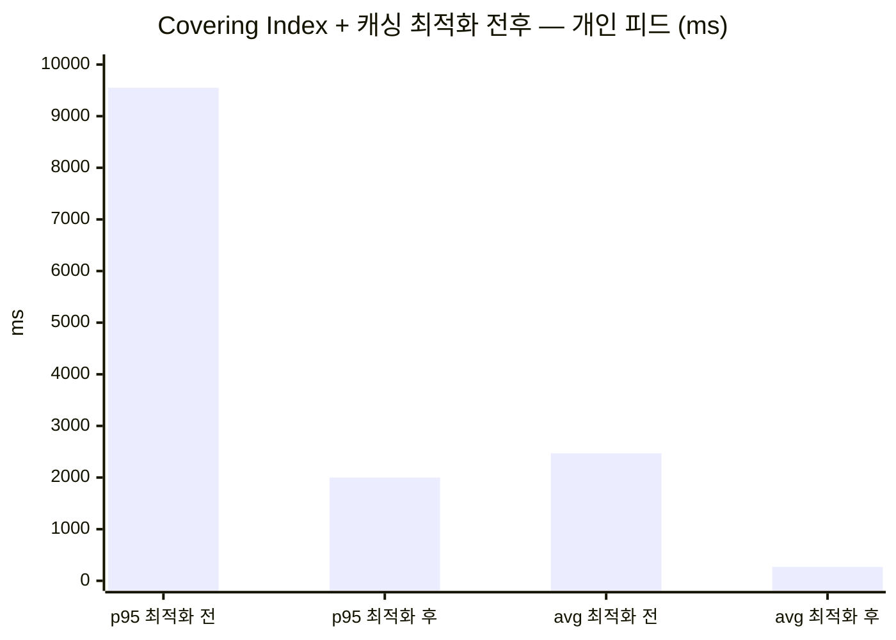
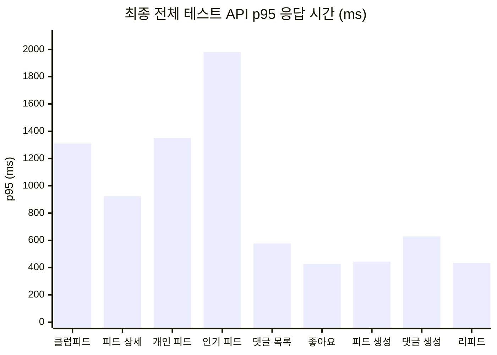
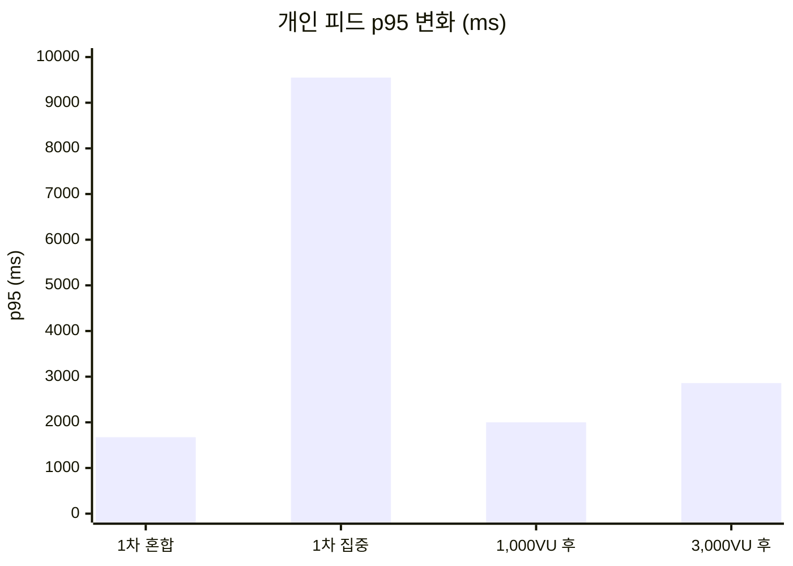

## 개요

[로컬 피드 부하 테스트](/feed-storage-abstraction-lua-script-backend-comparison/)에서 storage abstraction, Lua script 토글, UNION ALL 인기 피드 등의 최적화를 적용했다. 이 글은 동일한 피드 도메인을 AWS EC2에 배포하고 부하 테스트를 수행한 결과를 다룬다.

### EC2 인프라 구성

Load Generator(k6)는 c5.xlarge(4 vCPU, 8GB), App Server는 c5.xlarge(4 vCPU, 8GB), Infra(MySQL, Redis)는 c5.2xlarge(8 vCPU, 16GB)로 구성했다.

---

## 1차 테스트 — 초기 결과

### API 응답 시간



클럽피드 목록 p95 669ms(avg 234ms, max 3.0s), 피드 상세 p95 483ms(avg 73ms, max 2.3s), 개인 피드 p95 1,674ms(avg 507ms, max 7.97s), 인기 피드 p95 1,604ms(avg 475ms, max 8.04s), 댓글 목록 p95 50ms(avg 30ms, max 2.1s), 좋아요 토글 p95 297ms(avg 131ms, max 2.1s), 리피드 p95 8ms(avg 4ms, max 238ms).

### Phase별 성공률



Baseline 66.1%(300 VU), ClubList 100%(350 VU), Detail 100%(500 VU), Personal 0%(500 VU), Comments 100%(350 VU), Like 100%(700 VU), WriteMix 100%(350 VU), Extreme 71.7%(1,000 VU), Soak 71.9%(300 VU).

Thresholds: 8 PASS / 11 FAIL. 총 1,641,223 HTTP 요청, 에러율 20.4%.

### Phase 5 Personal 0% 원인

Phase 5 실패 원인은 쿼리 성능이 아니라 데이터 정합성 문제다. 시드 데이터에서 삭제된 Club을 참조하는 Feed가 존재하여 Club 엔티티 조회 시 500 에러가 발생했다.

### 개인 피드 IN절 병목

`WHERE club_id IN (20+개) ORDER BY feed_id DESC` 쿼리가 10.6M 행 테이블에서 filesort를 유발했다. 이것이 개인 피드 응답 시간 저하의 원인이다.

---

## 1차 최적화 — 복합 인덱스 + 커서 페이징 + popularity_score 사전 계산 + ZGC

### 적용 내용

1. **복합 인덱스 추가**
   - `idx_feed_club_feedid (club_id, feed_id)` — 개인 피드 커서 기반 쿼리용
   - `idx_feed_club_popularity (club_id, popularity_score)` — 인기 피드 인덱스 활용
2. **커서 기반 페이지네이션**: `WHERE feed_id < :cursor ORDER BY feed_id DESC LIMIT :limit` (OFFSET 제거)
3. **popularity_score 사전 계산**: per-row `LN(GREATEST(...))-TIMESTAMPDIFF(...)` 계산을 5분마다 배치 업데이트로 전환하여 인덱스 정렬 활용
4. **ZGC 적용**: G1GC에서 ZGC로 변경

### 결과 (Club 정합성 수정 포함)

```mermaid
xychart-beta
  title "1차 vs 2차 성공률 (%)"
  x-axis ["Baseline", "Personal", "Extreme", "Soak"]
  y-axis "성공률 (%)" 0 --> 110
  bar [66, 0, 72, 72]
  bar [100, 100, 99, 100]
```



Baseline 66.1% → 100%, Personal 0% → 100%, Extreme 71.7% → 99.16%, Soak 71.9% → 99.93%로 전 Phase에서 개선됐다.

- 총 에러: 122,456 → 2,426 (98% 감소)
- Thresholds: 8/19 → 12/19 PASS
- CPU (1,000 VU): 100% (G1GC) → 3~30% (ZGC)
- HikariCP Pending: 병목 상태 → 0

---

## 2차 최적화 — UNION ALL 시도와 롤백

개인 피드에 UNION ALL 방식(각 club_id별 개별 서브쿼리 → Java에서 병합)을 적용했다.



IN절+청크(baseline)는 개인 피드 p95 ~2.4s / 인기 피드 p95 ~2.1s였다. UNION ALL(Pool 300)은 개인 피드 p95 11.32s / 인기 피드 p95 387ms, UNION ALL(Pool 400)은 개인 피드 p95 8.52s / 인기 피드 p95 457ms였다.

```
인기 피드: UNION ALL로 2.1s → 387ms 개선
개인 피드: 유저당 ~20개 순차 쿼리 → 커넥션 풀 포화 → 오히려 악화

결론: 개인 피드는 IN절+청크로 롤백, 인기 피드만 UNION ALL 유지
```

---

## 3차 최적화 — covering index + 전 페이지 캐싱

```
1,000 VU 개인 피드 단독 집중 시나리오 → p95 9.55s
1차 테스트 1,674ms는 혼합 시나리오(Baseline 300 VU) 수치
500 VU가 개인 피드에 집중되면 IN절 병목 증폭
```

### Covering Index

`(club_id, deleted, feed_id DESC, like_count, comment_count)` 인덱스를 추가하여 테이블 랜덤 I/O를 제거했다.



원본 인덱스(club_id, feed_id)에서 개인 피드 p95 9.55s(avg 2.47s), Covering 인덱스(club_id, deleted, feed_id DESC, like_count, comment_count)에서 p95 5.94s(avg 2.18s)로 38% 개선됐다.

Covering index 효과: p95 9.55s → 5.94s (38% 개선).

### 전 페이지 Redis 캐싱

```
기존 첫 페이지만 캐싱 → 전체 0~5 페이지로 확장 (TTL 30초)

주의:
  Redis 캐시 적용 시 p95가 급격히 개선되지만 DB 앞단 병목을 가리는 효과
  캐시 eviction이나 cold start 시점에 실제 DB 병목이 그대로 드러남
  → 캐시 적용 전후를 모두 측정해야 실제 DB 성능 파악 가능
```

### 최종 결과 (covering index + 전 페이지 캐싱)



개인 피드 p95 9.55s → 2.00s(79% 개선), 개인 피드 avg 2.47s → 269ms(89% 개선), 인기 피드 p95 517ms, 총 iterations ~300K → 474K(58% 처리량 증가).

---

## 최종 전체 테스트 — 879K iterations

20분간 최대 1,000 VU로 879K iterations를 처리한 최종 테스트 결과다.

### API 응답 시간



클럽피드 목록 p95 1.31s(avg 774ms), 피드 상세 p95 923ms(avg 260ms), 개인 피드 p95 1.35s(avg 469ms), 인기 피드 p95 1.98s(avg 762ms), 댓글 목록 p95 577ms(avg 165ms), 좋아요 토글 p95 426ms(avg 313ms), 피드 생성 p95 444ms(avg 328ms), 댓글 생성 p95 629ms(avg 480ms), 리피드 p95 434ms(avg 95ms).

Phase 2~8, 10: 98.5~100% 성공. Phase 9 (Extreme 1,000 VU): 32.6%.

### 인프라 메트릭

유휴 시 HikariCP Active 1, Pending 0, JVM Heap 170MB, CPU 2~4%였다. 피크(Phase 9)에서 HikariCP Active 300(풀 MAX), Pending 268, JVM Heap 1,055MB, CPU 100%, GC(ZGC) 865회/총 18.8s(1.6% overhead)를 기록했다.

### MySQL

MySQL Slow Queries +2,524건(Phase 9에서 발생), Row Lock Waits +152건, Buffer Pool Free 142K → 28K pages(3GB 풀, 테스트 종료 시 여유 감소)였다.

### Redis

Redis Hit Rate 97.8%, Peak OPS 39,472/s, Memory 225 → 302MB(+77MB)였다.

---

## 병목 분석 — Phase 9 (1,000 VU) 한계

```
Phase 9 성공률 32.6% 하락 원인:
  1. HikariCP 300 커넥션 풀 전부 소진, Pending 268
  2. CPU 4코어 100% sustained
  3. 커넥션 타임아웃 cascade → 60초 max 응답 발생

코드 최적화로 해결 불가한 인프라 스케일링 한계
→ 수평 확장(다중 앱 인스턴스) 또는 인스턴스 업그레이드(c5.2xlarge) 필요
```

---

## 4차 최적화 — X-lock 경합 해소와 3x 스케일

```
3차까지: 단일 HikariCP 풀(300)
4차부터: HikariCP write/read 풀 분리, MySQL max_connections 800으로 확대

1,000 VU 병목 분석 결과: feed row에 대한 X-lock 경합이 쓰기 성능 저하의 원인
```

### 병목 진단

Lock wait timeout(5s 초과) 35,659건, InnoDB row lock waits 25,745건(평균 5초), Slow queries(10s+) 2,636건, read-pool 포화(active=160, waiting=234), feed 테이블 인덱스 수 10개였다.

```
UPDATE feed SET like_count = GREATEST(like_count + 1, 0) → feed row에 X-lock
좋아요 배치 consumer + 댓글 count 비동기 업데이트가 동일 feed row에 동시 접근
→ 직렬화 발생
```

### 적용 내용

**A. comment_count 배치 버퍼링**

```
기존: 댓글 생성마다 @Async로 즉시 UPDATE feed SET comment_count = comment_count + 1
     → 개별 X-lock

변경: Redis HINCRBY로 델타 축적 → 3초 주기 배치 flush
     → 단일 UPDATE ... CASE WHEN으로 여러 feed를 1회에 갱신
```

**B. MySQL 튜닝**

innodb_redo_log_capacity를 48MB에서 512MB로, innodb_lock_wait_timeout을 5s에서 3s로, innodb_flush_method를 fsync에서 O_DIRECT로 변경했다.

```
redo log 48MB → 쓰기 부하 시 체크포인트 빈번 유발
512MB로 확대하여 I/O 경합 감소
```

**C. HikariCP 풀 조정**

```
MySQL max_connections=800 내에서 write 300 + read 300 = 600으로 분배
기존 write 500 + read 500 = 1,000은 MySQL이 수용 불가한 크기
```

**D. 중복 인덱스 제거**

covering index 추가 후 기존 인덱스 3개가 중복 상태였다.

`idx_feed_club_deleted_created`는 `idx_feed_club_del_feedid_covering`으로 대체, `idx_feed_club_feedid`는 `idx_feed_club_feedid_covering`의 부분집합으로 제거, `idx_feed_club_popularity`는 `idx_feed_club_del_popularity`로 대체했다.

```
인덱스 10개 → 7개로 축소

covering index 포함 적극적 인덱스 추가 → 조회 성능 개선
  but INSERT/UPDATE마다 인덱스 갱신 비용 누적 → 쓰기 성능 저하
  피드 생성 p95가 14.21s까지 상승한 원인 중 하나

교훈: 인덱스는 읽기와 쓰기의 트레이드오프, 조회 최적화만 측정하면 부작용을 놓침
```

### 3x 스케일 테스트 결과 (최대 3,000 VU)

11 Phase, 19분 54초, 1,213,438 iterations.

```mermaid
xychart-beta
  title "3x 스케일 최적화 전후 p95 비교 (ms)"
  x-axis ["댓글 생성", "피드 생성"]
  y-axis "p95 (ms)" 0 --> 15000
  bar [11290, 14210]
  bar [5300, 2880]
```



댓글 생성 p95 11.29s → 5.30s(53% 개선), 피드 생성 p95 14.21s → 2.88s(80% 개선)였다. 최적화 후 피드 상세 p95 1.76s, 개인 피드 p95 2.86s, 인기 피드 p95 2.46s, 댓글 목록 p95 952ms, 좋아요 토글 p95 708ms를 기록했다.

- Phase 2~7: 99.94~100% 성공률
- Phase 9 Extreme (3,000 VU): 46.88%
- Phase 10 Soak: 94.50%

```
댓글 생성 53% 개선: comment_count 배치 버퍼링 효과
피드 생성 80% 개선: 중복 인덱스 제거로 INSERT 비용 감소
Phase 9 (3,000 VU) 46.88%: 단일 인스턴스의 처리 한계
Phase 2~8: 안정적 동작
```

---

## 개선 방안

### 적용 완료

1. covering index(club_id, deleted, feed_id DESC, like_count, comment_count): 개인 피드 p95 9.55s → 5.94s
2. 전 페이지 Redis 캐싱(0~5 페이지, TTL 30초): 개인 피드 p95 → 2.00s, avg 269ms
3. 인기 피드 UNION ALL: 인기 피드 p95 2.1s → 387ms(UNION ALL 단독 테스트 기준, 최종 혼합 테스트에서는 1.98s)
4. popularity_score 사전 계산 + 인덱스: per-row 계산 제거, 인덱스 정렬
5. ZGC 적용: CPU 100% → 3~30%
6. 커서 기반 페이지네이션: OFFSET 제거, deep page 성능 일정
7. comment_count 배치 버퍼링: 댓글 생성 p95 11.29s → 5.30s
8. 중복 인덱스 제거(10개 → 7개): 피드 생성 p95 14.21s → 2.88s(3x 스케일 최적화 전 기준)
9. MySQL 튜닝(redo log 512MB, O_DIRECT): I/O 경합 감소

### 추가 개선 후보

1. 3,000 VU 인프라 한계 → 수평 확장 또는 c5.2xlarge로 고부하 처리
2. Pass2 렌더링 5회 쿼리 → parent/root 단일 쿼리 병합으로 목록 API p95 감소
3. 개인 피드 IN절 한계 → Redis ZSET fan-out-on-write로 DB 쿼리 0
4. 댓글 생성 X-lock 잔여 → feed_comment FK의 S-lock 제거로 쓰기 경합 추가 감소

---

## 정리



1차(최적화 전)에서는 Phase 5 Personal 성공률 0%, Baseline 성공률 66.1%, 개인 피드 p95 1,674ms(혼합)/9.55s(집중), 인기 피드 p95 2.1s, CPU 100%(G1GC)였다. 1,000 VU 최적화 후에는 Personal/Baseline 모두 100%, 개인 피드 p95 2.00s, 인기 피드 p95 1.98s, 피드 생성 p95 444ms, 댓글 생성 p95 629ms, CPU 3~30%(ZGC), Redis Hit Rate 97.8%였다. 3,000 VU 최적화 후에는 Personal/Baseline 100%, 개인 피드 p95 2.86s, 인기 피드 p95 2.46s, 피드 생성 p95 2.88s(14.21s에서 80% 개선), 댓글 생성 p95 5.30s(11.29s에서 53% 개선)였다.

> **피드 도메인의 병목은 읽기(IN절)와 쓰기(X-lock)에서 각각 다르게 나타난다.** 읽기 병목은 covering index와 Redis 캐싱으로, 쓰기 병목은 배치 버퍼링과 중복 인덱스 제거로 해소된다. 3,000 VU 고부하에서의 한계는 단일 인스턴스의 물리적 제약이며, 수평 확장이 필요하다.

---

## 시리즈 탐색

**◀ 이전 글**
[채팅 부하 테스트 — AWS EC2에서 TX 분리, Virtual Thread Pinning 분석, 4,500 VU 달성](/chat-aws-ec2-load-test/)

**▶ 다음 글**
[정산 부하 테스트 — AWS EC2에서 시드 데이터 버그 수정과 5라운드 최적화](/settlement-aws-ec2-load-test/)
