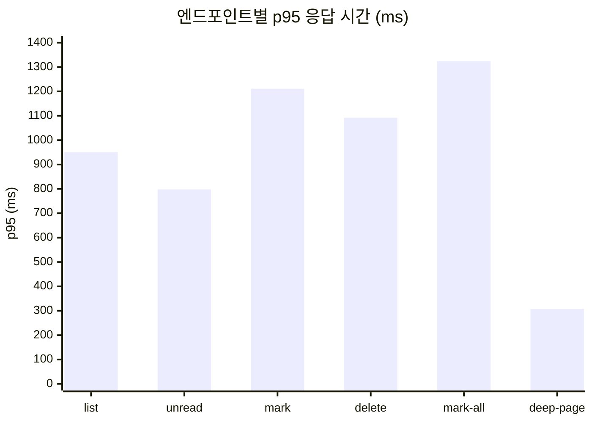
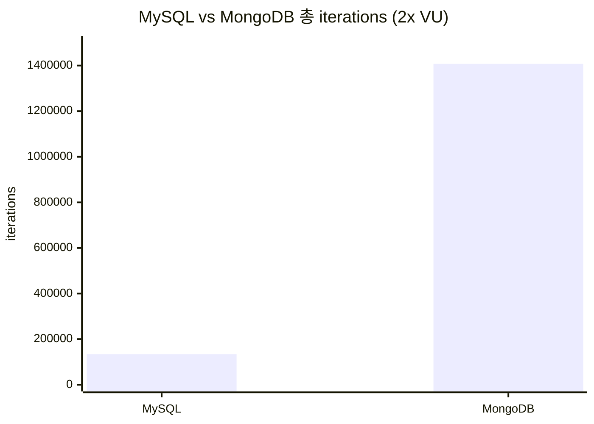
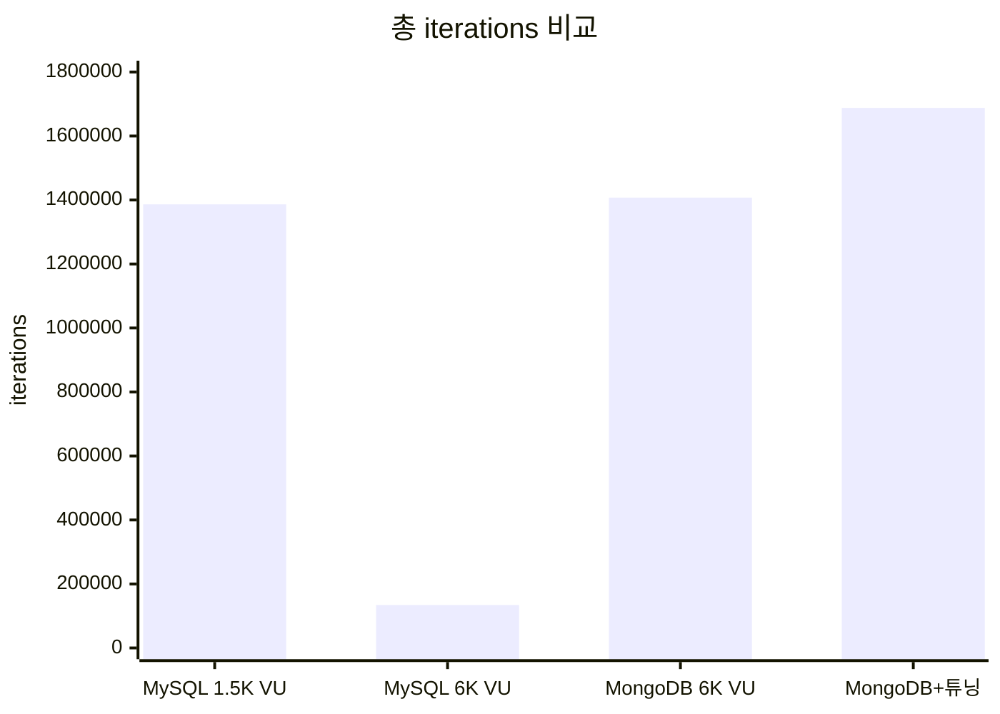

## 개요

React 프론트엔드 최적화를 마치고 Phase 4로 넘어간다. 로컬에서 통과한 테스트를 AWS EC2 환경에서 재검증한다.

[로컬 부하 테스트](/notification-api-performance-improvement/)에서 알림 API 성공률을 13% → 99.9%로 개선하고, [SSE 시나리오 테스트](/sse-notification-load-test-analysis/)에서 7,500 VU까지 안정성을 확인했다. 이번에는 AWS EC2에 배포한 실제 환경에서 동일한 부하 테스트를 실행했다.

### EC2 인프라 구성

Load Generator(k6)는 c5.xlarge(4 vCPU, 8GB)로 부하 발생기, App Server는 c5.xlarge(4 vCPU, 8GB)로 Spring Boot 앱, Infra(MySQL, Redis 등)는 c5.2xlarge(8 vCPU, 16GB)로 DB/인프라 전용 분리했다.

앱 서버와 인프라(DB, Redis)를 별도 인스턴스로 분리했다. 로컬 테스트에서는 앱·DB·k6가 전부 동일 머신에서 실행되어 네트워크 지연이 0이었지만, EC2에서는 인스턴스 간 네트워크 통신이 발생한다.

### 로컬 vs EC2 환경 비교

로컬에서는 네트워크 localhost(지연 0ms), HikariCP pool 100, 로컬 MySQL(앱과 동일 머신), CPU/메모리 제한 없음, 로그 기반 모니터링이었다. EC2에서는 인스턴스 간 네트워크 통신, HikariCP pool 300(ec2 프로필), c5.2xlarge 별도 인스턴스 DB, App 4 vCPU/8GB + Infra 8 vCPU/16GB, 앱 서버 + MySQL 서버 메트릭 수집으로 구성했다.

```
로컬 vs EC2의 차이:
  로컬: 네트워크 지연 0, CPU/메모리 충분 → 병목이 드러나지 않음
  EC2:  네트워크 왕복 + 자원 제한 → 다른 양상
```

---

## 테스트 결과

### k6 전체

총 시간 18분 35초, 총 iterations 1,386,269건, 전 Phase 성공률 100%(P2~P10)이었다.

### 엔드포인트별 응답 시간



list(알림 목록) p50 23.8ms / p95 949.5ms(읽기, 고부하 구간에서 p95 상승), unread(미읽음 수) p50 13.8ms / p95 798.3ms(서브쿼리 포함), mark(읽음 처리) p50 237.8ms / p95 1,210.9ms(write, row lock 발생), delete(삭제) p50 173.2ms / p95 1,092.0ms(write, 2단계 쿼리), mark-all(전체 읽음) p50 13.7ms / p95 1,323.7ms(write, 대량 UPDATE), deep-page(딥 페이징) p50 22.4ms / p95 308.1ms(커서 기반), sse(SSE 연결) p50 5,000ms / p95 5,001ms(timeout 기반 고정값).

```
p50: 전 엔드포인트 정상 범위
p95: write 작업(mark, delete, mark-all)이 1~1.3초 → 로컬에서는 관측 안 됨
```

### SSE Delivery E2E

SSE 전달 성공률 63.2%, 전달 지연 p50 308ms / p95 650ms, 알림 생성 성공률 100%, 알림 생성 p50 4.9ms / p95 314.8ms였다.

---

## 로컬 테스트와의 비교

### 성공률

로컬 API 성능 최적화 후([9차 시도](/notification-api-performance-improvement/))에서 성공률 99.9%, 로컬 SSE 시나리오 delivery([7가지 시나리오](/sse-notification-load-test-analysis/))에서 99.57%, **EC2 전 Phase에서 100%**를 달성했다.

```
EC2에서 성공률 100%인 이유:
  1. HikariCP pool 100 → 300 확대
  2. 로컬 테스트 이후 적용한 비동기 분리 + 인덱스 최적화가 반영
```

### SSE 전달률

로컬 200 VU SSE 단독에서 전달률 99.57%, 로컬 프론트엔드 SSE delivery 테스트(200 receivers)에서 100%, **EC2 고부하 혼합 시나리오(최대 1,500 VU)에서 63.2%**였다.

로컬 99%+ → EC2 63.2%로 하락한 원인:

```
1. SSE timeout 60초
   → 고부하에서 연결이 timeout으로 끊김
   → 재연결 시 Tomcat 스레드 포화로 새 연결 지연

2. Recovery 동기 실행
   → SSE subscribe 시 missedNotificationRecovery.recover()가 동기로
     DB 쿼리 + SSE 전송 수행 → 커넥션 점유 시간 증가

3. 네트워크 지연
   → localhost에서는 즉시 완료되던 SSE 전송이 EC2에서는 지연
   → Extreme 구간(1,500 VU)에서 누적
```

### write 응답 시간

```mermaid
xychart-beta
  title "write p95 — 로컬 vs EC2 (ms)"
  x-axis ["mark", "delete", "mark-all"]
  y-axis "p95 (ms)" 0 --> 1400
  bar [100, 100, 100]
  bar [1211, 1092, 1324]
```



mark(읽음 처리) 로컬 p95 < 100ms → EC2 p95 1,210.9ms, delete(삭제) 로컬 p95 < 100ms → EC2 p95 1,092.0ms, mark-all(전체 읽음) 로컬 p95 < 100ms → EC2 p95 1,323.7ms.

```
로컬: pool 100으로도 write p95 < 100ms
EC2:  pool 300으로 확대해도 write p95 > 1초

차이: 네트워크 왕복이 각 DB 요청에 추가
     + 1,500 VU 최대 부하에서 커넥션 경합 집중
```

---

## 앱 서버 모니터링

234 samples, 5초 간격으로 수집했다.

CPU 평균 35.3% / 최대 98.2%, JVM Heap 평균 1,047MB / 최대 2,048MB, HikariCP Active 평균 25.9 / 최대 365, HikariCP Pending 최대 275, Threads 평균 621 / 최대 899, GC 횟수 최대 1,755였다.

```
HikariCP Active 최대 365: pool size 300을 초과 (확장 과정에서 일시적 초과)
Pending 최대 275: Extreme/Spike 구간에서 커넥션 대기 대량 발생
```

---

## MySQL 모니터링

150 samples, 10초 간격으로 수집했다.

Connections 평균 243 / 최대 401, Running Threads 평균 20 / 최대 330, QPS 평균 5,089 / 최대 21,492, Slow Queries 최대 613건, Row Lock Waits 최대 32건, Buffer Pool Hit 99.89%였다.

```
Running Threads 최대 330: 1,500 VU 구간에서 DB 스레드 급증
Slow Query 613건: 같은 구간에 집중
Buffer Pool Hit 99.89%: 디스크 I/O는 병목 아님
```

---

## 병목 분석

### 1. HikariCP Pending 275 — 커넥션 풀 일시 포화

```
Extreme/Spike 구간(1,500 VU)에서 write가 동시 폭주:
  markAsRead: @Transactional → 커넥션 1개 점유
  deleteByIdAndUserId: 2회 UPDATE → 커넥션 점유 시간 2배

  pool 300이지만 1,500 VU write가 동시에 몰리면 부족
```

### 2. MySQL Running Threads 330, Slow Query 613

`countUnreadByUserId` 쿼리가 서브쿼리 + `COUNT(*)`를 사용한다.

```sql
SELECT COUNT(*) FROM notification
WHERE user_id = :userId AND is_read = false
  AND notification_id > (SELECT read_all_upto_id FROM user_notification_state ...)
```

```
countUnreadByUserId:
  인덱스 (user_id, is_read, notification_id) 존재
  하지만 서브쿼리 + 범위 스캔 비용 있음

mark/delete:
  row-level lock 유발
  같은 유저의 동시 mark/delete → lock 경합
  1,500 VU write 비율 높아지면 → row lock waits 32건, lock time 2.7초
```

### 3. Read p95 상승 — write lock의 read 전파

```
p50은 정상 (list 23.8ms, unread 13.8ms)
p95가 급등 (949.5ms, 798.3ms)

원인:
  고부하에서 write lock이 read 대기를 유발
  + findNotificationsByUserId의 서브쿼리 JOIN이 매 요청 실행
  + content 컬럼 조회를 위한 테이블 랜덤 I/O 추가
```

### 4. SSE 전달률 63.2%

k6의 SSE E2E 패턴(연결 → 알림 생성 → 수신 검증)에서 `sseTimeoutMillis: 60000`(1분)으로 설정되어 있다. 테스트 중 SSE 연결이 timeout으로 끊긴다. k6 시나리오 코드에서 타임아웃, 파라미터 범위, 검증 로직을 시드 데이터와 정확히 맞추는 작업은 단순하지 않다.

`SseEventSender.sendEvent()`는 `CompletableFuture.supplyAsync`로 비동기 처리하며, `sseEventExecutor`는 Virtual Thread 기반이라 스레드 수 자체는 병목이 아니다. SSE subscribe 시 `missedNotificationRecovery.recover()`의 동기 실행이 DB 쿼리 + SSE 전송을 포함하여 커넥션 점유 시간을 증가시킨다. 1,500 VU Extreme 구간에서 Tomcat 스레드 포화로 새 SSE 연결 자체가 지연된다.

---

## MongoDB 비교 테스트 — 19.7M 데이터, 6,000 VU

[로컬 테스트](/notification-storage-abstraction-mysql-mongodb/)에서 Port/Adapter 추상화로 MySQL↔MongoDB 전환이 가능한 구조를 만들었다. MySQL의 write 병목이 EC2에서도 동일하게 나타났으므로, 동일 EC2 환경에서 MongoDB로 전환하여 2x VU(최대 6,000 VU) 비교 테스트를 실행했다.

### MySQL vs MongoDB 응답 시간

```mermaid
xychart-beta
  title "MySQL vs MongoDB write p50 (ms) — 6,000 VU"
  x-axis ["mark", "delete", "mark-all"]
  y-axis "p50 (ms)" 0 --> 62000
  bar [29054, 59205, 60000]
  bar [31, 17, 14]
```



list: MySQL p50 162ms / p95 387ms, MongoDB p50 29.6ms / p95 1,663ms. unread: MySQL p50 147ms / p95 324ms, MongoDB p50 31.4ms / p95 1,683ms. mark: MySQL p50 29,054ms / p95 60,001ms(타임아웃), MongoDB p50 30.5ms / p95 3,307ms. delete: MySQL p50 59,205ms / p95 60,000ms(타임아웃), MongoDB p50 16.5ms / p95 1,513ms. mark-all: MySQL p50 60,000ms(타임아웃) / p95 60,000ms, MongoDB p50 13.9ms / p95 10,904ms. deep-page: MySQL p50 124ms / p95 282ms, MongoDB p50 14.8ms / p95 493ms.

```
MySQL write가 완전히 붕괴:
  mark p50: 29초, delete p50: 59초, mark-all: p50부터 타임아웃
  19.7M row에 동시 UPDATE → row lock 경합으로 거의 전체 타임아웃
  read(list, unread)는 정상이지만, write가 DB 전체를 마비시킴

MongoDB:
  mark p50: 30.5ms, delete p50: 16.5ms, mark-all p50: 13.9ms
  mark-all p95 10.9s는 해당 유저의 전체 미읽음 갱신 비용

주의: 이 배수(952배, 3,588배)는
  MySQL이 붕괴한 6,000 VU vs MongoDB 정상 작동을 비교한 수치.
  둘 다 정상인 1,500 VU에서는 MySQL mark p95 1,210ms vs MongoDB ~30ms → 약 40배.
  핵심은 배수가 아니라 MySQL이 특정 부하에서 구조적으로 붕괴한다는 것.
```

### 핵심 비교



MySQL(2x VU) 총 iterations 134,322, MongoDB(2x VU) 총 iterations 1,407,375(10.5배). Write Storm 성공률 MySQL 1.5% vs MongoDB 100%. Read Storm 성공률 둘 다 100%. Extreme 성공률 MySQL 27.2% vs MongoDB 100%. Soak 성공률 MySQL 24.8% vs MongoDB 100%. Spike 성공률 MySQL ~40% vs MongoDB 96.8%. Double Spike(6,000 VU) MySQL FAIL vs MongoDB 100%.

MySQL Write Storm 성공률 1.5%가 이 결과를 요약한다. MySQL의 row lock contention이 MongoDB의 document-level short lock으로 대체되면서, 6,000 VU Double Spike에서도 에러 없이 통과했다.

다만 MongoDB는 row lock waits, slow query 같은 명시적 지표가 없어서 성능 한계 지점을 진단하기 어렵다. MySQL은 HikariCP Pending, Row Lock Waits, Slow Query 등으로 병목이 수치로 드러나지만, MongoDB는 동일한 수준의 가시성을 제공하지 않는다. write 성능은 압도적이지만, 한계에 도달했을 때 어디가 병목인지 파악하는 것은 MySQL보다 어렵다.

---

## 커널 튜닝 + JVM 최적화 — MongoDB 추가 개선

MongoDB 비교 테스트 후 OS 커널과 JVM 설정을 점검한 결과, 네트워크 버퍼와 GC에 튜닝 여지가 있었다. SSE는 장시간 유지되는 TCP 연결이라 버퍼 설정이 성능에 직접 영향을 준다.

### 문제점

rmem_max/wmem_max를 212KB에서 16MB로 변경했다(SSE 6,000 연결에서 버퍼 부족). tcp_keepalive_time을 7,200초에서 60초로 변경했다(죽은 연결 감지가 2시간 지연). tcp_slow_start_after_idle을 1에서 0으로 변경했다(idle 후 SSE 전송 시 slow start로 지연).

c5.xlarge(4 vCPU, 8GB)에서 JVM heap 4GB + direct memory + thread stack으로 메모리 99.9%를 사용 중이었다. 6,000 SSE 연결 시 direct buffer가 부족할 수 있는 구조였다. ZGenerational GC, AlwaysPreTouch, Virtual Thread parallelism을 함께 적용했다.

### 결과

```mermaid
xychart-beta
  title "커널/JVM 튜닝 전후 p50 비교 (ms)"
  x-axis ["list", "unread", "mark", "delete", "mark-all", "deep-page"]
  y-axis "p50 (ms)" 0 --> 35
  bar [30, 31, 31, 17, 14, 15]
  bar [17, 17, 20, 13, 11, 11]
```



list p50 29.6ms → 16.8ms(-43%) / p95 1,663ms → 1,437ms(-14%). unread p50 31.4ms → 16.5ms(-47%) / p95 1,683ms → 1,444ms(-14%). mark p50 30.5ms → 20.3ms(-33%) / p95 3,307ms → 3,055ms(-8%). delete p50 16.5ms → 13.2ms(-20%) / p95 1,513ms → 1,544ms(동일). mark-all p50 13.9ms → 10.8ms(-22%) / p95 10,904ms → 7,582ms(-30%). deep-page p50 14.8ms → 11.0ms(-26%) / p95 493ms → 459ms(-7%). SSE 연결 p95 708ms → 90ms(-87%).

총 iterations 1,407,375 → 1,687,923(+20%), interrupted 4 → 0, Baseline 성공률 98.9% → 100%로 개선됐다.

p50이 전체적으로 20~47% 개선된 것은 ZGenerational GC + AlwaysPreTouch 효과다. SSE 연결 p95가 708ms → 90ms(-87%)로 개선된 것은 커널 TCP 버퍼 확대와 keepalive 튜닝 효과다. mark-all p95가 10.9s → 7.6s(-30%)로 감소했고, 처리량은 20% 증가했다. interrupted 0으로 안정성도 향상됐다.

---

## 개선 방안

### 즉시 적용 (코드 변경 최소)

1. HikariCP Pending 275 → `deleteByIdAndUserId` 2단계를 1단계 쿼리 통합으로 커넥션 점유 시간 50% 감소
2. MySQL Running 330 → list/unread 서브쿼리를 LEFT JOIN으로 변환하여 쿼리 실행 비용 감소
3. Read p95 949ms → Read Replica 라우팅 확인(`DataSourceRoutingConfig` 활용)으로 write lock에서 읽기 격리
4. SSE 63.2% → SSE timeout 60초를 300초로, 미연결 유저 Recovery 스킵으로 전달률 80%+ 달성

**delete 쿼리 통합**

```sql
-- Before: 2단계 (unread 삭제 시도 → 실패 시 전체 삭제)
-- After: 1단계 — is_read 사전 확인 후 단일 DELETE
DELETE FROM notification WHERE id = :id AND user_id = :userId
```

**서브쿼리 → LEFT JOIN 변환**

```sql
-- Before: 매 요청마다 서브쿼리
WHERE notification_id > (SELECT read_all_upto_id FROM user_notification_state ...)

-- After: LEFT JOIN
LEFT JOIN user_notification_state uns ON uns.user_id = n.user_id
WHERE n.notification_id > COALESCE(uns.read_all_upto_id, 0)
```

**Covering Index 추가**

`(user_id, notification_id DESC, content, type, is_read, created_at)` — list 쿼리에서 테이블 랜덤 I/O를 제거한다.

### 중기 개선 (아키텍처 변경)

1. write 경합 → mark/delete를 Redis 큐잉 후 배치 flush(좋아요 스트림 패턴 적용)로 row lock 경합 제거
2. read 지연 → Read Replica 분리(`DataSourceRoutingConfig` 활용)로 write lock 영향 완전 격리
3. SSE 안정성 → SSE 별도 포트/서버 분리 또는 WebFlux SSE 전환으로 REST 경합 없이 독립 스케일링

---

## 로컬 vs EC2 — 차이가 발생하는 구조적 원인

네트워크 RTT는 로컬 0ms에서 EC2 수 ms로, 각 DB 요청에 RTT가 추가되어 1,500 VU에서 누적됐다. CPU 경합은 로컬에서 없었지만(개발 장비 여유) EC2에서는 인스턴스 사양 제한으로 최대 98.2%에 도달했다. 커넥션 풀은 100에서 300으로 3배 확대했지만 Pending 275가 발생했다. SSE 연결 유지는 로컬에서 안정적(localhost)이었지만 EC2에서 네트워크 지연 + timeout으로 전달률이 99% → 63%로 하락했다. GC 압력은 로컬에서 낮았지만 EC2에서 1,755회 발생하여 JVM Heap 2,048MB 상한에 도달했다.

로컬 테스트에서 100ms 미만이던 write p95가 EC2에서 1초 이상으로 상승한 원인은 네트워크 RTT 자체보다, **RTT가 lock 보유 시간을 연장하는 효과**에 있다. 로컬에서는 lock 획득 → DB 연산 → lock 해제가 수 ms 내에 완료되지만, EC2에서는 각 단계에 네트워크 왕복이 추가되어 lock 보유 시간이 길어진다. 1,500 VU가 동시에 write를 실행하면 이 차이가 HikariCP Pending 275로 누적된다.

---

## 정리



EC2 MySQL(1,500 VU)에서 성공률 100%, write p95 1,092~1,323ms, 총 iterations 1,386,269, mark-all p95 1,323ms였다. EC2 MySQL(6,000 VU)에서 Write Storm 성공률 1.5%, write p95 타임아웃(60s), 총 iterations 134,322, mark-all p95 타임아웃이었다. EC2 MongoDB(6,000 VU)에서 Write Storm 성공률 100%, mark p95 3,307ms, 총 iterations 1,407,375, SSE 연결 p95 708ms, mark-all p95 10,904ms였다. MongoDB + 커널/JVM 튜닝에서 Baseline 성공률 100%, mark p95 3,055ms, 총 iterations 1,687,923, SSE 연결 p95 90ms, mark-all p95 7,582ms였다.

1,500 VU에서 MySQL은 전 Phase 100%를 달성했지만 write p95가 1초 이상이었다. 6,000 VU로 스케일하면 MySQL의 write는 완전히 붕괴한다. MongoDB로 전환하여 비교하면 동일 6,000 VU에서 write p50이 수십 ms로 처리되고, Double Spike까지 에러 없이 통과한다. 커널 TCP 버퍼 확대와 ZGenerational GC 적용으로 SSE 연결 p95가 708ms → 90ms, 처리량이 20% 추가 증가했다.

> **알림 도메인의 병목은 MySQL의 row lock contention이다.** 19.7M row에 동시 UPDATE가 몰리면 MySQL은 구조적으로 한계에 도달한다. MongoDB의 document-level short lock은 비교 테스트에서 이 문제를 해소했다. 다만 MongoDB는 row lock waits, slow query 같은 명시적 진단 지표가 없어서, 성능 한계에 도달했을 때 병목 지점을 파악하기 MySQL보다 어렵다.

---

## 시리즈 탐색

**◀ 이전 글**
[React 코드 품질 — C(68점)에서 B(82점)으로, React Query 도입과 컴포넌트 분리](/react-code-quality-c-to-b-react-query/)

**▶ 다음 글**
[채팅 부하 테스트 — AWS EC2에서 TX 분리, Virtual Thread Pinning 분석, 4,500 VU 달성](/chat-aws-ec2-load-test/)
