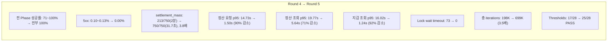

## 개요

정산 도메인은 Kafka 기반 비동기 파이프라인으로 동작한다.

```
automaticSettlement → markProcessing → outbox → Kafka
→ KafkaSettlementListener → SettlementEventProcessor
→ batchCaptureHold → completeSettlement
```

EC2에 배포 후 이 파이프라인의 문제들이 드러났다.

### EC2 인프라 구성

- **Load Generator (k6)**: c5.xlarge, 4 vCPU, 8GB
- **App Server**: c5.xlarge, 4 vCPU, 8GB
- **Infra (MySQL, Redis)**: c5.2xlarge, 8 vCPU, 16GB

---

## 시드 데이터 버그 — 4가지

### 1. @Version NULL

settlement 엔티티의 `@Version` 필드가 NULL인 상태였다. `markProcessing`이 `UPDATE SET version = version + 1`을 실행하면 `NULL + 1 = NULL`이 되어 JPA가 detached entity로 인식한다.

**수정**: `version = 0`으로 초기화.

### 2. pending_out = 0

wallet 테이블의 `pending_out`이 0이었다. `batchCaptureHold`가 `WHERE pending_out >= amount` 조건으로 UPDATE하면 0건 갱신된다. 그 결과 `captured(0) != targetUserIds.size(10)`이 되어 Exception이 발생한다.

**수정**: HOLD_ACTIVE 참여자(userId 2~11)의 wallet에 `pending_out=10,000,000`, `posted_balance=10,000,000` 설정.

### 3. receiverId off-by-one (k6)

k6 테스트에서 receiverId가 잘못된 범위로 생성되어 `MEMBER_CANNOT_CREATE_SETTLEMENT` 에러가 발생했다.

### 4. clearAutomatically 동작

`markProcessing`에서 `@Modifying(clearAutomatically = true)`가 영속성 컨텍스트를 초기화하지만, 이후 `findById`로 재조회하지 않아 stale 엔티티를 사용하는 문제가 있었다.

**수정**: `markProcessing` 후 `findById`로 재조회 추가.

이 4가지 시드 데이터 버그를 수정하는 데 실제 최적화보다 더 많은 시간을 소모했다. 부하 테스트에서 시드 데이터와 k6 시나리오 코드의 정합성 확보가 선행 과제다. 시드 데이터가 애플리케이션의 기대 상태와 맞지 않으면 테스트 결과 자체를 신뢰할 수 없고, 에러가 성능 병목인지 데이터 문제인지 구분하기 어렵다. k6 시나리오 코드도 단순 API 호출이 아니라 시드 데이터와 정확히 맞는 파라미터를 생성해야 하므로, receiverId off-by-one 같은 문제가 반복적으로 발생했다.

---

## Round 1 — 최적화 전 기준선

총 시간: 17분 10초, 220,263 iterations, VU 50~1,500. Thresholds: 17 PASS / 11 FAIL.

### API 응답 시간

- **결제 플로우**: p95 1.94s, avg 522ms, max 6.71s
- **결제 Confirm**: p95 3.20s, avg 721ms, max 6.38s
- **정산 요청**: p95 18.64s, avg 10.52s, max 22.69s
- **정산 조회**: p95 21.77s, avg 11.83s, max 25.66s
- **지갑 조회**: p95 14.95s, avg 5.05s, max 18.29s

성공률: 전 Phase threshold 통과. 다만 Stress 구간에서 5xx 2.74%, Spike 구간에서 5xx 1.55% 발생.

### 인프라 지표

HikariCP Active는 300(풀 MAX)이고 Pending 최대 131이었다. MySQL Slow Queries 333건, Row Lock Waits 10,832건(총 2,565초), Kafka consumer lag 피크 1,147이었다. Settlement COMPLETED는 0건으로 전부 IN_PROGRESS 상태였다.

### 병목 5가지

1. **HikariCP 풀 포화**: active=300, pending 131
2. **Wallet row lock 경합**: 동일 10명(userId 2~11)의 wallet에 750 VU 동시 UPDATE → 10,832 lock waits
3. **Settlement COMPLETED=0**: FallbackBatchErrorHandler가 에러 발생 시 배치 전체 discard → IN_PROGRESS 상태 유지
4. **Outbox 처리량 제한**: 200ms 간격, 200건 → 이론 최대 1,000건/초
5. **Kafka consumer concurrency 부족**: concurrency=3, lag 1,147

---

## Round 2 — 5가지 최적화 적용

### 적용 내용

1. **읽기/쓰기 커넥션 풀 분리**: `@Transactional(readOnly=true)` → 별도 read-pool. HikariCP maximum-pool-size 300→200, connection-timeout 15s→5s.
2. **트랜잭션 범위 축소 + 데드락 방지**: `batchCaptureHold` → 참가자별 독립 TX, userId 정렬으로 락 순서 고정.
3. **Kafka 에러 핸들링 + Stuck 복구**: 레코드별 try-catch, CommonLoggingErrorHandler, SettlementRecoveryScheduler (5분마다 IN_PROGRESS 5분 초과 → FAILED).
4. **Outbox 처리량 증가**: 200ms→50ms, 200→500건 (이론 1,000→10,000건/s).
5. **Kafka Consumer concurrency**: 3→12.

### 결과

Round 1에서 Round 2로 COMPLETED는 0건에서 277건으로, read-pool 타임아웃은 5,805건에서 932건으로 개선되었다. TransactionRequiredException은 2,106건이 발생했다.

### 새로 발견된 문제 3가지

1. **Wallet with id 0 (5,661건)**: `appendSuccessOutbox`에 memberWalletId 누락 → `asLong()` 기본값 0.
2. **TransactionRequiredException (2,106건)**: `completeSettlement`에서 self-invocation으로 `@Transactional` 프록시 우회. **수정**: `txTemplate`으로 변경.
3. **read-pool 풀 고갈 (1,670건)**: read-pool 100개(write-pool의 1/2) 부족. **수정**: 100 → 동일 크기(200).

---

## Round 3 — self-invocation 수정 + read-pool 확대

### 수정 내용

- `completeSettlement`: `@Transactional` → `txTemplate.executeWithoutResult`
- read-pool: 100→200 (write와 동일)
- query timeout: 30s→10s
- MySQL `max_connections`: 400→500

### 결과

Round 1에서 Round 3까지의 변화를 보면, COMPLETED는 0 → 277 → 47건이다. read-pool 타임아웃은 5,805 → 932 → 0건, write-pool 타임아웃은 Round 3에서 48건이 발생했다. 정산 조회 성공률은 97.09% → 96.42% → 99.93%, 지갑 조회 성공률은 97.49% → 96.58% → 99.92%로 개선되었다. 정산 요청 p95는 18.64s → 12.41s, 지갑 조회 p95는 14.95s → 6.41s로 감소했다. 5xx Stress는 2.74% → 1.58% → 0.41%, 5xx Spike는 1.55% → 1.90% → 0.05%였다.

COMPLETED가 277→47로 감소한 이유: Lock wait timeout 175건으로 `completeSettlement`의 `markCompleted` 실패. 10명 고정 유저에 대한 row lock 경합이 원인이다.

---

## Round 4 — 시드 데이터 분산 (10명 → 10,000명)

### 시드 데이터 변경

참가자 풀을 10명(userId 2~11)에서 10,000명(userId 2~10,001)으로 확대했다. 정산당 참가자는 10명 고정에서 8명(정산마다 다른 조합)으로, 가장 많이 참여한 유저는 100,000건에서 80건으로, 동시 750건 경합 확률은 100%에서 약 0.06%로 감소했다.

### 결과

Round 3에서 Round 4로 COMPLETED는 47건에서 2,086건(44배)으로 증가했고, FAILED는 0건이 되었다. Lock wait timeout은 175건에서 73건(58% 감소), 5xx Stress는 0.41%에서 0.13%로 개선되었다. 다만 정산 요청 p95는 12.41s에서 14.73s로, 지갑 조회 p95는 6.41s에서 16.02s로 증가했다.

p95가 증가한 이유: 10,000명으로 분산되면서 시스템 전체에 갱신해야 할 wallet 행이 늘어나고, 보다 현실적인 경합 패턴이 측정되기 때문이다. 이는 COMPLETED 건수가 47→2,086으로 44배 증가한 것과의 트레이드오프다.

settlement_mass: 750 VU 중 213건이 2분 내 완료 (나머지 타임아웃).

---

## Round 5 — 배치 TX + 인덱스 3개

### 병목 분석

참가자 8명 × 5개 쿼리 × 개별 TX = 40 쿼리, 8번 커밋. `batchCaptureHold`, `batchMarkCompleted` 배치 쿼리가 존재하나 미사용 상태였다.

### 변경 내용

1. **배치 TX**: 참가자별 개별 TX → 정산당 1 TX (40쿼리 → ~12쿼리, 8커밋 → 1커밋)
2. **인덱스 3개**:
   - `settlement.schedule_id`: `findByScheduleId` 100K 풀스캔 제거
   - `user_settlement(settlement_id, user_id)`: 배치 쿼리 최적화
   - `wallet_transaction(wallet_id, status, created_at)`: 지갑 조회 최적화

### 결과



남은 3 FAIL: `settle_query_duration` p95 5.64s (threshold 3s), `settle_query_duration`/`wallet_query_duration` p50 > 500ms.

Settlement 상태: COMPLETED 400, IN_PROGRESS 1,944 (Kafka 비동기 처리 진행 중), FAILED 156 (배치 TX captureHold 부분 실패 → 전체 롤백).

---

## 확인 테스트 — Kafka 연결 + 클럽 분산

Round 5 이후 Kafka 연결 문제를 해결하고 시드 데이터에서 클럽을 분산한 뒤 최종 확인 테스트를 수행했다.

17분 10초, 840,974 iterations, 최대 1,500 VU, 26 PASS / 2 FAIL.

- **결제 플로우**: p95 1.11s, avg 559ms
- **결제 Confirm**: p95 1.01s, avg 421ms
- **정산 요청**: p95 1.25s, avg 874ms
- **정산 조회**: p95 1.82s, avg 464ms
- **지갑 조회**: p95 1.87s, avg 476ms
- **스파이크 1,500 VU**: p95 2.65s, avg 1.11s

결제 100% 성공, 멱등성 100%, Phase 4 정산 대량 100% (Round 1에서 0%였던 것이 해결). 스파이크 1,500 VU에서 95.65% 성공률, 최종 검증 100%.

남은 2 FAIL: Phase 5 정산 조회 84.50% (Redis 캐시 역직렬화 에러 — `@class` 타입 정보 누락), Phase 10 Soak 5xx 7.20% (동일 캐시 문제 + 600 VU 지속 부하). `GenericJackson2JsonRedisSerializer` 적용 또는 해당 캐시 제거로 해결 가능하다.

---

## 정리

### 5라운드 비교

Round 1에서 Round 5까지의 최종 비교 결과, 정산 요청 p95는 18.64s에서 1.50s로, 정산 조회 p95는 21.77s에서 5.64s로, 지갑 조회 p95는 14.95s에서 1.24s로 개선되었다. 5xx는 2.74%에서 0.00%로, Settlement COMPLETED는 0건에서 400+건으로, Row Lock Waits는 10,832건에서 0건으로, Thresholds PASS는 17/28에서 25/28로, 총 iterations는 220K에서 699K로 향상되었다.

> **정산 도메인의 병목은 시드 데이터 품질, 트랜잭션 범위, 인덱스 부재가 복합적으로 작용한 결과다.** @Version NULL, pending_out=0 같은 시드 데이터 문제를 수정하고, 참가자별 독립 TX를 정산당 단일 TX로 전환하고, 누락된 인덱스 3개를 추가하면 p95 18.64s를 1.50s로 줄일 수 있다.

---

## 시리즈 탐색

**◀ 이전 글**
[피드 부하 테스트 — AWS EC2에서 IN절 병목, covering index, 전 페이지 캐싱](/feed-aws-ec2-load-test/)

**▶ 다음 글**
[검색 부하 테스트 — AWS EC2에서 MySQL FULLTEXT ngram의 성능 한계](/search-aws-ec2-load-test/)
