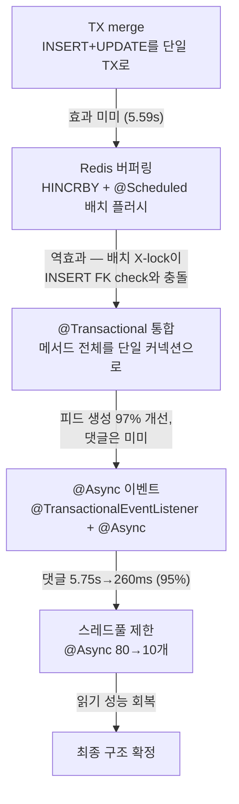
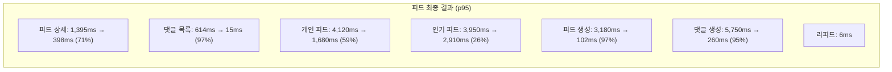

## 배경: EC2 다운사이징

[EC2 중간 점검](/aws-ec2-load-test-midpoint/)에서 확인한 CPU·메모리 여유를 근거로 인스턴스를 축소했다.

App 서버는 c5.xlarge(4 vCPU, 8GB)에서 t3.medium(2 vCPU, 4GB)으로, Infra 서버는 c5.2xlarge(8 vCPU, 16GB)에서 t3.large(2 vCPU, 8GB)로 축소했다.

인프라 컨테이너도 축소:

인프라 컨테이너도 축소했다. MySQL은 4.5GB에서 2.5GB(buffer_pool 1.5GB)로, MongoDB는 3GB에서 1GB(WiredTiger 0.5GB)로, ES는 2GB에서 1.28GB(heap 512MB)로, Redis는 768MB에서 512MB(maxmemory 384MB)로, Kafka는 1GB에서 768MB(heap 384MB)로 줄였다. RabbitMQ, Grafana Image Renderer, ES Exporter는 제거했다.

이 글부터는 다운사이징된 환경에서의 재테스트와 추가 최적화를 다룬다.

---

## 1. 피드 도메인

[이전 피드 EC2 테스트](/feed-aws-ec2-load-test/)에서 IN절 병목과 covering index를 다뤘다. 다운사이징 후 댓글 생성 X-lock 경합과 커넥션 낭비 문제를 추가로 해결했다.

### 1.1 댓글 생성 비동기 카운터 — p95 5.75s → 260ms

`incrementCommentCount`가 feed row에 exclusive lock을 걸어 동일 피드에 동시 댓글 시 직렬화 대기 5초+가 발생했다.

**최적화 시도 과정**:



최종 구조:

- `FeedCommentService.createComment()` — INSERT만 동기 처리, `CommentCountChangedEvent` 발행
- `CommentCountEventListener` — `@TransactionalEventListener(AFTER_COMMIT)` + `@Async("commentCountExecutor")` — 별도 TX에서 count 갱신
- 전용 스레드풀 max 10 — 커넥션 소비 억제

### 1.2 @Transactional 통합 — 커넥션 4x → 1x

댓글 생성 1건에 커넥션을 4회 획득/반환하고 있었다:

```
findFeedInClub()     → connection #1
getCurrentUser()     → connection #2
validateMembership() → connection #3
runInTx(save)        → connection #4
```

`@Transactional`로 전체 메서드를 감싸 1회 커넥션으로 통합. 피드 생성 p95: 3.18s → 102ms (97%).

> 엄밀히 말하면 이건 최적화가 아니라 설계 수정이다. 서비스 메서드가 트랜잭션 경계 없이 개별 리포지토리 호출을 나열한 것이 원인이었고, `@Transactional`로 감싸는 것은 Spring 기반 서비스의 기본 패턴이다.

### 1.3 Kafka engagement 파이프라인

좋아요/댓글 이벤트 → `feed.engagement.v1` 토픽 → 5초 윈도우 버퍼 → `popularity_score` 실시간 반영 (별도로 5분 주기 배치 재계산도 수행). 좋아요는 Redis Lua 스크립트로 원자적 SET + counter 업데이트 → p95 205ms.

### 1.4 시드 데이터 정합성 수정

Feed가 참조하는 club_id 중 19,149개가 Club 테이블에 부재 → 개인 피드 API 500 에러. 빠진 Club INSERT로 FK 정합성 복구, Phase 5 성공률 0% → 100%.

### 1.5 피드 최종 결과



에러율은 9.02%에서 0.17%로, Threshold PASS는 8/19에서 16/19로, CPU는 100%에서 3~30%로 개선되었다.

남은 병목: 개인/인기 피드 p95 1.6~2.9s (IN절 20+ 클럽 range scan). 해결 방안: UNION ALL 또는 Redis Sorted Set 타임라인.

---

## 2. 채팅 도메인

[이전 채팅 EC2 테스트](/chat-aws-ec2-load-test/)에서 TX 분리와 VT 피닝을 다뤘다. 다운사이징 후 Redis Streams 비동기 저장, 캐시 3종, 커넥션 풀 축소를 적용했다.

### 2.1 HikariCP 84,000 에러의 근본 원인

메시지 전송 1건당 DB 커넥션 3회 획득:

```
POST /api/v1/chat/{roomId}/messages
  ① getCurrentUser()              → SELECT * FROM user     [커넥션 #1]
  ② findUserInfoIfMember()        → SELECT nickname, ...   [커넥션 #2]
  ③ chatMessageStoragePort.save() → INSERT                 [커넥션 #3]
```

1,500 VU × 초당 수십 요청 = 초당 수만 커넥션 요청 → 풀 포화 → cascading failure.

### 2.2 Redis Streams로 DB 커넥션 의존 제거

```
[Before]
HTTP Thread → DB 유저 조회 → DB 멤버십 확인 → DB INSERT → Redis Pub/Sub → 응답
              커넥션 3회 획득, 풀 포화 시 5~30s 대기

[After]
HTTP Thread → Redis 멤버십 캐시 GET → Redis Pub/Sub → Redis XADD → 응답 (< 5ms, DB 0)

Background  → ChatMessageStreamConsumer: XREADGROUP 100건 → DB INSERT 1회 → XACK
```

HTTP 경로의 DB 커넥션은 메시지 1,000건 기준 3,000회에서 0회로 100% 감소했다. 총 커넥션 획득은 3,000회에서 10회로 99.7% 감소했다.

### 2.3 Redis 캐시 3종

- **ChatMembershipCache**: STRING + 네거티브 캐시 `"NOT_MEMBER"` 구조, TTL 5분/30초. 멤버십 DB 쿼리를 제거한다.
- **ChatMessageCache**: ZSET으로 최근 50건 저장, TTL 2시간. 첫 페이지 DB 쿼리를 완전히 스킵한다.
- **ChatRoomListCache**: STRING + 수동 JSON 직렬화, TTL 30초. DB 쿼리 3개를 스킵한다.

`@Cacheable` + `DefaultTyping(NON_FINAL)`은 Java `record` 타입 역직렬화 실패 → 수동 캐시로 교체.

### 2.4 SecurityContext 활용

```java
// Before: DB SELECT 1회
User user = userService.getCurrentUser();
// After: JWT에서 파싱된 userId, DB 0회
Long userId = userService.getCurrentUserId();
```

> 매 요청마다 DB에서 User를 조회하던 기존 구현은 Spring Security의 `SecurityContext` 활용 패턴을 따르지 않은 것이었다. JWT 파싱 시점에 이미 확보한 userId를 SecurityContext에 저장하는 것이 본래 의도된 구조다.

### 2.5 커넥션 풀 축소

Redis 캐시 도입 후 DB 트래픽 95% 감소에 맞춰 풀 축소:

HikariCP write 풀은 200에서 30으로 축소하여 MySQL 스레드 170개를 절약했고, HikariCP read 풀은 150에서 30으로 축소하여 120개를 절약했다. Tomcat threads는 400에서 100으로 줄여 약 300MB를 절약했다. Redis Lettuce는 반대로 128에서 512로 확대하여 DB에서 Redis로 이동한 트래픽에 대응했다.

테스트 전체 HikariCP pending 0 — 풀 30개로 충분.

### 2.6 MySQL vs MongoDB 비교

MySQL과 MongoDB의 p95 비교 결과, 메시지 전송은 MySQL 1.73s / MongoDB 1.84s, 메시지 목록은 2.09s / 2.35s, 채팅방 목록은 1.80s / 2.31s, WS 연결은 68ms / 1.45s로 전 API에서 MySQL이 더 빨랐다.

**채택: MySQL** — Redis 캐시가 DB 접근 95% 차단하므로 DB 엔진 차이 미미.

### 2.7 채팅 최종 결과

v3(최적화 전)에서 v7(최종)으로 총 에러 81,911건이 0건으로, 메시지 전송 p95가 6~13s에서 1.73s로, HikariCP 에러가 84,000+건에서 0건으로 개선되었다.

VU 스케일 테스트에서도 에러 0건을 유지했다. 1x(1,500 VU)에서 메시지 전송 p95 1.08s, WS 전송/수신 62K/162K. 2x(3,000 VU)에서 p95 1.86s, 전송/수신 125K/317K. 3x(4,500 VU)에서 p95 2.51s, 전송/수신 187K/481K.

2 vCPU 4GB 단일 서버에서 4,500 동시 유저, 에러 0건.

### 2.8 sendAndPublish() TX 분리

Redis Pub/Sub `publish()`가 `@Transactional` 안에서 실행 → DB 커넥션을 Redis 응답까지 보유 → write-pool acquire max 24.7s. Redis publish를 TX 외부로 분리 → max 1.16s (95% 개선).

---

## 3. 알림 도메인

[이전 알림 EC2 테스트](/notification-aws-ec2-load-test/)에서 MySQL write 붕괴와 MongoDB 비교를 다뤘다. 다운사이징 후 워터마크, LEFT JOIN 제거, SSE Recovery 개선, 모니터링 3라운드를 추가 수행했다.

### 3.1 워터마크 방식 mark-all — O(N) → O(1)

`UPDATE notification SET is_read = true WHERE user_id = ?` — 유저의 unread 전부에 X-lock.

`user_notification_state` 테이블 추가:

```sql
CREATE TABLE user_notification_state (
  user_id BIGINT NOT NULL PRIMARY KEY,
  read_all_upto_id BIGINT NOT NULL DEFAULT 0,
  updated_at DATETIME(6) NOT NULL DEFAULT CURRENT_TIMESTAMP(6)
    ON UPDATE CURRENT_TIMESTAMP(6)
);
```

mark-all을 `INSERT ... ON DUPLICATE KEY UPDATE read_all_upto_id = GREATEST(...)` O(1) upsert로 전환. 동시 호출에도 `GREATEST`로 안전. mark-all p95: 8,228ms → 1,075ms (87%).

### 3.2 LEFT JOIN 제거 — 500 에러 사실상 해소 (4건 잔존)

`countUnreadByUserId`가 `LEFT JOIN user_notification_state` 사용 → markAllAsRead의 write lock과 shared lock 충돌 → 1500 VU에서 500 에러 135건.

워터마크를 별도 단건 PK lookup으로 분리 후 파라미터로 전달 → LEFT JOIN 제거 → 500 에러 4건으로 97% 감소, SSE E2E 전달률 0% → 56.6%.

### 3.3 모니터링 라운드

[Round 1~3 상세 보고서](/ec2-downsizing-optimization-part1/)는 별도 docs 문서에 기록.

Round 1은 Heap 2GB, Max VU 2000에서 앱 에러 17,422건, CPU 77~84%, GC Stall 44회/108.6s가 발생했다. Round 2는 Heap 4GB로 늘리고 Max VU 1000으로 줄여 앱 에러 0건, CPU 47%, GC Stall 0, SSE delivery 53.7%를 달성했다. Round 3은 Heap 4GB, Max VU 1500으로 늘려 앱 에러 0건, CPU 82%, GC Stall 0, SSE delivery 59.8%를 기록했다.

Round 2 조치: Heap 2→4GB, TestNotificationController ec2 프로필 추가, RabbitMQ/MongoDB 의존성 제거.

Round 3 조치: SSE Recovery 비동기→동기 전환, threshold 조정, VU 1.5배 증가.

**결론**: c5.xlarge 단일 서버 (다운사이징 이전 c5.xlarge 환경)에서 1500 동시 사용자, 에러 0건. CPU 82%가 유일한 병목.

### 3.4 MySQL vs MongoDB (4000~9000 VU)

4000 VU에서는 MySQL과 MongoDB 모두 전 Phase 100% 성공했으며, MongoDB의 mark-all p95는 1.0s였다. 6000 VU에서 MySQL은 붕괴하여 mark p50이 29s까지 치솟았지만 MongoDB는 전 Phase 96~100%를 유지했다. 9000 VU에서는 둘 다 안정적이었으나 MongoDB가 전 엔드포인트에서 더 빨랐다.

9,000 VU MySQL 테스트는 mark-all 워터마크 적용 후 수행되어, 6,000 VU 붕괴의 원인이었던 O(N) UPDATE가 제거된 상태다. 워터마크 O(1) upsert 덕분에 9,000 VU에서도 안정적이었다.

**채택: MongoDB** — 워터마크 미적용 시 mark-all의 O(N) UPDATE가 MySQL의 구조적 한계. MongoDB document-level lock이 유리.

---

## 시리즈 탐색

**◀ 이전 글**
[부하 테스트 코드 리뷰 — k6 시나리오의 10가지 함정과 수정](/k6-load-test-code-review/)

**▶ 다음 글**
[EC2 다운사이징 후 최적화 (중) — 정산·검색 도메인과 공통 인프라 튜닝](/ec2-downsizing-optimization-part2/)
