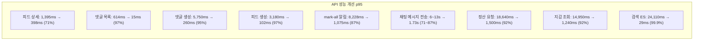
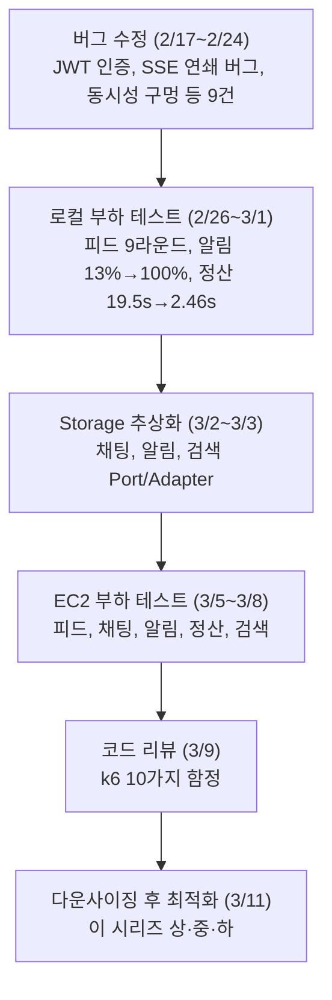

---

## 1. 도메인별 최종 기술 스택

- **피드**: DB는 MySQL, 메시지 큐는 Kafka(engagement), 캐시는 Redis(첫 페이지, popularity)
- **채팅**: DB는 MySQL, 메시지 큐는 Redis Streams(비동기 저장) + Redis Pub/Sub(실시간), 캐시는 Redis 캐시 3종
- **알림**: DB는 MongoDB, 메시지 큐는 Spring Events, 캐시는 Redis(SSE 레지스트리, 미전달 캐시)
- **검색**: DB는 ES(MySQL 폴백), 메시지 큐 없음, 캐시는 Redis
- **정산**: DB는 MySQL, 메시지 큐는 Kafka + Outbox, 캐시 없음(분산 락/게이트만)

### 선택 근거

**채팅 — MySQL 채택**: Redis 캐시가 DB 접근 95% 차단. MongoDB 드라이버 오버헤드만 추가되어 MySQL이 전 API에서 6~28% 빠르고, WS 연결은 21배 빠름.

**알림 — MongoDB 채택**: mark-all의 `UPDATE ... WHERE user_id = ?`가 MySQL에서 O(N) row lock. 6000 VU에서 MySQL은 mark p50 29s로 붕괴, MongoDB는 document-level lock으로 안정.

**검색 — ES 채택**: 키워드 검색 p95 29ms vs 24.11s (830배). MySQL FULLTEXT는 ES 불가 시 폴백용.

**정산 — R/W 분리 제거**: 단일 MySQL에서 R/W 풀 분리는 커넥션 수만 늘려 역효과 (지갑 조회 648% 악화). read replica 추가 시에만 유효.

---

## 2. 코드 리뷰 수정사항 (11건)

### 수정 완료

1. **NotificationService 모놀리식** (Critical): CQRS 분리 (Command + Query + Facade)
2. **@Transactional 내 이벤트 발행** (Critical): `@TransactionalEventListener(AFTER_COMMIT)` 확인 -- 이미 안전
3. **Pagination 무제한 파라미터** (High): `@Validated` + `@Min`/`@Max` 추가
4. **DataIntegrityViolation 미처리** (High): `@ExceptionHandler` → HTTP 409
5. **Notification userId 필드 중복** (Critical): 중복 `Long userId` 필드 제거
6. **RedisTemplate null 체크** (Medium): dead code 제거
7. **Native SQL → JPQL** (High): 3개 쿼리 전환 (`ON DUPLICATE KEY UPDATE` 제외)
8. **SSE Delivery E2E 미검증** (Enhancement): Phase 6b 추가 -- 알림 생성→SSE 실제 전달 검증
9. **Finance 시드 pending_out 불일치** (Critical): 참여자 wallet `pending_out` 정합성 복구
10. **AUTO_INCREMENT 드리프트** (High): `resolve_db_offsets()` -- DB 실제값 자동 감지
11. **k6 디렉토리 정리** (Enhancement): 불필요 파일 7개 제거

### 식별 but 미수정 (5건)

- **Toss API circuit breaker**: Resilience4j 도입 필요
- **Redis Lua가 DB TX 밖**: 설계상 의도
- **@WebMvcTest 부재**: 다음 스프린트
- **onlyone-common 테스트 0**: 유틸 클래스
- **Club 모듈 테스트 2건**: 통합 테스트로 커버

---

## 3. 전체 성과 요약

### API 성능 개선 (p95)

위 수치는 모두 t3.medium(2 vCPU, 4GB) + t3.large(2 vCPU, 8GB) 단일 인스턴스 기준이다. 피드 개인/인기 p95 1.6~2.9s, 채팅 4,500 VU 이상에서의 응답 시간 증가는 코드 최적화로 해결할 수 없는 단일 인스턴스의 물리적 한계다. 수평 확장(ALB + 다중 인스턴스)은 비용($65/월) 제약으로 미수행 상태이며, 다음 단계 과제로 남아 있다.

### 인프라 개선

알림 에러는 17,422건에서 0건으로, 채팅 에러는 81,911건에서 0건으로, 피드 에러율은 9.02%에서 0.17%로, 정산 5xx는 2.74%에서 0.00%로 개선되었다. CPU는 100% 포화 상태에서 3~30%로, GC Stall은 44회/108.6s에서 0으로, 채팅 DB 커넥션은 메시지 1K건 기준 3,000회에서 10회로 감소했다. EC2 비용은 c5.xlarge + c5.2xlarge에서 t3.medium + t3.large로 70% 절감되었다.

### 적용 기술 스택

- **JVM**: ZGC Generational (G1GC 대비 CPU 70%p 절감)
- **DB 인덱스**: 복합 인덱스 10종+ 추가
- **캐시**: Redis 캐시 14종 + 커스텀 캐시 3종
- **비동기**: Redis Streams, Kafka, @Async 이벤트
- **사전계산**: popularity_score 5분 주기 배치 갱신
- **페이징**: 커서 기반 pagination (OFFSET 제거)
- **커널**: TCP 버퍼/keepalive/backlog 튜닝
- **보안**: JWT Parser 싱글턴 캐싱 (ClassLoader lock 제거)

---

## 4. 후기 — 3주간의 작업을 마치며

### 문서화는 그때그때 해야 한다

이 시리즈를 쓰면서 가장 후회한 건 문서화를 미룬 것이다. 작업하면서 바로 기록했어야 할 것들을 나중에 한번에 정리하려 했더니, 맥락이 날아가고 숫자가 안 맞고 흐름이 끊겼다. "나중에 정리하지"는 "영원히 정리 안 함"과 같다. 다음부터는 커밋 단위로 기록한다.

### 테스트 코드의 부재는 결국 비용이 된다

성능 테스트와 리팩토링에 몰두하다 보면 단위 테스트를 등한시하게 된다. "어차피 k6으로 돌리면 되지"라고 생각했는데, 그건 착각이었다. 성능을 위해 구조를 변경하고, 비동기로 전환하고, 캐시를 끼우는 과정에서 기존 동작이 깨졌는지 확인할 방법이 k6밖에 없었다. k6을 한 번 돌리려면 시드 데이터 세팅, 인프라 기동, 수 분의 테스트 실행이 필요하다. 단위 테스트가 있었으면 몇 초 만에 확인할 수 있는 걸, EC2 비용을 쓰면서 수십 분씩 기다렸다.

정산 시드 데이터의 `pending_out=0` 버그, 피드의 삭제된 Club FK, 검색의 double encoding — 이런 것들로 날린 시간이 전체 작업의 체감 30%는 된다. 테스트 코드가 있었으면 시드 데이터 문제는 로컬에서 즉시 잡혔을 것이고, EC2 비용 $65의 상당 부분은 아낄 수 있었다. 테스트 코드 부재는 기술 부채가 아니라 실제 비용이다.

### Kafka는 생각보다 쓸 자리가 없었다

다들 Kafka를 얘기하길래 어디든 쓸 수 있을 거라 생각했는데, 막상 정산 Outbox 외에는 Kafka가 필수인 지점을 찾지 못했다. 채팅은 Redis Streams + Pub/Sub가 지연 시간과 인프라 비용 면에서 더 적합했고, 알림은 Spring Events로 충분했다. "이 기술을 써야 한다"가 아니라 "이 문제에 뭐가 맞는가"가 먼저라는 걸 체감했다.

### 다음 과제

- **테스트 코드 보강**: 특히 인증/인가 흐름과 common 모듈 — 이번에 가장 많은 버그가 나온 영역
- **WebFlux**: 현재 Spring MVC + Virtual Thread 기반인 알림 SSE를 WebFlux로 재구현해서 비교해보고 싶다
- **수평 확장**: 단일 인스턴스 한계를 확인했으니, ALB + 다중 인스턴스 구성을 시도할 차례다

---

## 시리즈 전체 흐름

---

## 시리즈 탐색

**◀ 이전 글**
[EC2 다운사이징 후 최적화 (중) — 정산·검색 도메인과 공통 인프라 튜닝](/ec2-downsizing-optimization-part2/)

**▶ 다음 글**
[Phase 5 — 프로덕션 하드닝: 48건 수정, Chaos Monkey, A/B 테스트 인프라](/production-hardening-chaos-engineering/)
