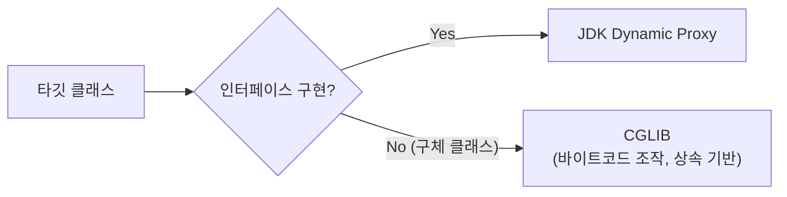

## 들어가며

`@Transactional`을 붙였는데 트랜잭션이 안 걸린 적이 있다. 같은 클래스 안에서 `this.method()`를 호출하면 프록시를 거치지 않는 self-invocation 문제였는데, 초반에 꽤 여러 번 당했다. 왜 프록시가 끼어드는지, 왜 `this` 호출은 프록시를 우회하는지 — 이걸 제대로 이해하려면 프록시가 어떻게 진화해왔는지를 처음부터 따라가야 했다.

토비의 스프링 1권은 1장부터 **관심사의 분리**를 일관되게 밀고 간다. DB 커넥션을 가져오는 코드가 DAO에 섞이는 것(1장), 변하는 것과 변하지 않는 것을 전략 패턴으로 분리하는 것(3장 템플릿), 트랜잭션 기술을 추상화하는 것(5장 서비스 추상화) — 이 흐름의 종착지가 6장 AOP다.

이 글은 토비의 스프링 1권 6장의 절 순서를 따르고, 2권 내용으로 보충한다. 글이 길어서 상편(1~4절: 프록시 진화)과 하편(5~9절: 트랜잭션 속성 + AspectJ + 실무 함정)으로 나뉜다. 프록시 원리만 궁금하면 상편까지 읽으면 된다.

**이 글은 상편이다.**

---

## 1. 트랜잭션 코드의 분리

5장에서 `UserService`에 트랜잭션 경계설정을 적용했다. `PlatformTransactionManager`를 DI 받아 직접 트랜잭션을 관리하는 코드다.

```java
// 1권 5장 — 트랜잭션이 섞인 UserService
public void upgradeLevels() {
    TransactionStatus status = transactionManager.getTransaction(
        new DefaultTransactionDefinition());
    try {
        List<User> users = userDao.getAll();
        for (User user : users) {
            if (canUpgradeLevel(user)) upgradeLevel(user);
        }
        transactionManager.commit(status);
    } catch (RuntimeException e) {
        transactionManager.rollback(status);
        throw e;
    }
}
```

문제가 명확하다. **비즈니스 로직**(레벨 업그레이드)과 **트랜잭션 경계설정**이 한 메서드에 뒤섞여 있다.

책에서는 이것을 두 개의 책임으로 분리한다. `UserService` 인터페이스를 도입하고, 비즈니스 로직은 `UserServiceImpl`에, 트랜잭션은 `UserServiceTx`에 둔다.

```java
// 1권 6.1 — 인터페이스 도입
public interface UserService {
    void add(User user);
    void upgradeLevels();
}
```

```java
// 비즈니스 로직만 담당
public class UserServiceImpl implements UserService {
    public void upgradeLevels() {
        List<User> users = userDao.getAll();
        for (User user : users) {
            if (canUpgradeLevel(user)) upgradeLevel(user);
        }
    }
}
```

```java
// 트랜잭션 경계설정만 담당 — 데코레이터 패턴
public class UserServiceTx implements UserService {
    private UserService target;
    private PlatformTransactionManager transactionManager;

    public void upgradeLevels() {
        TransactionStatus status = transactionManager.getTransaction(
            new DefaultTransactionDefinition());
        try {
            target.upgradeLevels();  // 핵심 로직은 위임
            transactionManager.commit(status);
        } catch (RuntimeException e) {
            transactionManager.rollback(status);
            throw e;
        }
    }

    public void add(User user) {
        target.add(user);  // 단순 위임
    }
}
```

클라이언트는 `UserService` 인터페이스에만 의존하고, 스프링 DI가 런타임에 `UserServiceTx` → `UserServiceImpl` 체인을 연결한다. 이 구조가 가능한 이유가 **DI**다 — 1장부터 DI를 강조해온 이유가 여기서 결실을 맺는다.

### 남는 문제

- `UserService`에 메서드가 10개면, `UserServiceTx`에도 10개를 전부 구현해야 한다. `add()`처럼 트랜잭션과 무관한 메서드도 **단순 위임 코드를 빠짐없이 작성**해야 한다.
- `OrderService`, `PaymentService`에도 트랜잭션이 필요하면? 서비스마다 `XxxServiceTx` 클래스를 만들어야 한다 — **클래스 폭발**.

---

## 2. 다이나믹 프록시와 팩토리 빈

### 프록시와 프록시 패턴

책에서는 먼저 용어를 정리한다.

- **프록시**: 클라이언트와 타깃 사이에서 대리 역할을 하는 오브젝트. 클라이언트는 타깃을 직접 호출한다고 생각하지만, 실제로는 프록시가 요청을 받아 처리한다.
- **타깃**: 프록시가 위임하는 실제 오브젝트.
- **데코레이터 패턴**: 타깃에 **부가 기능을 추가**하는 목적으로 프록시를 사용.
- **프록시 패턴**: 타깃에 대한 **접근을 제어**하는 목적으로 프록시를 사용.

`UserServiceTx`는 트랜잭션이라는 부가 기능을 추가하므로 데코레이터 패턴에 해당한다.

### 리플렉션

책에서는 다이나믹 프록시를 설명하기 전에 `java.lang.reflect`의 기초를 먼저 짚는다. `Method.invoke()`로 메서드를 호출할 수 있다는 것, 그리고 이 리플렉션이 다이나믹 프록시의 핵심 메커니즘이라는 것을 보여준다.

```java
Method method = String.class.getMethod("length");
int length = (int) method.invoke("Spring");  // 6
```

### JDK 다이나믹 프록시

프록시 클래스를 개발자가 만들지 않는다. **JVM이 런타임에 프록시 객체를 생성**하고, 모든 메서드 호출을 `InvocationHandler.invoke()` 하나로 모은다.

책에서는 `Hello` 인터페이스 예제로 먼저 동작을 보여준 뒤, `UserService`에 적용한다.

```java
// 1권 6.3 — 트랜잭션 InvocationHandler
public class TransactionHandler implements InvocationHandler {
    private Object target;  // 타입 제한 없음 — 어떤 타깃이든 적용 가능
    private PlatformTransactionManager transactionManager;
    private String pattern;  // 트랜잭션 적용 메서드 이름 패턴

    public Object invoke(Object proxy, Method method, Object[] args)
            throws Throwable {
        if (method.getName().startsWith(pattern)) {
            return invokeInTransaction(method, args);
        }
        return method.invoke(target, args);
    }

    private Object invokeInTransaction(Method method, Object[] args)
            throws Throwable {
        TransactionStatus status = transactionManager.getTransaction(
            new DefaultTransactionDefinition());
        try {
            Object result = method.invoke(target, args);
            transactionManager.commit(status);
            return result;
        } catch (InvocationTargetException e) {
            transactionManager.rollback(status);
            throw e.getTargetException();
        }
    }
}
```

`target`이 `Object` 타입이라는 게 핵심이다. `UserService`든 `OrderService`든 어떤 인터페이스든 하나의 `TransactionHandler`로 프록시를 만들 수 있다. **클래스 폭발 문제가 해결**된다.

### 흔한 오해

"동적 프록시는 원하는 메서드만 구현한다" — 틀린 이해다.

프록시는 인터페이스의 **모든 메서드를 생성**한다. `add()`, `upgradeLevels()`, `get()` 전부 프록시 메서드가 만들어진다. 차이는 부가 기능을 적용할지 여부를 `invoke` 내부에서 **조건으로 결정**한다는 것이다.

**UserServiceTx(수동 프록시)** 방식에서는 메서드를 개발자가 직접 작성하고, 부가 기능도 메서드별로 코드를 작성하며, 타깃 타입이 `UserService` 전용이다. 반면 **TransactionHandler(동적 프록시)** 방식에서는 메서드를 JVM이 자동 생성하고, 부가 기능 적용 여부를 `invoke()` 내부에서 pattern 매칭으로 결정하며, 타깃 타입이 `Object`이므로 어떤 서비스든 재사용할 수 있다.

### 다이나믹 프록시를 위한 팩토리 빈

`TransactionHandler`와 다이나믹 프록시는 스프링 빈으로 등록할 수 없다. `Proxy.newProxyInstance()`가 반환하는 오브젝트의 클래스를 미리 알 수 없기 때문이다.

책에서는 **팩토리 빈**(`FactoryBean` 인터페이스)을 도입해 이 문제를 해결한다. `getObject()`에서 다이나믹 프록시를 생성해 반환하면, 스프링이 그 프록시를 빈으로 등록한다.

```java
// 1권 6.3 — TxProxyFactoryBean
public class TxProxyFactoryBean implements FactoryBean<Object> {
    Object target;
    PlatformTransactionManager transactionManager;
    String pattern;
    Class<?> serviceInterface;  // 프록시가 구현할 인터페이스

    public Object getObject() throws Exception {
        TransactionHandler txHandler = new TransactionHandler();
        txHandler.setTarget(target);
        txHandler.setTransactionManager(transactionManager);
        txHandler.setPattern(pattern);

        return Proxy.newProxyInstance(
            getClass().getClassLoader(),
            new Class[]{serviceInterface},
            txHandler
        );
    }

    public Class<?> getObjectType() { return serviceInterface; }
    public boolean isSingleton() { return false; }
}
```

### 팩토리 빈의 한계

`TxProxyFactoryBean`은 타깃 오브젝트마다 설정을 하나씩 만들어야 한다. `UserService`, `OrderService` 각각에 `TxProxyFactoryBean` 빈 정의가 필요하다. 또한 `TransactionHandler`가 프록시 팩토리 빈 하나당 새로 만들어지므로 **부가 기능의 재사용이 어렵다**.

---

## 3. 스프링의 프록시 팩토리 빈

다음으로 스프링이 제공하는 `ProxyFactoryBean`으로 넘어간다. 직접 만든 `TxProxyFactoryBean`과 이름이 비슷하지만 근본적으로 다르다.

### Advice — 부가 기능

스프링의 `ProxyFactoryBean`은 부가 기능을 `InvocationHandler`가 아닌 **`MethodInterceptor`**(Advice)로 구현한다. 결정적 차이: `MethodInterceptor`는 **타깃 정보를 가지고 있지 않다.**

```java
// 1권 6.4 — MethodInterceptor
public class TransactionAdvice implements MethodInterceptor {
    PlatformTransactionManager transactionManager;

    public Object invoke(MethodInvocation invocation) throws Throwable {
        TransactionStatus status = transactionManager.getTransaction(
            new DefaultTransactionDefinition());
        try {
            Object result = invocation.proceed();  // 타깃 호출을 위임
            transactionManager.commit(status);
            return result;
        } catch (RuntimeException e) {
            transactionManager.rollback(status);
            throw e;
        }
    }
}
```

`InvocationHandler.invoke()`는 `target.method.invoke(target, args)`로 타깃을 직접 호출했다. 반면 `MethodInterceptor.invoke()`는 `invocation.proceed()`로 **타깃 호출을 프레임워크에 위임**한다. 이 덕분에 Advice는 타깃과 독립적이고, **여러 프록시에서 공유**할 수 있다.

책에서 강조하는 핵심: **템플릿/콜백 패턴**이다. `ProxyFactoryBean`이 템플릿, `MethodInterceptor`가 콜백. 3장에서 배운 패턴이 여기서 재등장한다.

### Pointcut — 적용 대상 선정

부가 기능(Advice)과 적용 대상 선정(Pointcut)을 분리한다.

```java
// 1권 6.4 — Pointcut
NameMatchMethodPointcut pointcut = new NameMatchMethodPointcut();
pointcut.setMappedName("upgrade*");
```

### Advisor — Advice + Pointcut

```java
// 1권 6.4 — Advisor = Advice + Pointcut
ProxyFactoryBean pfBean = new ProxyFactoryBean();
pfBean.setTarget(userServiceImpl);
pfBean.addAdvisor(new DefaultPointcutAdvisor(pointcut, advice));

UserService proxy = (UserService) pfBean.getObject();
```

책의 정의: **Advisor는 "한 가지 부가 기능을 어디에 적용할지를 명확히 담은 오브젝트"**다.

왜 Advice와 Pointcut을 묶어서 Advisor로 만드는가? 여러 Advisor를 하나의 `ProxyFactoryBean`에 등록할 수 있기 때문이다. Advisor A는 `upgrade*` 메서드에 트랜잭션을, Advisor B는 모든 메서드에 로깅을 — 이런 조합이 가능하다.

### 프록시 방식 자동 선택

`ProxyFactoryBean`은 JDK Dynamic Proxy와 CGLIB을 자동으로 선택한다.



1권의 포인트: 개발자는 `ProxyFactoryBean`에 타깃과 Advisor만 전달하면 되고, 어떤 프록시 기술을 쓸지는 **프레임워크가 결정**한다. 5장에서 `PlatformTransactionManager`로 JDBC/JPA/하이버네이트 트랜잭션 기술을 추상화한 것과 같은 맥락 — **PSA**(Portable Service Abstraction).

### ProxyFactoryBean의 한계

Advice를 공유할 수 있게 됐지만, 여전히 **빈 설정은 타깃마다 필요**하다. `UserService`, `OrderService` 각각에 `ProxyFactoryBean`을 등록해야 한다. 타깃이 100개면 설정도 100개.

---

## 4. 스프링 AOP — 자동 프록시 생성기

AOP 진화의 클라이맥스다.

### BeanPostProcessor

책에서는 스프링 컨테이너의 확장 포인트인 `BeanPostProcessor`를 설명한다. **빈이 생성된 직후에 가공할 수 있는 후처리기**다. 2권 1장(IoC 컨테이너와 DI)에서 빈 라이프사이클을 상세히 다루는데, `BeanPostProcessor`의 위치는 다음과 같다.

```
빈 인스턴스 생성
    ↓
의존관계 주입 (DI)
    ↓
BeanPostProcessor.postProcessBeforeInitialization()
    ↓
초기화 콜백 (@PostConstruct, InitializingBean)
    ↓
BeanPostProcessor.postProcessAfterInitialization()  ← 여기서 프록시 교체
    ↓
빈 사용
    ↓
소멸 콜백 (@PreDestroy)
```

### DefaultAdvisorAutoProxyCreator

스프링이 제공하는 `BeanPostProcessor` 구현체다. 동작 방식:

1. 빈이 생성될 때마다 호출된다
2. 컨테이너에 등록된 **모든 Advisor**를 가져온다
3. 각 Advisor의 **Pointcut으로 현재 빈을 검사**한다
4. 하나라도 매칭되면 `ProxyFactory`로 **프록시를 생성**한다
5. **원본 빈 대신 프록시를 컨테이너에 반환**한다

이것으로 `ProxyFactoryBean`을 빈마다 등록할 필요가 사라진다. **Advisor만 빈으로 등록하면, 자동 프록시 생성기가 알아서 해당 빈들에 프록시를 적용한다.**

### Pointcut의 이중 필터

3절의 `ProxyFactoryBean`에서는 메서드 매칭만 하면 됐다. 하지만 자동 프록시 생성기는 **어떤 클래스에 적용할지**도 결정해야 한다. 그래서 Pointcut은 두 단계 필터를 갖는다.

```java
public interface Pointcut {
    ClassFilter getClassFilter();      // 어떤 클래스에?
    MethodMatcher getMethodMatcher();  // 어떤 메서드에?
}
```

`ClassFilter`가 먼저 빈의 클래스를 걸러내고, 통과한 빈에 대해 `MethodMatcher`가 메서드를 검사한다. 이 이중 필터 구조가 "service 패키지의 클래스 중 upgrade로 시작하는 메서드"처럼 세밀한 조건을 가능하게 한다.

---

## 상편 정리

```
UserService에 트랜잭션 코드가 섞임
    ↓
1. UserServiceTx로 분리 — 데코레이터 패턴
    ↓  문제: 위임 코드 반복 + 클래스 폭발
2. JDK 다이나믹 프록시 — invoke()로 호출 통합
    → 팩토리 빈 — FactoryBean으로 프록시를 빈으로 등록
    ↓  문제: 타깃마다 팩토리 빈 설정 필요 + 부가 기능 재사용 어려움
3. ProxyFactoryBean — Advice/Pointcut/Advisor 분리
    ↓  문제: 빈마다 ProxyFactoryBean 설정 필요
4. DefaultAdvisorAutoProxyCreator — BeanPostProcessor로 자동 프록시
```

각 단계는 이전 단계의 **구체적인 불편함**을 해결하기 위해 등장했다. 책이 `UserService` 트랜잭션 예제 하나를 6장 끝까지 끌고 가는 이유는, AOP가 갑자기 등장한 기술이 아니라 **프록시 패턴의 반복적 한계를 단계별로 추상화한 결과**임을 보여주기 위해서다.

**▶ 하편:** [트랜잭션 속성, @AspectJ, 실무 함정](/spring-aop-proxy-evolution-2/)

