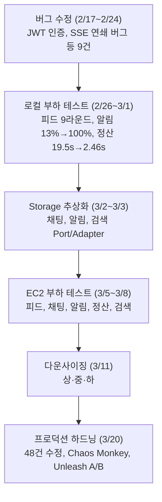

---

Phase 4까지는 "동작하게 만들기"와 "빠르게 만들기"에 집중했다. 버그 60건을 수정하고, 6개 도메인 각각에 부하 테스트를 돌리고, Storage 추상화까지 끝냈다. EC2 비용 70%를 절감하면서도 모든 API가 통과했다.

그런데 코드 리뷰 11건을 수정하면서 깨달은 게 있다. **성능은 괜찮은데, 이 코드를 프로덕션에 배포해도 되는가?**라는 질문에는 자신 있게 "예"라고 답할 수 없었다. 그래서 Phase 5는 관점을 완전히 바꿨다.

---

## 1. 분석 관점 — 5개 전문 팀

Phase 4까지는 "개발자" 한 가지 관점이었다. 이번에는 실제 프로덕션 환경에서 코드를 만질 5개 역할의 관점으로 전수 분석했다.

- **DBA 엔지니어**: 스키마 설계, 인덱스 전략, 쿼리 성능, 트랜잭션을 본다.
- **백엔드 엔지니어**: 아키텍처, 보안, 동시성, 에러 핸들링을 본다.
- **성능 엔지니어**: 캐싱, 커넥션 풀, 직렬화, 병목을 본다.
- **DevOps 엔지니어**: CI/CD, Docker, 모니터링, 로깅을 본다.
- **A/B 테스트 / 유지보수**: Feature Flag, 테스트 커버리지, 기술 부채를 본다.

Phase 4의 [코드 리뷰](/ec2-downsizing-optimization-part3/#2-코드-리뷰-수정사항-11건)에서는 "식별 but 미수정" 5건을 남겼다. 이번에는 그런 걸 남기지 않겠다는 방침으로 시작했다.

---

## 2. 발견된 이슈 — 115건

전수 분석 결과:

- **CRITICAL** (12건): Wallet→User cascade 삭제, JWT 시크릿 하드코딩, 배포 시 전체 다운, 백업 없음
- **HIGH** (34건): /test/** 인증 우회, Refresh Token 폐기 없음, Toss 타임아웃 미설정, 컨테이너 root 실행
- **MEDIUM** (45건): UNIQUE 제약 누락, HikariCP 100개, Outbox 50ms 폴링, 구조화 로깅 없음
- **LOW** (24건): Enum VARCHAR(255), 중복 인덱스, SSE 타임아웃 불일치

Phase 1에서 발견한 ~60건의 버그와 비교하면 성격이 완전히 다르다. Phase 1은 "코드가 틀림" (kakaoId/userId 혼동, 반환값 무시)이었고, 이번에는 "코드는 맞지만 프로덕션에서 터짐" (cascade 방향, 커넥션 누수, 인증 우회)이다.

---

## 3. 수정 내역 — 43건, 42 파일 수정 + 13 파일 신규

> 115건 중 43건(DBA 10 + Security 9 + Performance 9 + DevOps 12 + 코드 품질 3)을 이 Phase에서 수정했다. 나머지 72건은 MEDIUM/LOW 심각도로, Chaos Monkey 테스트와 A/B 인프라 구축을 우선하고 후속 스프린트로 이관했다.

### 3.1 DBA 영역 (10건)

#### [CRITICAL] Wallet → User CascadeType.ALL

Phase 1의 [지갑·결제 버그](/wallet-payment-toss-db-failure/)에서 Toss 승인 후 DB 실패를 수정했지만, 더 근본적인 문제가 숨어 있었다.

```java
// Before — Wallet 삭제 시 User가 cascade 삭제됨
@OneToOne(fetch = FetchType.LAZY, cascade = CascadeType.ALL)
@JoinColumn(name = "user_id", unique = true)
private User user;

// After — cascade 제거
@OneToOne(fetch = FetchType.LAZY)
@JoinColumn(name = "user_id", unique = true)
private User user;
```

금융 엔티티(Wallet)가 ID 엔티티(User)의 생명주기를 소유하면, `walletRepository.delete(wallet)` 한 줄로 유저의 모든 데이터(UserClub, Feed, FeedComment, FeedLike, ChatRoom 멤버십)가 고아 레코드로 남는다. FK가 깨진 상태에서 참조하는 모든 쿼리가 실패한다.

#### [HIGH] ClubLike 인덱스 제로

Phase 1의 [모임 동시성 구멍](/club-concurrency-ghost-members/)에서 UserClub에 UNIQUE 제약을 추가했지만, ClubLike에는 빠뜨렸다. PK 외에 인덱스가 하나도 없어서:
- "user X가 club Y를 좋아했나?" → full table scan
- 같은 유저가 동일 클럽에 중복 좋아요 가능

```java
@Table(name = "club_like",
    uniqueConstraints = @UniqueConstraint(name = "uq_club_like_user_club",
        columnNames = {"user_id", "club_id"}),
    indexes = @Index(name = "idx_club_like_club_id", columnList = "club_id"))
```

#### [HIGH] VARCHAR(255)로 저장되는 사용자 콘텐츠

Feed.content, FeedComment.content, Message.text, Club.description — 전부 `@Column(name = "content")`로 선언되어 MySQL 기본값 VARCHAR(255)로 저장된다. Phase 2의 [피드 부하 테스트](/feed-performance-load-test/)에서 255자 이하 테스트 데이터만 사용했기 때문에 문제가 드러나지 않았다.

```java
// 4개 엔티티 모두 동일하게 변경
@Column(name = "content", columnDefinition = "TEXT")
private String content;
```

#### 기타 DBA 수정 (7건)

- **UserChatRoom**: 비유니크 인덱스를 UNIQUE 제약으로 변경
- **UserInterest**: 중복 인덱스 3개를 UNIQUE + 1개로 정리
- **Transfer**: user_settlement_id 인덱스 추가
- **OutboxEvent**: @PrePersist로 createdAt 자동 설정, payload @Lob→TEXT
- **schema.sql**: sync_feed_counts 전체 스캔을 JOIN 기반 불일치 행만 갱신으로 변경

schema.sql의 `sync_feed_counts`는 매 앱 시작 시 실행되는데, 기존 방식은 모든 feed 행에 대해 correlated subquery를 돌렸다. Phase 4의 EC2 환경(10만 피드)에서는 30~60초가 걸렸을 것이다.

```sql
-- Before: 모든 행 갱신 (O(N) correlated subquery)
UPDATE feed f SET f.like_count = (
    SELECT COUNT(*) FROM feed_like fl WHERE fl.feed_id = f.feed_id
);

-- After: 불일치 행만 갱신 (JOIN, WHERE 조건)
UPDATE feed f
   LEFT JOIN (SELECT fl.feed_id, COUNT(*) AS cnt
              FROM feed_like fl GROUP BY fl.feed_id) AS sub
     ON f.feed_id = sub.feed_id
SET f.like_count = COALESCE(sub.cnt, 0)
WHERE f.like_count != COALESCE(sub.cnt, 0);
```

---

### 3.2 Security 영역 (9건)

#### [CRITICAL] /test/** 보안 화이트리스트

SecurityConfig의 `AUTH_WHITELIST`에 `"/test/**"`가 프로파일 조건 없이 포함되어 있었다.

```java
private static final String[] AUTH_WHITELIST = {
    "/api/v1/signup/**",
    ...
    "/test/**",   // ← 프로덕션에서도 인증 우회
};
```

TestAuthController와 TestNotificationController는 `@Profile({"local", "test"})`로 제한되어 있지만, **보안 화이트리스트 자체는 프로파일 무관**하다. 프로덕션에서 `/test/` 경로로의 요청이 Spring Security를 완전히 우회한다. 제거.

#### [HIGH] JWT Refresh Token 블랙리스트 없음

Phase 1의 [JWT 구조 버그](/spring-security-jwt-structure-bugs/)에서 JwtException 패키지를 수정했지만, 더 근본적인 문제가 있었다. Refresh Token이 stateless JWT라서 로그아웃/탈퇴 후에도 만료 전까지 유효하다.

Redis SET 기반 블랙리스트를 구현했다:

```java
@Service
public class TokenBlacklistService {
    private static final String BLACKLIST_PREFIX = "token:blacklist:";

    public void blacklist(String token, Duration ttl) {
        redisTemplate.opsForValue().set(BLACKLIST_PREFIX + token, "1", ttl);
    }

    public boolean isBlacklisted(String token) {
        return Boolean.TRUE.equals(redisTemplate.hasKey(BLACKLIST_PREFIX + token));
    }
}
```

- 로그아웃 시 refresh token을 블랙리스트에 등록 (TTL = refresh 만료시간)
- `refreshAccessToken()` 호출 시 블랙리스트 체크 → 차단
- 회원 탈퇴는 기존 `assertActive()` 검증으로 자동 차단

#### [HIGH] Rate Limit IP 스푸핑

[RateLimitFilter](/ec2-downsizing-optimization-part3/)에서 `X-Forwarded-For` 헤더를 무조건 신뢰했다. 로드밸런서 없이 직접 노출된 환경에서 공격자가 임의 IP로 rate limit을 우회할 수 있다.

```java
// Before — 헤더 무조건 신뢰
private String getClientIp(HttpServletRequest request) {
    String forwarded = extractHeader(request, "X-Forwarded-For");
    if (forwarded != null) return forwarded.split(",")[0].trim();
    ...
}

// After — trustProxy 설정에 따라 분기
@Value("${app.rate-limit.trust-proxy:false}")
private boolean trustProxy;

private String getClientIp(HttpServletRequest request) {
    if (trustProxy) { ... }  // LB 뒤에서만 헤더 참조
    return request.getRemoteAddr();  // 기본: 직접 연결 IP
}
```

#### [CRITICAL] JWT 시크릿 하드코딩

`k6-tests/lib/common.js`와 `application-test.yml`에 동일한 JWT 시크릿이 평문으로 커밋되어 있었다. k6은 환경변수 필수로 변경, 테스트는 별도 테스트 전용 시크릿으로 교체.

#### 기타 Security 수정

- **PaymentController**: confirmPayment, failPayment에 `@Valid` 추가
- **StringEncryptConverter**: 암호화 키가 JWT 시크릿에 폴백하던 것을 독립 키 필수로 변경
- **SseEventSender**: handleStateFailure가 throw하던 것을 return false로 변경(정상적인 연결 해제)
- **KafkaSettlementListener**: 실패해도 ack하던 것을 실패 시 RuntimeException throw로 변경(Kafka 재전송)
- **ClubCommandService**: joinClub 정원 체크 TOCTOU를 pessimistic lock으로 변경

KafkaSettlementListener는 Phase 2의 [정산 최적화](/finance-settlement-batch-kafka-tuning/)에서 배치 처리를 구현할 때 놓친 부분이다. 정산 메시지는 금융 데이터인데, 처리 실패 후 ack하면 해당 메시지가 영구 손실된다.

---

### 3.3 Performance 영역 (9건)

#### [CRITICAL] Toss Feign 클라이언트 타임아웃 미설정

Phase 1의 [Toss 결제 버그](/wallet-payment-toss-db-failure/)에서 보상 트랜잭션을 구현했지만, Feign 클라이언트에 타임아웃이 없어서 Toss API 장애 시 스레드가 무한 대기한다. 200개 Tomcat 스레드가 모두 대기하면 전체 앱이 마비된다.

```java
@Bean
public Request.Options feignOptions() {
    return new Request.Options(5, TimeUnit.SECONDS, 10, TimeUnit.SECONDS, true);
}
```

Phase 4의 코드 리뷰에서 "식별 but 미수정"으로 남겼던 "Toss API circuit breaker" 항목의 첫 번째 단계다.

#### [HIGH] HikariCP 로컬 풀 100개 + 누수 감지 없음

로컬에서 `maximum-pool-size: 100`은 과도하고, 커넥션 누수 버그를 감춘다. Phase 2의 [채팅 커넥션 3,000회→10회](/chat-aws-ec2-load-test/)에서 write-pool 분리로 커넥션 폭발을 해결했지만, leak detection 자체가 없어서 문제를 사전에 감지할 수 없었다.

```yaml
# Before
maximum-pool-size: 100
# leak-detection: 없음

# After
maximum-pool-size: 20
leak-detection-threshold: 30000  # 30초 이상 미반환 시 경고 로그
```

프로덕션에도 `leak-detection-threshold`와 `provider_disables_autocommit: true` 추가.

#### [HIGH] FeedLikeStreamConsumer 단일 스레드

Phase 3의 [피드 Lua Script](/feed-storage-abstraction-lua-script-backend-comparison/)에서 Redis Streams 컨슈머를 구현했는데, 단일 스레드로 동작해서 처리량이 ~1K/s에 제한된다.

```java
// Before: 단일 스레드
private Thread worker;

// After: 설정 가능한 멀티스레드
@Value("${app.feed-like-stream.worker-count:2}")
private int workerCount;
private List<Thread> workers;
```

각 워커 스레드가 고유한 Redis 컨슈머 이름을 가지므로, 같은 consumer group 내에서 메시지를 분산 처리한다.

#### 기타 Performance 수정

- **OutboxRelayService**: 50ms 폴링을 200ms로 변경(유휴 시 DB 부하 75% 감소)
- **FeedCacheService**: `getOrLoadResult(key, loader)` 추가(캐시 스탬피드 방지)
- **FeedLikeStreamConsumer**: sleepQuiet에서 InterruptedException 재설정

---

### 3.4 DevOps 영역 (12건)

#### [CRITICAL] Dockerfile 보안 강화

Phase 4에서 Docker 이미지를 빌드하여 EC2에 배포했지만, 컨테이너가 root로 실행되고 있었다. HEALTHCHECK도 없어서 앱이 응답하지 않아도 Docker가 감지하지 못한다.

```dockerfile
# 보안: non-root 사용자
RUN groupadd -r appuser && useradd -r -g appuser appuser
USER appuser

# 헬스체크
HEALTHCHECK --interval=30s --timeout=5s --start-period=60s --retries=3 \
    CMD curl -f http://localhost:8080/actuator/health || exit 1

# GC 로깅 (Phase 4에서 GC Stall 44회 발생했을 때 로그가 없어서 원인 파악에 시간 소요)
-Xlog:gc*:file=/app/logs/gc.log:time,uptime,level,tags:filecount=5,filesize=10m
```

빌드 레이어 캐싱도 추가했다. 기존에는 소스 한 줄 변경에도 전체 의존성을 다시 다운로드했다.

#### [HIGH] 구조화된 로깅 + Correlation ID

Phase 4의 EC2 테스트에서 문제가 발생했을 때 `~/app.log`를 grep하는 것이 유일한 디버깅 수단이었다. 요청을 추적할 방법이 없어서, SSE→알림→DB를 거치는 흐름에서 어디서 실패했는지 찾기 위해 타임스탬프를 수동 비교해야 했다.

```java
// CorrelationIdFilter.java — 신규 생성
@Component
@Order(Ordered.HIGHEST_PRECEDENCE)
public class CorrelationIdFilter extends OncePerRequestFilter {
    @Override
    protected void doFilterInternal(...) {
        String correlationId = request.getHeader("X-Correlation-Id");
        if (correlationId == null) correlationId = UUID.randomUUID().toString().substring(0, 8);
        MDC.put("correlationId", correlationId);
        response.setHeader("X-Correlation-Id", correlationId);
        try { filterChain.doFilter(request, response); }
        finally { MDC.remove("correlationId"); }
    }
}
```

logback-spring.xml도 9줄에서 50줄로 확장:
- 로컬: `[correlationId]` 포함 텍스트 패턴
- 프로덕션: LogstashEncoder JSON 출력 (ELK/Loki 호환)

#### [CRITICAL] Prometheus 알림 규칙 + Grafana 대시보드

Phase 4에서 Prometheus + Grafana를 docker-compose에 구성했지만, **알림 규칙이 0건**이었다. 모니터링 인프라만 있고 실제로 알려주는 기능이 없는 상태.

11개 알림 규칙을 추가했다:

- **Application - 서버 다운**: 임계값 1분
- **Application - 5xx 에러율**: 임계값 5% / 2분
- **Application - P95 응답시간**: 임계값 2초 / 5분
- **JVM - 힙 사용량**: 임계값 85% / 5분
- **HikariCP - 커넥션풀 사용량**: 임계값 80% / 2분
- **HikariCP - 대기 커넥션**: 임계값 5개 / 1분
- **Infrastructure - MySQL/Redis 다운**: 임계값 1분
- **Infrastructure - Redis 메모리**: 임계값 85% / 5분
- **Infrastructure - 슬로우 쿼리**: 임계값 1건/분 / 5분

Grafana에 8패널 대시보드도 프로비저닝: HTTP 요청률, P95 응답시간, JVM 힙, HikariCP 커넥션, SSE 연결, 5xx 에러율, Redis 메모리, GC pause.

#### [HIGH] CI/CD 파이프라인 개선

Phase 4에서 EC2에 배포할 때 `docker compose down --rmi all` → `docker compose up -d`를 실행했는데, 이 사이에 전체 다운타임이 발생한다.

- **리소스 경로**: `./src/main/resources/`(멀티모듈 불일치) → `./onlyone-api/src/main/resources/`
- **Docker 태그**: `latest`만 → `${{ github.sha }}` + `latest`
- **Actions 버전**: `docker/login-action@v1`, `appleboy/ssh-action@master` → `@v3`, `@v1.2.0`
- **배포 방식**: stop-all → rm-all → pull → up → `up --force-recreate --no-deps app`

#### 기타 DevOps 수정

- **RedisConfig**: @Primary 제거(REST API ObjectMapper 덮어쓰기 방지)
- **docker-compose**: MongoDB/Grafana 비밀번호 환경변수화
- **run-app.sh**: JMX 인증 활성화, kill -9 즉시를 30초 graceful 대기로 변경
- **build.gradle**: logstash-logback-encoder 8.0 추가

---

### 3.5 코드 품질 (3건)

- **WalletController**: `ResponseEntity<?>` → `ResponseEntity<CommonResponse<WalletTransactionResponseDto>>`
- **FeedCommentRepository**: 미사용 비페이징 오버로드 제거
- **ScheduleController**: join HTTP 메서드 `PATCH` → `POST`(멤버십 생성은 POST)

---

## 4. Chaos Monkey — 카오스 엔지니어링

### 왜 필요했나

Phase 4의 EC2 테스트에서 Toss API 타임아웃, HikariCP 풀 고갈, SSE 연결 끊김 같은 장애 시나리오를 k6로 간접적으로만 재현했다. "Toss가 3초 느려지면 우리 결제 서비스는 어떻게 되나?"를 직접 테스트한 적이 없다.

[Chaos Monkey for Spring Boot](https://codecentric.github.io/chaos-monkey-spring-boot/latest/) (Codecentric)를 통합했다.

### 활성화

```bash
CHAOS_MONKEY_ENABLED=true SPRING_PROFILES_ACTIVE=local,chaos-monkey ./gradlew bootRun
```

### 테스트 결과

#### Latency Assault (100%, 1000~2000ms)

```
설정: level=1, latencyRangeStart=1000, latencyRangeEnd=2000

/actuator/health (watcher 대상 아님):
  요청 1: HTTP=200, 112ms
  요청 2: HTTP=200, 125ms

/api/v1/clubs (Controller watcher 대상):
  요청 1: HTTP=403, 1627ms  ← 지연 주입 확인
  요청 2: HTTP=403, 1769ms
  요청 3: HTTP=403, 1327ms
```

**검증**: 설정한 범위(1000~2000ms) 내에서 정확하게 지연이 주입된다. actuator 엔드포인트는 영향을 받지 않아서, HEALTHCHECK가 장애로 인식하지 않는다. 이건 의도된 동작이다 — 장애 주입 중에 컨테이너가 재시작되면 안 된다.

#### Exception Assault (100%, RuntimeException)

```
설정: level=1, exceptionsActive=true

/api/v1/clubs:
  요청 1: HTTP=500, {"code":"GLOBAL_500_1","message":"서버 내부 오류가 발생했습니다."}
  요청 2: HTTP=500, 동일
  요청 3: HTTP=500, 동일

로그:
  java.lang.RuntimeException: Chaos Monkey - RuntimeException
  c.e.o.g.e.GlobalExceptionHandler - 예외 발생 [/error] GET - HTTP 500
```

**검증**: `GlobalExceptionHandler`가 예상치 못한 RuntimeException을 안전하게 처리한다. 클라이언트에 "Chaos Monkey"라는 내부 구현 세부사항이 노출되지 않는다. 이건 Phase 3의 [에러 코드 분리 리팩토링](/multi-domain-refactoring-errorcode-code-quality/)에서 구축한 에러 핸들링 체계가 정상 동작하는 것을 증명한다.

#### 비활성화 → 복귀

```
Chaos 지연 상태:  1327~1769ms
disable API 호출 후: 85~106ms  ← 즉시 복귀
```

**검증**: 런타임에 재시작 없이 장애 주입을 on/off할 수 있다. 프로덕션에서 문제 발견 시 즉시 비활성화 가능.

### 프로덕션 안전장치

Chaos Monkey가 프로덕션에서 활성화되면 서비스 장애로 이어진다. 3겹의 안전장치를 적용했다:

1. `ChaosMonkeyConfig`에 `@Profile("chaos-monkey")` — 명시적 프로파일 활성화 필요
2. `application-prod.yml`에 `chaos.monkey.enabled: false` + `management.endpoint.chaosmonkey.enabled: false` — 환경변수 우회 차단
3. SecurityConfig에서 `/actuator/chaosmonkey/**` 인증 필요 — 외부에서 트리거 불가

---

## 5. Unleash — A/B 테스트 프레임워크

### 왜 필요했나

Phase 3에서 [Storage 추상화](/chat-storage-websocket-extreme-test/)를 구현하면서 MySQL↔MongoDB 전환을 `@ConditionalOnProperty`로 구현했다. 하지만 이 방식은:
- **배포 시점에 고정** — 재시작 없이 변경 불가
- **전체 사용자에게 동시 적용** — 10%만 먼저 적용하는 것 불가
- **메트릭 비교 불가** — A/B 그룹별 에러율, 응답시간 비교 불가

[Unleash](https://www.getunleash.io/) (오픈소스, 셀프호스팅)를 선택한 이유:
- Docker Compose에 추가하면 끝 (기존 인프라 패턴과 일치)
- Java SDK 공식 지원
- gradualRollout (비율 기반), userWithId (타겟팅), 환경별 활성화 지원
- SaaS 비용 없음

### 아키텍처

```
┌──────────┐    ┌─────────────────┐    ┌────────────┐
│ Unleash  │◄───│ Unleash Server  │───▶│ PostgreSQL │
│ UI :4242 │    │ (Feature Flags) │    │ (unleash)  │
└──────────┘    └───────┬─────────┘    └────────────┘
                        │ SDK polling (15s)
                ┌───────▼─────────┐
                │ Spring Boot App │
                │FeatureFlagService│
                └─────────────────┘
```

### 테스트 결과

```bash
# Unleash 서버 기동
docker compose --profile unleash up -d

# Feature Flag 생성 (API)
POST /api/admin/projects/default/features
  → {"name":"new-feed-algorithm","type":"experiment"}  ✓

# 50% 롤아웃 전략 추가
POST .../strategies
  → {"name":"flexibleRollout","parameters":{"rollout":"50","stickiness":"userId"}}  ✓

# 활성화
POST .../environments/development/on  ✓

# SDK 연동 확인
앱 로그: "Unleash 초기화: url=http://localhost:4242/api, appName=onlyone"  ✓

# Client API 조회
GET /api/client/features
  → "name":"new-feed-algorithm", "enabled":true, "rollout":"50"  ✓
```

### 코드에서 사용하는 방법

```java
@RequiredArgsConstructor
@Service
public class FeedQueryService {
    private final FeatureFlagService featureFlags;

    public List<FeedOverviewDto> getPersonalFeed(Long userId, Pageable pageable) {
        if (featureFlags.isEnabled("new-feed-algorithm", userId)) {
            return newAlgorithm(userId, pageable);  // 실험군
        }
        return currentAlgorithm(userId, pageable);   // 대조군
    }
}
```

`FeatureFlagService`는 인터페이스로 설계했다. Unleash 비활성 시 `NoOpFeatureFlagService`가 자동으로 주입되어 모든 flag가 false를 반환한다. 기존 코드에 영향 없음.

---

## 6. 평가 변화

- **아키텍처 설계**: A → A (유지)
- **동시성 제어**: A- → A- (유지)
- **확장성 설계**: B+ → A- (Unleash A/B + FeatureFlagService 인터페이스)
- **코드 일관성**: B+ → A- (엔티티 제약조건, 타입 안전성, HTTP 메서드 통일)
- **인프라 구성**: B → B+ (알림 11개, Grafana 대시보드, Chaos Monkey)
- **운영 안정성**: D → C+ (Correlation ID, 구조화 로깅, 헬스체크, 누수 감지)
- **보안**: D+ → B- (JWT 블랙리스트, 시크릿 제거, non-root, IP 보호)
- **테스트**: C- → C (카오스 엔지니어링 검증, 금융 단위 테스트는 여전히 0건)
- **데이터 무결성**: C → B+ (Cascade 수정, UNIQUE 제약, TEXT 컬럼)

**종합**: "잘 설계된 프로토타입" → **"프로덕션 배포 직전 단계"**

---

## 7. 프로덕션 배포 전 남은 필수 작업

1. **TLS/HTTPS**: 평문 HTTP는 프로덕션 불가. 신규 항목.
2. **DB 자동 백업**: 데이터 손실 방지. 신규 항목.
3. **Payment 단위 테스트**: 금융 로직 무테스트. Phase 4에서 미수정으로 남긴 것.
4. **무중단 배포**: `--force-recreate`로 개선했지만 순간 다운. 신규 항목.

Phase 4에서 "다음 과제"로 남긴 3가지 중:
- **테스트 코드 보강** → 부분 진행 (AuthServiceTest, UserServiceTest 수정)
- **WebFlux 전환** → 미착수 (현재 Virtual Thread로 충분)
- **수평 확장** → 미착수 (Unleash + SSE 분산 레지스트리로 준비는 됨)

---

## 시리즈 전체 흐름



---

## 시리즈 탐색

**◀ 이전 글**
[EC2 다운사이징 후 최적화 (하) — 전체 통합 결과와 코드 리뷰](/ec2-downsizing-optimization-part3/)
