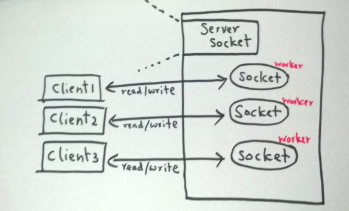
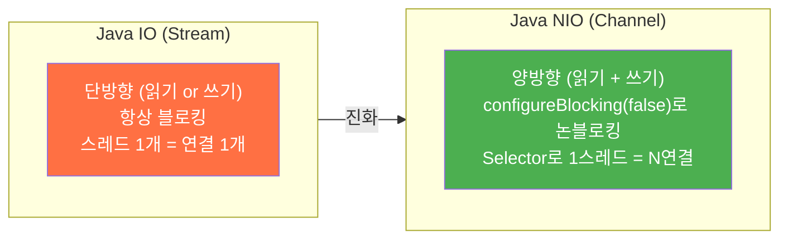
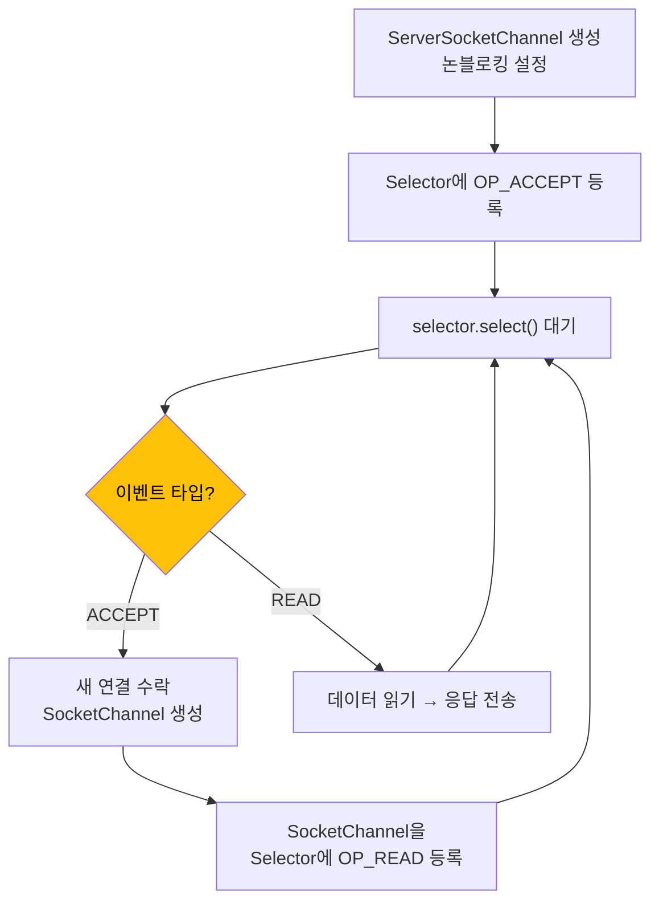
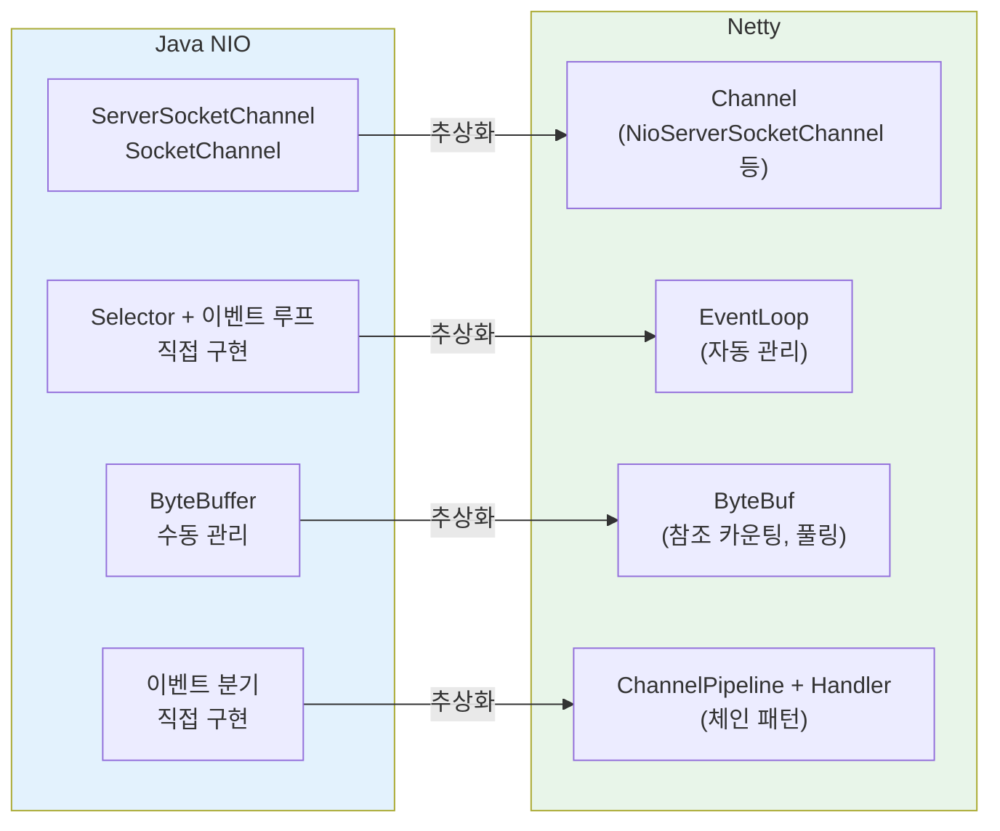
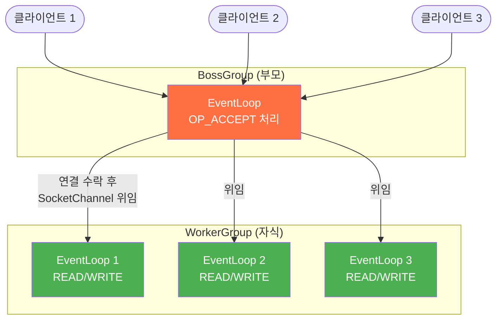
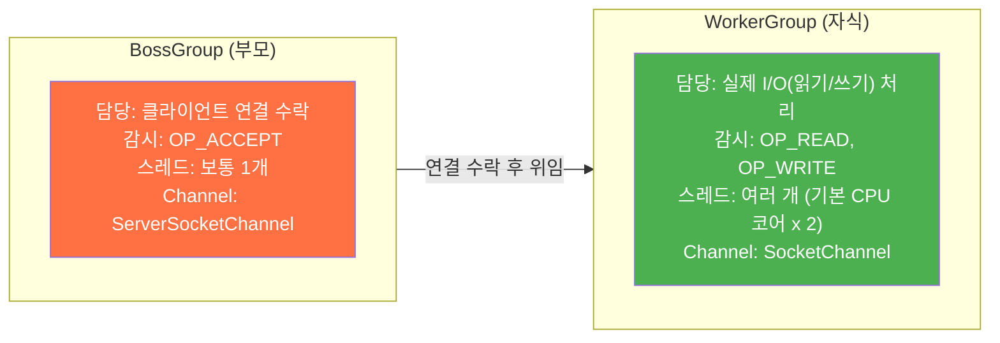
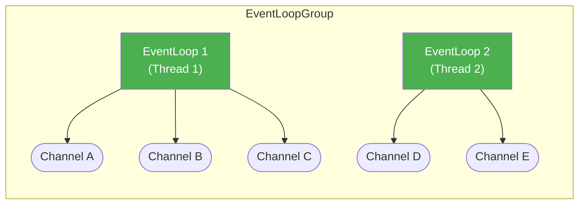
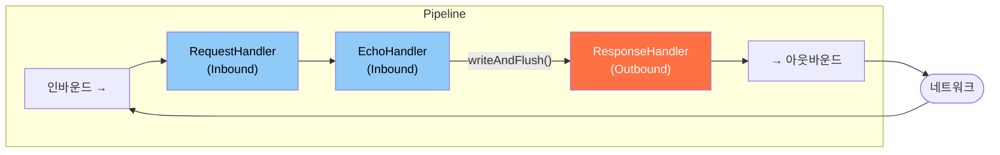
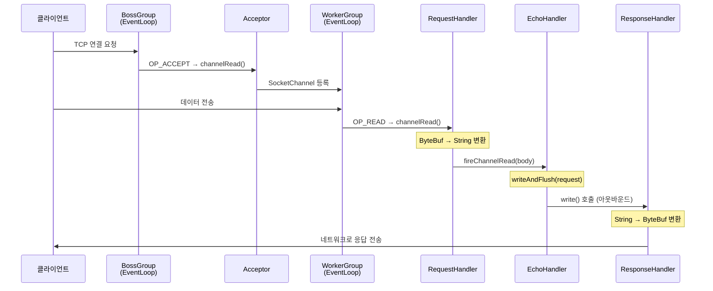

이 글은 Netty의 비동기 이벤트 기반 네트워크 프레임워크를 **Java Blocking I/O부터 단계적으로** 따라가며 정리한다. 최종 목표는 EventLoop가 I/O 작업을 어떻게 비동기로 처리하는지 코드 레벨에서 이해하는 것이다.

> 참고 자료: 네티 인 액션, 자바 네트워크 소녀 네티, Spring Webflux 완전 정복

---

# Blocking I/O vs Non-Blocking I/O

## Java IO: Blocking의 한계

가장 기본적인 Java 소켓 서버를 먼저 본다.

```java
@Slf4j
public class JavaIOServer {
    @SneakyThrows
    public static void main(String[] args) {
        log.info("start main");
        try (ServerSocket serverSocket = new ServerSocket()) {
            serverSocket.bind(new InetSocketAddress("localhost", 7777));

            while (true) {
                Socket clientSocket = serverSocket.accept();  // 연결 올 때까지 블로킹
                byte[] requestBytes = new byte[1024];
                InputStream in = clientSocket.getInputStream();
                in.read(requestBytes);                         // 데이터 올 때까지 블로킹
                log.info("request: {}", new String(requestBytes).trim());

                OutputStream out = clientSocket.getOutputStream();
                String response = "This is server";
                out.write(response.getBytes());
                out.flush();
            }
        }
    }
}
```

**문제점:**

`accept()`에서는 클라이언트 연결을 대기하면서 새 연결이 올 때까지 스레드가 정지된다. `in.read()`에서는 데이터 수신을 대기하면서 데이터가 올 때까지 스레드가 정지된다. 전체 구조적으로 한 번에 한 연결만 처리할 수 있으므로, 다중 클라이언트를 처리하려면 스레드마다 1개씩 할당해야 한다.

클라이언트가 1,000개면 스레드도 1,000개가 필요하다. 스레드 생성/관리 비용과 **컨텍스트 스위칭 오버헤드**가 병목이 된다.


*Blocking I/O 모델 — 클라이언트마다 전용 스레드가 필요하다*

---

## Java NIO: Non-Blocking으로의 전환

Java 1.4에서 도입된 NIO는 **Non-blocking I/O**를 지원한다. 핵심 개념 두 가지: **Channel**과 **Selector**.

### Channel — 양방향 통로

Java IO의 Stream은 단방향(InputStream / OutputStream)이다. NIO의 **Channel은 양방향**이며, 읽기와 쓰기를 하나의 객체로 처리한다.



주요 채널:

- **ServerSocketChannel**: 서버 측, 클라이언트 연결 요청 수락
- **SocketChannel**: 클라이언트-서버 간 데이터 송수신

### Selector — I/O 멀티플렉싱의 핵심

Selector는 여러 Channel에서 **I/O 준비 상태**를 감시하고, 준비된 채널만 선택하여 처리한다. 하나의 스레드가 수천 개의 Channel을 관리할 수 있다.


*I/O 멀티플렉싱 — 단일 스레드가 Selector를 통해 여러 Channel을 처리한다*

**이점:**

- 적은 스레드로 더 많은 연결 처리
- 컨텍스트 스위칭 오버헤드 감소
- I/O 대기 중인 시간에 다른 채널 처리 가능

### Java NIO Echo Server

```java
@Slf4j
public class NioEchoServer {
    @SneakyThrows
    public static void main(String[] args) {
        try (ServerSocketChannel serverChannel = ServerSocketChannel.open();
             Selector selector = Selector.open()) {

            serverChannel.bind(new InetSocketAddress("localhost", 8080));
            serverChannel.configureBlocking(false);  // 논블로킹 모드

            // Selector에 ACCEPT 이벤트 등록
            serverChannel.register(selector, SelectionKey.OP_ACCEPT);

            while (true) {
                selector.select();  // 이벤트가 준비될 때까지 대기

                Iterator<SelectionKey> keys = selector.selectedKeys().iterator();
                while (keys.hasNext()) {
                    SelectionKey key = keys.next();
                    keys.remove();

                    if (key.isAcceptable()) {
                        // 새 연결 수락 → 논블로킹 설정 → READ 이벤트 등록
                        SocketChannel client =
                                ((ServerSocketChannel) key.channel()).accept();
                        client.configureBlocking(false);
                        client.register(selector, SelectionKey.OP_READ);
                    } else if (key.isReadable()) {
                        // 데이터 읽기 → 응답 전송
                        SocketChannel client = (SocketChannel) key.channel();
                        String body = readRequest(client);
                        sendResponse(client, body);
                    }
                }
            }
        }
    }

    private static String readRequest(SocketChannel client) throws IOException {
        ByteBuffer buffer = ByteBuffer.allocate(1024);
        client.read(buffer);
        buffer.flip();
        return new String(buffer.array()).trim();
    }

    @SneakyThrows
    private static void sendResponse(SocketChannel client, String body) {
        log.info("request: {}", body);
        ByteBuffer response = ByteBuffer.wrap(("received: " + body).getBytes());
        client.write(response);
        client.close();
    }
}
```

**동작 흐름:**



1. ServerSocketChannel을 열고 **논블로킹** 모드로 설정
2. Selector에 **OP_ACCEPT** 이벤트를 등록
3. `select()`로 이벤트가 준비될 때까지 대기
4. 준비된 이벤트 목록(`selectedKeys`)을 순회하며 타입별 처리
5. ACCEPT → 새 SocketChannel을 만들어 **OP_READ**로 다시 등록
6. READ → 데이터를 읽고 응답 전송

이 패턴을 **I/O 멀티플렉싱**이라 한다. 단일 스레드가 여러 채널의 I/O 이벤트를 처리하는 방식이다.

---

# Netty의 핵심 컴포넌트

Netty는 Java NIO를 **한 단계 더 추상화**한 프레임워크다. Spring 5.0의 WebFlux도 기본 서버 엔진으로 Netty를 사용한다.



---

## Channel과 ChannelFuture

### Channel — 소켓의 추상화

Netty의 Channel은 Java NIO의 SocketChannel/ServerSocketChannel을 감싸서 **입출력 작업의 복잡성을 완화**하고, Pipeline 등 추가 기능을 제공한다.

```java
EventLoopGroup parentGroup = new NioEventLoopGroup();
EventLoopGroup childGroup = new NioEventLoopGroup(4);

NioServerSocketChannel serverSocketChannel = new NioServerSocketChannel();
parentGroup.register(serverSocketChannel);   // EventLoop의 Selector에 등록
serverSocketChannel.pipeline().addLast(acceptor(childGroup));

ChannelFuture channelFuture = serverSocketChannel.bind(new InetSocketAddress(8080));
```

`parentGroup.register(serverSocketChannel)`을 호출하면, 내부적으로 `doRegister()`가 실행되어 채널이 EventLoop의 **Selector에 등록**된다.

### ChannelFuture — 비동기 결과 처리

Netty의 모든 아웃바운드 I/O 작업은 **ChannelFuture**를 반환한다. 작업 완료를 직접 검사할 필요 없이, **리스너 콜백**으로 결과를 받는다.

```java
public interface ChannelFuture extends Future<Void> {
    Channel channel();                           // 관련 채널
    ChannelFuture addListener(...);              // 완료 시 콜백 등록
    ChannelFuture removeListener(...);           // 리스너 제거
    ChannelFuture sync() throws InterruptedException;  // 완료까지 블로킹 (테스트용)
}
```

```java
channelFuture.addListener(new ChannelFutureListener() {
    @Override
    public void operationComplete(ChannelFuture future) {
        if (future.isSuccess()) {
            log.info("Server bound to port 8080");
        } else {
            log.info("Failed to bind to port 8080");
            parentGroup.shutdownGracefully();
            childGroup.shutdownGracefully();
        }
    }
});
```

`operationComplete()`에서 성공/실패 여부를 확인하고, 실패 시 리소스를 정리한다. **비동기 세계에서는 try-catch 대신 이 콜백이 에러 처리의 주요 수단**이 된다.

---

## EventLoop — Netty의 심장

### BossGroup과 WorkerGroup

Netty는 **EventLoopGroup** 두 개로 서버를 구성한다. 이 패턴은 리액터 패턴(Reactor Pattern)의 구현이다.





### EventLoop와 Channel의 관계



핵심 규칙:

- 한 **EventLoopGroup**은 1개 이상의 **EventLoop**를 포함
- 한 **EventLoop**는 수명주기 동안 **하나의 Thread**에 바인딩
- EventLoop의 모든 I/O 이벤트는 **해당 전용 Thread**에서 처리
- 한 **Channel**은 수명주기 동안 **하나의 EventLoop**에 등록
- 한 **EventLoop**에 **여러 Channel**이 할당될 수 있음

**이 구조의 장점:** Channel은 항상 같은 Thread에서 처리되므로, ChannelHandler 구현에서 **동기화와 스레드 안전성을 걱정할 필요가 없다**.

**주의 — 블로킹 금지:** 하나의 EventLoop가 여러 Channel을 담당하므로, **블로킹 I/O가 발생하면 해당 EventLoop의 모든 Channel 처리가 지연**된다. 블로킹 작업은 반드시 별도 스레드풀이나 비동기 방식으로 처리해야 한다.

**주의 — ThreadLocal:** EventLoop 하나가 여러 Channel에 사용되므로, ThreadLocal을 쓰면 **모든 Channel이 동일한 값을 공유**하게 된다. Channel별 상태는 `Channel.attr()` 또는 `ChannelHandlerContext`를 사용해야 한다.

### NioEventLoop의 내부 구조

NioEventLoop는 세 가지 핵심 컴포넌트를 가진다:

```java
public final class NioEventLoop extends SingleThreadEventLoop {
    private Selector selector;            // I/O 멀티플렉싱
}

public abstract class SingleThreadEventExecutor ... {
    private final Queue<Runnable> taskQueue;  // 비동기 태스크 큐
}
```

- **Selector**: 등록된 Channel들의 I/O 이벤트를 감시한다.
- **TaskQueue**: 사용자가 제출한 비동기 태스크를 저장한다 (즉시 실행이 아닌 큐잉).
- **Thread**: Selector 감시와 TaskQueue 처리를 단일 스레드에서 교대로 실행한다.

### NioEventLoop의 run() — 무한 루프

EventLoop의 핵심은 `run()` 메서드의 무한 루프다:

```java
@Override
protected void run() {
    for (;;) {
        // 1단계: I/O 이벤트 처리
        if (strategy > 0) {
            processSelectedKeys();    // Selector에서 준비된 이벤트 처리
        }

        // 2단계: 비-I/O 태스크 처리
        runAllTasks();                // TaskQueue의 태스크 실행
    }
}
```

**ioRatio** 설정으로 I/O 처리와 태스크 처리의 시간 비율을 조절한다:

ioRatio가 50(기본값)이면 I/O 처리와 태스크 처리에 각각 50%씩 시간을 할당하며, 일반적인 서버에 적합하다. ioRatio가 100이면 I/O를 먼저 전부 처리한 뒤 태스크를 전부 처리하는 방식으로 비율 제한 없이 동작하며, I/O 집약 서버에 적합하다. ioRatio가 70이면 I/O에 70%, 태스크에 30%를 할당하며, I/O가 중요한 경우에 사용한다.

### NioEventLoopGroup 생성

```java
EventLoopGroup parentGroup = new NioEventLoopGroup();     // 기본: CPU 코어 × 2
EventLoopGroup childGroup = new NioEventLoopGroup(4);     // 명시적으로 4개
```

내부적으로 `MultithreadEventExecutorGroup`의 `newChild()`가 호출되어, 지정된 수만큼 **NioEventLoop 인스턴스**가 생성된다.

---

## ChannelPipeline과 ChannelHandler

### Pipeline — 핸들러 체인

각 Channel에는 **ChannelPipeline**이 하나씩 존재한다. Pipeline은 **ChannelHandler들의 연결 리스트**이며, 인바운드/아웃바운드 이벤트가 이 체인을 따라 순서대로 흐른다.



- **인바운드** 이벤트: 네트워크 → Pipeline → 앞에서 뒤로 (Head → Tail)
- **아웃바운드** 이벤트: Pipeline → 네트워크 → 뒤에서 앞으로 (Tail → Head)

### Handler 등록 — 리액터 패턴

Netty는 **리액터 패턴**의 구현체다. Reactor(EventLoop)가 이벤트 발생을 대기하다가, 이벤트 발생 시 적절한 EventHandler(ChannelHandler)에게 전달한다.

```java
private static ChannelInboundHandler acceptor(EventLoopGroup childGroup) {
    EventExecutorGroup executorGroup = new DefaultEventExecutorGroup(4);

    return new ChannelInboundHandlerAdapter() {
        @Override
        public void channelRead(ChannelHandlerContext ctx, Object msg) {
            log.info("Acceptor.channelRead");
            if (msg instanceof SocketChannel) {
                SocketChannel socketChannel = (SocketChannel) msg;

                // Pipeline에 핸들러 등록
                socketChannel.pipeline().addLast(
                        executorGroup, new LoggingHandler(LogLevel.INFO));
                socketChannel.pipeline().addLast(
                        requestHandler(),
                        responseHandler(),
                        echoHandler());

                // WorkerGroup의 Selector에 채널 등록
                childGroup.register(socketChannel);
            }
        }
    };
}
```

---

### 인바운드 이벤트 — 상대방의 동작

인바운드 이벤트는 **연결 상대방이 어떤 동작을 취했을 때** 발생한다: 채널 활성화, 데이터 수신 등.

`ChannelInboundHandler`의 주요 메서드:

- `channelActive()`: 채널이 활성화(연결 완료)되었을 때 호출된다.
- `channelRead()`: 메시지를 수신했을 때 호출된다.
- `channelReadComplete()`: 현재 배치의 마지막 메시지를 처리했을 때 호출된다.
- `exceptionCaught()`: 읽기 작업 중 예외가 발생했을 때 호출된다.

**RequestHandler — ByteBuf를 String으로 변환:**

```java
private static ChannelInboundHandler requestHandler() {
    return new ChannelInboundHandlerAdapter() {
        @Override
        public void channelRead(ChannelHandlerContext ctx, Object msg) {
            if (msg instanceof ByteBuf) {
                try {
                    ByteBuf buf = (ByteBuf) msg;
                    int len = buf.readableBytes();
                    CharSequence body = buf.readCharSequence(len, StandardCharsets.UTF_8);
                    log.info("RequestHandler.channelRead: " + body);

                    ctx.fireChannelRead(body);  // 다음 인바운드 핸들러로 전달
                } finally {
                    ReferenceCountUtil.release(msg);  // ByteBuf 해제 (참조 카운팅)
                }
            }
        }
    };
}
```

- `ctx.fireChannelRead(body)`: 변환한 데이터를 **다음 인바운드 핸들러**에 전달
- `ReferenceCountUtil.release(msg)`: Netty의 **참조 카운팅** 메모리 관리. 사용 완료된 ByteBuf를 해제하지 않으면 메모리 누수 발생

**EchoHandler — 인바운드 → 아웃바운드 전환:**

```java
private static ChannelInboundHandler echoHandler() {
    return new ChannelInboundHandlerAdapter() {
        @Override
        public void channelRead(ChannelHandlerContext ctx, Object msg) {
            if (msg instanceof String) {
                String request = (String) msg;
                log.info("EchoHandler.channelRead: " + request);

                // writeAndFlush()로 아웃바운드 방향 전환
                ctx.writeAndFlush(request)
                        .addListener(ChannelFutureListener.CLOSE);  // 완료 후 채널 닫기
            }
        }
    };
}
```

`writeAndFlush()`를 호출하면 이벤트 흐름이 **인바운드 → 아웃바운드**로 전환된다. 이 시점부터 Pipeline을 **역방향**으로 순회하며 아웃바운드 핸들러를 실행한다.

---

### 아웃바운드 이벤트 — 내가 요청한 동작

아웃바운드 이벤트는 **프로그래머가 요청한 동작**이다: 연결 요청, 데이터 전송, 소켓 닫기 등.

**ResponseHandler — String을 ByteBuf로 변환:**

```java
private static ChannelOutboundHandler responseHandler() {
    return new ChannelOutboundHandlerAdapter() {
        @Override
        public void write(ChannelHandlerContext ctx, Object msg, ChannelPromise promise) {
            if (msg instanceof String) {
                log.info("ResponseHandler.write: " + msg);
                String body = (String) msg;
                ByteBuf buf = ctx.alloc().buffer();
                buf.writeCharSequence(body, StandardCharsets.UTF_8);

                ctx.write(buf, promise)                        // 다음 아웃바운드 핸들러로 전달
                        .addListener(ChannelFutureListener.CLOSE);
            }
        }
    };
}
```

`ctx.write(buf, promise)`는 변환한 ByteBuf를 **다음 아웃바운드 핸들러**에 전달한다. 최종적으로 Head 핸들러에 도달하면 네트워크로 전송된다.

---

### 전체 이벤트 흐름

하나의 HTTP 요청-응답 사이클을 처리하는 전체 흐름:



1. 클라이언트 연결 요청 → BossGroup의 EventLoop가 **OP_ACCEPT** 감지
2. Acceptor가 SocketChannel을 생성하고 Pipeline을 설정
3. **WorkerGroup에 채널 등록** → 이후 이 채널의 모든 I/O는 WorkerGroup이 담당
4. 클라이언트 데이터 전송 → WorkerGroup의 EventLoop가 **OP_READ** 감지
5. **인바운드**: RequestHandler(ByteBuf→String) → EchoHandler(비즈니스 로직)
6. **아웃바운드**: EchoHandler의 writeAndFlush() → ResponseHandler(String→ByteBuf) → 네트워크

---

# 완전한 Echo Server

지금까지의 모든 개념이 합쳐진 Netty Echo Server 전체 코드:

```java
@Slf4j
public class EchoNettyServer {

    public static void main(String[] args) {
        EventLoopGroup parentGroup = new NioEventLoopGroup();      // Boss: 연결 수락
        EventLoopGroup childGroup = new NioEventLoopGroup(4);      // Worker: I/O 처리

        NioServerSocketChannel serverSocketChannel = new NioServerSocketChannel();
        parentGroup.register(serverSocketChannel);
        serverSocketChannel.pipeline().addLast(acceptor(childGroup));

        ChannelFuture channelFuture = serverSocketChannel.bind(new InetSocketAddress(8080));

        channelFuture.addListener(new ChannelFutureListener() {
            @Override
            public void operationComplete(ChannelFuture future) {
                if (future.isSuccess()) {
                    log.info("Server bound to port 8080");
                } else {
                    log.info("Failed to bind to port 8080");
                    parentGroup.shutdownGracefully();
                    childGroup.shutdownGracefully();
                }
            }
        });
    }

    private static ChannelInboundHandler acceptor(EventLoopGroup childGroup) {
        EventExecutorGroup executorGroup = new DefaultEventExecutorGroup(4);

        return new ChannelInboundHandlerAdapter() {
            @Override
            public void channelRead(ChannelHandlerContext ctx, Object msg) {
                log.info("Acceptor.channelRead");
                if (msg instanceof SocketChannel) {
                    SocketChannel socketChannel = (SocketChannel) msg;
                    socketChannel.pipeline().addLast(
                            executorGroup, new LoggingHandler(LogLevel.INFO));
                    socketChannel.pipeline().addLast(
                            requestHandler(),
                            responseHandler(),
                            echoHandler());
                    childGroup.register(socketChannel);
                }
            }
        };
    }

    private static ChannelInboundHandler requestHandler() {
        return new ChannelInboundHandlerAdapter() {
            @Override
            public void channelRead(ChannelHandlerContext ctx, Object msg) {
                if (msg instanceof ByteBuf) {
                    try {
                        ByteBuf buf = (ByteBuf) msg;
                        CharSequence body = buf.readCharSequence(
                                buf.readableBytes(), StandardCharsets.UTF_8);
                        log.info("RequestHandler.channelRead: " + body);
                        ctx.fireChannelRead(body);
                    } finally {
                        ReferenceCountUtil.release(msg);
                    }
                }
            }
        };
    }

    private static ChannelOutboundHandler responseHandler() {
        return new ChannelOutboundHandlerAdapter() {
            @Override
            public void write(ChannelHandlerContext ctx, Object msg,
                              ChannelPromise promise) {
                if (msg instanceof String) {
                    log.info("ResponseHandler.write: " + msg);
                    ByteBuf buf = ctx.alloc().buffer();
                    buf.writeCharSequence((String) msg, StandardCharsets.UTF_8);
                    ctx.write(buf, promise)
                            .addListener(ChannelFutureListener.CLOSE);
                }
            }
        };
    }

    private static ChannelInboundHandler echoHandler() {
        return new ChannelInboundHandlerAdapter() {
            @Override
            public void channelRead(ChannelHandlerContext ctx, Object msg) {
                if (msg instanceof String) {
                    log.info("EchoHandler.channelRead: " + msg);
                    ctx.writeAndFlush(msg)
                            .addListener(ChannelFutureListener.CLOSE);
                }
            }
        };
    }
}
```

---

# 정리

- **Blocking I/O**: `accept()`, `read()`에서 스레드가 정지되며, 연결당 스레드 1개가 필요하다.
- **Non-Blocking I/O (NIO)**: Channel과 Selector를 사용하여 단일 스레드가 N개 연결을 처리한다.
- **I/O 멀티플렉싱**: Selector가 준비된 채널만 선택하여 처리하는 패턴이다.
- **Channel**: 소켓 입출력의 추상화로, 양방향 통신과 Pipeline을 지원한다.
- **ChannelFuture**: 비동기 I/O 결과를 리스너 콜백으로 수신한다.
- **EventLoopGroup**: EventLoop들의 컨테이너(스레드 풀)다.
- **EventLoop**: 단일 스레드 + Selector + TaskQueue로 구성되며, Channel의 모든 I/O를 전담한다.
- **BossGroup**: OP_ACCEPT를 처리하고, 연결 수락 후 WorkerGroup에 위임한다.
- **WorkerGroup**: OP_READ/WRITE를 처리하며, 실제 데이터를 송수신한다.
- **ChannelPipeline**: ChannelHandler들의 연결 리스트로, 이벤트가 체인을 따라 흐른다.
- **ChannelInboundHandler**: 인바운드 이벤트(데이터 수신 등)를 처리하며, 앞에서 뒤 방향으로 진행한다.
- **ChannelOutboundHandler**: 아웃바운드 이벤트(데이터 전송 등)를 처리하며, 뒤에서 앞 방향으로 진행한다.
- **ioRatio**: EventLoop의 I/O 처리 대 태스크 처리 시간 비율이다 (기본 50).
- **리액터 패턴**: EventLoop(Reactor)가 이벤트를 감지하고 Handler에게 위임하는 설계 패턴이다.
