Redis(Remote Dictionary Server)를 처음 접하면 "캐시"로만 생각하기 쉽다. 하지만 Redis는 **자료구조 서버**에 가깝다. String, Hash, List, Set, Sorted Set 등 다양한 자료구조를 메모리에서 $$ O(1) $$ ~ $$ O(\log N) $$으로 조작할 수 있고, 이 자료구조들이 캐시, 세션, 순위표, 메시지 큐, 분산 락 같은 다양한 문제를 해결한다.

---

# 왜 Redis인가

## RDBMS만으로 부족한 순간

웹 애플리케이션의 대부분은 RDBMS(MySQL, PostgreSQL)로 충분하다. 하지만 특정 상황에서 DB가 병목이 된다.

**같은 데이터를 반복 조회**하면 매번 디스크 I/O와 쿼리 파싱이 발생한다. Redis에 올려두면 메모리에서 즉시 반환한다. **순위표**는 DB에서 `ORDER BY score DESC`를 매번 돌리는 대신, Sorted Set으로 $$ O(\log N) $$에 조회할 수 있다. **세션**은 서버가 여러 대면 공유가 안 되는데, Redis를 중앙 저장소로 쓰면 해결된다. **좋아요 같은 실시간 카운터**는 DB의 UPDATE 잠금 경합이 심한데, `INCR` 하나면 원자적으로 증가시키고 나중에 DB에 동기화하면 된다. **분산 락**은 DB 락보다 `SET NX EX` 한 줄이 훨씬 가볍고, **Rate Limiting**도 `INCR` + `EXPIRE` 조합이면 충분하다.

핵심은 **"자주 읽고, 빠르게 써야 하고, 휘발되어도 복구 가능한 데이터"**를 Redis에 두는 것이다.

## 숫자로 보는 차이

```
MySQL SELECT (인덱스 히트):  ~0.5ms
Redis GET:                   ~0.1ms (로컬), ~1ms (네트워크 포함)

MySQL UPDATE (락 경합 없음):  ~1ms
Redis INCR:                  ~0.1ms

초당 처리량:
  MySQL:  ~10,000 QPS (튜닝 기준)
  Redis:  ~100,000 QPS (싱글 스레드!)
```

---

# Redis가 싱글 스레드인데 왜 빠른가

Redis의 가장 자주 나오는 면접 질문이다.

## 싱글 스레드의 의미

Redis가 "싱글 스레드"라는 것은 **명령어 처리(command execution)**가 하나의 스레드에서 순차적으로 실행된다는 뜻이다. 네트워크 I/O나 백그라운드 작업(RDB 저장, AOF rewrite 등)은 별도 스레드에서 처리한다.

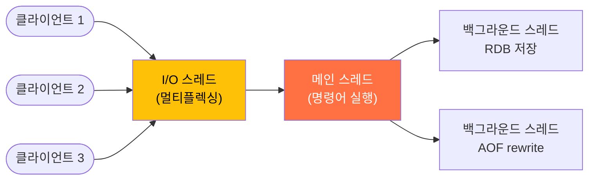

> Redis 6.0부터 **I/O 스레드 멀티플렉싱**(threaded I/O)이 도입되었다. 네트워크 읽기/쓰기를 여러 스레드가 분담하지만, 명령어 실행은 여전히 메인 스레드 하나에서 수행한다.

## 빠른 이유

첫째, **메모리 기반**이다. 모든 데이터가 RAM에 있으므로 디스크 I/O가 없다. 둘째, Hash Table이나 Skip List 같은 **단순한 자료구조**를 사용하여 $$ O(1) $$ ~ $$ O(\log N) $$으로 연산한다. 셋째, `epoll`/`kqueue` 기반 **I/O 멀티플렉싱**으로 하나의 스레드가 수만 개 연결을 관리한다. Netty의 Selector와 동일한 원리다. 넷째, **시스템 콜 최소화**, 파이프라이닝, 클라이언트 측 버퍼링으로 커널 수준에서도 최적화되어 있다.

하지만 가장 중요한 것은 **락이 없다**는 것이다. 멀티스레드 DB는 동시 접근 시 행 잠금, 페이지 잠금, 래치 등의 동기화 비용이 발생한다. Redis는 명령어가 순차 실행되므로 이 비용이 완전히 제거된다.

## 싱글 스레드의 주의점

명령어가 순차 실행이므로, **느린 명령어 하나가 뒤의 모든 명령어를 막는다.**

`KEYS *`는 모든 키를 $$ O(N) $$으로 순회하므로, 운영 환경에서 실행하면 Redis가 수 초간 멈출 수 있다. **절대 사용하지 말 것.** 대신 `SCAN`을 쓰면 커서 기반으로 조금씩 가져온다. `FLUSHALL`도 마찬가지로 `FLUSHALL ASYNC`로 백그라운드 삭제해야 하고, 대용량 Set의 `SMEMBERS`는 `SSCAN`으로 나눠 읽어야 한다. 큰 값을 삭제할 때 `DEL` 대신 `UNLINK`를 쓰면 메모리 해제를 백그라운드에서 처리한다. Lua 스크립트도 실행 중에는 다른 명령이 완전히 막히므로 짧고 단순하게 유지해야 한다.

---

# 자료구조별 정리

Redis의 진짜 강점은 **서버 측 자료구조 조작**이다. 데이터를 클라이언트로 가져와서 처리하는 게 아니라, 서버에서 바로 조작하고 결과만 반환한다.

## String — 가장 기본, 가장 자주 사용

키 하나에 문자열(또는 숫자) 하나를 저장한다. 최대 512MB.

```
SET user:1:name "김철수"
GET user:1:name             → "김철수"

SET counter 0
INCR counter                → 1        (원자적 증가)
INCRBY counter 10           → 11

SETNX lock:order:123 "server-1"        (키가 없을 때만 설정 → 분산 락)
SET session:abc "..." EX 3600           (1시간 TTL)
```

`SET`/`GET`으로 저장·조회하고, `INCR`/`DECR`로 원자적으로 증감한다. 모두 $$ O(1) $$. `SETNX`(Set if Not eXists)는 키가 없을 때만 저장하므로 분산 락의 기반이 된다. 여러 키를 한 번에 다루려면 `MSET`/`MGET`($$ O(N) $$)을 쓰고, `EXPIRE`로 TTL을 설정하고 `TTL`로 남은 시간을 확인한다.

**활용:** 캐시, 세션, 카운터, 분산 락, Rate Limiting

---

## Hash — 객체(필드-값) 저장

하나의 키 안에 여러 필드-값 쌍을 저장한다. RDB의 한 행(row)과 유사하다.

```
HSET user:1 name "김철수" age 28 email "kim@example.com"
HGET user:1 name            → "김철수"
HGETALL user:1              → {name: "김철수", age: "28", email: "kim@example.com"}
HINCRBY user:1 age 1        → 29       (특정 필드만 원자적 증가)
```

`HSET`/`HGET`으로 필드 단위 저장·조회 ($$ O(1) $$), `HGETALL`로 전체 조회 ($$ O(N) $$, N=필드 수), `HINCRBY`로 특정 필드만 원자적 증가, `HDEL`로 필드 삭제, `HEXISTS`로 존재 여부 확인이 가능하다.

**String vs Hash:**

```
[String으로 저장]
SET user:1:name "김철수"     → 키 3개 필요
SET user:1:age "28"
SET user:1:email "kim@..."

[Hash로 저장]
HSET user:1 name "김철수" age 28 email "kim@..."  → 키 1개
```

Hash가 메모리 효율이 더 좋다. 필드가 적을 때(`hash-max-ziplist-entries` 이하) Redis는 내부적으로 **ziplist**라는 압축 구조를 사용하여 메모리를 절약한다.

**활용:** 사용자 프로필, 상품 정보, 설정 값 등 **객체 단위 캐시**

---

## List — 순서가 있는 목록

양방향 연결 리스트. 양쪽 끝에서 삽입/삭제가 $$ O(1) $$.

```
LPUSH recent:user:1 "feed:100" "feed:99" "feed:98"   (왼쪽에 삽입)
RPUSH queue:email "job:1" "job:2"                      (오른쪽에 삽입)

LRANGE recent:user:1 0 9     → 최근 10개 항목
LPOP queue:email             → "job:1" (왼쪽에서 꺼냄)
BRPOP queue:email 30         → 30초간 대기, 항목이 오면 꺼냄 (블로킹)
LLEN queue:email             → 남은 항목 수
```

`LPUSH`/`RPUSH`로 양쪽에 $$ O(1) $$ 삽입, `LPOP`/`RPOP`으로 $$ O(1) $$ 꺼내기. `LRANGE`로 범위 조회하고, `BRPOP`/`BLPOP`은 큐에 항목이 올 때까지 블로킹하며 대기하는 **블로킹 POP**이다. `LLEN`으로 길이를 확인하고, `LTRIM`으로 범위 밖 요소를 잘라내면 "최근 N개만 유지"하는 패턴을 만들 수 있다.

**활용:** 최근 활동 목록, 메시지 큐(간단한), 알림 목록

```
# 최근 피드 10개만 유지
LPUSH recent:user:1 "feed:101"
LTRIM recent:user:1 0 9               ← 11번째부터 자동 삭제
```

---

## Set — 중복 없는 집합

순서 없는 고유한 값들의 모음. **집합 연산**(합집합, 교집합, 차집합)을 서버에서 바로 수행할 수 있다.

```
SADD tag:java "post:1" "post:2" "post:3"
SADD tag:spring "post:2" "post:3" "post:4"

SMEMBERS tag:java           → {"post:1", "post:2", "post:3"}
SISMEMBER tag:java "post:1" → 1 (존재)

SINTER tag:java tag:spring  → {"post:2", "post:3"}        (교집합: java AND spring)
SUNION tag:java tag:spring  → {"post:1","post:2","post:3","post:4"}  (합집합)
SDIFF tag:java tag:spring   → {"post:1"}                   (차집합: java에만 있는 것)

SCARD tag:java              → 3 (요소 수)
```

`SADD`/`SREM`으로 $$ O(1) $$ 추가·제거, `SISMEMBER`로 $$ O(1) $$ 존재 확인. Set의 진짜 강점은 **서버 측 집합 연산**이다 — `SINTER`(교집합), `SUNION`(합집합), `SDIFF`(차집합)를 데이터를 클라이언트로 가져오지 않고 서버에서 바로 계산한다. `SCARD`로 요소 수, `SRANDMEMBER`로 랜덤 추출도 가능하다.

**활용:** 태그 시스템, 좋아요 사용자 목록, 친구 관계, 중복 방지

```
# 사용자가 이미 좋아요 눌렀는지 확인 → O(1)
SISMEMBER feed:100:likes "user:1"

# 공통 친구 찾기
SINTER friends:user:1 friends:user:2
```

---

## Sorted Set (ZSet) — 점수가 있는 정렬 집합

Set + 각 멤버에 **score(점수)**가 부여됨. score 기준으로 자동 정렬되며, 순위(rank) 조회가 $$ O(\log N) $$으로 가능하다. 내부적으로 **Skip List + Hash Table**로 구현된다.

```
ZADD leaderboard 1500 "player:kim"
ZADD leaderboard 2300 "player:lee"
ZADD leaderboard 1800 "player:park"
ZADD leaderboard 2100 "player:choi"

ZRANGE leaderboard 0 -1 WITHSCORES     → 점수 오름차순 전체
ZREVRANGE leaderboard 0 2 WITHSCORES   → 상위 3명 (내림차순)
  → 1) "player:lee"  2300
  → 2) "player:choi" 2100
  → 3) "player:park" 1800

ZRANK leaderboard "player:kim"          → 0 (오름차순 순위, 0-based)
ZREVRANK leaderboard "player:lee"       → 0 (내림차순 1등)

ZINCRBY leaderboard 500 "player:kim"    → 2000 (점수 증가)
ZRANGEBYSCORE leaderboard 1500 2000     → 점수 범위로 조회
ZCARD leaderboard                       → 4 (총 멤버 수)
```

내부적으로 **Skip List**를 사용하므로 대부분의 연산이 $$ O(\log N) $$이다. `ZADD`로 멤버를 추가하면 score 기준으로 자동 정렬되고, 이미 존재하는 멤버는 score가 업데이트된다. `ZRANGE`/`ZREVRANGE`로 순위 범위를 조회하고, `ZRANK`/`ZREVRANK`로 특정 멤버의 순위를 $$ O(\log N) $$에 알 수 있다. `ZINCRBY`로 score를 원자적으로 증가시키고, `ZRANGEBYSCORE`로 점수 범위 조회, `ZCARD`로 총 멤버 수 확인이 가능하다.

**활용:** 리더보드/순위표, 인기 검색어, 타임라인(score=timestamp), 지연 큐(score=실행 시간)

```
# 실시간 리더보드 — 상위 10명
ZREVRANGE leaderboard 0 9 WITHSCORES

# "나는 몇 등?" — O(log N)
ZREVRANK leaderboard "player:kim"

# 타임라인 — score를 Unix timestamp로 사용
ZADD timeline:user:1 1711540800 "feed:100"
ZREVRANGEBYSCORE timeline:user:1 +inf 1711540000 LIMIT 0 20   → 최근 20개 피드
```

---

## 자료구조 선택 가이드

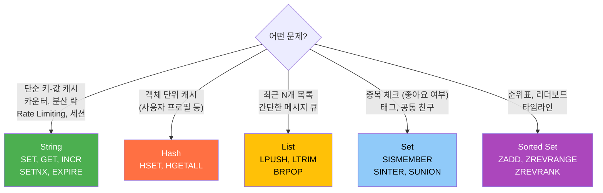

---

# 캐시 전략

Redis를 캐시로 사용할 때 가장 중요한 것은 **DB와 캐시 사이의 데이터 일관성**이다.

## 읽기 전략

### Cache-Aside (Look-Aside)

가장 보편적인 패턴. 애플리케이션이 캐시와 DB를 직접 관리한다.

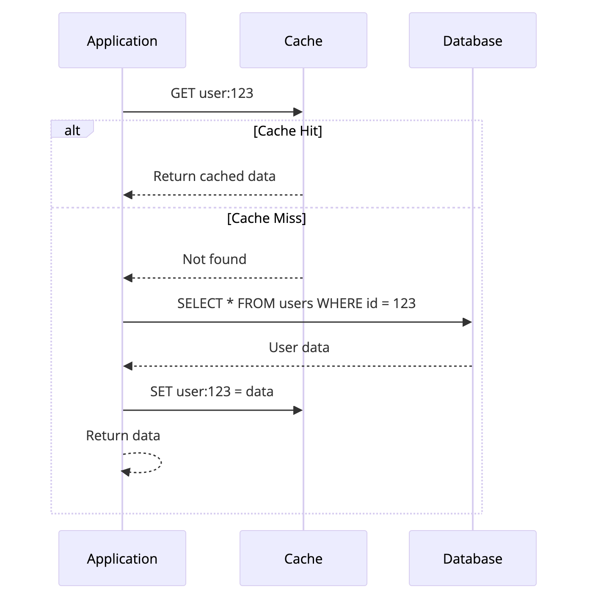
*Cache-Aside 패턴 — 캐시 Hit 시 즉시 반환, Miss 시 DB 조회 후 캐시에 저장*

```java
public User getUser(Long id) {
    String key = "user:" + id;

    // 1. 캐시 조회
    User cached = redisTemplate.opsForValue().get(key);
    if (cached != null) return cached;   // Cache Hit

    // 2. Cache Miss → DB 조회
    User user = userRepository.findById(id).orElseThrow();

    // 3. 캐시에 저장 (TTL 1시간)
    redisTemplate.opsForValue().set(key, user, Duration.ofHours(1));
    return user;
}
```

구현이 단순하고, 캐시가 죽어도 DB로 폴백할 수 있으며, 실제로 읽히는 데이터만 캐시에 올라간다. 단점은 최초 요청이 항상 Miss라는 것, 그리고 DB를 업데이트한 뒤 **캐시 무효화를 잊으면 정합성이 깨진다**는 것이다. 무효화 로직을 직접 구현해야 하므로 빠뜨리기 쉽다.

### Read-Through

캐시 라이브러리가 Miss 시 자동으로 DB에서 로드한다. 애플리케이션은 캐시만 바라보면 된다. Spring의 `@Cacheable`이 이 패턴이다.

```java
@Cacheable(value = "users", key = "#id")
public User getUser(Long id) {
    return userRepository.findById(id).orElseThrow();
}
```

---

## 쓰기 전략

### Write-Around

DB에만 쓰고, 캐시는 건드리지 않는다. 다음 읽기 시 Cache Miss가 발생하면 그때 캐시에 로드.

```
쓰기: App → DB (캐시 무시)
읽기: App → Redis(Miss) → DB → Redis에 저장
```

**장점:** 쓰기가 빠르다 (Redis 호출 없음). **단점:** 쓰기 직후 읽기가 오면 항상 Miss.

### Write-Through

DB와 캐시에 **동시에** 쓴다.

```
쓰기: App → Redis + DB (함께)
읽기: App → Redis (항상 Hit)
```

**장점:** 캐시와 DB가 항상 일치. **단점:** 쓰기 지연 증가 (두 곳에 써야 하므로), 읽히지 않는 데이터도 캐시에 존재.

### Write-Behind (Write-Back)

캐시에만 먼저 쓰고, DB 반영은 **비동기로 나중에** 한다.

```
쓰기: App → Redis (즉시)
      Redis → DB (비동기, 배치)
```

**장점:** 쓰기가 매우 빠르다, DB 부하 분산. **단점:** Redis 장애 시 데이터 유실 위험, 구현 복잡.

### 어떤 쓰기 전략을 쓸까

세 전략을 쓰기 속도 순으로 놓으면 **Write-Behind > Write-Around > Write-Through**다. 하지만 Write-Behind는 Redis 장애 시 DB에 반영 안 된 데이터가 유실되므로 위험하고, Write-Through는 두 곳에 동시에 쓰느라 느리다. **Write-Around가 가장 균형 잡힌 선택**이다 — 쓰기가 빠르고, 정합성은 TTL 만료 시 자연스럽게 갱신된다.

가장 흔한 조합: **Cache-Aside(읽기) + Write-Around(쓰기) + TTL**. 단순하고 안전하다.

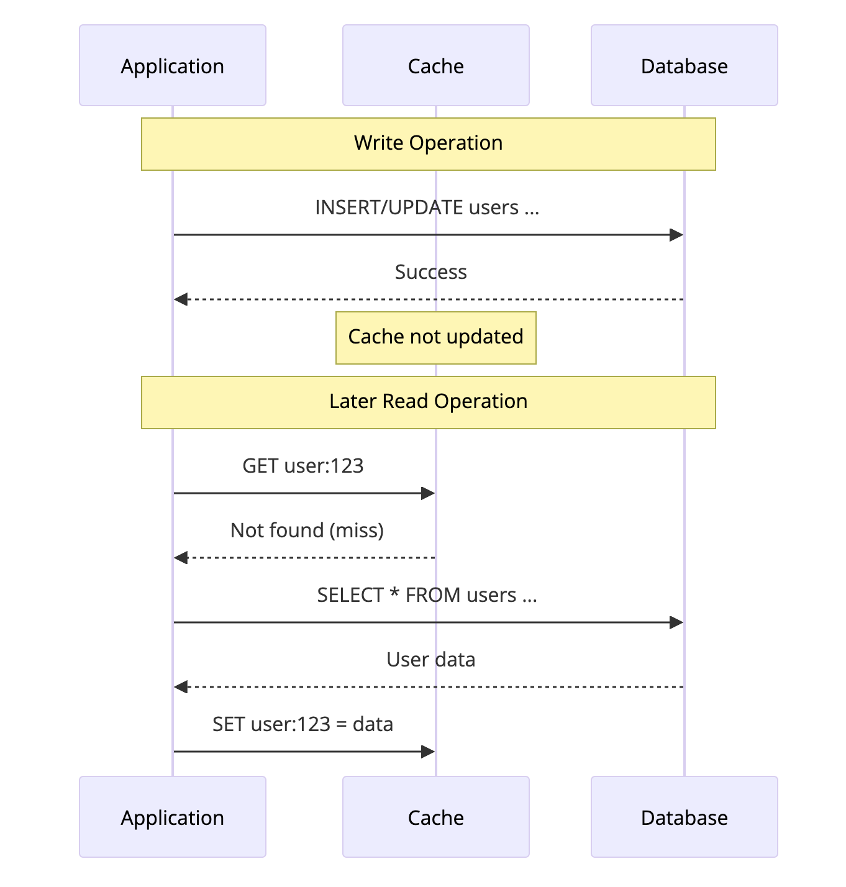
*Write-Around — 쓰기는 DB에 직접 수행하고 캐시는 읽기 시 채워진다 (권장)*

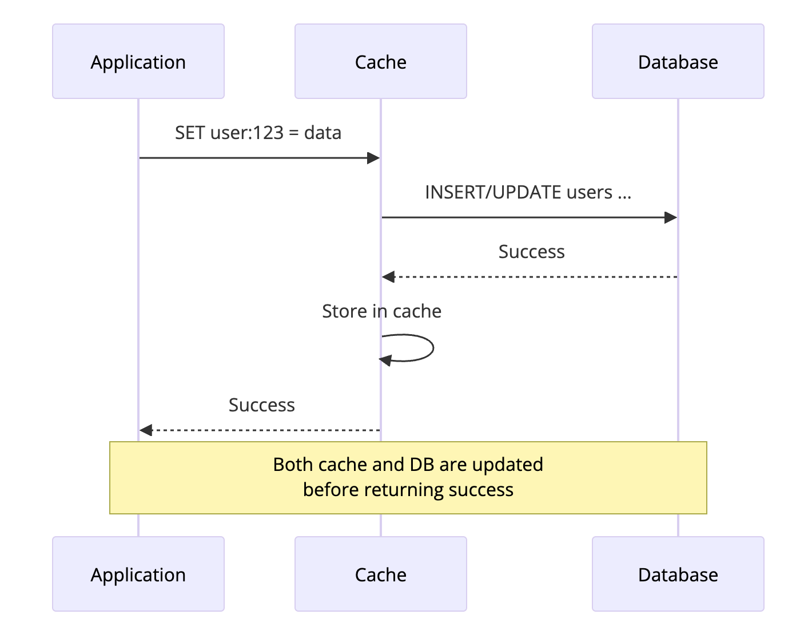
*Write-Through — 캐시와 DB 모두 동기적으로 업데이트한다*

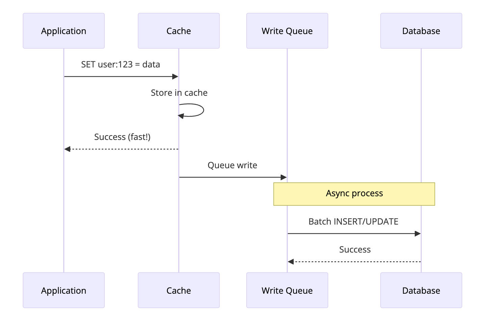
*Write-Behind (Write-Back) — 캐시에 먼저 쓰고 DB에는 비동기 배치로 반영한다*

---

## 캐시 무효화 — 가장 어려운 문제

> *"컴퓨터 과학에서 어려운 문제는 두 가지다: 캐시 무효화와 이름 짓기."* — Phil Karlton

### 업데이트 시 캐시 삭제 vs 갱신

```java
// 방법 1: 삭제 (권장)
public void updateUser(Long id, UserUpdateDto dto) {
    userRepository.update(id, dto);
    redisTemplate.delete("user:" + id);  // 다음 읽기 시 자연스럽게 갱신
}

// 방법 2: 갱신
public void updateUser(Long id, UserUpdateDto dto) {
    User updated = userRepository.update(id, dto);
    redisTemplate.opsForValue().set("user:" + id, updated);  // 즉시 반영
}
```

**삭제가 더 안전하다.** 갱신 방식은 두 스레드가 동시에 같은 키를 업데이트할 때, 나중에 실행된 SET이 더 오래된 값을 덮어쓰는 **race condition**이 발생할 수 있다. 삭제 방식은 최악의 경우에도 Cache Miss가 발생할 뿐이고, 다음 읽기에서 DB의 최신 값을 가져온다. Miss 한 번의 비용은 정합성이 깨지는 것보다 훨씬 싸다.

---

# 영속성 (Persistence)

Redis는 인메모리이므로 프로세스가 죽으면 데이터가 사라진다. 이를 방지하기 위해 두 가지 영속성 메커니즘을 제공한다.

## RDB (Redis Database) — 스냅샷

특정 시점의 전체 데이터를 **바이너리 파일(dump.rdb)**로 저장한다.

```
# redis.conf
save 900 1        # 900초(15분) 동안 1회 이상 변경 시 스냅샷
save 300 10       # 300초(5분) 동안 10회 이상 변경 시 스냅샷
save 60 10000     # 60초(1분) 동안 10,000회 이상 변경 시 스냅샷
```

RDB 파일은 작고 복원이 빠르며, 백업과 복제에 적합하다. 하지만 **마지막 스냅샷 이후의 데이터는 유실**된다. 스냅샷을 찍을 때 `fork()`를 호출하므로 메모리 사용량이 일시적으로 증가하고, 데이터가 크면 fork 비용이 부담될 수 있다.

## AOF (Append Only File) — 로그

모든 쓰기 명령을 **로그 파일(appendonly.aof)**에 순서대로 기록한다. 복원 시 로그를 처음부터 재실행한다.

```
# redis.conf
appendonly yes
appendfsync everysec    # 1초마다 디스크에 동기화 (권장)
# appendfsync always    # 매 명령마다 동기화 (가장 안전, 가장 느림)
# appendfsync no        # OS에 맡김 (가장 빠름, 유실 위험)
```

AOF는 데이터 유실이 최대 1초(`everysec` 설정)로 매우 적고, 로그가 사람이 읽을 수 있는 텍스트이며, AOF rewrite로 파일 크기를 관리할 수 있다. 단점은 파일이 RDB보다 크고, 복원 시 명령을 처음부터 재실행하므로 RDB보다 느리다는 것이다.

## 어떤 것을 쓸까?

**캐시 전용**(유실 OK)이면 영속성을 끄거나 RDB만 켜면 된다. **세션이나 카운터**처럼 약간의 유실이 허용되면 AOF(everysec)가 적합하다. **데이터 저장소**로 쓰면서 유실이 불가하면 AOF + RDB를 모두 켠다.

실무에서 가장 흔한 설정: **AOF(everysec) + RDB를 백업용으로 병행**.

---

# 운영 필수 개념

## TTL (Time-To-Live) — 메모리 관리의 기본

모든 캐시 키에는 **반드시 TTL을 설정**해야 한다. 설정하지 않으면 데이터가 영원히 남아 메모리가 가득 찬다.

```
SET session:abc "data" EX 3600      # 1시간 후 만료
EXPIRE user:1 600                   # 기존 키에 10분 TTL 설정
TTL user:1                          # 남은 시간 조회 → 598
PERSIST user:1                      # TTL 제거 (영구 보존)
```

## Eviction Policy — 메모리가 가득 찼을 때

`maxmemory`에 도달하면 Redis는 설정된 정책에 따라 키를 제거한다.

기본값인 `noeviction`은 메모리가 가득 차면 쓰기를 거부(에러 반환)한다. 캐시 용도라면 **`allkeys-lru`가 가장 권장**되는데, 가장 오래 안 읽힌 키부터 제거하므로 자주 쓰는 데이터가 살아남는다. 영구 키와 캐시 키가 섞여 있다면 `volatile-lru`(TTL이 설정된 키 중에서만 LRU 제거)를 쓰고, 인기도 차이가 큰 데이터에는 `allkeys-lfu`(가장 적게 읽힌 키 제거)가 적합하다. `volatile-ttl`은 만료가 임박한 것부터, `allkeys-random`은 균일한 접근 패턴일 때 사용한다.

```
# redis.conf
maxmemory 2gb
maxmemory-policy allkeys-lru
```

## Pipeline — 네트워크 왕복 줄이기

Redis 명령어 하나당 네트워크 왕복(RTT) 1회가 발생한다. 여러 명령을 **파이프라인으로 묶으면** RTT를 1회로 줄일 수 있다.

```
[파이프라인 없이]
SET a 1   → RTT → OK
SET b 2   → RTT → OK
SET c 3   → RTT → OK
총 RTT: 3회

[파이프라인]
SET a 1 }
SET b 2 } → RTT 1회 → OK, OK, OK
SET c 3 }
총 RTT: 1회
```

```java
// Spring Data Redis
redisTemplate.executePipelined((RedisCallback<Object>) connection -> {
    connection.stringCommands().set("a".getBytes(), "1".getBytes());
    connection.stringCommands().set("b".getBytes(), "2".getBytes());
    connection.stringCommands().set("c".getBytes(), "3".getBytes());
    return null;
});
```

100개 명령을 개별 전송하면 ~100ms, 파이프라인이면 ~1ms. **대량 작업 시 필수.**

## Lua 스크립트 — 원자적 복합 연산

여러 명령을 **원자적으로** 실행해야 할 때 Lua 스크립트를 사용한다. 스크립트 실행 중에는 다른 명령이 끼어들 수 없다.

```lua
-- Rate Limiting: 1분에 최대 100회
local key = KEYS[1]
local limit = tonumber(ARGV[1])
local window = tonumber(ARGV[2])

local current = tonumber(redis.call('GET', key) or '0')
if current >= limit then
    return 0   -- 거부
end

redis.call('INCR', key)
if current == 0 then
    redis.call('EXPIRE', key, window)
end
return 1       -- 허용
```

```java
// Spring Data Redis에서 Lua 실행
DefaultRedisScript<Long> script = new DefaultRedisScript<>(luaScript, Long.class);
Long result = redisTemplate.execute(script, List.of(key), limit, windowSeconds);
```

**주의:** Lua 스크립트가 오래 실행되면 Redis 전체가 블로킹된다. 짧고 단순하게 유지할 것.

---

## 분산 락 — SET NX EX

여러 서버에서 동일한 리소스에 동시 접근하는 것을 방지한다.

```
# 락 획득 (키가 없을 때만 SET, 10초 TTL)
SET lock:order:123 "server-1" NX EX 10

# 성공 → OK (락 획득)
# 실패 → nil (이미 다른 서버가 보유)

# 락 해제 (본인이 설정한 락만 해제 — Lua로 원자적 처리)
```

```lua
-- 안전한 락 해제: 본인이 설정한 값일 때만 삭제
if redis.call('GET', KEYS[1]) == ARGV[1] then
    return redis.call('DEL', KEYS[1])
else
    return 0
end
```

분산 락을 쓸 때 **반드시 TTL을 설정**해야 한다. 락을 잡은 프로세스가 죽으면 TTL 없이는 락이 영원히 남아 데드락이 된다. 값에는 **고유 ID**(UUID 등)를 넣어서, 다른 서버의 락을 실수로 해제하는 것을 방지한다. 해제할 때는 반드시 **Lua 스크립트**로 "내 값이 맞는지 확인 → 삭제"를 원자적으로 수행해야 한다. GET과 DEL을 따로 보내면 그 사이에 다른 서버가 끼어들 수 있다. 단일 Redis가 아닌 클러스터 환경에서는 **Redlock** 알고리즘(Redis 공식 제안)을 사용한다.

---

# 내부 인코딩 — 메모리를 아끼는 방법

Redis는 **자료구조마다 데이터 크기에 따라 내부 인코딩을 자동 전환**한다. 작은 데이터에는 압축 구조를, 큰 데이터에는 본래의 자료구조를 사용한다.

## 인코딩 종류

모든 자료구조는 **데이터가 작을 때 압축 인코딩, 커지면 본래 인코딩**으로 자동 전환된다.

**String**은 정수면 `int`, 44바이트 이하면 `embstr`(메타데이터+문자열을 한 블록에), 그보다 크면 `raw`로 저장된다. **Hash**와 **Sorted Set**은 필드/요소가 128개 이하이고 값이 64바이트 이하면 **ziplist**(Redis 7+에서는 **listpack**)를 쓰고, 넘으면 각각 **hashtable**과 **skiplist+hashtable**로 전환된다. **List**는 listpack/ziplist에서 **quicklist**(ziplist의 연결 리스트)로 자동 관리된다. **Set**은 정수만 들어있으면 **intset**(정렬된 정수 배열), 비정수가 섞이거나 128개를 넘으면 **hashtable**로 바뀐다.

확인 방법:

```
SET mykey "hello"
OBJECT ENCODING mykey           → "embstr"

SET mykey 12345
OBJECT ENCODING mykey           → "int"

HSET myhash a 1 b 2 c 3
OBJECT ENCODING myhash          → "listpack"    (Redis 7+)

# 필드를 129개 넣으면
OBJECT ENCODING myhash          → "hashtable"   (자동 전환)
```

## ziplist / listpack — 작은 데이터의 비밀 무기

ziplist(Redis 7 이전)와 listpack(Redis 7+)은 **연속된 메모리 블록**에 데이터를 순차 저장한다.

```
[일반 해시테이블]
  포인터 → 노드1 → 포인터 → 노드2 → 포인터 → 노드3
  각 노드마다 포인터(8바이트), 메모리 할당 오버헤드, 캐시 미스

[ziplist/listpack]
  |헤더|entry1|entry2|entry3|끝|
  연속 메모리. 포인터 없음. CPU 캐시 친화적.
```

hashtable은 노드당 약 64바이트의 오버헤드(포인터, 메모리 할당 메타)가 있고, 노드가 메모리 곳곳에 흩어져 있어 CPU 캐시 미스가 잦다. 반면 ziplist/listpack은 노드당 약 10바이트로, 연속된 메모리에 빼곡히 들어차 있다. 조회는 $$ O(N) $$ 순차 탐색이지만, $$ N \leq 128 $$이면 **CPU 캐시 히트율**이 압도적으로 높아서 해시테이블의 $$ O(1) $$보다 실제로 더 빠르다. 이것이 Redis가 작은 데이터에 압축 인코딩을 쓰는 이유다.

## 메모리 확인 및 설정

```
MEMORY USAGE user:1             → 해당 키의 메모리 사용량 (바이트)
INFO memory                     → 전체 메모리 사용 현황
```

```
# redis.conf — 전환 기준 조정
hash-max-listpack-entries 128
hash-max-listpack-value 64
zset-max-listpack-entries 128
set-max-intset-entries 512
```

---

# Pub/Sub — 발행/구독 메시징

Redis는 간단한 **발행/구독(Pub/Sub)** 메시징을 지원한다.

```
# 터미널 1: 구독
SUBSCRIBE chat:general

# 터미널 2: 발행
PUBLISH chat:general "안녕하세요!"
# → 터미널 1에 즉시 도착

# 패턴 구독 (와일드카드)
PSUBSCRIBE chat:*
```

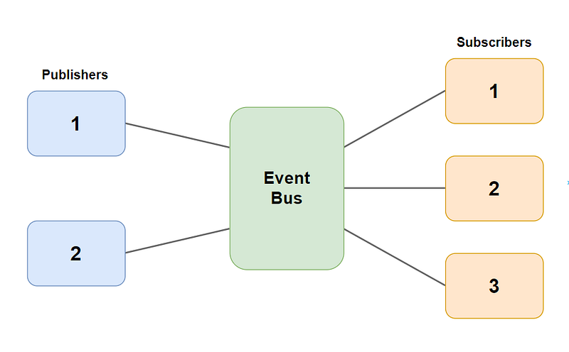
*Pub/Sub 패턴 — Publisher가 메시지를 발행하면 구독 중인 모든 Subscriber에게 실시간 전달된다*

### Pub/Sub의 한계

Pub/Sub은 **fire-and-forget**이다. 메시지가 저장되지 않으므로 발행 시점에 구독자가 없으면 그 메시지는 그냥 사라진다. 구독자가 연결을 끊었다가 다시 연결해도 그 사이의 메시지를 받을 수 없고, ACK 메커니즘도 없어서 전달을 보장하지 않는다(at-most-once). 클러스터 환경에서는 메시지가 모든 노드에 브로드캐스트되어 네트워크 부하가 커질 수 있다.

결론: 유실이 허용되는 **실시간 알림**에만 쓴다. 메시지 보장이 필요하면 Redis Streams를 써야 한다.

---

# Redis Streams — Kafka처럼 쓰는 Redis

Redis 5.0에서 도입된 **Streams**는 Pub/Sub의 한계를 해결한 **로그 기반 메시지 구조**다.

## Pub/Sub vs Streams

Pub/Sub과 가장 큰 차이는 **메시지가 저장된다**는 것이다. Pub/Sub은 구독자가 없으면 메시지가 사라지지만, Streams는 로그 구조로 **영구 저장**된다. 구독자가 오프라인이었다가 돌아와도 마지막 읽은 위치부터 재개할 수 있다. **Consumer Group**을 지원하여 Kafka처럼 여러 Consumer가 메시지를 분담 처리할 수 있고, `XACK`로 처리 완료를 확인하며, ID를 지정하면 특정 위치부터 **재처리**도 가능하다.

## 기본 명령어

```
XADD mystream * user "kim" action "login"
→ "1711540800123-0"

XRANGE mystream - + COUNT 10
XREAD BLOCK 5000 STREAMS mystream $
```

## Consumer Group

여러 Consumer가 하나의 Stream을 **분담하여** 처리한다. 같은 그룹 내에서 각 메시지는 **하나의 Consumer만** 처리한다.

```
XGROUP CREATE mystream order-group $ MKSTREAM
XREADGROUP GROUP order-group consumer-1 COUNT 5 BLOCK 2000 STREAMS mystream >
XACK mystream order-group "1711540800123-0"
```

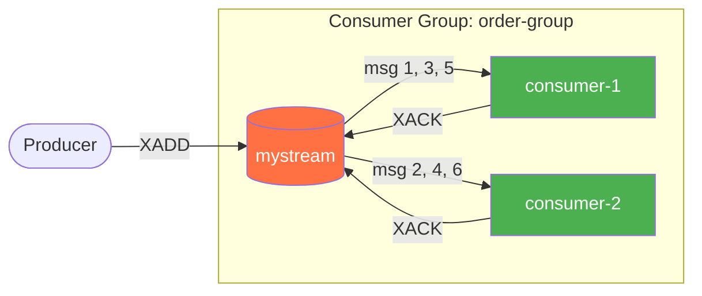

### XPENDING과 XCLAIM — 장애 복구

Consumer가 ACK 전에 죽으면 메시지는 **pending** 상태로 남는다.

```
XPENDING mystream order-group - + 10
XCLAIM mystream order-group consumer-2 60000 "1711540800123-0"
```

`XPENDING`으로 ACK 안 된 메시지 목록을 조회하고, `XCLAIM`으로 다른 Consumer의 pending 메시지를 인수인계할 수 있다. Redis 6.2+에서는 `XAUTOCLAIM`으로 일정 시간 초과된 pending을 자동 인수인계하는 것도 가능하다.

### Stream 크기 관리

```
XADD mystream MAXLEN ~ 10000 * user "kim" action "login"
XTRIM mystream MAXLEN ~ 10000
```

---

# Transaction — MULTI/EXEC

Redis 트랜잭션은 RDBMS와 다르다. **롤백이 없다.**

```
MULTI
SET account:A 900
SET account:B 1100
EXEC
```

## RDBMS 트랜잭션과의 차이

RDBMS의 트랜잭션은 전체 성공 아니면 전체 롤백이지만, Redis의 MULTI/EXEC는 **롤백이 없다**. 명령을 순차 실행하는데, 개별 명령이 실패해도 나머지는 그냥 실행된다. EXEC 중에 다른 명령이 끼어들지는 않으므로 격리성은 보장되지만, RDBMS의 다양한 격리 수준(READ COMMITTED, REPEATABLE READ 등)과는 다르다. 조건부 실행은 WHERE 절 대신 `WATCH`로 낙관적 락을 건다.

## WATCH — 낙관적 락

`WATCH`는 키를 감시하다가, EXEC 시점에 해당 키가 변경되었으면 **트랜잭션 전체를 취소**한다.

```
WATCH account:A
val = GET account:A

MULTI
SET account:A (val - 100)
SET account:B (val + 100)
EXEC
# → WATCH 이후 account:A가 변경되었으면 nil 반환 (취소)
```

## MULTI/EXEC vs Lua

MULTI/EXEC와 Lua 스크립트 모두 실행 중 다른 명령이 끼어들지 못한다는 점은 동일하다. 핵심 차이는 **조건 분기**다. MULTI/EXEC는 명령을 큐에 넣는 시점에 이전 명령의 결과를 알 수 없으므로 "A를 읽고, 값이 100 이상이면 B를 업데이트"같은 **조건부 로직이 불가능**하다. Lua 스크립트는 if/else를 자유롭게 쓸 수 있다. 네트워크 측면에서도 MULTI/EXEC는 명령마다 큐잉하지만, Lua는 스크립트 전체를 한 번에 전송한다.

단순한 복수 명령 실행에는 MULTI/EXEC, 조건부 원자적 연산에는 Lua를 쓴다.

---

# Replication — 복제

## Master-Replica 구조

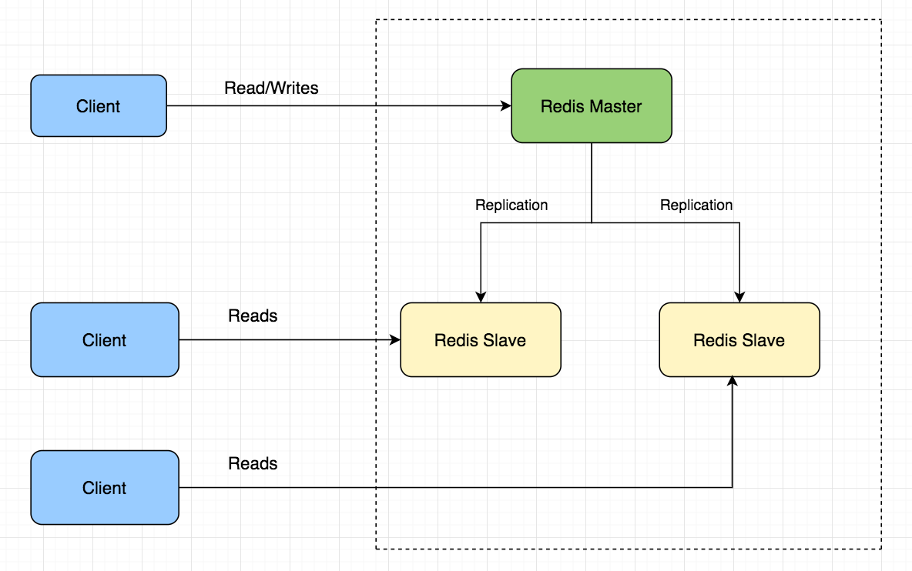
*Master-Replica 복제 — Master가 쓰기를 처리하고 Replica로 비동기 복제하여 읽기를 분산한다*

```
REPLICAOF 192.168.1.100 6379
```

### 복제 동작 원리

**최초 동기화 (Full Sync):**

1. Replica가 Master에 연결
2. Master가 `BGSAVE` → RDB 스냅샷 생성 (fork)
3. 스냅샷을 Replica에 전송
4. 전송 중 들어온 명령은 **replication buffer**에 축적
5. 스냅샷 로드 후 buffer 명령 순서대로 적용

**이후 동기화:** Master의 모든 쓰기 명령이 **실시간으로** Replica에 전파. 비동기 복제이므로 Master는 Replica 응답을 기다리지 않는다.

### 비동기 복제의 위험

```
Master:   SET key "A"  →  SET key "B"  →  장애!
Replica:  SET key "A"  →  (아직 "B" 미수신)  →  Master로 승격

결과: key = "A" ("B"는 유실)
```

`WAIT` 명령으로 동기 복제를 강제할 수 있지만 지연이 발생한다:

```
SET key "B"
WAIT 1 5000        # 최소 1개 Replica가 5초 내에 복제 확인할 때까지 대기
```

---

## Sentinel — 자동 장애 복구

Master 장애 시 Replica를 **자동으로 Master로 승격**하는 고가용성 시스템.

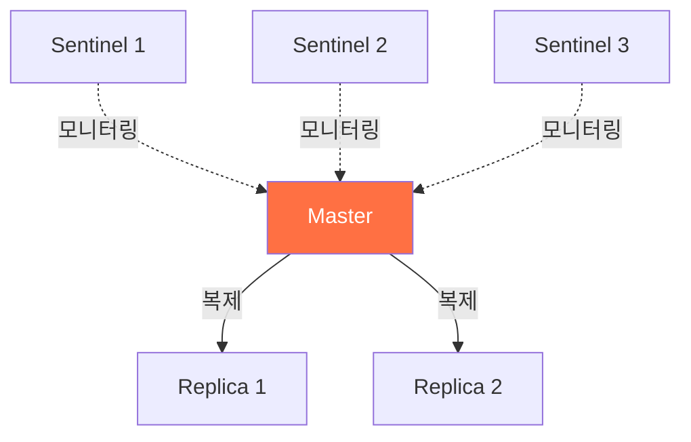

### 페일오버 과정

1. Sentinel들이 Master에 주기적으로 PING
2. 응답 없으면 **SDOWN** (Subjective Down) — "내가 보기엔 죽음"
3. 과반수 동의 시 **ODOWN** (Objective Down) — "합의에 의한 죽음"
4. Sentinel 중 **리더 선출** (Raft 기반)
5. 가장 데이터가 최신인 Replica를 **Master로 승격**
6. 나머지 Replica는 새 Master를 바라보도록 재설정
7. 클라이언트에 **새 Master 주소 알림**

설정 예시:

```
sentinel monitor mymaster 127.0.0.1 6379 2      # quorum=2: 2개 이상 동의 시 ODOWN
sentinel down-after-milliseconds mymaster 5000   # 5초 무응답 시 SDOWN
sentinel failover-timeout mymaster 60000         # 페일오버 타임아웃 60초
```

**Sentinel은 최소 3개** 운영해야 한다. 2개면 하나가 죽었을 때 과반수를 구성할 수 없어 페일오버가 불가능하다.

---

## Cluster — 수평 확장 (샤딩)

데이터를 **여러 노드에 분산 저장**하여 단일 Redis의 메모리 한계를 넘는다.

### Hash Slot 기반 샤딩

16,384개 해시 슬롯으로 키 공간을 나눈다:

$$
\text{slot} = \text{CRC16}(\text{key}) \mod 16384
$$

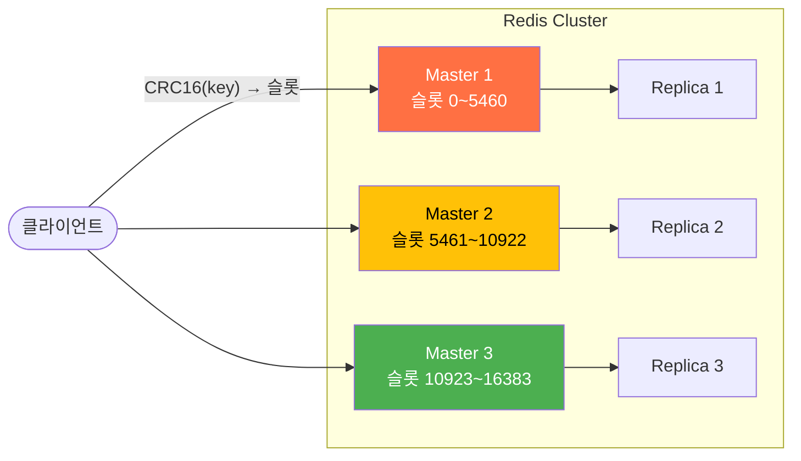

### MOVED 리다이렉트

잘못된 노드에 요청하면 올바른 노드를 알려준다:

```
GET user:2
→ (error) MOVED 8890 192.168.1.102:6379
# 클라이언트가 자동으로 올바른 노드에 재요청
```

### 클러스터의 제약

`MGET key1 key2`처럼 **여러 키를 한 번에 다루는 명령**은 key들이 서로 다른 노드에 있을 수 있으므로 제한된다. Lua 스크립트도 스크립트 내 모든 키가 같은 슬롯에 있어야 하고, MULTI/EXEC도 마찬가지다. `SELECT` 명령은 아예 불가능하여 DB 0만 사용할 수 있다.

이 제약은 대부분 **Hash Tag**로 해결한다:

**Hash Tag:**

```
SET {user:1}:profile "..."
SET {user:1}:session "..."
MGET {user:1}:profile {user:1}:session    # 같은 슬롯 → 성공
```

---

# 실전 문제와 대응

## Cache Stampede (Thundering Herd)

인기 캐시 키의 **TTL 만료 순간**, 수백 개 요청이 동시에 Cache Miss → 모두 DB 쿼리 → DB 과부하.

### 해결 1: 분산 락 (Mutex)

하나의 요청만 DB에 접근, 나머지는 대기:

```java
public User getUser(Long id) {
    String key = "user:" + id;
    User cached = redis.get(key);
    if (cached != null) return cached;

    String lockKey = "lock:" + key;
    boolean acquired = redis.setIfAbsent(lockKey, "1", Duration.ofSeconds(5));

    if (acquired) {
        try {
            User user = db.findById(id);
            redis.set(key, user, Duration.ofHours(1));
            return user;
        } finally {
            redis.delete(lockKey);
        }
    } else {
        Thread.sleep(50);
        return redis.get(key);
    }
}
```

### 해결 2: 논리적 만료 (Logical Expiration)

TTL을 실제보다 길게 설정하고, 값 내부에 논리적 만료 시간 저장. 만료 시 **백그라운드**에서 갱신, 그 동안 **오래된 값 반환**.

```java
CacheEntry entry = redis.get(key);
if (entry.isLogicallyExpired()) {
    executor.submit(() -> refreshCache(key));  // 비동기 갱신
}
return entry.getData();   // 오래된 값이라도 즉시 반환
```

분산 락 방식은 정합성을 보장하지만 락 대기 시간이 발생한다. 논리적 만료 방식은 DB 부하가 없고 응답이 빠르지만, 짧은 시간 동안 오래된 데이터가 노출될 수 있다. 트래픽이 극단적이고 약간의 지연이 허용되면 논리적 만료, 정합성이 절대적이면 분산 락을 쓴다.

---

## Hot Key 문제

특정 키에 요청이 **극단적으로 집중**되는 현상.

### 해결 1: 로컬 캐시 (L1 Cache)

```java
Cache<String, Object> localCache = Caffeine.newBuilder()
        .expireAfterWrite(1, TimeUnit.SECONDS)
        .maximumSize(1000)
        .build();

public Object get(String key) {
    return localCache.get(key, k -> redis.get(k));
}
```

### 해결 2: 키 분산 (Key Sharding)

```java
int shard = ThreadLocalRandom.current().nextInt(10);
String value = redis.get("hot:keyword:" + shard);
```

---

## Big Key 문제

하나의 키에 데이터가 **너무 큰** 경우. 삭제/조회/만료 시 블로킹.

String이 10MB를 넘거나, Hash/Set/Sorted Set이 10만 요소를 넘으면 위험하다. `HGETALL`이나 `SMEMBERS` 한 번에 수 초간 블로킹되고, 삭제(`DEL`)나 만료 시에도 메모리 해제에 시간이 걸린다.

### 탐지 및 해결

```
redis-cli --bigkeys                    # 큰 키 찾기 (SCAN 기반, 운영 중 안전)
MEMORY USAGE my:big:key                # 특정 키 메모리 확인

UNLINK my:big:key                      # 비동기 삭제 (DEL 대신)
```

큰 Hash/Set은 **여러 키로 분할** (bucket = hash(id) % N).

---

# 모니터링

## 필수 명령어

```
INFO memory                    # 메모리: used_memory, fragmentation_ratio
INFO stats                     # 통계: keyspace_hits/misses, ops_per_sec
INFO replication               # 복제: replica 수, offset 차이
INFO clients                   # 클라이언트: 연결 수

SLOWLOG GET 10                 # 느린 명령어 최근 10개
CLIENT LIST                    # 현재 연결된 클라이언트
DBSIZE                         # 현재 키 수
```

## 핵심 모니터링 지표

가장 먼저 볼 것은 **캐시 적중률**(`keyspace_hits / (hits + misses)`)이다. 80% 이하면 캐시 전략 자체를 점검해야 한다. **메모리 사용률**(`used_memory / maxmemory`)이 90%를 넘으면 eviction이 빈번하게 발생하고, **메모리 단편화**(`mem_fragmentation_ratio`)가 1.5 이상이면 실제 데이터보다 훨씬 많은 메모리를 점유하고 있다는 뜻이다.

**연결 수**(`connected_clients`)가 `maxclients`에 근접하면 새 연결이 거부될 수 있고, **복제 지연**(`master_repl_offset - slave_repl_offset`)의 차이가 크면 Replica가 Master를 따라가지 못하고 있는 것이다. `SLOWLOG`에 느린 명령이 자주 찍히면 Big Key나 위험 명령을 사용하고 있을 가능성이 높고, `instantaneous_ops_per_sec`의 급격한 변화는 트래픽 이상 신호다.

```
# redis.conf
slowlog-log-slower-than 10000     # 10ms 이상 걸리는 명령 기록
slowlog-max-len 128
```

---

# 정리

Redis는 **자료구조 서버**다. String, Hash, List, Set, Sorted Set 각각이 서로 다른 문제를 해결한다. 싱글 스레드이기 때문에 락 없이 빠르지만, 반대로 느린 명령 하나가 전체를 멈출 수 있으므로 `KEYS *` 같은 $$ O(N) $$ 명령은 운영에서 절대 쓰면 안 된다.

캐시로 쓸 때는 **Cache-Aside + Write-Around + TTL** 조합이 가장 단순하고 안전하다. 무효화 시에는 갱신보다 **삭제**가 race condition에 강하다. 영속성이 필요하면 **AOF(everysec) + RDB 백업**을 병행한다.

내부적으로 ziplist/listpack 같은 압축 인코딩이 작은 데이터의 메모리를 아끼고, 데이터가 커지면 hashtable/skiplist로 자동 전환된다. 이 전환 기준을 알아야 메모리를 최적화할 수 있다.

메시징이 필요하면 **유실 허용 → Pub/Sub**, **보장 필요 → Streams**(Consumer Group + ACK). 트랜잭션은 MULTI/EXEC보다 **Lua 스크립트**가 조건 분기까지 가능해서 실무에서 더 유용하다.

단일 인스턴스의 한계는 **Replication**(읽기 분산 + 장애 대비), **Sentinel**(자동 페일오버), **Cluster**(해시 슬롯 샤딩으로 수평 확장)로 넘는다. Sentinel은 최소 3개, Cluster는 Hash Tag로 다중 키 명령의 슬롯 제약을 해결한다.

운영에서 자주 만나는 문제 세 가지: **Cache Stampede**(TTL 만료 시 동시 DB 접근 → 분산 락 또는 논리적 만료), **Hot Key**(특정 키에 집중 → 로컬 캐시 또는 키 분산), **Big Key**(큰 데이터 블로킹 → `UNLINK` 비동기 삭제, 키 분할). 이 셋을 모르면 장애가 터진 뒤에 알게 된다.
