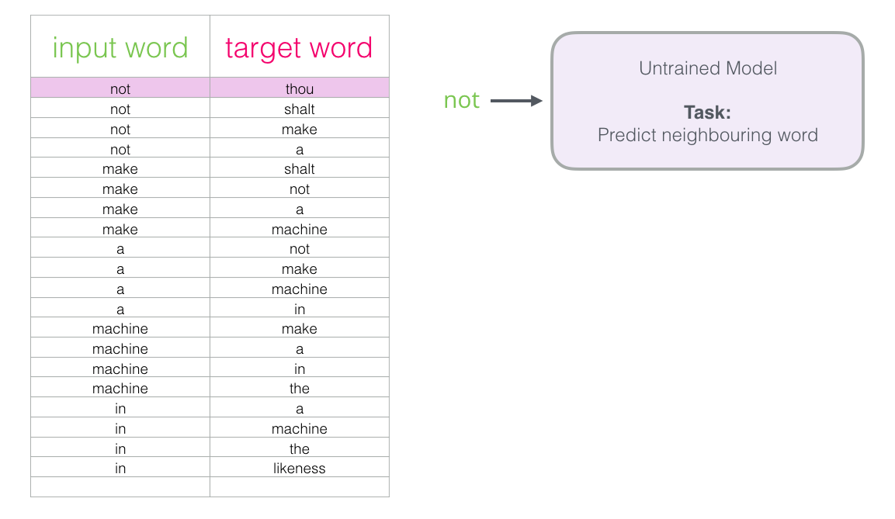
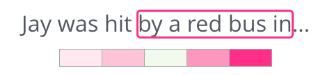
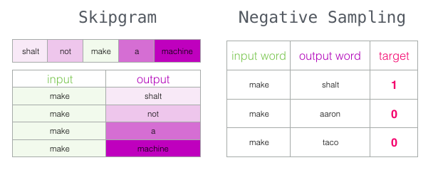
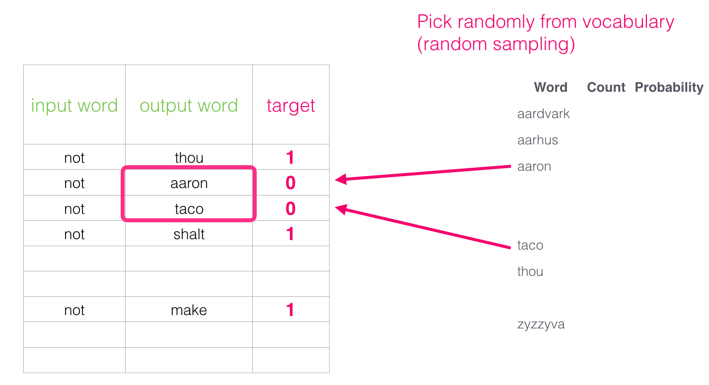
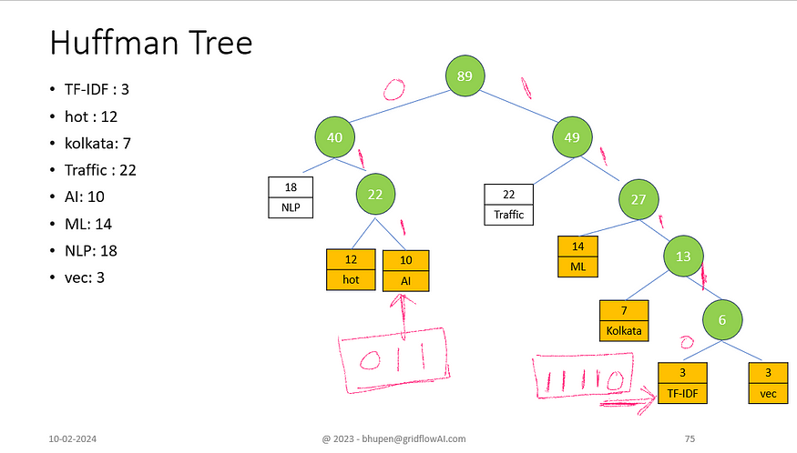
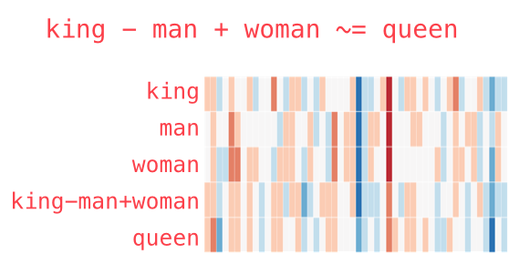

컴퓨터는 문자열을 이해하지 못한다. "고양이"와 "강아지"가 비슷한 개념이라는 것도, "왕"에서 "남자"를 빼고 "여자"를 더하면 "여왕"이 된다는 것도 모른다. 단어를 숫자로 바꿔야 하는데, 어떻게 바꾸느냐에 따라 모델 성능이 극적으로 달라진다.

2013년 Google의 Tomas Mikolov가 발표한 Word2Vec은 이 문제를 해결했고, 이후 NLP의 판도를 바꿨다. 두 편의 논문이 핵심이다:
- *Efficient Estimation of Word Representations in Vector Space* (2013) — CBOW와 Skip-gram 아키텍처 제안
- *Distributed Representations of Words and Phrases and their Compositionality* (2013) — Negative Sampling, Subsampling 등 학습 최적화 기법 제안

---

# 왜 Word2Vec인가

## 원-핫 인코딩의 한계

가장 단순한 방법은 원-핫 인코딩(One-Hot Encoding)이다. 단어 집합(vocabulary)의 크기만큼 벡터를 만들고, 해당 단어 위치만 1, 나머지는 0으로 채운다.

```
단어 집합: [고양이, 강아지, 사과, 바나나]

고양이 = [1, 0, 0, 0]
강아지 = [0, 1, 0, 0]
사과   = [0, 0, 1, 0]
바나나 = [0, 0, 0, 1]
```

문제가 두 가지다.

**1. 단어 간 관계를 표현할 수 없다.**

"고양이"와 "강아지"는 둘 다 동물이니 가까워야 하고, "고양이"와 "바나나"는 멀어야 한다. 하지만 원-핫 벡터 사이의 코사인 유사도는 전부 0이다. 모든 단어 쌍이 똑같이 "무관"하다.

$$
\cos(\text{고양이}, \text{강아지}) = \frac{[1,0,0,0] \cdot [0,1,0,0]}{\|[1,0,0,0]\| \cdot \|[0,1,0,0]\|} = 0
$$

**2. 차원이 폭발한다.**

단어 집합이 10만 개면 벡터 하나가 10만 차원이다. 대부분이 0인 희소(sparse) 벡터라 메모리 낭비가 심하고, 모델이 학습할 정보도 없다.

## 임베딩이라는 해결책

원-핫의 두 문제를 동시에 해결하는 것이 **임베딩(Embedding)**이다. 단어를 **낮은 차원(보통 100~300)의 밀집(dense) 실수 벡터**로 표현한다.

```
고양이 = [0.21, -0.55, 0.83, ..., 0.12]    (300차원)
강아지 = [0.19, -0.48, 0.79, ..., 0.15]    (300차원)
바나나 = [-0.62, 0.31, -0.15, ..., 0.88]   (300차원)
```

이렇게 되면:
- "고양이"와 "강아지"의 코사인 유사도가 높다 → **의미적 유사성 반영**
- 10만 개 단어도 300차원이면 충분 → **차원 축소**

문제는 이 벡터를 어떻게 만드느냐다. 사람이 수작업으로 정할 수는 없으니, **데이터에서 학습**해야 한다. 그 방법이 Word2Vec이다.

---

# Word2Vec의 핵심 아이디어

> **"비슷한 맥락에서 등장하는 단어는 비슷한 의미를 가진다."**
> — 분포 가설 (Distributional Hypothesis, Harris 1954)

"나는 __ 를 키운다"에서 빈칸에 "고양이"와 "강아지"가 모두 들어갈 수 있다. 반면 "나는 __ 를 키운다"에 "자동차"는 어색하다. Word2Vec은 이런 **주변 단어(context)**의 공유 패턴으로부터 의미를 학습한다.

핵심 통찰은 이것이다: Word2Vec은 단어의 "의미"를 직접 학습하는 것이 아니다. **"어떤 단어가 어떤 단어 근처에 나타나는가"라는 패턴을 학습하는 것이고, 그 부산물로 의미 있는 벡터가 만들어진다.** 임베딩은 예측 과제를 풀기 위해 학습된 가중치 행렬의 행(row)일 뿐이다.

Word2Vec에는 두 가지 아키텍처가 있다: **CBOW**와 **Skip-gram**.

---

# CBOW (Continuous Bag of Words)

## 과제

**주변 단어들이 주어졌을 때, 중심 단어를 예측한다.**

```
"나는  예쁜  [고양이]를  좋아한다"
          윈도우(c=2)

입력(주변 단어): "나는", "예쁜", "를", "좋아한다"
출력(중심 단어): "고양이"
```

윈도우 크기 $$ c $$는 좌우로 몇 단어를 볼 것인지 결정한다. $$ c=2 $$이면 중심 단어 양옆 2개씩, 총 4개의 주변 단어를 본다.

## 네트워크 구조


*CBOW: 주변 단어(context words)를 입력으로 받아 빈칸(target word)을 예측한다. (출처: [The Illustrated Word2vec](https://jalammar.github.io/illustrated-word2vec/), CC BY-NC-SA 4.0)*

두 개의 가중치 행렬이 있다:
- **입력 행렬 $$ W \in \mathbb{R}^{V \times N} $$**: 각 행이 해당 단어의 임베딩 벡터. V는 단어 집합 크기, N은 임베딩 차원.
- **출력 행렬 $$ W' \in \mathbb{R}^{N \times V} $$**: 은닉층에서 출력층으로의 가중치.

### 단계별 동작

**1단계: Embedding Lookup**

입력 행렬 $$ W $$에서 각 주변 단어의 원-핫 벡터에 해당하는 행을 꺼낸다. 원-핫 벡터와 행렬의 곱은 결국 해당 행을 그대로 선택하는 것이다(lookup).

$$
\mathbf{v}_{w_i} = W^T \cdot \mathbf{x}_{w_i}
$$

원-핫 벡터 $$ \mathbf{x}_{w_i} $$에서 1인 위치의 행만 뽑아오므로, 실제 연산에서는 행렬곱을 하지 않고 인덱스로 직접 접근한다. 이것이 PyTorch의 `nn.Embedding`이 하는 일이다.

**2단계: 평균**

주변 단어 벡터들의 평균을 구한다. "Bag of Words"라는 이름처럼 **단어 순서는 무시**한다. "나는 고양이를" 과 "고양이를 나는"은 동일하게 취급된다.

$$
\mathbf{h} = \frac{1}{2c} \sum_{i=1}^{2c} \mathbf{v}_{w_i}
$$

**3단계: Softmax**

평균 벡터 $$ \mathbf{h} $$를 출력 행렬 $$ W' $$와 곱한 뒤 Softmax를 적용하여, 전체 단어 집합에 대한 확률 분포를 만든다.

$$
P(w_j | \text{context}) = \frac{\exp(\mathbf{u}_{w_j}^T \cdot \mathbf{h})}{\sum_{k=1}^{V} \exp(\mathbf{u}_{w_k}^T \cdot \mathbf{h})}
$$

$$ \mathbf{u}_{w_j} $$는 출력 행렬 $$ W' $$에서 단어 $$ w_j $$에 해당하는 열 벡터다.

**4단계: Cross-Entropy Loss**

정답 단어("고양이")의 확률을 최대화한다. 이는 Cross-Entropy Loss를 최소화하는 것과 같다.

$$
L = -\log P(w_{\text{target}} | \text{context})
$$

**5단계: 역전파(Backpropagation)**

Loss에 대해 $$ W $$와 $$ W' $$를 경사 하강법(SGD)으로 갱신한다. 이 과정이 코퍼스의 모든 윈도우에 대해 반복되면서, **비슷한 맥락에 등장하는 단어들의 벡터가 점점 가까워진다.**

학습이 끝나면 입력 행렬 $$ W $$의 각 행이 곧 **단어 임베딩 벡터**가 된다. 출력 행렬 $$ W' $$는 보통 버린다(일부 구현에서는 $$ W $$와 $$ W' $$를 평균하기도 한다).

### 은닉층에 비선형 활성화 함수가 없는 이유

일반적인 신경망은 은닉층에 ReLU, sigmoid 같은 비선형 활성화 함수를 넣는다. 하지만 Word2Vec은 **은닉층이 단순한 선형 투사(projection)**다. 비선형 함수를 넣지 않는다.

이유가 있다:

1. **Word2Vec의 목적은 "분류"가 아니라 "표현 학습"이다.** 복잡한 비선형 결정 경계를 학습할 필요가 없다. 단어 간의 관계를 벡터 공간에서 **선형적으로** 표현하는 것이 목표다.

2. 선형 투사이기 때문에 **king - man + woman ≈ queen** 같은 벡터 산술이 가능해진다. 비선형 변환이 끼면 이런 깔끔한 선형 관계가 깨진다.

3. 출력층의 Softmax 자체가 이미 비선형이다. 은닉층까지 비선형을 넣으면 학습이 느려지기만 하고 임베딩 품질은 나아지지 않는다.

---

# Skip-gram

## 과제

CBOW의 반대다. **중심 단어가 주어졌을 때, 주변 단어를 예측한다.**

```
"나는  예쁜  [고양이]를  좋아한다"
           윈도우(c=2)

입력(중심 단어): "고양이"
출력(주변 단어): "나는", "예쁜", "를", "좋아한다"
```

실제로는 (중심, 주변) 쌍을 만들어서 각각 독립적으로 학습한다:


*코퍼스에서 윈도우를 슬라이딩하며 (input word, target word) 쌍을 만든다. 이 쌍들이 Skip-gram의 학습 데이터가 된다. (출처: [The Illustrated Word2vec](https://jalammar.github.io/illustrated-word2vec/), CC BY-NC-SA 4.0)*

## 네트워크 구조


*Skip-gram: 중심 단어(분홍색)가 입력이고, 주변 단어들이 출력이다. (출처: [The Illustrated Word2vec](https://jalammar.github.io/illustrated-word2vec/), CC BY-NC-SA 4.0)*

CBOW와 달리 입력이 하나이므로 평균을 구하는 단계가 없다. 입력 행렬 $$ W $$에서 중심 단어의 벡터를 꺼내고, 출력 행렬 $$ W' $$와 곱하고, Softmax로 확률을 만든다.

## 손실 함수

윈도우 내 모든 주변 단어에 대한 로그 확률의 합을 최대화한다.

$$
L = -\sum_{j=1}^{2c} \log P(w_{c+j} | w_c) = -\sum_{j=1}^{2c} \log \frac{\exp(\mathbf{u}_{w_{c+j}}^T \cdot \mathbf{v}_{w_c})}{\sum_{k=1}^{V} \exp(\mathbf{u}_{w_k}^T \cdot \mathbf{v}_{w_c})}
$$

## 윈도우 내 동적 샘플링

Mikolov의 원 구현에서는 윈도우 크기를 고정하지 않고, 1부터 $$ c $$ 사이의 랜덤한 값을 매번 선택한다. 이렇게 하면 중심 단어에 가까운 주변 단어가 더 자주 학습 데이터에 포함되어, **가까운 단어에 더 큰 가중치**를 주는 효과가 생긴다.

## CBOW vs Skip-gram

| | CBOW | Skip-gram |
|---|---|---|
| 방향 | 주변 → 중심 | 중심 → 주변 |
| 입력 | 주변 단어 2c개 | 중심 단어 1개 |
| 출력 | 중심 단어 1개 | 주변 단어 1개 (쌍 단위) |
| 학습 속도 | **빠름** | 느림 (쌍이 더 많음) |
| 빈도 낮은 단어 | 약함 (평균에 묻힘) | **강함** (중심 단어로 직접 학습) |
| 데이터 적을 때 | 약함 | **유리** |
| 데이터 많을 때 | **유리** | 느려짐 |

CBOW에서 희귀 단어가 약한 이유를 구체적으로 보자. "quasar"라는 단어가 코퍼스에 3번 나타난다고 하자.

- **CBOW**: "quasar"가 중심 단어(정답)인 경우는 3번뿐이다. 주변 단어들의 평균으로 "quasar"를 맞춰야 하는데, 3번의 학습 기회로는 부족하다.
- **Skip-gram**: "quasar"가 중심 단어(입력)인 경우 3번이지만, 각 경우에 주변 단어 2c개와 쌍을 만들므로 총 $$ 3 \times 2c $$ 번의 학습 기회가 생긴다. 윈도우 크기가 5면 30번이다.

실무에서는 **Skip-gram이 더 널리 쓰인다.** 희귀 단어의 임베딩 품질이 더 좋기 때문이다.

---

# Softmax의 비용 문제

CBOW든 Skip-gram이든, 출력층에서 Softmax를 계산할 때 **전체 단어 집합(V)에 대해 지수 함수를 계산하고 정규화**해야 한다.

$$
P(w_j | w_I) = \frac{\exp(\mathbf{u}_{w_j}^T \cdot \mathbf{v}_{w_I})}{\sum_{k=1}^{V} \exp(\mathbf{u}_{w_k}^T \cdot \mathbf{v}_{w_I})}
$$

분모의 합산이 $$ O(V) $$다. V가 10만이면 학습 한 스텝마다 10만 번의 내적 + 지수 함수 + 합산이 필요하다. 코퍼스가 수십억 단어이므로 이 계산을 수십억 번 반복해야 한다. **현실적으로 학습이 불가능하다.**

Word2Vec의 두 번째 논문이 이 문제를 해결하는 두 가지 방법을 제시한다.

---

# Negative Sampling

## 아이디어

Softmax는 "전체 단어 중에서 정답의 확률이 가장 높아야 한다"는 목표를 세운다. 이를 바꿔서, **"정답 쌍은 높은 점수를, 무작위 쌍은 낮은 점수를 받도록"** 이진 분류 문제로 변환한다.


*왼쪽: Skip-gram이 만드는 (입력, 출력) 쌍. 오른쪽: Negative Sampling으로 변환 — 실제 쌍은 target=1, 무작위 쌍은 target=0. (출처: [The Illustrated Word2vec](https://jalammar.github.io/illustrated-word2vec/), CC BY-NC-SA 4.0)*


*긍정 쌍(초록 1)의 주변 단어는 실제 윈도우에서 가져오고, 부정 쌍(빨간 0)은 단어 집합에서 빈도 기반으로 무작위 선택한다. (출처: [The Illustrated Word2vec](https://jalammar.github.io/illustrated-word2vec/), CC BY-NC-SA 4.0)*

전체 V개 단어 대신, 정답 1개 + 부정 샘플 k개만 계산하면 된다.

## 목적 함수

Softmax가 아니라 **시그모이드(sigmoid)**를 사용한다.

$$
L = -\log \sigma(\mathbf{u}_{w_O}^T \cdot \mathbf{v}_{w_I}) - \sum_{i=1}^{k} \mathbb{E}_{w_i \sim P_n(w)} \left[ \log \sigma(-\mathbf{u}_{w_i}^T \cdot \mathbf{v}_{w_I}) \right]
$$

- 첫째 항: 긍정 쌍의 내적을 크게 → $$ \sigma $$ 출력을 1에 가깝게
- 둘째 항: 부정 쌍의 내적을 작게 → $$ \sigma(-\cdot) $$ 출력을 1에 가깝게 (= $$ \sigma(\cdot) $$를 0에 가깝게)

직관적으로: 정답 단어의 벡터는 중심 단어와 **같은 방향**으로, 오답 단어의 벡터는 **반대 방향**으로 밀어낸다.

## Negative 샘플은 어떻게 뽑나

균일 분포로 뽑으면 "the", "a", "is" 같은 고빈도 단어만 계속 뽑힌다. 빈도의 **3/4 제곱**에 비례하게 샘플링한다.

$$
P_n(w_i) = \frac{f(w_i)^{3/4}}{\sum_{j=1}^{V} f(w_j)^{3/4}}
$$

왜 3/4 제곱인가? 빈도가 $$ f = 0.9 $$인 단어와 $$ f = 0.01 $$인 단어를 비교해보자.

| | 원래 빈도 | 3/4 제곱 | 변화 |
|---|---|---|---|
| 고빈도 | 0.9 | 0.92 | 거의 그대로 |
| 저빈도 | 0.01 | 0.032 | **3.2배** 증가 |

3/4 제곱은 고빈도 단어의 확률을 줄이고 저빈도 단어의 확률을 상대적으로 키워서, **다양한 단어가 부정 샘플로 뽑히게** 한다. Mikolov는 여러 지수를 실험한 결과 3/4가 가장 좋았다고 보고했다.

## 부정 샘플 수 (k)

- 큰 코퍼스: k = 2~5 정도로 충분
- 작은 코퍼스: k = 5~20

k가 크면 학습이 안정적이지만 느려진다. 원 논문에서는 큰 데이터셋에 k=5, 작은 데이터셋에 k=15를 권장했다.

## 계산 비용

- Full Softmax: $$ O(V) $$ — V가 10만이면 10만 번 계산
- Negative Sampling: $$ O(k+1) $$ — k가 5면 6번 계산
- **약 1만 7천 배** 빨라진다

---

# Hierarchical Softmax

Negative Sampling 이전에 제안된 방법이다. 단어 집합을 **이진 트리(Huffman Tree)**로 구성하고, 루트에서 리프(단어)까지의 경로를 따라가며 이진 분류(좌/우)를 반복한다.


*Huffman Tree 기반 Hierarchical Softmax. 고빈도 단어(Traffic, NLP)는 루트에 가까운 짧은 경로에, 저빈도 단어(TF-IDF, vec)는 깊은 경로에 배치된다. 루트에서 리프까지 각 내부 노드에서 시그모이드로 좌/우를 결정한다. (출처: [Abhishek Jain](https://medium.com/@abhishekjainindore24/hierarchial-softmax-for-word-embeddings-47e1ca398ed6))*

- 고빈도 단어 예측: 짧은 경로 → **적은 시그모이드 계산**
- 저빈도 단어 예측: 긴 경로 → 더 많은 계산이지만, 자주 등장하지 않으므로 전체 평균 비용은 낮다
- Full Softmax: **V번** 계산 → Hierarchical Softmax: $$ O(\log_2 V) $$번 계산

### 각 내부 노드의 결정

각 내부 노드에서 좌/우로 갈 확률을 시그모이드로 계산한다:

$$
P(\text{left} | n, w_I) = \sigma(\mathbf{v'}_n^T \cdot \mathbf{v}_{w_I})
$$

$$ \mathbf{v'}_n $$은 내부 노드 $$ n $$의 파라미터 벡터다. 출력 행렬 $$ W' $$ 대신, 트리의 내부 노드마다 벡터를 학습한다.

### Negative Sampling과의 비교

| | Hierarchical Softmax | Negative Sampling |
|---|---|---|
| 계산량 | $$ O(\log V) $$ | $$ O(k) $$ |
| 저빈도 단어 | **유리** (짧은 경로 가능) | 보통 |
| 구현 복잡도 | 높음 (Huffman 트리 구축) | **낮음** |
| 실무 선호 | 적음 | **많음** |

실무에서는 **Negative Sampling이 압도적으로 많이 쓰인다.** 구현이 단순하고 성능도 충분하기 때문이다. gensim, fastText 등 주요 구현체의 기본값도 Negative Sampling이다.

---

# Subsampling of Frequent Words

"the", "a", "is" 같은 고빈도 단어(불용어)는 거의 모든 윈도우에 등장한다. 이 단어들은 두 가지 문제를 일으킨다:

1. **정보가 적다:** "the"가 주변에 있다는 것은 중심 단어의 의미에 거의 영향을 주지 않는다. "the cat" 에서 "the"는 "cat"의 의미를 알려주지 않는다.
2. **학습 자원을 낭비한다:** 학습 시간의 대부분이 "the", "a" 같은 단어의 벡터를 갱신하는 데 쓰인다.

Word2Vec은 고빈도 단어를 확률적으로 제거(subsampling)한다.

$$
P(\text{discard } w_i) = 1 - \sqrt{\frac{t}{f(w_i)}}
$$

- $$ f(w_i) $$: 단어 $$ w_i $$의 코퍼스 내 출현 빈도 (예: "the"가 100만 단어 중 7만 번 → $$ f = 0.07 $$)
- $$ t $$: 임계값 (보통 $$ 10^{-5} $$)

구체적으로 계산하면:

| 단어 | 빈도 $$ f $$ | 제거 확률 | 효과 |
|------|---|---|---|
| "the" | 0.07 | 98.8% | 거의 다 버림 |
| "cat" | 0.001 | 90.0% | 상당수 버림 |
| "quasar" | 0.000001 | 0% | 전부 유지 |

이렇게 하면:
- 학습 속도가 빨라진다
- 저빈도 단어의 임베딩 품질이 올라간다 (고빈도 단어의 노이즈가 줄어드므로)
- 실질적으로 윈도우 크기가 넓어지는 효과가 있다 (고빈도 단어가 빠지면 멀리 있던 단어가 윈도우 안으로 들어온다)

---

# 학습 결과: 임베딩 벡터의 성질

학습이 완료되면 흥미로운 성질들이 나타난다.

## 선형 관계 (Word Analogy)

Word2Vec의 가장 유명한 성질이다. 단어 벡터의 산술 연산이 의미적 관계를 반영한다.

$$
\vec{\text{king}} - \vec{\text{man}} + \vec{\text{woman}} \approx \vec{\text{queen}}
$$

$$
\vec{\text{Paris}} - \vec{\text{France}} + \vec{\text{Japan}} \approx \vec{\text{Tokyo}}
$$

$$
\vec{\text{walked}} - \vec{\text{walk}} + \vec{\text{swim}} \approx \vec{\text{swam}}
$$

"왕"과 "남자"의 차이(성별 벡터)가 "여왕"과 "여자"의 차이와 같다. 이런 의미적 관계가 벡터 공간에서 **평행한 방향 벡터**로 인코딩된다.


*king, man, woman, queen의 실제 임베딩 벡터 시각화. king−man+woman의 결과 벡터가 queen과 거의 일치한다. (출처: [The Illustrated Word2vec](https://jalammar.github.io/illustrated-word2vec/), CC BY-NC-SA 4.0)*

이것이 가능한 이유는 은닉층이 **선형 투사**이기 때문이다. 비선형 활성화 함수가 없으므로 벡터 공간의 선형 구조가 보존된다.

## 유사도

코사인 유사도로 단어 간 의미적 거리를 측정할 수 있다.

```
cos("고양이", "강아지") ≈ 0.76   가까움 (둘 다 반려동물)
cos("고양이", "호랑이") ≈ 0.65   꽤 가까움 (둘 다 고양잇과)
cos("고양이", "자동차") ≈ 0.12   멀다 (관련 없음)
```

## 클러스터링

비슷한 단어들이 벡터 공간에서 자연스럽게 군집을 형성한다. t-SNE로 2D에 투영하면 시각적으로 확인할 수 있다.

```
동물 군집:  고양이, 강아지, 토끼, 햄스터
과일 군집:  사과, 바나나, 오렌지, 포도
나라 군집:  한국, 일본, 중국, 미국
동사 군집:  달리다, 뛰다, 걷다, 기어가다
```

## 다의어 문제

"bank"는 "은행"일 수도 있고 "강둑"일 수도 있다. 하지만 Word2Vec은 단어당 **벡터 하나**만 부여한다. 다의어의 모든 의미가 하나의 벡터로 평균화된다. 이것이 Word2Vec의 가장 큰 한계이며, 이후 ELMo와 BERT가 해결한 문제다.

---

# 하이퍼파라미터

Word2Vec의 성능은 하이퍼파라미터에 크게 좌우된다.

| 하이퍼파라미터 | 권장값 | 영향 |
|---|---|---|
| **임베딩 차원 (N)** | 100~300 | 클수록 표현력 ↑, 과적합 위험 ↑, 학습 시간 ↑ |
| **윈도우 크기 (c)** | 5~10 | 작으면 구문적(syntactic) 유사성, 크면 의미적(semantic) 유사성 |
| **최소 빈도 (min_count)** | 5 | 이 빈도 미만인 단어는 제거. 노이즈 감소 |
| **학습률 (α)** | 0.025 (초기) | 학습 중 선형으로 감소 |
| **Negative 샘플 수 (k)** | 5~15 | 큰 코퍼스는 작게, 작은 코퍼스는 크게 |
| **Subsampling 임계값 (t)** | $$ 10^{-5} $$ | 고빈도 단어 제거 정도 |
| **반복 횟수 (epochs)** | 5~15 | 많을수록 수렴하지만 수확 체감 |

**윈도우 크기의 영향이 흥미롭다:**

- $$ c = 2 $$: "running"과 "runs" 같은 **구문적(syntactic)** 관계가 잘 잡힌다. 바로 옆 단어는 문법적으로 관련된 경우가 많기 때문.
- $$ c = 10 $$: "running"과 "jogging" 같은 **의미적(semantic)** 관계가 잘 잡힌다. 넓은 맥락에서 유사한 단어가 공유되기 때문.

---

# 두 행렬: 입력 행렬 vs 출력 행렬

Word2Vec은 두 개의 가중치 행렬 $$ W $$와 $$ W' $$를 학습한다. 학습이 끝나면 어떤 행렬을 임베딩으로 쓸까?

**보통은 입력 행렬 $$ W $$만 사용한다.** 이것이 gensim 등 표준 구현의 기본 동작이다.

하지만 연구에 따르면 $$ W $$와 $$ W' $$를 **평균**하거나 **연결(concatenate)**하면 일부 태스크에서 성능이 올라가기도 한다. GloVe는 이 관찰을 설계에 반영하여 두 행렬의 합을 기본 임베딩으로 사용한다.

---

# gensim으로 학습하기

```python
from gensim.models import Word2Vec

# 코퍼스: 문장의 리스트, 각 문장은 단어의 리스트
sentences = [
    ["나는", "고양이를", "좋아한다"],
    ["나는", "강아지를", "좋아한다"],
    ["고양이는", "귀엽다"],
    ["강아지는", "충성스럽다"],
    # ... 실제로는 수백만 문장
]

model = Word2Vec(
    sentences,
    vector_size=300,   # 임베딩 차원
    window=5,          # 윈도우 크기
    min_count=5,       # 최소 빈도
    sg=1,              # 0=CBOW, 1=Skip-gram
    negative=5,        # Negative Sampling 수
    sample=1e-5,       # Subsampling 임계값
    epochs=10,         # 반복 횟수
    workers=4,         # 병렬 스레드
)

# 유사 단어 검색
model.wv.most_similar("고양이", topn=5)
# [('강아지', 0.82), ('토끼', 0.71), ('햄스터', 0.68), ...]

# 단어 벡터 접근
vector = model.wv["고양이"]  # shape: (300,)

# 단어 유추 (king - man + woman = ?)
model.wv.most_similar(positive=["king", "woman"], negative=["man"], topn=1)
# [('queen', 0.71)]

# 모델 저장/로드
model.save("word2vec.model")
loaded = Word2Vec.load("word2vec.model")
```

## 사전학습 모델 사용

직접 학습하지 않고 대규모 코퍼스에서 미리 학습된 벡터를 사용할 수도 있다.

```python
import gensim.downloader as api

# Google News 300d (약 300만 단어, 1.6GB)
model = api.load("word2vec-google-news-300")

model.most_similar("python")
# [('scripting_language', 0.68), ('Java', 0.66), ...]
```

---

# Word2Vec vs GloVe vs FastText

Word2Vec만이 단어 임베딩 방법은 아니다. 각각의 한계를 보완하는 후속 모델들이 있다.

## GloVe (Global Vectors, Stanford 2014)

Word2Vec이 **로컬 윈도우**만 보는 반면, GloVe는 **전체 코퍼스의 동시 등장 행렬(co-occurrence matrix)**을 활용한다.

먼저 코퍼스 전체를 스캔하여 "단어 i와 단어 j가 윈도우 내에서 몇 번 함께 등장했는지"를 세어 행렬 $$ X $$를 만든다. 그리고 두 단어 벡터의 내적이 동시 등장 횟수의 로그에 비례하도록 학습한다.

$$
\mathbf{w}_i^T \mathbf{\tilde{w}}_j + b_i + \tilde{b}_j = \log X_{ij}
$$

Word2Vec은 윈도우를 슬라이딩하면서 로컬 패턴만 보지만, GloVe는 전역 통계를 한 번에 반영하므로 **작은 코퍼스에서도 안정적**이다.

## FastText (Facebook, 2016)

단어를 **서브워드(subword) n-gram**으로 분해한다.

```
"eating" → ["<ea", "eat", "ati", "tin", "ing", "ng>"]

벡터("eating") = 벡터("<ea") + 벡터("eat") + ... + 벡터("ng>")
```

이렇게 하면:
- **OOV(Out-of-Vocabulary) 처리 가능**: 학습 시 본 적 없는 단어도 n-gram 조합으로 벡터를 생성할 수 있다. "unfairly"를 본 적 없어도 "un", "fair", "ly" 조각은 다른 단어에서 학습되어 있다.
- **형태소가 풍부한 언어에 강하다**: 한국어, 터키어, 핀란드어처럼 접미사/접두사로 의미가 바뀌는 언어에서 특히 효과적이다.
- **오타에 강건하다**: "apple"과 "appel"은 n-gram이 대부분 겹치므로 유사한 벡터를 갖는다.

## 비교

| | Word2Vec | GloVe | FastText |
|---|---|---|---|
| 학습 방식 | 로컬 윈도우 (예측 기반) | 전역 동시 등장 행렬 (카운트 기반) | 로컬 윈도우 + 서브워드 |
| OOV 처리 | 불가 | 불가 | **가능** |
| 형태소 풍부한 언어 | 보통 | 보통 | **강함** |
| 학습 속도 | 빠름 | 빠름 (행렬 연산) | 느림 (n-gram 많음) |
| 메모리 | 보통 | 보통 | 큼 (n-gram 벡터) |
| 대표 사전학습 | Google News 300d | Wikipedia+Gigaword | Wikipedia 157개 언어 |

---

# Word2Vec이 NLP에 남긴 것

Word2Vec 이전에도 단어 임베딩은 존재했다(LSA, LDA 등). 하지만 Word2Vec은 세 가지 면에서 패러다임을 바꿨다.

**1. 실용적 속도.** Negative Sampling과 Subsampling 덕분에 수십억 단어의 코퍼스에서 수 시간 만에 학습할 수 있다. 이전 방법들은 이런 규모가 불가능했다.

**2. 벡터 산술.** king - man + woman = queen 이라는 결과는 학계와 업계 모두에 충격을 줬다. 단순한 신경망이 언어의 의미 구조를 포착한다는 증거였다.

**3. Transfer Learning의 시작.** 대규모 코퍼스에서 한 번 학습한 벡터를 다른 태스크(감정 분석, 개체명 인식 등)에 가져다 쓰는 관행이 Word2Vec에서 시작됐다. 이것이 ELMo → BERT → GPT로 이어지는 사전학습(pre-training) 패러다임의 출발점이다.

현재 대부분의 NLP는 Transformer 기반 모델(BERT, GPT)을 사용하며, Word2Vec이 직접 쓰이는 경우는 줄었다. 하지만 Transformer의 첫 번째 레이어도 결국 **임베딩 레이어**이며, Word2Vec이 보여준 "단어를 벡터 공간에 배치한다"는 아이디어 위에 서 있다.

---

# 정리

| 항목 | 내용 |
|------|------|
| **배경** | 원-핫 인코딩은 단어 관계를 표현하지 못하고 차원이 폭발 |
| **핵심 아이디어** | 분포 가설: 비슷한 맥락의 단어는 비슷한 의미 |
| **CBOW** | 주변 단어 → 중심 단어 예측. 빠르지만 희귀 단어에 약함 |
| **Skip-gram** | 중심 단어 → 주변 단어 예측. 느리지만 희귀 단어에 강함 |
| **비선형 활성화** | 은닉층에 사용하지 않음. 선형 투사만 → 벡터 산술 가능 |
| **출력층** | Softmax + Cross-Entropy. 비용 $$ O(V) $$로 비현실적 |
| **Negative Sampling** | 정답 1개 + 오답 k개만 학습. 비용 $$ O(k) $$. 시그모이드 사용 |
| **Hierarchical Softmax** | Huffman 트리 이진 분류. 비용 $$ O(\log V) $$ |
| **Subsampling** | 고빈도 단어 확률적 제거. 학습 속도 ↑, 저빈도 품질 ↑ |
| **핵심 성질** | 선형 관계 (king - man + woman ≈ queen) |
| **한계** | 정적 임베딩 (다의어 처리 불가), 로컬 윈도우 한정 |
| **후속** | GloVe (전역 통계), FastText (서브워드), ELMo/BERT/GPT (문맥 임베딩) |

---

*이미지 출처: [The Illustrated Word2vec — Jay Alammar](https://jalammar.github.io/illustrated-word2vec/) (CC BY-NC-SA 4.0), [Hierarchical Softmax — Abhishek Jain](https://medium.com/@abhishekjainindore24/hierarchial-softmax-for-word-embeddings-47e1ca398ed6)*
